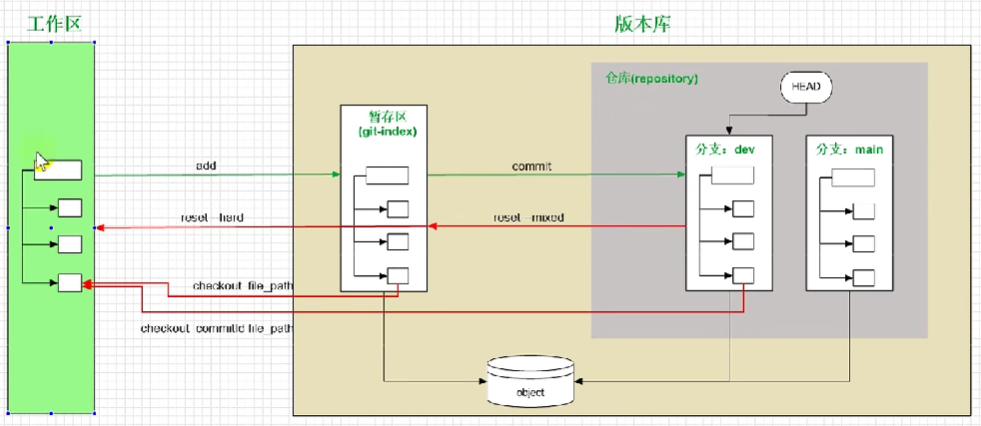
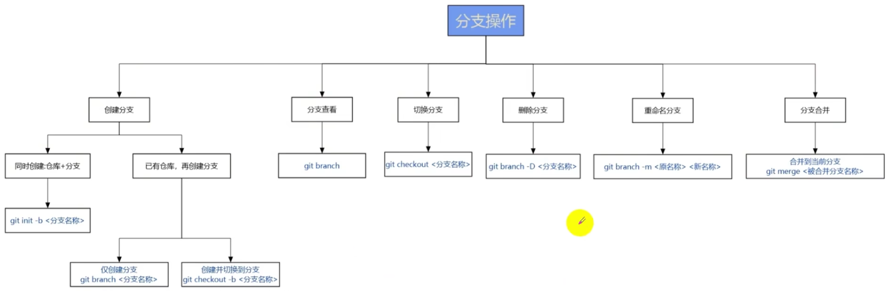

# 常用指令记录

起因是发现，现在记忆力越来越不得行了，有些工具没有用到就会慢慢忘记指令，再去相应搜索实在不方便。因此在这里进存档，方便自己查阅。

## Git

- git clone [仓库链接]
- git add [被修改的文件] （. 表示所有的）
- git commit
- git push
- git status：查看状态，可以看到是否有修改
- git log：查看日志（恢复时需要用到）

`.gitignore`：在根目录下创建，对于需要忽视不追踪的文件名，写入

### 复原

删除的文件：git checkout [文件名.txt]

修改文件（没有add过）：git checkout [文件名.txt]

修改且add / commit：git checkout [commitid] [文件名.txt]

### 分支

- git init -b [分支名]
- git branch：查看分支
- git branch [新分支名]：仅用于创建分支，但不会切换到新分支
- git branch -m [旧分支名] [新分支名]
- git branch -d（已修改未合并）/ -D（强制删除）[新分支名]
- git checkout [分支名]：切换分支
- git checkout -b [分支名]：创建并切换分支
- cat [文件名]：查看文件内容
- git merge [被合并的分支名称]

开发分支：dev
主分支：main
