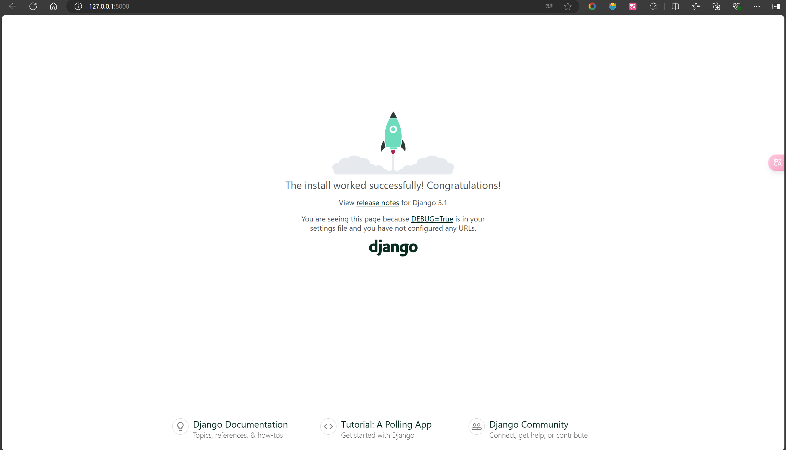
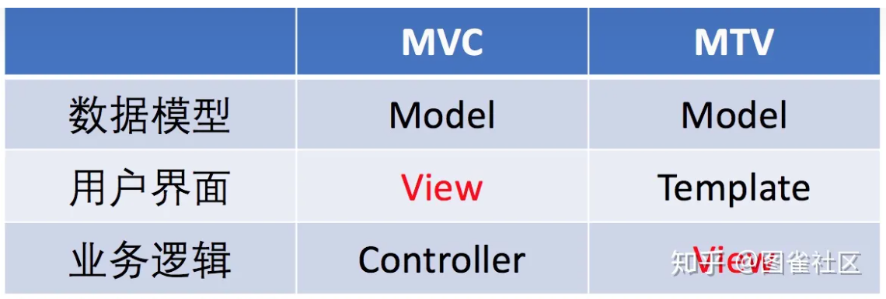
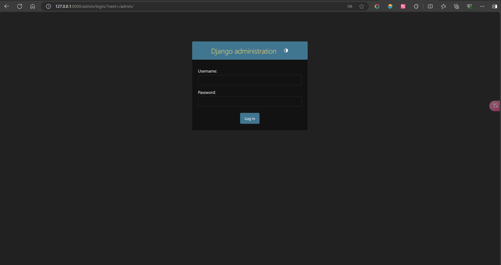
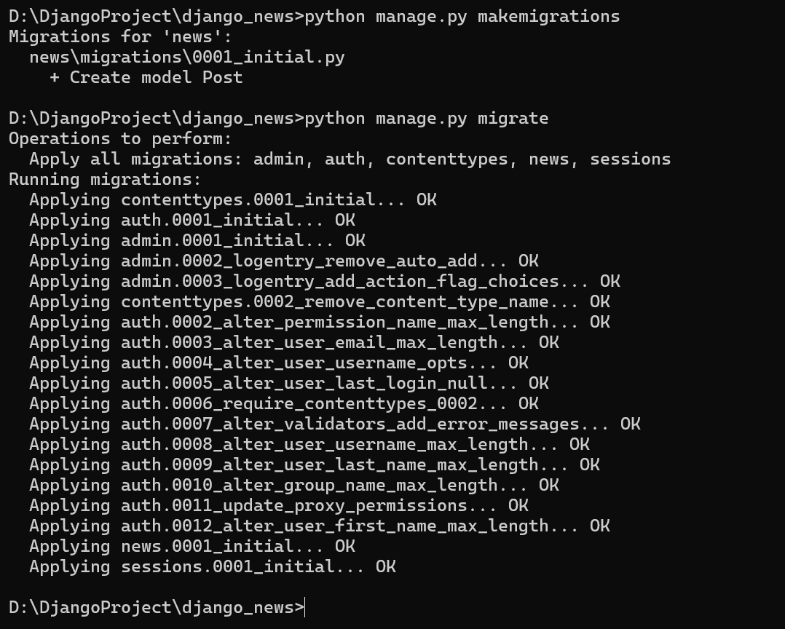
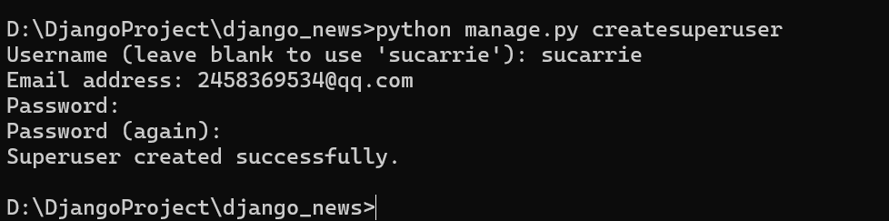

### 启动

```python
>>> django-admin startproject helloDjango # 脚手架工具创建项目
>>> python manage.py runserver # 启动
```



### APP分类

- 内置：框架自带应用，admin（后台管理）、auth（身份鉴权）、sessions（会话管理）
- 自定义：实现自身业务逻辑
- 第三方：社区提供

### 结构

层次1

```c
django_news
├── django_news              // 项目全局文件目录
│   ├── __init__.py
│   ├── settings.py          // 全局配置
│   ├── urls.py              // 全局路由
│   └── wsgi.py              // WSGI服务接口（暂时不用纠结这个是神马）
└── manage.py                // 项目管理脚本
```

层次2 APP

```c
news                     // news 应用目录
├── __init__.py          // 初始化模块
├── admin.py             // 后台管理配置
├── apps.py              // 应用配置
├── migrations           // 数据库迁移文件目录
│   └── __init__.py      // 数据库迁移初始化模块
├── models.py            // 数据模型
├── tests.py             // 单元测试
└── views.py             // 视图
```

### MTV法则

Model（模型）+Template（模板）+View（视图），类似于MVC

### MVC法则（补充）



```python
# settings 里加入news，此时/admin可以有登录
INSTALLED_APPS = [
    "django.contrib.admin",
    "django.contrib.auth",
    "django.contrib.contenttypes",
    "django.contrib.sessions",
    "django.contrib.messages",
    "django.contrib.staticfiles",
    "news",
]
```



### 视图（业务逻辑）

- 基于函数的视图（FBV）
- 基于类的视图（CBV）

### 模板

- 表达式插值

  ```html
  <h1>{{ name }}</h>
  <p>{{ news.title }}</p>
  <p>{{ news.vistiors.0 }}</p>
  ```

- 条件语句

  ```html
  
  	<h1> Ti tis true! </h1>
  
  	<h1> It is false! </h1>
  
  ```

- 循环语句

  ```html
  
  	<p>{{ elem }}</p>
  
  ```

### 模型

和数据库进行联动

- 轻松切换各种关系型数据库
- ORM（对象关系映射）模块，免于使用SQL
- 数据库迁移机制，修改数据模式方便

#### ORM示例

```python
# 查询所有模型
# 等价于 SELECT * FROM Blog
Blog.objects.all()

# 查询单个模型
# 等价于 SELECT * FROM Blog WHERE ID=1
Blog.objects.get(id=1)

# 添加单个模型
# 等价于 INSERT INTO Blog (title, content) VALUES ('hello', 'world')
blog = Blog(title='hello', content='world')
blog.save()
```

#### 数据库迁移

Django定义的模型转换为SQL代码*迁移文件），数据库进行更新表



```python
from django.db import models


class Post(models.Model):
    title = models.CharField(max_length=200)
    content = models.TextField()

    def __str__(self):
        return self.title
```

```python
# 创建迁移文件
>>> python manage.py makemigrations

# 对数据库迁移
>>> python manage.py migrate
```

### 超级用户创建

```python
>>> python manage.py createsuperuser
```



### 配置后台管理接口

```python
# 在news/admon.py
from django.contrib import admin
from .models import Post

admin.site.register(Post)
```

### 数据查询

```python
from django.shortcuts import render
from .models import Post

def index(request):
    context = { 'news_list': Post.objects.all() }
    return render(request, 'news/index.html', context=context)
```