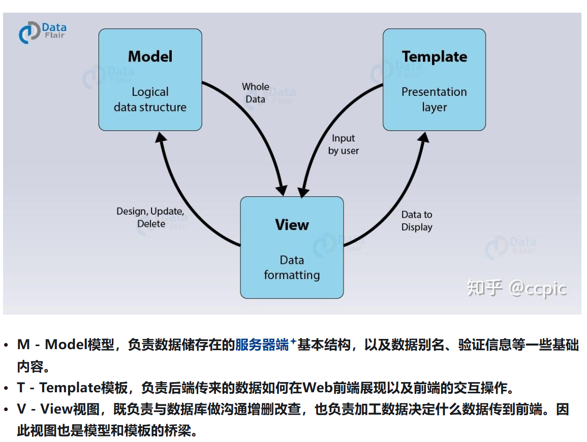
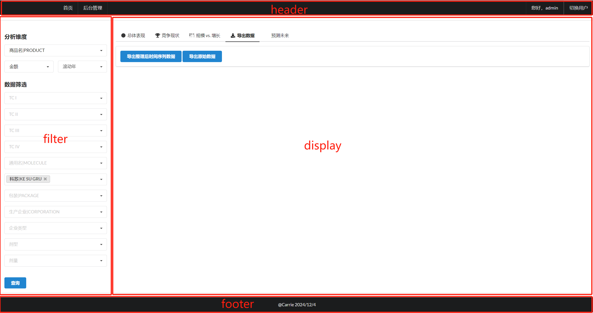
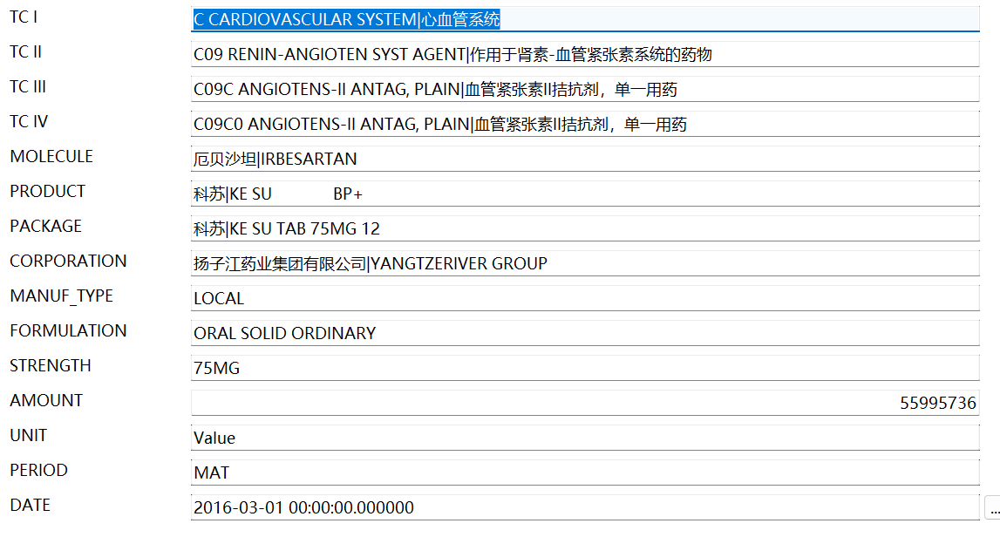
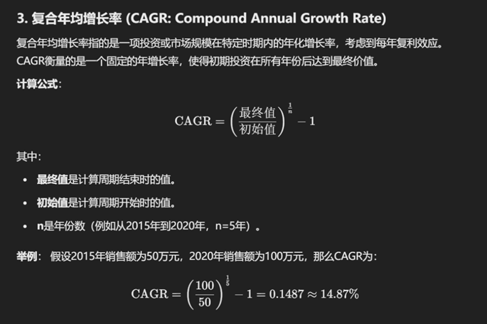
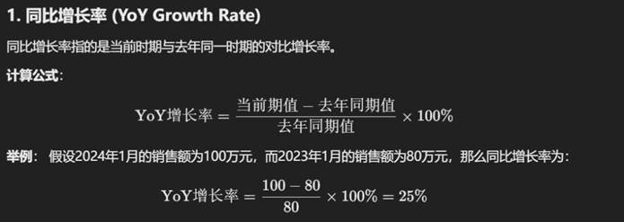
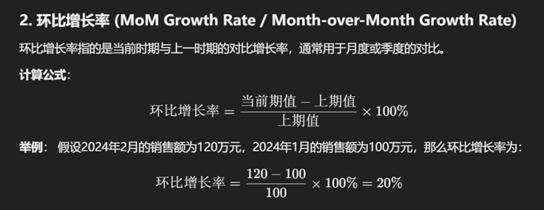

# 写在前面
现在时隔大概1-2月，又重新开始博客记录。没有记录的原因是前段时间都未曾开展技术学习。
谈及原因，是这学期参加大多数评优评奖而全力改动PPT和练演讲。因此，没有收入就没有产出。

# 数据分析平台

## 缘由

我个人一直想做，作为Python大作业，也当作练手项目。
当初看到这个参照项目时，刚好有个人做了这么个项目，也愿意教授。
另一方面，是2020年已然有这样的技术，感到惊叹。
再者则是，对于作者数据分析师但能不断求知和探索能力的赞赏。

----
Django主要就是mtv+URL，对于这种项目mt完全用不上，交互问题很吃亏。后续可以考虑改为前后端分离。

## 分析

ref：[Python Django+SQL+Pandas+Pyecharts自建在线数据分析平台 | 知乎](https://zhuanlan.zhihu.com/p/142490087)，特此鸣谢！

### 需求&改变

1. 脱离Excel的展示框架
2. VBA+ADO运行效率瓶颈

未来扩展方向


目前实现核心的功能需求。

### 技术

- 后端Web框架：Python3.11 + Django
- 数据库：MySQL
- 数据处理：Pandas + Numpy + mkl + 其他
- Javascript库：JQuery
- 前端CSS：Semantic UI
- 前端交互表图：Pyecharts
- 前端数据表格：jQuery Datatables
- 部署（未）

## Django框架



关于Django创建和启动略

## 初步搭建Django环境

```
INSTALLED_APPS = [
    ...
    'chpa_data'
]
```
在`settings.py`将`chpa_data`加入

层级结构：
```
datasite
├── chpa_data
│   ├── admin.py
|   └── ....
├── datasite
└── manage.py
```

由于要处理大量数据，考虑Django ORM只有在处理事务型数据时有一些易用性和可读性方面的优势，因此，在View层用SQL Alchemy或Pyodbc等中间库直接用SQL语句操作数据库，在View层直接返回API的JsonResponse。

```
from django.http import HttpResponse
from sqlalchemy import create_engine
import pandas as pd


ENGINE = create_engine('mssql+pymssql://(local)/CHPA_1806') #创建数据库连接引擎


def index(request):
    sql = "Select count(*) from data"
    df = pd.read_sql_query(sql, ENGINE)
    return HttpResponse(df.to_html()) #渲染，这里暂时渲染为最简单的HttpResponse
```

### URL

```
# ----------------* urls.py *----------------------

from django.contrib import admin
from django.urls import include,path

urlpatterns = [

    path('chpa/', include('chpa_data.urls')),
    path('admin/', admin.site.urls),
]
```

```
# ----------------* chpa_data目录创建一个urls.py
# 写入app下views.py里面每个view对应url

from django.urls import path
from . import views

app_name = 'chpa'  # 这句是必须的，和之后所有的URL语句有关
urlpatterns = [
    path(r'index', views.index, name='index'),
]
```

## 页面布局



根据此布局，搭建模板架构，并充分利用其模板继承特性

#### 基础模板（父模板）

```
<!-- 载入静态文件 -->


<!-- 引入导航栏 -->

<!-- 预留具体页面的位置 -->

<!-- 引入注脚 -->

```

header已引入需要的静态文件，继承base页面无需再引用静态文件

```
# ------------------* datasite的settings.py加一条设置

STATIC_URL = '/static/' # 静态文件夹相对于工程根目录的相对位置
STATICFILES_DIRS = (
    os.path.join(BASE_DIR, "static"), 
)  # 该语句建议保留，对低版本的Django也是指明静态文件的位置，后续版本有功能改变
```

`` 通用相对静态，使用include直接引用。多对一和一对一
`` 多个子模版多次继承重写同一部分。一对多
`` 继承

#### header

```
<a href= class="item">首页</a>
```
`url tag`，结构对应`chpa_data`的urls.py里的``

### 各页面关系

普通页面继承于父页面
display继承于analysis

base：导航，所需css，注脚
analysis：主要是分页（分为filter和display）
index：内容

## 数据处理

### 指标分析

这是比较重要的步骤，争取呈现更丰富有价值的结果。

业务..重中之重



- 属性字段：前13描述药品的属性，包括分类，化合物通用名，剂型，生产公司等
- 指标字段：AMOUNT量化指标
- 筛选字段：UNIT区分销售额、销售量（盒数）或销售量（片数）；PERIOD区分滚动年或季度
- 日期字段（横截面数据分析是筛选，同比增长等；趋势分析作为行列的维度）

**日期**遇到移动平均数据，有规则：
季度：全选或批量连续选
滚动年：移动平均的rolling期数间隔筛选DATE

### 实际处理

用SQL尽可能精确地筛选数据，再由Pandas根据需求把数据做各种处理

`Pandas`的`pivoted_table`方法快速透视数据

```
pivoted = pd.pivot_table(df,
                       values='AMOUNT',  # 数据透视汇总值为AMOUNT字段，一般保持不变
                       index='DATE',  # 数据透视行为DATE字段，一般保持不变
                       columns='MOLECULE',  # 数据透视列为MOLECULE字段，该字段以后应跟随分析需要动态传参
                       aggfunc=np.sum) # 数据透视汇总方式为求和，一般保持不变
```

#### 计算各种经济指标

年复合增长率


同比增长率


环比增长率


基于上述，进一步计算：
1. 最新滚动年销售额：最新数据行的销售额或其他关键数据。
2. 净增长：与 4 个周期前的变化（即同比净增长）。
3. 份额：最新时间点的份额。
4. 份额同比变化：份额与 4 个周期前的变化。
5. 同比增长率：每个时间点的同比增长率。
6. EI：衡量该时间点与市场增速的对比，> 100 时为跑赢大盘。

`.to_html`转为html，可以渲染到页面

```
<!-- Django渲染html代码时需要加入|safe，保证html不会被自动转义 -->
{{ ptable|safe }}
```

views.py内的函数的作用

index主
ptable竞争现状
get_kpi市场规模

## 前端表单交互

search查询

#### filter里面的筛选器

下拉菜单，使用`Semantic UI`的搜索相应功能
```
class：class="ui fluid search dropdown"

<!-- 因为用到Semantic UI的Search Dropdown控件，必须有下面语句初始化 -->
<script>
    $('.ui.fluid.search.dropdown')
        .dropdown({ fullTextSearch: true });
</script>
```

## 异步传参加载

```
urlpatterns = [
    ...
    path(r'search/<str:column>/<str:kw>', views.search, name='search')
]
```

AJAX（异步的JavaScript和XML技术）实现异步传参

GET得到结果：
1. 解析前端参数到理想格式
2. 根据前端参数数据拼接SQL并用Pandas读取
3. Pandas读取数据后，将前端选择的DIMENSION作为pivot_table方法的column参数
4. 返回Json格式的结果

### 自定义的模板过滤器tag filter

创建templatetags，tags.py--保留一位小数的百分号

前端模板加入：``

改写`{{ market_gr|percentage:1 }}`

## 表格设置

数据源为DOM，前端分页，JS设置的方法

filter里面初始化DataTables

### 一键复制

编写`js`

`range.selectNodeContents(el)`用于选择`el`元素的所有内容
并添加到`window.getSelection`的选中区域。

`document.execCommand("Copy")`
这是用来执行复制操作的浏览器命令，将选中的内容复制到剪贴板。

## 动态图表

过程步骤（下面静态大体相似）：
1. 前端html部分准备一个空白的DOM
`<div id="bar_total_trend" style="width:1000px; height:600px;"></div>`
2. JS部分用echarts初始化命令渲染这个元素
3. 后端准备数据
4. 使用数据用Pyecharts生成图表对象
5. 利用Pyechart全局API dump_options()生成图表对象json格式的全局options
6. 前端JS部分用AJAX通信获取后端json `chart.dump_options()`
7. AJAX调用json成功后使用.setOption方法刷新图表元素呈现可视化结果

## 静态图表

将上方大量代码绘制的Matplotlib图片保存为base64编码的字符串，再在头部加上Data URI scheme
```
# 保存到字符串
    sio = BytesIO()
    plt.savefig(sio, format='png', bbox_inches='tight', transparent=True, dpi=600)
    data = base64.encodebytes(sio.getvalue()).decode()  # 解码为base64编码的png图片数据
    src = 'data:image/png;base64,' + str(data)  # 增加Data URI scheme
    
    ...

    return src
```

## 导出excel

在实现导出数据至 Excel 的功能时，
你不能仅仅依赖于 AJAX 回调来实现导出功能，
因为导出数据通常涉及到生成一个文件并返回给用户，
这个过程不适合使用 AJAX 异步请求处理。
相反，导出功能应该与查询功能（查询数据并显示结果）并行工作，
意味着你需要为导出功能创建一个 新的方法 和 新的 URL 路径 来处理数据导出的请求。

## 缓存

缓存最适合的场景是前端请求频率高+后台更新频率低

本项目（医疗药品）后台更新频率非实时更新的月度收集数据，适合缓存。采用文件缓存。

视图缓存和URL缓存都要先引用缓存装饰器：
`from django.views.decorators.cache import cache_page`

声明`duration`：
`@cache_page(60 * 60 * 24 * 30) #  缓存30天`

这二者比较简单，但需要你的返回内容相对每个参数是完全静态的。
整站缓存或模板层缓存操作复杂。前者要中间件，后者标识缓存DOM。

创建清除缓存。

## 用户登录

Django原生系统的用户数据和sesssion数据都需要数据库存储，使用使用django默认的sqlite3数据库

```
DATABASES = {
    'default': {
        'ENGINE': 'django.db.backends.sqlite3',
        'NAME': os.path.join(BASE_DIR, 'db.sqlite3'),
    }
}
```

第一次
`python manage.py migrate`
超级管理员
`python manage.py createsuperuser`

绑定
```
@login_required
@cache_page(60 * 60 * 24 * 30)
```