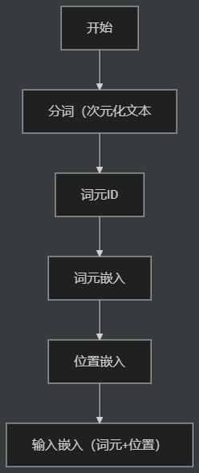
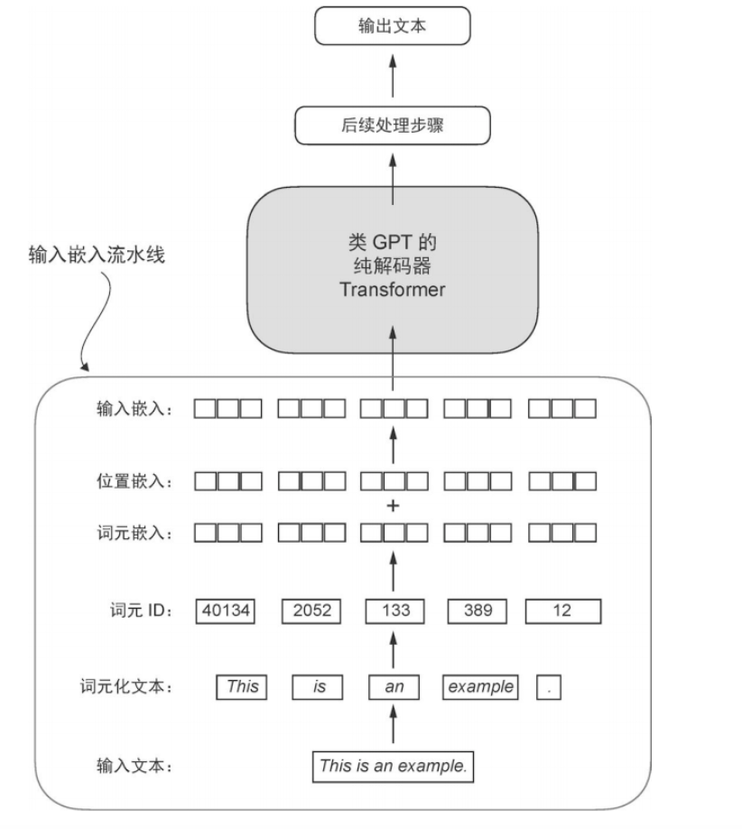
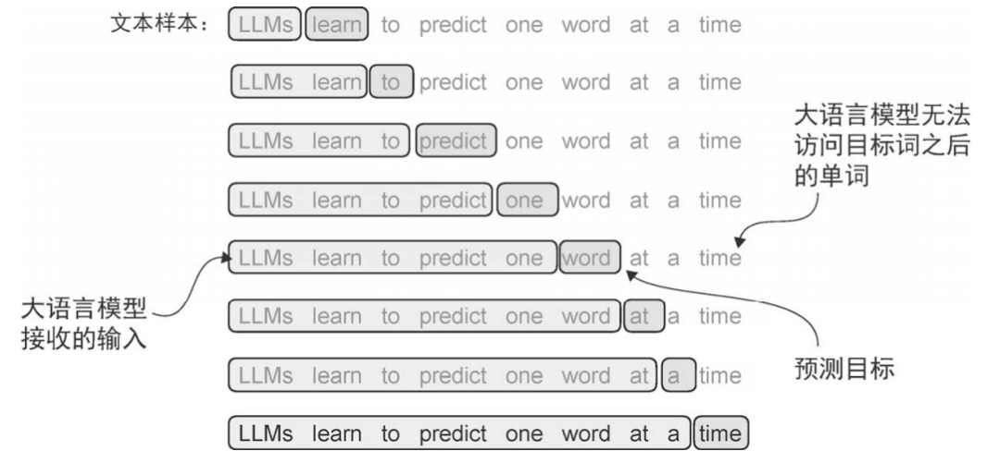
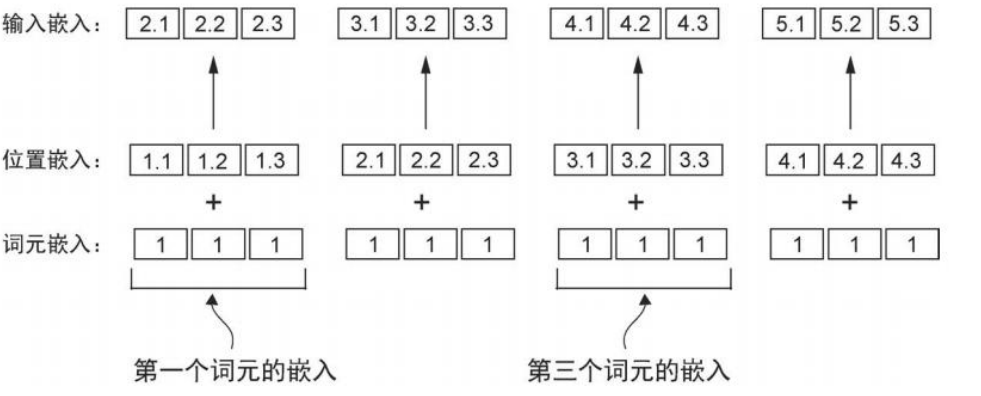

# 大模型自学记录Day1

终于结束了考研，现在重新拾起我的博客，记录学习。

## 近几个月计划

### 毕业前

- [ ] 大模型相关内容
- [ ] 雅思
- [ ] 化妆

### 毕业后

- [ ] 课题组内容
- [ ] 科研技能和知识
- [ ] 学车
- [ ] 做饭

## LLM学习

基础阶段决定先根据：[张梅山老师发布的大模型基础学习路线](https://zhangmeishan.github.io/teaching.html)

特此感谢！

笔记只记录一些关键代码，方便后续回顾复盘

## 文本数据处理

#### 过程



- 分词（encode）
  - **标准化：**读取文本，处理标点符号
  - **拆分 (Split)：**使用 正则表达式将文本切分为列表
  - **去重与排序：**提取所有唯一的单词
  - **构建映射表：**词 —— ID
    - 引入特殊上下文词元
      - 未知单词
      - 文档分隔符
  - 反过来（decode）



### 输入文本

```python
with open("the-verdict.txt", "r", encoding="utf-8") as f:
# 以 UTF-8 编码打开文本文件（只读）

    raw_text = f.read()
    # 读取文件全部内容到 raw_text
```

### 词元化文本（分词）

分词`(tokenize)`后嵌入`(embedding)`

分词：用正规表达式来进行分割为词元（token）---> 构建一个词表
### 词元ID

嵌入：文本（token）转换成对应的数字编号（token ID）

后续嵌入层（embedding layer）进行处理得到向量表示

```python
# 构建词表，包含文本出现的所有不重复的token
all_words = sorted(set(preprocessed))

# 用 enumerate 给每个唯一 token 分配一个编号，构建 token→ID 的词表字典
vocab = {token:integer for integer, token in enumerate(all_words)}

# 把 vocab 反转，得到 ID→token 的映射字典，方便从编号还原成文本
int_to_str = {i:s for s,i in vocab.items()}
```

特殊词元：未知词和文本结束的位置

#### 最终获取ID

```python
# 对预处理后的 token 去重并排序，得到词表的基础 token 集合
all_tokens = sorted(list(set(preprocessed))) # pre..表示已经分词且预处理后的

# 添加特殊 token：文本结束标记和未知词标记
all_tokens.extend(["<|endoftext|>","<|unk|>"])

# 为每个 token 分配唯一的整数 ID，构建 token→ID 的词表映射
vocab = {token:integer for integer,token in enumerate(all_tokens)}
```

#### 分词器：

```Python
class SimpleTokenizerV2:
    def __init__(self, vocab):
        self.str_to_int = vocab
        self.int_to_str = {i:s for s,i in vocab.items()}

    def encode(self,text):
        preprocessed = re.split(r'([,.:;?_!"()\']|--|\s)',text)

        preprocessed = [
              item.strip() for item in preprocessed if item.strip()
        ]
        preprocessed = [item if item in self.str_to_int
              else "<|unk|>" for item in preprocessed]
        # 遇到不在词表中的 token，用 <|unk|> 代替

        ids = [self.str_to_int[s] for s in preprocessed]
        return ids

    def decode(self, ids):
        text = " ".join([self.int_to_str[i] for i in ids])

        text = re.sub(r'\s+([,.:;?!"()\'])',r'\1',text)
        return text
```

使用分词器

```python
# 创建
tokenizer = SimpleTokenizerV2(vocab)

# 编码
tokenizer.encode(text)

# 解码
tokenizer.decode(tokenizer.encode(text))
```

#### BPE分词

BPE（Byte Pair Encoding，字节对编码）：把不在词表的单词拆成更小的子词单元，处理词表外词

```python
import tiktoken

# 加载 tiktoken 内置的 GPT-2 分词器（BPE 规则与词表），用于把文本编码成 token/ID
tokenizer = tiktoken.get_encoding("gpt2")
# 使用编码、解码如上所示相同
```

#### 使用滑动窗口进行数据采样

按顺序一次生成一个词（token）



**数据加载器**，遍历输入数据集，返回序列：输入序列，向右平移一位后的目标序列

**顺序：**

1. 样本的输入序列、目标序列
2. 文本编码为ID
3. 滑动窗口取片段，当前窗口的输入序列、目标序列
4. 将 3 转为张量保存到 1 里面

```python
import torch
from torch.utils.data import Dataset, DataLoader

class GPTDatasetV1(Dataset):
# 用滑动窗口把一段长文本切成很多训练样本（输入序列与右移一位的目标序列）

    def __init__(self, txt, tokenizer, max_length, stride):
    # txt 是原始文本，max_length 是每个样本的序列长度，stride 是窗口每次滑动的步长

        self.input_ids = []
        # 保存每个样本的输入序列

        self.target_ids = []
        # 保存每个样本的目标序列（用于预测下一个 token）

        token_ids = tokenizer.encode(txt)
        # 把整段文本编码成 token ID 序列

        for i in range(0, len(token_ids) - max_length, stride):
        # 用滑动窗口从 token 序列中依次截取长度为 max_length 的片段

            input_chunk = token_ids[i:i + max_length]
            # 当前窗口的输入序列

            target_chunk = token_ids[i + 1: i + max_length + 1]
            # 目标序列比输入整体右移一位，用来做“预测下一个 token”

            self.input_ids.append(torch.tensor(input_chunk))
            # 把输入序列转成张量并保存

            self.target_ids.append(torch.tensor(target_chunk))
            # 把目标序列转成张量并保存

    def __len__(self):
    # 返回数据集中样本的数量

        return len(self.input_ids)
        # 样本数等于切出来的输入序列数量

    def __getitem__(self, idx):
    # 按索引返回一个样本（输入，目标）

        return self.input_ids[idx], self.target_ids[idx]
        # 返回第 idx 个输入序列和对应的目标序列
```

**张量** 表示多维数组，用tensor（喂给神经网络）不用list的原因：

           1. 计算速度更快
           2. 可以放到GPU跑
           3. 支持自动求导

**`DataLoader`**

`PyTorch`里面专门负责喂数据给模型的工具：它负责把数据集按批次、一组一组地送给模型训练

参数情况：

- batch_size：一次给大模型喂几个样本，一次训练输入4条序列
- max_length：每个样本序列长度，每个输入样本有256个token
- stride：滑动窗口步长
  - =1：最大化数据利用率，但计算量大，数据高度重叠
  - =Context Length：可能丢失跨边界的语义
  - 最佳实践：通常 Stride 设置这就等于 Context Length 以避免过拟合，但在数据稀缺时可减小 Stride


常见设置：stride < max_length，为了重叠，使得上下文具有连续性

- shuffle：训练时为True，测试时为False
- drop_last：最后不满 batch_size 的 batch 是否丢掉，统一shape
- num_workers：用几个子进程加载数据，=0 主进程，多个常用于数据量大的时候

```python
def create_dataloader_v1(txt, batch_size=4, max_length=256, stride=128,
                         shuffle=True, drop_last=True, num_workers=0):
# 创建一个 DataLoader，用于按批次产出输入序列和右移一位的目标序列

    tokenizer = tiktoken.get_encoding("gpt2")
    # 分词：加载 GPT-2 的分词器，把文本编码成 token ID

    dataset = GPTDatasetV1(txt, tokenizer, max_length, stride)
    # 切样本：把长文本切成多个训练样本（滑动窗口+目标右移一位）

    dataloader = DataLoader(dataset, batch_size=batch_size,
                            shuffle=shuffle, drop_last=drop_last,
                            num_workers=num_workers)
    # 组batch：按 batch_size 组批，并可选择打乱与丢弃不完整的最后一个 batch

    return dataloader
	# 返回训练器
```

使用

```python
dataloader = create_dataloader_v1( 
    raw_text, batch_size=1, max_length=4, stride=4, shuffle=False
)
# 8，4，4

data_iter = iter(dataloader) # 把一个“可遍历对象”变成迭代器
first_batch = next(data_iter) # 从迭代器里取下一个元素

inputs, targets = next(data_iter)
# 取出第一个 batch 的输入序列和右移一位的目标序列
```

注意：stride可以设置更大一些，不同样本尽量不要重叠，重叠使得训练数据过于相似，增加过拟合风险

### 词元嵌入

可训练的查找表：ID通过嵌入层转换成连续的向量表示，要设置每个词的嵌入向量维度
表示**是什么词**，给定一个Token ID，层直接返回对应的行向量

`embedding_layer = torch.nn.Embedding(vocab_size,output_dim)`

嵌入层：看作“查表用”的权重矩阵，形状=词表词数（ID取值范围）× **嵌入向量维度**
也就是6行对应词表中的6个token，每一行是一个长度为3的**嵌入向量**（token用三个数字表示）
**嵌入向量维度**：表示特征
嵌入层等价于“one-hot加矩阵乘法”

```Python
# gpt-2
vocab_size = 50257
output_dim = 256

token_embedding_layer = torch.nn.Embedding(vocab_size, output_dim)

token_embeddings = token_embedding_layer(inputs)
# 把输入的 token ID 通过嵌入层转换成向量表示

token_embeddings.shape
```

### 位置嵌入

`gpt-2` 使用绝对位置嵌入，为序列每一个位置分配一个固定的“位置编号”，编号通过嵌入层映射为向量。
告知**在哪个位置**，谁在前，谁在后。

每个位置也有自己的向量

```python
context_length = max_length
# 位置编号的范围等于序列长度（0 到 max_length-1）

pos_embedding_layer = torch.nn.Embedding(context_length, output_dim)
# 创建位置嵌入层：把每个位置 ID 映射成 output_dim 维向量

# 生成位置 ID（0 到 max_length-1），并查表得到对应的位置嵌入向量
pos_embeddings = pos_embedding_layer(torch.arange(context_length)) 
```

### 输入嵌入

位置嵌入与token的嵌入向量结合

```python
input_embeddings = token_embeddings + pos_embeddings 
```


