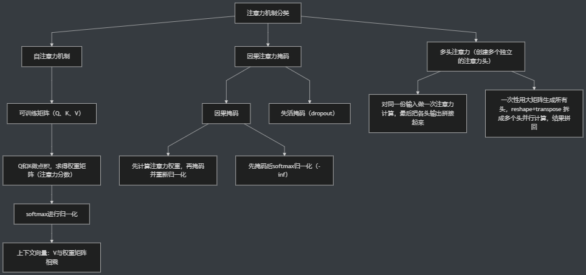
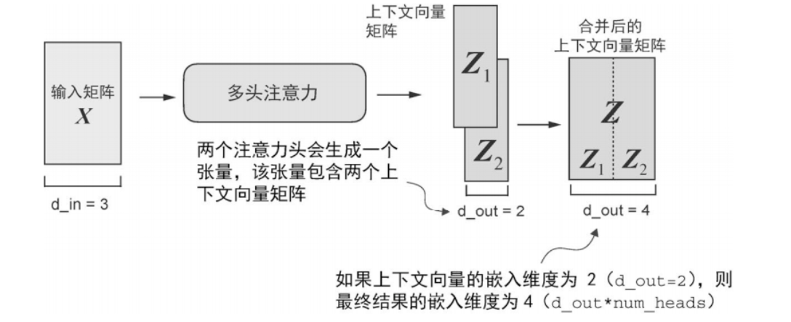

# 大模型自学记录Day2

## 注意力机制

注意力机制解决的问题，对比：

### CNN

- 将输入压缩为中间状态，依赖该中间状态输入`token`容易丢失细节，要求不断会看完整输入

### 自注意力机制

- 回看整个输入
- 有选择回看（权重）



#### 点积

计算点积：`torch.dot(input_query, input_1)`

对`dot`进行展开写：

```python
# enumerate:给每个元素自动编号
res=0. # 小数形式
i=0

for idx, ele in enumerate(inputs[i]):
    res+=inputs[i][idx] * input_query[idx]

res
```

##### 点积与余弦相似度区别

点积：相关性的“原始分数”，关键取决于夹角（很强+很像）
$$
a⋅b=∣a∣∣b∣cosθ
$$

- 方向
- 长度

余弦相似度：去掉长度影响后的“纯方向相似度”（很像，语义检索常用）
$$
\cos\theta=\frac{\mathbf{a}\cdot\mathbf{b}}{|\mathbf{a}||\mathbf{b}|}
$$

- 只看方向

##### 对所有进行点积

```python
"""
方法1：双重循环
"""
# 推广到整个序列，计算任意两个输入向量间
attn_scores=torch.empty(6,6)

for i,x_i in enumerate(inputs):
    for j,x_j in enumerate(inputs):
        attn_scores[i,j]=torch.dot(x_i,x_j) # 计算点积
```

```python
"""
方法2：矩阵乘法，更高效
"""
attn_scores=inputs @ inputs.T # 矩阵乘法
# 等价 torch.matmul(inputs, inputs.T), T是转置
attn_scores
```

#### 归一化

注意力分数转换为注意力权重

##### 方法1：简单归一化

```python
attn_weights_2_tmp=attn_score_2/attn_score_2.sum()
```

##### 方法2：`softmax`归一化

实际实现使用这个，会更稳定

```python
def softmax_naive(x):
    return torch.exp(x) / torch.exp(x).sum(dim=0)

"""
    dim=0：沿着第 0 维（行的方向）进行压缩求和
    相当于按列往下加
"""
attn_weights_2_naive=softmax_naive(attn_score_2)
```

##### 简单和`softmax`区别

`softmax`：把一组任意实数，转换成一组概率值
$$
\text{softmax}(z_i)=\frac{e^{z_i}}{\sum_{j=1}^{n} e^{z_j}}
$$
普通归一化：

1. 可能有负数
2. 区分度不够：指数可以放大差异

`Attention`里面使用`softmax`：
$$
\text{Attention}(Q,K,V)=
\text{softmax}\left(\frac{QK^T}{\sqrt{d_k}}\right)V
$$

#### 上下文向量

注意力分数矩阵与`x`相乘

```python
all_context_vecs=attn_weights @ inputs
```

#### 汇总，简化版自注意力模块

```python
attn_scores=inputs @ inputs.T
attn_weights=torch.softmax(attn_scores,dim=1)
all_context_vecs=attn_weights @ inputs
all_context_vecs
```

#### 实际所用自注意力模块

实际中，不会直接彼此点积，通过三组可训练矩阵
生成`query,key,value`
`query,key`得到注意力分数
归一化权重
对`value`加权求和 --> 上下文向量

##### 方法1：Parameter矩阵

```python
# 推广计算所有的，上述封装到自注意力模块
"""
方法1：手动Parameter矩阵
"""
import torch.nn as nn

class SelfAttention_v1(nn.Module):
    def __init__(self, d_in, d_out):
        super().__init__() # 初始化 nn.Module 内部机制
        self.W_query=torch.nn.Parameter(torch.rand(d_in, d_out))
        self.W_key=torch.nn.Parameter(torch.rand(d_in, d_out))
        self.W_value=torch.nn.Parameter(torch.rand(d_in, d_out))
    def forward(self,x):
        queries = inputs @ W_query
        keys = inputs @ W_key
        values = inputs @ W_value

        attn_scores=queries @ keys.T
        """
        维度越大，点积的数值通常会变得越大。
        如果不做缩放（/ d_k**0.5），注意力分数会更容易出现“差距很大”的情况，
        softmax就会变得非常极端（几乎全压在某一个位置上），从而梯度变小、训练不稳定。

        dim=-1：
        希望对同一个 Q 的所有 K 分数作 归一化。
        所有 K 通常放在最后一维
        """
        attn_weights=torch.softmax(attn_scores / d_k**0.5, dim=-1)
        context_vec=attn_weights @ values
        return context_vec
    
sa_v1=SelfAttention_v1(d_in,d_out)
sa_v1(inputs)
```

##### 方法2：`PyTorch`层线性

`PyTorch`线性层，包含一个可训练的权重矩阵`+bias`

初始化更合理：
初始化时就考虑输入输出维度的尺度，使参数的初始分布与层的尺寸相匹配
采用`Kaiming Uniform` 初始化

```python
import torch.nn as nn

class SelfAttention_v2(nn.Module):
    def __init__(self, d_in, d_out, qkv_bias=False):
        super().__init__() # 初始化 nn.Module 内部机制
        # 已经是可训练的矩阵了，不需要进行 inputs @ W_query 相乘
        self.W_query=torch.nn.Linear(d_in,d_out,bias=qkv_bias)
        self.W_key=torch.nn.Linear(d_in,d_out,bias=qkv_bias)
        self.W_value=torch.nn.Linear(d_in,d_out,bias=qkv_bias)
    def forward(self,x):
        queries = self.W_query(x)
        keys = self.W_key(x)
        values = self.W_value(x)

        attn_scores=queries @ keys.T
        attn_weights=torch.softmax(attn_scores / d_k**0.5, dim=-1)
        context_vec=attn_weights @ values
        return context_vec
    
sa_v2=SelfAttention_v2(d_in,d_out)
sa_v2(inputs)
```

权重服从均匀分布：
$$
W \sim U(-\sqrt{k}, \sqrt{k})
$$

其中：

$$
k = \frac{1}{\text{in\_features}}
$$

比如：

`nn.Linear(4, 3)`

那么：

$$
k = \frac{1}{4}
$$

所以范围就是：

$$
[-0.5, 0.5]
$$
作用：

- 防止梯度爆炸
- 防止梯度消失

### 因果注意力掩码 `mask`

#### 因果掩码

##### 方法1：先计算注意力权重后归一化

```python
"""
生成下三角掩码矩阵 torch.tril

torch.tril(input, diagonal=0)
- input:输入张量
- diagonal:控制从哪条对角线开始保留(=0,对角线;=1,网上移),默认为0

torch.ones():单位阵
"""

context_length=attn_scores.shape[0]
mask_simple=torch.tril(torch.ones(context_length,context_length))

masked_simple=attn_weights * mask_simple

# 再次归一化
row_sums=masked_simple.sum(dim=-1,keepdim=True)
masked_simple_norm=masked_simple / row_sums
```

##### 方法2：尚未归一化时先掩码，再softmax

```python
"""
torch.triu和tril的功效刚好相反
masked_fill是 PyTorch 张量对象自带的方法
"""

mask=torch.triu(torch.ones(context_length, context_length),diagonal=1)
masked=attn_scores.masked_fill(mask.bool(),-torch.inf)
# 右上角为 True，全填充为 -inf，在 softmax 时候e^-∞为0

torch.exp(torch.tensor(float("-inf")))
# float("-inf") 的作用是把字符串"-inf"转成一个特殊的浮点数值：负无穷大

attn_weights=torch.softmax(masked / d_k**0.5,dim=-1)
```

#### 失活掩码

```python
"""
失活掩码：用于dropout中
dropout：常见的正则化手段，降低过拟合，随机选择一部分位置并置零

一般失活掩码和因果掩码配合使用
因果掩码进行屏蔽，失活掩码进行随机屏蔽
以求降低模型对某些注意力连接的依赖

注意：失活掩码并不普遍使用，但gpt-2使用了
PyTorch 提供了现成的`Dropout`层
"""

torch.manual_seed(123)

layer=torch.nn.Dropout(0.5)

# 使用例子
example=torch.ones(6,6)
# 其余数值变大，dropout会对保留下来的数值缩放
layer(example)
```

#### 多批次

```python
# 考虑常见训练场景：一次同时处理多条输入（批次 batch）
# [批次大小,序列长度,嵌入维度]

# stack:在一个新维度上把多个张量叠起来
batch=torch.stack((inputs,inputs),dim=0)
batch.shape
```

#### 汇总，因果注意力机制

使用了`buffer`

```python
import torch.nn as nn

class CausalAttention(nn.Module):
    # caual因果
    """
    PyTorch 里模型分为两类：
    1. 可训练参数 parameter
    eg. self.linear.weight
    会参与训练，计算梯度，被优化器更新
    2. 缓冲器 buffer
    固定张量，不参与训练
    跟着模型走，自动保存
    但不用普通变量的原因：不会自动跟模型走
    当：model.cuda()时，普通变量可能还留在cpu
    """
    def __init__(self,d_in,d_out,context_length,dropout,qkv_bias=False):
        super().__init__()
        self.W_query=torch.nn.Linear(d_in,d_out,bias=qkv_bias)
        self.W_key = torch.nn.Linear(d_in, d_out, bias=qkv_bias)
        self.W_value = torch.nn.Linear(d_in, d_out, bias=qkv_bias)
        self.dropout=torch.nn.Dropout(dropout)
        # 注册因果掩码为缓冲器 buffer,张量 mask登记为模型一部分固定一部分
        self.register_buffer("mask",torch.triu(torch.ones(context_length,context_length),diagonal=1))

    def forward(self,x):
        # 拿输入维度
        b, num_tokens, d_in=x.shape # batch,每句话 token 数,每个 token 维度
        # 生成 Q K V
        queries=self.W_query(x)
        keys=self.W_key(x)
        values=self.W_value(x)
        # 计算注意力分数
        """
        因为是三维矩阵,这里只交换第一和第二维（画个图增加理解）
        不动零维的batch
        不能用.T，T是全部转置
        """
        attn_scores=queries @ keys.transpose(1,2)
        # mask
        attn_scores.masked_fill_(# 带下划线是原地操作，不创建副本，直接修改 attn_scores
            self.mask.bool()[:num_tokens,:num_tokens],-torch.inf)
        # softmax
        attn_weights=torch.softmax(
            attn_scores/keys.shape[-1]**0.5, dim=-1
        )
        attn_weights=self.dropout(attn_weights)
        # 上下文向量
        context_vec=attn_weights @ values
        return context_vec

torch.manual_seed(789)

context_length=batch.shape[1] # 一次取得 token数量
dropout=0.0 # 不随机丢弃，暂时关闭
ca = CausalAttention(d_in, d_out, context_length, dropout)
ca(batch) # 等价于ca.forward(batch) 进行前向传播
```

掩码放在`__init__`里提前生成，是为了避免在每次`forward`时重复创建同一份矩阵。因果掩码只与最大上下文长度`context_length` 有关，本身不需要随着输入或训练动态变化，因此在初始化阶段生成一次即可。前向计算时，输入序列的实际长度可能是`num_tokens`（可能小于`context_length`），所以代码用`self.mask[:num_tokens, :num_tokens]` 截取出与当前注意力分数矩阵同样大小的那一块掩码，既保证尺寸对齐，也避免多余计算。

### 多头注意力机制



并行使用多个自注意力头，提取不同类型的信息
最后把张量在最后一维拼接起来

- 注意力头的数量是可设置的超参数，初始化所需数量的注意力头

##### 方法1：堆叠多个注意力头，顺序执行

```python
"""
方法1：堆叠多个注意力头，forward里逐个调用，本质上还是顺序执行
"""

class MultiHeadAttentionWrapper(nn.Module):
    """
    多头注意力的“封装层”。
    思路：创建多个独立的注意力头（这里用 CausalAttention 作为单头），
    每个头都对同一份输入做一次注意力计算，最后把各头输出拼接起来。
    """
    def __init__(self,d_in,d_out,context_length,dropout,num_heads=2,qkv_bias=False):
        super().__init__()
        self.heads=nn.ModuleList([
        CausalAttention(d_in,d_out,context_length,dropout,qkv_bias) for _ in range(num_heads)
        ])
        """
        列表推导式：_ 表示有变量但不用它
        等价于：
        heads = []

        for i in range(num_heads):
            heads.append(
                CausalAttention(d_in,d_out,context_length,dropout,qkv_bias)
            )
        """
    
    def forward(self,x):
        """
        前向传播：同一个输入 x 分别送进每个注意力头，输出拼接
        输入 x 形状: (b, num_tokens, d_in)
        单个头输出形状: (b, num_tokens, d_out)
        拼接后输出形状: (b, num_tokens, d_out * num_heads)

        torch.cat 沿某个维度把各个张量拼接起来
        dim=0,上下拼接
        dim=1,左右拼接
        """
        return torch.cat([head(x) for head in self.heads],dim=-1)

torch.manual_seed(123)

context_length=batch.shape[1]
d_in,d_out=3,2

mha=MultiHeadAttentionWrapper(d_in,d_out,context_length,dropout=0.0,num_heads=2)
mha(batch)
```

##### 方法2：一次性生成，再拆分

```python
"""
方法2：一次性生成所有头的Q/K/V
要求d_out可以被头数num_heads整除
每个头的维度：head_dim = d_out // num_heads
最后一维包含所有头信息，再按照 num_heads 和 head_dim 把它拆分成多个头的表示
"""
class MultiHeadAttention(nn.Module):
    """
    一次性用大矩阵生成所有头的 Q/K/V，再 reshape+transpose 拆成多个头并行计算
    最后把所有头的结果拼回 (b, num_tokens, d_out)
    """

    def __init__(self, d_in, d_out, context_length, dropout, num_heads, qkv_bias=False):
        super().__init__()
        # 断言条件必须成立否则报错
        assert(d_out % num_heads == 0)

        self.d_out = d_out # 总输出维度
        self.num_heads = num_heads # 头数
        self.head_dim=d_out // num_heads

        self.W_query = nn.Linear(d_in, d_out, bias=qkv_bias)
        self.W_key = nn.Linear(d_in, d_out, bias=qkv_bias)
        self.W_value = nn.Linear(d_in, d_out, bias=qkv_bias)
        self.out_proj=nn.Linear(d_out,d_out)
        self.dropout=nn.Dropout(dropout)
        self.register_buffer(
            "mask",
            torch.triu(torch.ones(context_length,context_length),
                        diagonal=1)
        )

    def forward(self,x):
        b, num_tokens, d_in = x.shape
        keys = self.W_key(x) 
        queries = self.W_query(x)
        values = self.W_value(x)

        # keys.view 改变张量形状，不改变数据本身
        """
        拆分多头，把最后一维 d_out 拆分为(num_heads,head_dim)
        形状变为(b,num_tokens,num_heads,head_dim)
        """
        keys=keys.view(b,num_tokens,self.num_heads,self.head_dim)
        queries=queries.view(b,num_tokens,self.num_heads,self.head_dim)
        values=values.view(b,num_tokens,self.num_heads,self.head_dim)

        """
        交换维度,num_heads提到前面，并行计算注意力
        形状变为(b,num_heads,num_tokens,head_dim)

        head1:
            token1 [1,2]
            token2 [3,4]
            token3 [5,6]
        
        head2:
            token1 [7,8]
            token2 [9,10]
            token3 [11,12]
        """
        keys=keys.transpose(1,2)
        queries=queries.transpose(1,2)
        values=values.transpose(1,2)

        attn_scores=queries @ keys.transpose(2,3)
        mask_bool=self.mask.bool()[:num_tokens,:num_tokens]

        attn_scores.masked_fill_(mask_bool, -torch.inf)
        attn_weights=torch.softmax(attn_scores/keys.shape[-1]**0.5,dim=-1)
        attn_weigths=self.dropout(attn_weights)
        # 更换回维度
        """
        transpose → 调整顺序
        view → 拼接头

        但transpose只改变查看数据的方式,数据在内存里可能不连续
        view要求内存必须连续
        contiguous重新整理成连续内存

        token1:
            head1 [1,2]
            head2 [7,8]
        
        token2:
            head1 [3,4]
            head2 [9,10]
        
        token3:
            head1 [5,6]
            head2 [11,12] 
        """
        context_vec=(attn_weights @ values).transpose(1,2)
        # h 和 hd 合并回 d_out
        context_vec=context_vec.contiguous().view(b,num_tokens,self.d_out)
        context_vec=self.out_proj(context_vec)

        return context_vec

torch.manual_seed(123)

batch_size,context_length,d_in=batch.shape
d_out=2
mha=MultiHeadAttention(d_in,d_out,context_length,0.0,num_heads=2)

context_vecs=mha(batch)
print(context_vecs)
print("context_vecs.shape:", context_vecs.shape)
```

