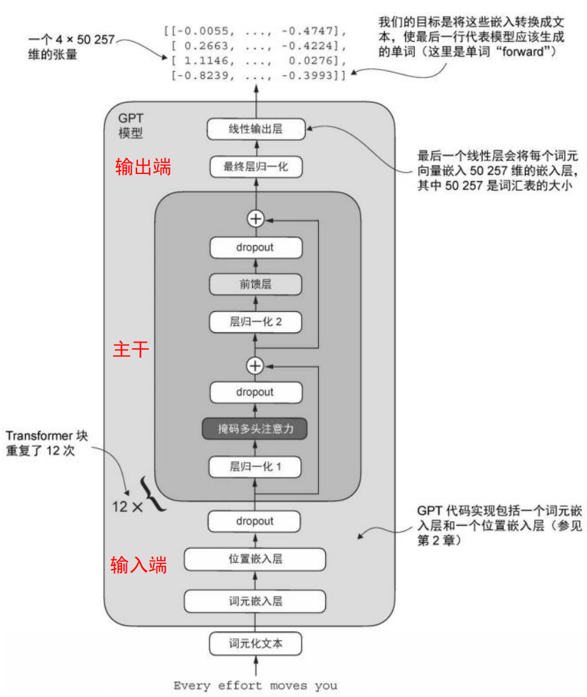
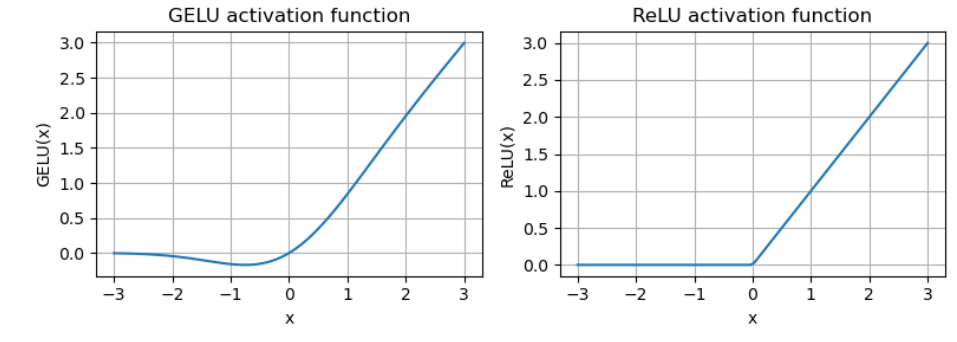

# 从头实现GPT模型

## 过程



## 参数含义

```python
"vocab_size": 50257,    # 词汇表大小（token 总数）
"context_length": 1024, # 上下文长度（一次最多处理的 token 数）
"emb_dim": 768,         # 嵌入维度（每个 token 向量的长度）
"n_heads": 12,          # 注意力头数（多头注意力的 head 数量）
"n_layers": 12,         # Transformer 层数（block 的数量）
"drop_rate": 0.1,       # Dropout 概率（训练时用于防止过拟合）
"qkv_bias": False       # Q/K/V 线性映射是否使用 bias（是否加偏置项）
```

## 完整GPT模型

### GPT完整骨架

```python
import torch
import torch.nn as nn

import tiktoken
from torch.utils.data import Dataset, DataLoader

"""
GPTModel
"""
class GPTModel(nn.Module):
    """
    一个可用的 GPT 模型骨架：
    Token Embedding + Position Embedding
    -> 多层 TransformerBlock 堆叠
    -> 最终 LayerNorm
    -> 输出头（投影回词表大小，得到 logits）
    """
    def __init__(self,cfg):
        super().__init__()
        self.tok_emb=nn.Embedding(cfg["vocab_size"],cfg["emb_dim"])
        self.pos_emb=nn.Embedding(cfg["context_length"],cfg["emb_dim"])
        self.drop_emb=nn.Dropout(cfg["drop_rate"])

        self.trf_blocks=nn.Sequential(
        *[TransformerBlock(cfg) for _ in range(cfg["n_layers"])])
        self.final_norm=LayerNorm(cfg["emb_dim"])
        self.out_head=nn.Linear(
            cfg["emb_dim"],cfg["vocab_size"],bias=False
        ) # logits 是未做 softmax 的打分

    def forward(self,in_idx):
        """
        前向传播：
        in_idx: (batch_size, seq_len) 的 token id
        返回:
        logits: (batch_size, seq_len, vocab_size)
               表示每个位置对词表中所有 token 的预测打分
        """
        batch_size,seq_len=in_idx.shape
        tok_embeds=self.tok_emb(in_idx)
        pos_embeds=self.pos_emb(torch.arange(seq_len,device=in_idx.device))
        x=tok_embeds+pos_embeds
        x=self.drop_emb(x)
        x=self.trf_blocks(x)
        x=self.final_norm(x)
        logits=self.out_head(x)
        return logits

    # 数据流动
    def forward(self,in_idx):
        batch_size,seq_len=in_idx.shape
        tok_embeds=self.tok_emb(in_idx)
        pos_embeds=self.pos_emb(torch.arange(seq_len,device=in_idx.device))
        x=tok_embeds+pos_embeds
        x=self.drop_emb(x)
        x=self.trf_blocks(x)
        x=self.final_norm(x)
        logits=self.out_head(x)
        return logits

"""
TransformerBlock
"""
class TransformerBlock(nn.Module):
    def __init__(self,cfg):
        super().__init__()
        self.att=MultiHeadAttention(
            d_in=cfg["emb_dim"],
            d_out=cfg["emb_dim"],
            context_length=cfg["context_length"],
            num_heads=cfg["n_heads"], 
            dropout=cfg["drop_rate"],
            qkv_bias=cfg["qkv_bias"])
        self.ff=FeedForward(cfg)
        # 归一化
        self.norm1=LayerNorm(cfg["emb_dim"]) # 注意力子模块前
        self.norm2=LayerNorm(cfg["emb_dim"]) # 前馈子模块前
        self.drop_shortcut=nn.Dropout(cfg["drop_rate"])

    def forward(self,x): # 使用残差链接
        shortcut=x # 原始输入
        x=self.norm1(x)
        x=self.att(x)
        x=self.drop_shortcut(x)
        x=x+shortcut

        shortcut=x
        x=self.norm2(x)
        x=self.ff(x)
        x=self.drop_shortcut(x)
        x=x+shortcut

        return x

"""
LayerNorm
"""
class LayerNorm(nn.Module):
    # 简化版LayerNorm
    """
    1. 对每个样本在特征维度上标准化
    2. 用两个可学习参数把标准化后结果：缩放和平移
    
    - eps:很小的常熟，用于后续计算时避免除零
    - scale:缩放
    - shift:平移
    """
    # 使用可学习参数，在需要时调整
    def __init__(self,emb_dim):
        super().__init__()
        self.eps=1e-5
        self.scale=nn.Parameter(torch.ones(emb_dim)) # 全1，一开始不改变尺寸
        self.shift=nn.Parameter(torch.zeros(emb_dim)) # 全0，一开始不平移

    def forward(self,x):
        mean=x.mean(dim=-1,keepdim=True)
        var=x.var(dim=-1,keepdim=True)
        norm_x=(x-mean)/torch.sqrt(var+self.eps)
        return self.scale * norm_x + self.shift
    
"""
GRLU
"""
class GELU(nn.Module):
    """
    具有GRLU激活函数的前馈神经网络
    
    - 传统的ReLU
    
    * - GELU:融合了高斯分布相关的平滑非线性（在负值区间保留非零梯度）
      - SwiGLU:引入了基于sigmoid的门控机制
    """
    def __init__(self):
        super().__init__()

    def forward(self,x):
        """
        tanh 近似公式：
        GELU(x) ≈ 0.5 * x * (1 + tanh( sqrt(2/pi) * (x + 0.044715 * x^3) ))
        其中 0.044715 是经验常数，sqrt(2/pi) 是缩放系数
        """
        return 0.5*x*(1+torch.tanh(
            torch.sqrt(torch.tensor(2.0/torch.pi))*
            (x+0.044715*torch.pow(x,3))
        ))

"""
FeedForward
"""
# 小型神经网络 FeedForward，用于大模型的 Block 组成部分
class FeedForward(nn.Module):
    """
    Sequential:
    按顺序把多个层串起来，前一层的输出自动作为下一层的输入
    
    不用的话，需要自己写：
    layer1 = nn.Linear(10, 20)
    layer2 = nn.ReLU()
    layer3 = nn.Linear(20, 5)
    
    def forward(self, x):
        x = layer1(x)
        x = layer2(x)
        x = layer3(x)
        return x
    """
    def __init__(self,cfg):
        super().__init__()
        self.layers=nn.Sequential(
            # 扩展层，扩展四倍（增加表达能力与参数量）
            nn.Linear(cfg["emb_dim"],4*cfg["emb_dim"]),
            # 非线性
            GELU(),
            # 投影回原维度
            nn.Linear(4*cfg["emb_dim"],cfg["emb_dim"]),
        )

    def forward(self,x):
        return self.layers(x)


"""
掩码多头注意力机制
"""
class GPTDatasetV1(Dataset):
    def __init__(self, txt, tokenizer, max_length, stride):
        self.input_ids = []
        self.target_ids = []

        # Tokenize the entire text
        token_ids = tokenizer.encode(txt, allowed_special={"<|endoftext|>"})

        # Use a sliding window to chunk the book into overlapping sequences of max_length
        for i in range(0, len(token_ids) - max_length, stride):
            input_chunk = token_ids[i:i + max_length]
            target_chunk = token_ids[i + 1: i + max_length + 1]
            self.input_ids.append(torch.tensor(input_chunk))
            self.target_ids.append(torch.tensor(target_chunk))

    def __len__(self):
        return len(self.input_ids)

    def __getitem__(self, idx):
        return self.input_ids[idx], self.target_ids[idx]


def create_dataloader_v1(txt, batch_size=4, max_length=256,
                         stride=128, shuffle=True, drop_last=True, num_workers=0):
    # Initialize the tokenizer
    tokenizer = tiktoken.get_encoding("gpt2")

    # Create dataset
    dataset = GPTDatasetV1(txt, tokenizer, max_length, stride)

    # Create dataloader
    dataloader = DataLoader(
        dataset, batch_size=batch_size, shuffle=shuffle, drop_last=drop_last, num_workers=num_workers)

    return dataloader


class MultiHeadAttention(nn.Module):
    def __init__(self, d_in, d_out, context_length, dropout, num_heads, qkv_bias=False):
        super().__init__()
        assert d_out % num_heads == 0, "d_out must be divisible by num_heads"

        self.d_out = d_out
        self.num_heads = num_heads
        self.head_dim = d_out // num_heads  # Reduce the projection dim to match desired output dim

        self.W_query = nn.Linear(d_in, d_out, bias=qkv_bias)
        self.W_key = nn.Linear(d_in, d_out, bias=qkv_bias)
        self.W_value = nn.Linear(d_in, d_out, bias=qkv_bias)
        self.out_proj = nn.Linear(d_out, d_out)  # Linear layer to combine head outputs
        self.dropout = nn.Dropout(dropout)
        self.register_buffer("mask", torch.triu(torch.ones(context_length, context_length), diagonal=1))

    def forward(self, x):
        b, num_tokens, d_in = x.shape

        keys = self.W_key(x)  # Shape: (b, num_tokens, d_out)
        queries = self.W_query(x)
        values = self.W_value(x)

        # We implicitly split the matrix by adding a `num_heads` dimension
        # Unroll last dim: (b, num_tokens, d_out) -> (b, num_tokens, num_heads, head_dim)
        keys = keys.view(b, num_tokens, self.num_heads, self.head_dim)
        values = values.view(b, num_tokens, self.num_heads, self.head_dim)
        queries = queries.view(b, num_tokens, self.num_heads, self.head_dim)

        # Transpose: (b, num_tokens, num_heads, head_dim) -> (b, num_heads, num_tokens, head_dim)
        keys = keys.transpose(1, 2)
        queries = queries.transpose(1, 2)
        values = values.transpose(1, 2)

        # Compute scaled dot-product attention (aka self-attention) with a causal mask
        attn_scores = queries @ keys.transpose(2, 3)  # Dot product for each head

        # Original mask truncated to the number of tokens and converted to boolean
        mask_bool = self.mask.bool()[:num_tokens, :num_tokens]

        # Use the mask to fill attention scores
        attn_scores.masked_fill_(mask_bool, -torch.inf)

        attn_weights = torch.softmax(attn_scores / keys.shape[-1]**0.5, dim=-1)
        attn_weights = self.dropout(attn_weights)

        # Shape: (b, num_tokens, num_heads, head_dim)
        context_vec = (attn_weights @ values).transpose(1, 2)

        # Combine heads, where self.d_out = self.num_heads * self.head_dim
        context_vec = context_vec.contiguous().view(b, num_tokens, self.d_out)
        context_vec = self.out_proj(context_vec)  # optional projection

        return context_vec


"""
生成文本函数
"""
def generate_text_simple(model,idx,max_new_tokens,context_size):
    """
    使用“贪心解码（greedy decoding）”生成文本的简化函数。

    参数：
    - model: 已构建好的 GPT 模型，输入 token id 序列，输出每个位置的 logits
    - idx: 初始上下文的 token id，形状 (batch_size, seq_len)
    - max_new_tokens: 要生成的新 token 数量
    - context_size: 模型允许的最大上下文长度（超出时只截取最后 context_size 个 token）
    """
    for _ in range(max_new_tokens):
        # 截取模型可用的上下文
        idx_cond=idx[:,-context_size:]
        # 向前推理得到 logits，不计算梯度
        with torch.no_grad():
            logits=model(idx_cond)
        # 只取最后一个位置
        logits=logits[:,-1,:]
        # 通过 softmax 转成概率分布
        probas=torch.softmax(logits,dim=-1)
        # 贪心解码
        idx_next=torch.argmax(probas,dim=-1,keepdim=True)
        # 新的拼接上去
        idx=torch.cat((idx,idx_next),dim=1)
    return idx
```

### 生成文本`demo`

1. 取最后一个`token`对应的`logits`
2. 应用 `softmax` 做归一化：把原本取值范围在 (−∞,+∞) 的打分转换成概率分布
3. 选出概率最高的 `token` 作为下一个输出（例如**贪心解码**就是取最大概率对应的 `token`）
4. 把新生成的`token` 追加到输入序列中，再把更新后的序列送回模型

```python
def generate_text_simple(model,idx,max_new_tokens,context_size):
    """
    使用“贪心解码（greedy decoding）”生成文本的简化函数。

    参数：
    - model: 已构建好的 GPT 模型，输入 token id 序列，输出每个位置的 logits
    - idx: 初始上下文的 token id，形状 (batch_size, seq_len)
    - max_new_tokens: 要生成的新 token 数量
    - context_size: 模型允许的最大上下文长度（超出时只截取最后 context_size 个 token）
    """
    for _ in range(max_new_tokens):
        # 截取模型可用的上下文
        idx_cond=idx[:,-context_size:]
        # 向前推理得到 logits，不计算梯度
        with torch.no_grad():
            logits=model(idx_cond)
        # 只取最后一个位置
        logits=logits[:,-1,:]
        # 通过 softmax 转成概率分布
        probas=torch.softmax(logits,dim=-1)
        # 贪心解码
        idx_next=torch.argmax(probas,dim=-1,keepdim=True)
        # 新的拼接上去
        idx=torch.cat((idx,idx_next),dim=1)
    return idx
```

### 使用示例

```python
# 实例化 GPT 模型，124M 参数模型
import tiktoken
tokenizer = tiktoken.get_encoding("gpt2")

model=GPTModel(GPT_CONFIG_124M)

start_context = "Hello, I am"

encoded=tokenizer.encode(start_context)
encoded_tensor=torch.tensor(encoded).unsqueeze(0)

# 模型切换为评估状态：
# 关闭 Dropout、使用固定的 LayerNorm/BatchNorm 行为（如果有），保证推理结果稳定
model.eval()

out=generate_text_simple(
    model=model,
    idx=encoded_tensor, # 已经分词好的 token_id 序列
    max_new_tokens=6, # 需要额外生成的 token 数量
    context_size=GPT_CONFIG_124M["context_length"] # 上下文窗口
)

# 解码
decoded_text=tokenizer.decode(out.squeeze(0).tolist())
print(decoded_text)
```

## 各个模块

### `GPTModel`骨干框架

1. 词元嵌入层`self.tok_emb=nn.Embedding(cfg["vocab_size"],cfg["emb_dim"])`
2. 位置嵌入层`self.pos_emb=nn.Embedding(cfg["context_length"],cfg["emb_dim"])`
3. (1+2)
4. 随即丢弃神经元`self.drop_emb=nn.Dropout(cfg["drop_rate"])`
5. 堆叠`Transformerblock`，重复

```python
        # 主干：堆叠 n_layers 个 Transformer block,重复执行 n 次
        self.trf_blocks=nn.Sequential(
        *[TransformerBlock(cfg) for _ in range(cfg["n_layers"])])
        """
        *：表示解包操作符
        [nn.Linear(), nn.ReLU()]
        -- > nn.Sequential(nn.Linear(), nn.ReLU())
        """
```

5. 最终层归一化`self.final_norm=LayerNorm(cfg["emb_dim"])`

6. 线性输出层

   ```python
   self.out_head=nn.Linear(
               cfg["emb_dim"],cfg["vocab_size"],bias=False
           )
   ```

### `TransformerBlock`

进行组合，引入掩码多头注意力机制（详见后补充）

```python
"""
组合成完整的Transformer模块代码
"""
# 引入掩码多头注意力机制
from pre import MultiHeadAttention 

class TransformerBlock(nn.Module):
    def __init__(self,cfg):
        super().__init__()
        self.att=MultiHeadAttention(
            d_in=cfg["emb_dim"],
            d_out=cfg["emb_dim"],
            context_length=cfg["context_length"],
            num_heads=cfg["n_heads"], 
            dropout=cfg["drop_rate"],
            qkv_bias=cfg["qkv_bias"])
        self.ff=FeedForward(cfg)
        # 归一化
        self.norm1=LayerNorm(cfg["emb_dim"]) # 注意力子模块前
        self.norm2=LayerNorm(cfg["emb_dim"]) # 前馈子模块前
        self.drop_shortcut=nn.Dropout(cfg["drop_rate"])

    def forward(self,x):
        shortcut=x # 原始输入
        x=self.norm1(x)
        x=self.att(x)
        x=self.drop_shortcut(x)
        x=x+shortcut

        shortcut=x
        x=self.norm2(x)
        x=self.ff(x)
        x=self.drop_shortcut(x)
        x=x+shortcut

        return x
```

#### 参数总数

在原始 GPT-2 论文中，研究者使用了**权重绑定（weight tying）**，也就是把输出层的权重与`token`嵌入层（`tok_emb`）的权重共享，做法等价于设置`self.out_head.weight = self.tok_emb.weight`。这样一来，模型不会为输出层再单独学习一套权重，从而显著减少参数量。

权重绑定指的是：将`token`嵌入矩阵复用为输出矩阵。如果不做权重绑定，会把这部分参数算两遍，参数总数从124M增加到更大的数。在实际训练中，不做权重绑定会更容易训练一些。

#### 各个版本情况

 - **GPT2-small** (the 124M configuration we already implemented):
        - "emb_dim" = 768
        - "n_layers" = 12
        - "n_heads" = 12

    - **GPT2-medium:**
        - "emb_dim" = 1024
        - "n_layers" = 24
        - "n_heads" = 16
    
    - **GPT2-large:**
        - "emb_dim" = 1280
        - "n_layers" = 36
        - "n_heads" = 20
    
    - **GPT2-XL:**
        - "emb_dim" = 1600
        - "n_layers" = 48
        - "n_heads" = 25

### `LayerNorm`

层归一化：对给定层的输出进行标准化，使得具有更稳定分布
稳定训练过程，防止梯度爆炸和下降

1. 对每个样本在特征维度上标准化
2. 用两个可学习参数把标准化后结果：缩放和平移

#### 1.标准化过程

- 求均值`mean=out.mean(dim=-1,keepdim=True)`
- 求方差`var=out.var(dim=-1,keepdim=True)`

1. 数据平移，以均值为中心，输出围绕 0 附近分布：`out-mean`

2. 方差调整为 1，将其除以标准差（方差的平方根）：`normed=(out-mean)/torch.sqrt(var)`

```python
# 简化版LayerNorm
"""
- eps:很小的常熟，用于后续计算时避免除零
- scale:缩放
- shift:平移
"""
# 使用可学习参数，在需要时调整
class LayerNorm(nn.Module):
    def __init__(self,emb_dim):
        super().__init__()
        self.eps=1e-5
        self.scale=nn.Parameter(torch.ones(emb_dim)) # 全1，一开始不改变尺寸
        self.shift=nn.Parameter(torch.zeros(emb_dim)) # 全0，一开始不平移

    def forward(self,x):
        mean=x.mean(dim=-1,keepdim=True)
        var=x.var(dim=-1,keepdim=True)
        norm_x=(x-mean)/torch.sqrt(var+self.eps)
        return self.scale * norm_x + self.shift
```

`unbiased=False`更常见；只有在确实需要统计意义上的“无偏估计”，或要和某段实现严格对齐时，才会用`unbiased=True`。

两者的差别在于固定比例,特征维度为 N 时，`unbiased=True`的方差会比`unbiased=False`大约
$$
\frac{N}{N-1}
$$
对应标准差相差
$$
\sqrt{\frac{N}{N-1}}
$$
所以 N 很大（如 768）时差异几乎可以忽略，但 N 很小（如教学案例中的 5）时差异会明显一些。

#### 2.残差链接

一般`LayerNorm`会与残差链接搭配使用：`use_shortcut`

使用残差后，梯度明显变大了

##### 残差链接过程

```python
"""
残差 / 快捷链接

为了解决：梯度爆炸和梯度消失
相当于增加一条旁路
LayerNorm与残差链接搭配使用
"""

class ExampleDeepNeuralNetwork(nn.Module):
    def __init__(self,layer_sizes,use_shortcut):
        """
        layer_sizes: 每一层的宽度列表，例如 [5, 10, 10, 10, 10, 1]
                 表示输入维度=5，接着 5->10->10->10->10->1 共 5 个线性层
        use_shortcut: 是否启用残差链接（当输入输出 shape 相同才进行相加）
        """
        super().__init__()
        self.use_shortcut=use_shortcut
        """
        ModuleList类似list，但是专门给PyTorch用的
        如果用list可能不会正确跟踪参数
        """
        # 先线性变换，再激活函数
        self.layers=nn.ModuleList([
            nn.Sequential(nn.Linear(layer_sizes[0], layer_sizes[1]), GELU()),
            nn.Sequential(nn.Linear(layer_sizes[1], layer_sizes[2]), GELU()),
            nn.Sequential(nn.Linear(layer_sizes[2], layer_sizes[3]), GELU()),
            nn.Sequential(nn.Linear(layer_sizes[3], layer_sizes[4]), GELU()),
            nn.Sequential(nn.Linear(layer_sizes[4], layer_sizes[5]), GELU())
        ])

    def forward(self,x):
        """
        逐层计算 layer_output = layer(x)
        若启用残差链接且 x 与 layer_output 的形状一致，则做 x = x + layer_output
          （形状一致是为了保证相加合法）
        否则直接用 x = layer_output
        """
        for layer in self.layers:
            layer_output=layer(x)
            if self.use_shortcut and x.shape==layer_output.shape:
                x=x+layer_output
            else:
                x=layer_output
        return x
```

##### 打印权重参数

```python
def print_gradients(model,x):
    """
    用于打印模型各层权重参数的梯度大小（平均绝对值），观察梯度是否衰减/爆炸。
    步骤：
    (1) 前向传播得到 output
    (2) 构造一个目标 target（这里设为 0）
    (3) 用 MSELoss 计算 loss
    (4) 反向传播 loss.backward() 计算梯度
    (5) 遍历模型参数，打印每个 weight 的梯度均值
    """
    # 前向传播
    output=model(x)
    target=torch.tensor([[0.]]) # 创建二维张量，占位符，仅仅演示

    # 损失函数，这里使用均方误差（回归，连续）
    # 大模型里更多使用，交叉熵损失（分类，离散）token的概率用这个
    loss=nn.MSELoss()
    loss=loss(output,target)
    loss.backward() # 反向传播，计算梯度，结果会保存到 param.grad

    """
    model.named_parameters()：返回模型中所有参数[参数名字,参数值]
    """
    for name,param in model.named_parameters():
        if 'weight' in name:
            # 取梯度均值
            print(f"{name} has gradient mean of {param.grad.abs().mean().item()}")
```

最终得出结果，使用残差链接**梯度明显变大**

### `GRLU`

```python
"""
具有GRLU激活函数的前馈神经网络

- 传统的ReLU

* - GELU:融合了高斯分布相关的平滑非线性（在负值区间保留非零梯度）
  - SwiGLU:引入了基于sigmoid的门控机制
"""
class GELU(nn.Module):
    def __init__(self):
        super().__init__()

    def forward(self,x):
        """
        tanh 近似公式：
        GELU(x) ≈ 0.5 * x * (1 + tanh( sqrt(2/pi) * (x + 0.044715 * x^3) ))
        其中 0.044715 是经验常数，sqrt(2/pi) 是缩放系数
        """
        return 0.5*x*(1+torch.tanh(
            torch.sqrt(torch.tensor(2.0/torch.pi))*
            (x+0.044715*torch.pow(x,3))
        ))
```

- GELU：像一个平滑版的`ReLU`
  - 用高斯分布的累积分布函数，对输入做“概率性保留”

$$
\text{GELU}(x)=x\cdot \frac{1}{2}\left(1+\operatorname{erf}\left(\frac{x}{\sqrt{2}}\right)\right)
$$

​	常用近似公式：
$$
\text{GELU}(x)\approx 0.5x\left(1+\tanh\left(\sqrt{\frac{2}{\pi}}\left(x+0.044715x^3\right)\right)\right)
$$


- `SwiGLU`：**Swish + GLU 门控机制**
  - 带开关门的FFN，一个分支 xw2 生成信息，另一分支 xw1 控制通过多少信息
  - 然后逐元素相乘，给每个特征一个动态权重开关

$$
\text{Swish}(z)=z\cdot \sigma(z)
$$

$$
\sigma(z)=\frac{1}{1+e^{-z}}
$$

$$
\text{SwiGLU}(x)=\left((xW_1)\cdot \sigma(xW_1)\right)\odot (xW_2)
$$

### `FeedForward`

```python
# 小型神经网络 FeedForward，用于大模型的 Block 组成部分
"""
Sequential:
按顺序把多个层串起来，前一层的输出自动作为下一层的输入

不用的话，需要自己写：
layer1 = nn.Linear(10, 20)
layer2 = nn.ReLU()
layer3 = nn.Linear(20, 5)

def forward(self, x):
    x = layer1(x)
    x = layer2(x)
    x = layer3(x)
    return x
"""
class FeedForward(nn.Module):
    def __init__(self,cfg):
        super().__init__()
        self.layers=nn.Sequential(
            # 扩展层，扩展四倍（增加表达能力与参数量）
            nn.Linear(cfg["emb_dim"],4*cfg["emb_dim"]),
            # 非线性
            GELU(),
            # 投影回原维度
            nn.Linear(4*cfg["emb_dim"],cfg["emb_dim"]),
        )

    def forward(self,x):
        return self.layers(x)
```

### 补充：上一chapter，掩码多头注意力机制

```python
# Copyright (c) Sebastian Raschka under Apache License 2.0 (see LICENSE.txt).
# Source for "Build a Large Language Model From Scratch"
#   - https://www.manning.com/books/build-a-large-language-model-from-scratch
# Code: https://github.com/rasbt/LLMs-from-scratch

import tiktoken
import torch
import torch.nn as nn
from torch.utils.data import Dataset, DataLoader


class GPTDatasetV1(Dataset):
    def __init__(self, txt, tokenizer, max_length, stride):
        self.input_ids = []
        self.target_ids = []

        # Tokenize the entire text
        token_ids = tokenizer.encode(txt, allowed_special={"<|endoftext|>"})

        # Use a sliding window to chunk the book into overlapping sequences of max_length
        for i in range(0, len(token_ids) - max_length, stride):
            input_chunk = token_ids[i:i + max_length]
            target_chunk = token_ids[i + 1: i + max_length + 1]
            self.input_ids.append(torch.tensor(input_chunk))
            self.target_ids.append(torch.tensor(target_chunk))

    def __len__(self):
        return len(self.input_ids)

    def __getitem__(self, idx):
        return self.input_ids[idx], self.target_ids[idx]


def create_dataloader_v1(txt, batch_size=4, max_length=256,
                         stride=128, shuffle=True, drop_last=True, num_workers=0):
    # Initialize the tokenizer
    tokenizer = tiktoken.get_encoding("gpt2")

    # Create dataset
    dataset = GPTDatasetV1(txt, tokenizer, max_length, stride)

    # Create dataloader
    dataloader = DataLoader(
        dataset, batch_size=batch_size, shuffle=shuffle, drop_last=drop_last, num_workers=num_workers)

    return dataloader


class MultiHeadAttention(nn.Module):
    def __init__(self, d_in, d_out, context_length, dropout, num_heads, qkv_bias=False):
        super().__init__()
        assert d_out % num_heads == 0, "d_out must be divisible by num_heads"

        self.d_out = d_out
        self.num_heads = num_heads
        self.head_dim = d_out // num_heads  # Reduce the projection dim to match desired output dim

        self.W_query = nn.Linear(d_in, d_out, bias=qkv_bias)
        self.W_key = nn.Linear(d_in, d_out, bias=qkv_bias)
        self.W_value = nn.Linear(d_in, d_out, bias=qkv_bias)
        self.out_proj = nn.Linear(d_out, d_out)  # Linear layer to combine head outputs
        self.dropout = nn.Dropout(dropout)
        self.register_buffer("mask", torch.triu(torch.ones(context_length, context_length), diagonal=1))

    def forward(self, x):
        b, num_tokens, d_in = x.shape

        keys = self.W_key(x)  # Shape: (b, num_tokens, d_out)
        queries = self.W_query(x)
        values = self.W_value(x)

        # We implicitly split the matrix by adding a `num_heads` dimension
        # Unroll last dim: (b, num_tokens, d_out) -> (b, num_tokens, num_heads, head_dim)
        keys = keys.view(b, num_tokens, self.num_heads, self.head_dim)
        values = values.view(b, num_tokens, self.num_heads, self.head_dim)
        queries = queries.view(b, num_tokens, self.num_heads, self.head_dim)

        # Transpose: (b, num_tokens, num_heads, head_dim) -> (b, num_heads, num_tokens, head_dim)
        keys = keys.transpose(1, 2)
        queries = queries.transpose(1, 2)
        values = values.transpose(1, 2)

        # Compute scaled dot-product attention (aka self-attention) with a causal mask
        attn_scores = queries @ keys.transpose(2, 3)  # Dot product for each head

        # Original mask truncated to the number of tokens and converted to boolean
        mask_bool = self.mask.bool()[:num_tokens, :num_tokens]

        # Use the mask to fill attention scores
        attn_scores.masked_fill_(mask_bool, -torch.inf)

        attn_weights = torch.softmax(attn_scores / keys.shape[-1]**0.5, dim=-1)
        attn_weights = self.dropout(attn_weights)

        # Shape: (b, num_tokens, num_heads, head_dim)
        context_vec = (attn_weights @ values).transpose(1, 2)

        # Combine heads, where self.d_out = self.num_heads * self.head_dim
        context_vec = context_vec.contiguous().view(b, num_tokens, self.d_out)
        context_vec = self.out_proj(context_vec)  # optional projection

        return context_vec
```

需要强调的是，这里模型还没有训练，所以预测未必合理；真正让“正确的下一个 token”概率变高的训练过程，会在下一章完成。


