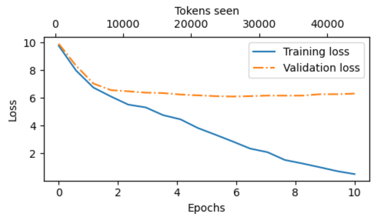
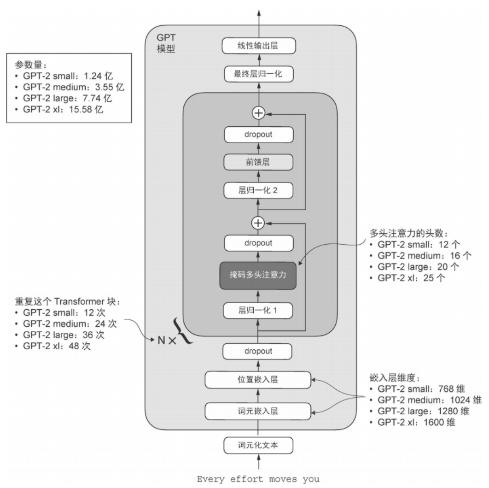
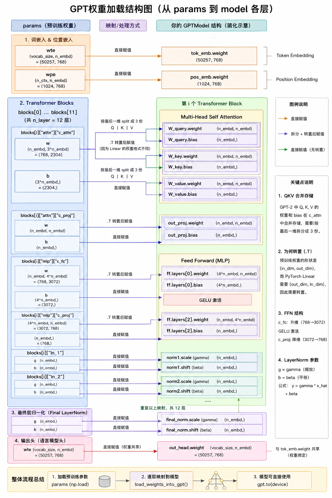

# 无标签预训练

## 关键内容

1. 预训练大模型的训练循环
2. 模型评估代码，检查效果与质量
3. 解码策略
4. 保存和加载预训练权重

## 现代大模型与原先区别

- 不使用`dropout`
- `nn.Linear`不使用`bias`

## 过程记录

### 训练

#### 方便文本与token ID之间来回转换

```python
import tiktoken

def text_to_token_ids(text,tokenizer):
    encoded=tokenizer.encode(text,allowed_special={'<|endoftext|>'})
    
    # 把 token id 列表转成 PyTorch 张量，形状是 [seq_len]
    # torch.tensor(encoded) -> 1D 张量，例如 [15496, 1234, ...]
    # unsqueeze(0) 在最前面增加一个 batch 维度，变成 [1, seq_len]
    # 这么做是因为大多数模型的输入都要求带 batch 维，即使只生成一条样本也要写成 batch=1
    encoded_tensor=torch.tensor(encoded).unsqueeze(0)
    return encoded_tensor

def token_ids_to_text(token_ids,tokenizer):
    # 反着来
    flat=token_ids.squeeze(0)
    return tokenizer.decode(flat.tolist())
```

#### 使用模型

```python
GPT_CONFIG_124M = {
    "vocab_size": 50257,   
    "context_length": 256, 
    "emb_dim": 768,        
    "n_heads": 12,         
    "n_layers": 12,      
    "drop_rate": 0.1,      
    "qkv_bias": False     
}

torch.manual_seed(123)
model = GPTModel(GPT_CONFIG_124M)
model.eval();

start_context = "Every effort moves you"

tokenizer=tiktoken.get_encoding("gpt2")

token_ids=generate_text_simple(
    model=model,
    idx=text_to_token_ids(start_context,tokenizer),
    max_new_tokens=10,
    context_size=GPT_CONFIG_124M["context_length"]
)

print("Output text:\n", token_ids_to_text(token_ids, tokenizer))
```

### 评估

#### 交叉熵函数

##### 原理

目标：使得`token`的概率接近**1**
数学优化里，最大化概率对数。取对数后，目标变成**0**。

- 取对数
- 计算平均值
- 取负（转为需要最小化的目标函数）

即**交叉熵损失**

输出`logits`，经过`softmax`
$$
\hat{y}_i = \frac{e^{z_i}}{\sum_{j=1}^{C} e^{z_j}}
$$
代入交叉熵
$$
L = - \log\left(\frac{e^{z_y}}{\sum_{j=1}^{C} e^{z_j}}\right)
$$

##### 使用

直接使用`PyTorch`内置函数

- 内部自动完成（包括`softmax`和对数计算）

```python
logits_flat=logits.flatten(0,1)
targets_flat=targets.flatten()
loss=torch.nn.functional.cross_entropy(logits_flat,targets_flat)
```

##### 困惑度

困惑度通常被认为更直观，因为它可以理解为模型在每一步“相当于在多少个候选词或 token 之间犹豫不决”，困惑度衡量的是模型预测出来的概率分布与数据集中真实词分布的匹配程度。和损失一样，困惑度越低，说明模型的预测越接近真实分布，整体效果也越好。

```python
perplexity=torch.exp(loss)
```

#### 前期准备

##### 数据集划分

```python
train_ratio=0.90
split_idx=int(train_ratio * len(text_data))
train_data=text_data[:split_idx]
val_data=text_data[split_idx:]
```

##### 配置

```python
train_loader=create_dataloader_v1(
    train_data,
    batch_size=2,
    max_length=GPT_CONFIG_124M["context_length"],
    stride=GPT_CONFIG_124M["context_length"],
    drop_last=True, # 丢弃最后一个不满 batch 的小批次
    shuffle=True, # 训练时打乱
    num_workers=0
)

val_loader=create_dataloader_v1(
    val_data,
    batch_size=2,
    max_length=GPT_CONFIG_124M["context_length"],
    stride=GPT_CONFIG_124M["context_length"],
    drop_last=False,  # 验证时通常不丢数据，最后一个不满 batch 的也参与评估
    shuffle=False,    # 验证集不打乱，保证评估稳定可复现
    num_workers=0
)

if total_tokens*(train_ratio)<GPT_CONFIG_124M["context_length"]:
    print("token数不够训练集，建议调小配置或增大比例")
if total_tokens*(1-train_ratio)<GPT_CONFIG_124M["context_length"]:
    print("token数不够测试集，建议调小配置或调小比例")
    
# 打印输入张量和目标张量的形状，查看划分是否正确
# 计算token数，input_batch.numel()
```

##### 工具函数

- 计算`batch`交叉熵函数
- 按用户指定的`batch`数量计算并汇总损失

```python
def calc_loss_batch(input_batch,target_batch,model,device):
    # 移动到同一个设别(gpu/cpu)
    input_batch,target_batch=input_batch.to(device),target_batch.to(device)
    logits=model(input_batch)
    """
    交叉熵要求输入格式：
    (input.shape)  = (N, C)
    (target.shape) = (N,)

    将batch和seq_len两个维度展平成N
    """
    loss=torch.nn.functional.cross_entropy(logits.flatten(0,1),target_batch.flatten())
    return loss

def calc_loss_loader(data_loader,model,device,num_batches=None):
    total_loss=0.
    if len(data_loader)==0:
        return float("nan") # 防止发生除零
        
    # 默认遍历整个 loader；也可以只算前 num_batches 个 batch（用于快速评估/调试）
    elif num_batches is None:
        num_batches=len(data_loader)
    else:
        num_batches=min(num_batches,len(data_loader))

    # 累加
    for i,(input_batch,target_batch) in enumerate(data_loader):
        if i<num_batches:
            loss=calc_loss_batch(input_batch,target_batch,model,device)
            total_loss+=loss.item()
            # loss.item() 取出 Python 数值
        else:
            break
    return total_loss/num_batches
```

##### 实例

```python
"""
优先级：CUDA（NVIDIA显卡）-> MPS（苹果芯片GPU）-> CPU
"""

if torch.cuda.is_available():
    device=torch.device("cuda")
elif torch.backends.mps.is_available():
    # 检查 PyTorch 版本，按.分割，取前两个
    # 只有版本 > 2.9 才可以使用 mps
    major,minor=map(int,torch.__version__.split(".")[:2])
    if(major,minor)>=(2,9):
        device=torch.device("mps")
    else:
        device=torch.device("cpu")
else:
    device=torch.device("cpu")

print(f"Using {device} device.")

model.to(device)

torch.manual_seed(123)

with torch.no_grad():
    train_loss=calc_loss_loader(train_loader,model,device)
    val_loss=calc_loss_loader(val_loader,model,device)

print("Training loss:", train_loss)
print("Validation loss:", val_loss)
```

#### 训练大模型

- `loss`量化进度
- `sample`感知输出合理性

```python
def train_model_simple(model,train_loader,val_loader,optimizer,device,num_epochs,
                       eval_freq,eval_iter,start_context,tokenizer):
    """
    按照 num_epochs 反复遍历训练集，每个 batch执行：
    1.清空旧梯度
    2.前向计算交叉熵损失
    3.反向传播得到梯度
    """
    train_losses,val_losses,track_tokens_seen=[],[],[]
    tokens_seen,global_step=0,-1

    for epoch in range(num_epochs):
        model.train() # 训练模式，启动训练行为
        for input_batch,target_batch in train_loader:
            # 清空上一轮的梯度，避免梯度累积
            optimizer.zero_grad()
            # 前向+交叉熵 loss
            loss=calc_loss_batch(input_batch,target_batch,model,device)
            # 反向传播，计算梯度
            loss.backward()
            # 优化器根据梯度更新模型参数
            optimizer.step()

            # 反映训练规模：统计累计处理过多少个 token
            tokens_seen+=input_batch.numel()
            global_step+=1 

            if global_step%eval_freq==0:
                train_loss,val_loss=evaluate_model(
                    model,train_loader,val_loader,device,eval_iter)
                train_losses.append(train_loss)
                val_losses.append(val_loss)
                track_tokens_seen.append(tokens_seen)
                # 按固定频率做一次快速评估（评估 eval_iter 个 batch）
                print(f"Ep {epoch+1} (Step {global_step:06d}): "
                      f"Train loss {train_loss:.3f}, Val loss {val_loss:.3f}")    

        generate_and_print_sample(
            model,tokenizer,device,start_context
        )

    return train_losses,val_losses,track_tokens_seen

def evaluate_model(model,train_loader,val_loader,device,eval_iter):
    """
    进行评估
    """
    # 评估模式，关闭随机性，保持评估稳定
    model.eval()

    with torch.no_grad():
    # 只用前 eval_iter 个 batch 估算平均 loss，速度快但足够用于训练过程的趋势监控
        train_loss=calc_loss_loader(train_loader,model,device,num_batches=eval_iter)
        val_loss=calc_loss_loader(val_loader,model,device,num_batches=eval_iter)
    # 评估结束切回训练模式
    model.train() 
    return train_loss,val_loss

def generate_and_print_sample(model,tokenizer,device,start_context):
    """
    质量检测：每个 epoch结束后调用，生成一段样例文本
    """
    model.eval()
    
    # 从位置嵌入长度读取模型支持的上下文窗口
    context_size=model.pos_emb.weight.shape[0]
    # prompt 编码并放到同一设备
    encoded=text_to_token_ids(start_context,tokenizer).to(device)
    with torch.no_grad():
        token_ids=generate_text_simple(
            model=model,idx=encoded,
            max_new_tokens=50,context_size=context_size
        )
    # 解码成可读的文本
    decoded_text=token_ids_to_text(token_ids,tokenizer)
    print(decoded_text.replace("\n", " "))  
    model.train()
```

##### 使用

```python
torch.manual_seed(123)
model=GPTModel(GPT_CONFIG_124M)
model.to(device)
optimizer=torch.optim.AdamW(
    # 优化器：训练大模型使用，带 weight_decay 的正则化
    model.parameters(),
    # 学习率：决定每次参数更新步幅
    lr=0.0004,
    # 权重衰减：抑制权重过大，降低过拟合风险
    weight_decay=0.1
)

num_epochs=10
train_losses,val_losses,tokens_seen=train_model_simple(
    model,train_loader,val_loader,optimizer,device,
    num_epochs=num_epochs,
    eval_freq=5,
    eval_iter=5,
    start_context="Every effort moves you",
    tokenizer=tokenizer
)
```

##### 绘制图



`loss`开始过拟合
原因：训练集小，对同一份数据重复训练多轮

### 解码策略

研究 如何**概率 --> 文本**

1. 贪心解码：选择概率最大的（确定，不随机）

```python
next_token_id=torch.argmax(probas).item() 
```

2. 温度缩放：`logits`除以大于0的数

- 温度大于1时，`softmax`后的概率会更均匀
- 小于1时，更尖锐，偏向高概率的`token`

```python
def softmax_with_temperature(logits,temperature):
    scaled_logits = logits / temperature
    return torch.softmax(scaled_logits, dim=0)

# 1:不改变 ；0.1更尖锐；5：更平滑
temperatures=[1,0.1,5]
scaled_probas = [softmax_with_temperature(next_token_logits, T) for T in temperatures]
```

3. Top-k采样：限制随机采样范围

```python
# 限制采样范围
top_k=3

# 返回最高分的（logits值，位置索引）
top_logits,top_pos=torch.topk(next_token_logits,top_k)

"""
方法1：小于最小阈值的变为 -inf，softmax时候变为0，其他的原样
"""
new_logits=torch.where(
    condition=next_token_logits<top_logits[-1],
    input=torch.tensor(float("-inf")),
    other=next_token_logits
)

"""
方法2：创建张量，所有位置-inf，其他对应位置拷贝。效率高一点
"""
new_logits=torch.full_like(
    next_token_logits,-torch.inf
)
new_logits[top_pos]=next_token_logits[top_pos]

topk_probas=torch.softmax(new_logits,dim=0) # 进行softmax
```

#### 文本生成函数修改

```python
def generate(model,idx,max_new_tokens,context_size,temperature=0.0,top_k=None,eos_id=None):
    """
    temperature：0，贪心解码；>0，采样解码
    top_k：只在前 k个采样；None--不限制
    eos_id：提前停止；None不启用
    """
    for _ in range(max_new_tokens):
        # 裁剪输入序列：保留最后 context_size 个
        idx_cond=idx[:,-context_size:]
        with torch.no_grad():
            logits=model(idx_cond)
        logits=logits[:,-1,:]

        if top_k is not None:
            top_logits,_=torch.topk(logits,top_k)
            min_val=top_logits[:,-1] # 阈值：最小的
            logits=torch.where(
                logits<min_val,
                torch.tensor(float("-inf")).to(logits.device),
                logits
            )

        if temperature > 0.0:
            logits=logits/temperature
            # 数值稳定：先减去最大值，防止溢出
            logits=logits-logits.max(dim=-1,keepdim=True).values
            probs=torch.softmax(logits,dim=-1)
            idx_next=torch.multinomial(probs,num_samples=1)
        else:
            idx_next=torch.argmax(logits,dim=-1,keepdim=True)

        # 制定了停止位置，且已到停止处，则提前停止
        if idx_next == eos_id:
            break
        idx=torch.cat((idx,idx_next),dim=1) # 新的拼到末尾，作为下一步输入

    return idx    

# 使用实例
token_ids = generate(
    model=model,
    idx=text_to_token_ids("Every effort moves you", tokenizer).to(inference_device),
    max_new_tokens=15,
    context_size=GPT_CONFIG_124M["context_length"],
    top_k=25,
    temperature=1.4
)

token_ids_to_text(token_ids, tokenizer)
```

### 保存和加载权重

#### 保存

```python
# 保存权重和优化器（使用自适应优化器）
torch.save({
    "model_state_dict":model.state_dict(),
    "optimizer_state_dict":optimizer.state_dict(),
    },
    "model_and_optimizer.pth"
)
```

#### 加载

```python
model=GPTModel(GPT_CONFIG_124M)
if torch.cuda.is_available():
    device=torch.device("cuda")
elif torch.backends.mps.is_available():
    major, minor = map(int, torch.__version__.split(".")[:2])
    if (major, minor) >= (2, 9):
        device = torch.device("mps")
else:
    device = torch.device("cpu")

# example
# map_location=device：无论权重文件是在哪个设备上保存的，都映射到当前 device
# 只加载权重，更安全 + 只恢复参数
model.load_state_dict(torch.load("model.pth",map_location=device,weights_only=True))
model.eval();

# 检查点，完整
checkpoint=torch.load("model_and_optimizer.pth",weights_only=True)

model=GPTModel(GPT_CONFIG_124M)
model.load_state_dict(checkpoint["model_state_dict"])

optimizer=torch.optim.AdamW(model.parameters(),lr=0.0005,weight_decay=0.1)
optimizer.load_state_dict(checkpoint["optimizer_state_dict"])
model.train();
```

## 使用GPT-2

##### 配置（`settings`）

模型结构蓝图，决定模型长什么样

- `vocab`：词表大小，模型总共认识多少`token`
- `n_ctx`：上下文长度，模型一次最多同时看多少`token`（同，`context_length,max_length,seq_len`）
- `n_embd`：嵌入维度，每个token表示的向量维度
- `n_head`：多头注意力头数
- `n_layer`：`Transformer block`层数

##### 参数字典（`params.keys()`）

模型权重被分模块存储（真正学到的），决定模型学到了什么

- `wte：embedding` 权重矩阵（50257，768）
- `wpe`：位置编码矩阵（1024，768）
- `blocks`：所有`Transformer`层的参数
- `g`和`b`：`LayerNorm`参数
  - `g`：缩放参数，控制缩放
  - `b`：偏置参数，控制平移

##### 各种版本GPT



```python
from gpt_download import download_and_load_gpt2

settings,params=download_and_load_gpt2(model_size="124M",models_dir="gpt2")

"""
权重已加载到Python中，现在将权重传入实例中
"""
# 定义字典保存模型配置
model_configs = {  # 定义一个字典保存不同 GPT-2 模型的配置，以简化管理
    "gpt2-small (124M)": {"emb_dim": 768, "n_layers": 12, "n_heads": 12},
    "gpt2-medium (355M)": {"emb_dim": 1024, "n_layers": 24, "n_heads": 16},
    "gpt2-large (774M)": {"emb_dim": 1280, "n_layers": 36, "n_heads": 20},
    "gpt2-xl (1558M)": {"emb_dim": 1600, "n_layers": 48, "n_heads": 25},
}

model_name="gpt2-small (124M)"

# 复制基础配置
NEW_CONFIG=GPT_CONFIG_124M.copy()
# 更新为所选配置
NEW_CONFIG.update(model_configs[model_name])
NEW_CONFIG.update({"context_length": 1024, "qkv_bias": True})

# 实例化模型，评估模式
gpt=GPTModel(NEW_CONFIG)
gpt.eval();

# 将权重分配到 GPTModel实例中对应的权重张量
def assign(left, right):
    # 检验权重。left:我模型，right:预训练权重
    if left.shape != right.shape:
        raise ValueError(f"Shape mismatch. Left: {left.shape}, Right: {right.shape}")
    return torch.nn.Parameter(torch.tensor(right))
    
import numpy as np

def load_weights_into_gpt(gpt, params):
    # embedding层
    gpt.pos_emb.weight = assign(gpt.pos_emb.weight, params['wpe'])
    gpt.tok_emb.weight = assign(gpt.tok_emb.weight, params['wte'])

    # Attention层
    for b in range(len(params["blocks"])):
        # 官方 GPT 把三个权重合并了，所以这里要再拆分开
        q_w, k_w, v_w = np.split(
            (params["blocks"][b]["attn"]["c_attn"])["w"], 3, axis=-1)
       
        # 转置的原因：
        # 官方常见：(input_dim, output_dim)
        # PyTorch Linear是(out_features, in_features)
        gpt.trf_blocks[b].att.W_query.weight = assign(
            gpt.trf_blocks[b].att.W_query.weight, q_w.T)
        gpt.trf_blocks[b].att.W_key.weight = assign(
            gpt.trf_blocks[b].att.W_key.weight, k_w.T)
        gpt.trf_blocks[b].att.W_value.weight = assign(
            gpt.trf_blocks[b].att.W_value.weight, v_w.T)

        q_b, k_b, v_b = np.split(
            (params["blocks"][b]["attn"]["c_attn"])["b"], 3, axis=-1)
        gpt.trf_blocks[b].att.W_query.bias = assign(
            gpt.trf_blocks[b].att.W_query.bias, q_b)
        gpt.trf_blocks[b].att.W_key.bias = assign(
            gpt.trf_blocks[b].att.W_key.bias, k_b)
        gpt.trf_blocks[b].att.W_value.bias = assign(
            gpt.trf_blocks[b].att.W_value.bias, v_b)

        # Attention输出层
        # 多头 attention 拼接后的线性映射
        gpt.trf_blocks[b].att.out_proj.weight = assign(
            gpt.trf_blocks[b].att.out_proj.weight, 
            params["blocks"][b]["attn"]["c_proj"]["w"].T)
        gpt.trf_blocks[b].att.out_proj.bias = assign(
            gpt.trf_blocks[b].att.out_proj.bias, 
            params["blocks"][b]["attn"]["c_proj"]["b"])

        # 前馈网络FFN
        # 升维，激活，后降维，扩展表达能力再压缩回主维度
        gpt.trf_blocks[b].ff.layers[0].weight = assign(
            gpt.trf_blocks[b].ff.layers[0].weight, 
            params["blocks"][b]["mlp"]["c_fc"]["w"].T)
        gpt.trf_blocks[b].ff.layers[0].bias = assign(
            gpt.trf_blocks[b].ff.layers[0].bias, 
            params["blocks"][b]["mlp"]["c_fc"]["b"])
        gpt.trf_blocks[b].ff.layers[2].weight = assign(
            gpt.trf_blocks[b].ff.layers[2].weight, 
            params["blocks"][b]["mlp"]["c_proj"]["w"].T)
        gpt.trf_blocks[b].ff.layers[2].bias = assign(
            gpt.trf_blocks[b].ff.layers[2].bias, 
            params["blocks"][b]["mlp"]["c_proj"]["b"])

        # layerNorm
        gpt.trf_blocks[b].norm1.scale = assign(
            gpt.trf_blocks[b].norm1.scale, 
            params["blocks"][b]["ln_1"]["g"])
        gpt.trf_blocks[b].norm1.shift = assign(
            gpt.trf_blocks[b].norm1.shift, 
            params["blocks"][b]["ln_1"]["b"])
        gpt.trf_blocks[b].norm2.scale = assign(
            gpt.trf_blocks[b].norm2.scale, 
            params["blocks"][b]["ln_2"]["g"])
        gpt.trf_blocks[b].norm2.shift = assign(
            gpt.trf_blocks[b].norm2.shift, 
            params["blocks"][b]["ln_2"]["b"])

    gpt.final_norm.scale = assign(gpt.final_norm.scale, params["g"])
    gpt.final_norm.shift = assign(gpt.final_norm.shift, params["b"])
    gpt.out_head.weight = assign(gpt.out_head.weight, params["wte"])
    
    
load_weights_into_gpt(gpt, params)
gpt.to(device);

# 实例使用
torch.manual_seed(123)

token_ids = generate(
    model=gpt,
    idx=text_to_token_ids("Every effort moves you", tokenizer).to(device),
    max_new_tokens=25,
    context_size=NEW_CONFIG["context_length"],
    top_k=50,
    temperature=1.5
)

print("Output text:\n", token_ids_to_text(token_ids, tokenizer))
```

##### 权重加载结构图




