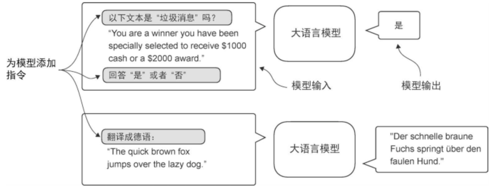

# 针对分类任务的微调

微调：在预训练模型的基础上做二次训练，把模型的能力对齐到某个明确任务或者使用场景上
本节任务：使用已有的预训练模型做邮件分类
**分类微调**：类别和数量是预定义好的
**指令微调**如下图所示：



## 前期流程

1. 读取数据
2. 查看种类数量
3. 控制数量一样多：下采样（降采样）
4. 分类编码（0/1）
5. 划分子集

```python
def random_split(df,train_frac,validation_frac):
    """
    sample:随机抽样
    - frac=1 表示“抽取 100% 的行”，相当于全量洗牌，随机打乱
    reset_index:重新生成索引
    - drop=True 表示不要把原来的索引作为一列保留下来。
    """
    # 下标
    df=df.sample(frac=1,random_state=123).reset_index(drop=True)
    train_end=int(len(df)*train_frac)
    validation_end=train_end+int(len(df)*validation_frac)

    train_df=df[:train_end]
    validation_df=df[train_end:validation_end]
    test_df=df[validation_end:]

    return train_df,validation_df,test_df

# 70 学习,10 调整,20 客观评估
train_df,validation_df,test_df=random_split(balanced_df,0.7,0.1)
```

6. 统一长度（截断/补齐）

```python
# 找出最长序列，给短的补上 padding token
import torch
from torch.utils.data import Dataset
import tiktoken

tokenizer=tiktoken.get_encoding("gpt2")
print(tokenizer.encode("<|endoftext|>", allowed_special={"<|endoftext|>"}))

class SpamDataset(Dataset):
    """
    1.将csv的数据变成能直接训练的数据集对象，预先编码
    2.解决长度对齐
    """
    def __init__(self,csv_file,tokenizer,max_length=None,pad_token_id=50256): # 编号是这个
        self.data=pd.read_csv(csv_file)

        # 读取文本和标签
        self.encoded_texts=[
            # 分词并编码
            tokenizer.encode(text) for text in self.data["Text"]
        ]

        # 统一长度
        if max_length is None:
            # 未指定长度，则为最长
            self.max_length=self._longest_encoded_length()
        else:
            # 指定了长度，截断
            self.max_length=max_length
            self.encoded_texts=[
                encoded_text[:self.max_length]
                for encoded_text in self.encoded_texts
            ]

        # 补齐(padding):序列补齐到相同长度
        self.encoded_texts=[
            encoded_text+[pad_token_id]*(self.max_length-len(encoded_text))
            for encoded_text in self.encoded_texts
        ]

    def __getitem__(self,index):
        # 逐条取数据
        # 返回张量的(输入序列,标签)
        encoded=self.encoded_texts[index]
        # iloc 是按 行号（位置索引） 取行的方法。
        label=self.data.iloc[index]["Label"] # 取 index这一行的 Label这一列
        return (
            torch.tensor(encoded,dtype=torch.long),
            torch.tensor(label,dtype=torch.long)
        )

    def __len__(self):
        return len(self.data)

    def _longest_encoded_length(self):
        # 扫描所有，找到最长的，作为 padding目标长度
        max_length=0
        for encoded_text in self.encoded_texts:
            encoded_length=len(encoded_text)
            if encoded_length > max_length:
                max_length=encoded_length
        return max_length
    
# 使用（其他几个数据分类相同）
train_dataset=SpamDataset(
    csv_file="train.csv",
    max_length=None,
    tokenizer=tokenizer
)
```

7. 创建 `DataLoader`

```python
# 创建 DataLoader
from torch.utils.data import DataLoader

num_workers=0
batch_size=8

torch.manual_seed(123)

"""
各个数据集格式说明：
- 训练集：打乱 + 丢弃，保持batch形状
- 验证集：不打乱 + 不丢弃，不浪费
- 测试集：同验证集
"""

train_loader=DataLoader(
    dataset=train_dataset,
    batch_size=batch_size,
    shuffle=True,
    num_workers=num_workers,
    drop_last=True, # 如果剩下的不足一个 batch，就丢弃
)

val_loader=DataLoader(
    dataset=val_dataset,
    batch_size=batch_size,
    num_workers=num_workers,
    drop_last=False, # 如果剩下的不足一个 batch，也不丢弃
)

test_loader=DataLoader(
    dataset=test_dataset,
    batch_size=batch_size,
    num_workers=num_workers,
    drop_last=False, 
)
```

8. 预训练权重模型（参照上一节）

   - 配置参数（`BASE_CONFIG`，`model_configs`）

     - `BASE_CONFIG.update(model_configs[CHOOSE_MODEL])`
     - 序列长度不能超过模型最大上下文：`assert`
     - 参数灌入模型：
       - `settings,params=download_and_load_gpt2(model_size=model_size,models_dir="gpt2")`
       - `model=GPTModel(BASE_CONFIG)`
       - `load_weights_into_gpt(model,params)`

   - 生成本文，检验是否加载

     - ```python
       token_ids=generate_text_simple(
           model=model,
           idx=text_to_token_ids(text_1,tokenizer),
           max_new_tokens=15,
           context_size=BASE_CONFIG["context_length"]
       )
       
       print(token_ids_to_text(token_ids, tokenizer))
       ```

   ## 微调

   ### 冻结和解冻

   #### 冻结

   ```python
   # 替换输出层，进行微调
   # 冻结模型
   for param in model.parameters():
       param.requires_grad=False # 决定训练时是否计算梯度和更新
   
   # 转换输出头
   model.out_head=torch.nn.Linear(in_features=BASE_CONFIG["emb_dim"],out_features=num_classes)
   ```

   #### 解冻

   ```python
   # 最后一个 Transformer和 输出层最终的 LayerNorm 一并可训练
   for param in model.trf_blocks[-1].parameters():
       param.requires_grad=True
   for param in model.final_norm.parameters():
       param.requires_grad=True    
       
   # 增加 batch层
   inputs=torch.tensor(inputs).unsqueeze(0)
   with torch.no_grad():
       outputs=model(inputs)
   # 使用最后一个token
   outputs[:, -1, :]
   ```

   ### 计算分类损失和准确率

   #### 得到最大概率

   ```python
   # 方法1：显式计算 softmax
   probas=torch.softmax(outputs[:,-1,:],dim=-1)
   label=torch.argmax(probas)
   print("Class label:", label.item())
   
   # 方法2：softmax不会改变大小，输出最大的 logit对应的也是概率最大的
   logits = outputs[:, -1, :]
   label = torch.argmax(logits)
   print("Class label:", label.item())
   ```

   #### 准确率

   ```python
   # 计算分类准确率
   def calc_accuracy_loader(data_loader,model,device,num_batches=None):
       # 评估状态：不计算梯度
       model.eval()
       correct_predictions,num_examples=0,0
       if num_batches is None:
           # 遍历整个
           num_batches=len(data_loader)
       else:
           # 否则只评估前面的，用于快速验证/调试
           num_batches=min(num_batches,len(data_loader))
   
       for i,(input_batch,target_batch) in enumerate(data_loader):
           if i<num_batches:
               input_batch,target_batch=input_batch.to(device),target_batch.to(device)
               with torch.no_grad():
                   logits=model(input_batch)[:,-1,:] # 取最后一个 token输出作为分类
               predicted_labels=torch.argmax(logits,dim=-1)
               # 取 batch数量
               num_examples+=predicted_labels.shape[0]
               # .sum():前面判断得到 true,false.累加 1
               # .item():把只有一个元素的张量转换成 Python 原生数字
               correct_predictions += (predicted_labels == target_batch).sum().item()
           else:
               break
       return correct_predictions/num_examples
   
   # 选择使用的设备
   if torch.cuda.is_available():
       device = torch.device("cuda")
   elif torch.backends.mps.is_available():
       major, minor = map(int, torch.__version__.split(".")[:2])
       if (major, minor) >= (2, 9):
           device = torch.device("mps")
       else:
           device = torch.device("cpu")
   else:
       device = torch.device("cpu")
   model.to(device) 
   
   # 计算准确率：这里 num_batches=10 表示只用前 10 个 batch 做快速评估（调试/验证用）
   train_accuracy = calc_accuracy_loader(train_loader, model, device, num_batches=10)
   val_accuracy = calc_accuracy_loader(val_loader, model, device, num_batches=10)
   test_accuracy = calc_accuracy_loader(test_loader, model, device, num_batches=10)
   ```

   #### 损失函数

   - `num_batches`让你在调试或训练中期用少量batch快速估计趋势；等到关键节点再做全量评估。

   - 空的`DataLoader`返回 `NaN` 是为了让数据管道问题尽早暴露出来，而不是给出一个看似正常但其实误导的数值。

   - 最后返回平均`loss`而不是累积`loss`，是为了消除数据规模和 `batch` 数量的影响，保证不同场景下的结果具有可比性。

   ```python
   # 目的：提高准确率，但准确率不是可微分函数
   # 最小化交叉熵损失
   def calc_loss_batch(input_batch,target_batch,model,device):
       input_batch, target_batch = input_batch.to(device), target_batch.to(device)
       logits=model(input_batch)[:,-1,:]
       loss=torch.nn.functional.cross_entropy(logits,target_batch)
       return loss
   
   def calc_loss_loader(data_loader, model, device, num_batches=None):
       total_loss=0.
       if len(data_loader)==0:
           return float("nan")
       elif num_batches is None:
           num_batches = len(data_loader)
       else:
           num_batches = min(num_batches, len(data_loader))
   
       for i,(input_batch,target_batch) in enumerate(data_loader):
           if i<num_batches:
               loss=calc_loss_batch(input_batch,target_batch,model,device)
               total_loss+=loss.item() # loss是张量，使用.item()取出浮点数
           else:
               break
       return total_loss/num_batches
   
   with torch.no_grad():
       train_loss = calc_loss_loader(train_loader, model, device, num_batches=5)
       val_loss = calc_loss_loader(val_loader, model, device, num_batches=5)
       test_loss = calc_loss_loader(test_loader, model, device, num_batches=5)
   ```

   ### 开始微调

   ```python
   """
   不同之处:
   1.统计已经见过的训练样本数，而不是token数
   2.记录分类准确率
   """
   def train_classifier_simple(model,train_loader,val_loader,optimizer,device,num_epochs,
                               eval_freq,eval_iter):
       train_losses,val_losses,train_accs,val_accs=[],[],[],[]
       # ex:统计已见过的训练样本数
       # glo:统计走过的 batch步数（按频率估计
       examples_seen,global_step=0,-1
       for epoch in range(num_epochs):
           model.train()
           for input_batch,target_batch in train_loader:
               optimizer.zero_grad()
               loss=calc_loss_batch(input_batch,target_batch,model,device)
               # 计算梯度
               loss.backward()
               # 根据梯度更新参数
               optimizer.step()
               examples_seen+=input_batch.shape[0]
               global_step+=1
               if global_step%eval_freq==0:
                   # 计算损失函数，每 eval_iter 个 batch
                   train_loss,val_loss=evaluate_model(
                       model,train_loader,val_loader,device,eval_iter)
                   train_losses.append(train_loss)
                   val_losses.append(val_loss)
                   print(f"Ep {epoch+1} (Step {global_step:06d}): "
                         f"Train loss {train_loss:.3f}, Val loss {val_loss:.3f}")
           # 计算精确度
           train_accuracy=calc_accuracy_loader(train_loader,model,device,num_batches=eval_iter)
           val_accuracy=calc_accuracy_loader(val_loader,model,device,num_batches=eval_iter)
           
           print(f"Training accuracy: {train_accuracy*100:.2f}% | ", end="")
           print(f"Validation accuracy: {val_accuracy*100:.2f}%")
   
           train_accs.append(train_accuracy)
           val_accs.append(val_accuracy)
   
       return train_losses,val_losses,train_accs,val_accs,examples_seen
   ```

   ```python
   def evaluate_model(model,train_loader,val_loader,device,eval_iter):
       model.eval()
       with torch.no_grad():
           train_loss=calc_loss_loader(train_loader, model, device, num_batches=eval_iter)
           val_loss=calc_loss_loader(val_loader, model, device, num_batches=eval_iter)
       model.train()
       return train_loss,val_loss
   ```

   ```python
   import time 
   start_time=time.time()
   torch.manual_seed(123)
   
   # lr=5e-5 是较常见的微调学习率量级；weight_decay 用于权重衰减，帮助正则化、减少过拟合
   optimizer=torch.optim.AdamW(model.parameters(),lr=5e-5,weight_decay=0.1)
   
   # 训练轮次：5
   num_epochs=5
   
   train_losses,val_losses,train_accs,val_accs,examples_seen=train_classifier_simple(
       model,train_loader,val_loader,optimizer,device,
       num_epochs=num_epochs,eval_freq=50,eval_iter=5,
   )
   # eval_freq=50 表示每训练 50 个 step 评估一次 loss
   # eval_iter=5 表示评估时只用前 5 个 batch 做快速估计（更省时间）
   
   end_time=time.time()
   execution_time_minutes=(end_time-start_time)/60
   print(f"Training completed in {execution_time_minutes:.2f} minutes.")
   ```

   #### 全量评估

   ```python
   train_accuracy = calc_accuracy_loader(train_loader, model, device)
   val_accuracy = calc_accuracy_loader(val_loader, model, device)
   test_accuracy = calc_accuracy_loader(test_loader, model, device)
   ```

   ### 进行分类

   ```python
   """
   使用微调后的模型做真实垃圾短信判断:
   1.输入文本按训练时同样的方式处理成模型能读的数字序列（补齐和截断）
   2.送入模型，输出0/1，再转换为文本标签
   """
   def classify_review(text,model,tokenizer,device,max_length=None,pad_token_id=50256):
       model.eval()
       input_ids=tokenizer.encode(text)
       # 读取位置嵌入的长度，得到最大上下文长度
       supported_context_length=model.pos_emb.weight.shape[0]
       # 截断
       input_ids=input_ids[:min(max_length,supported_context_length)]
       # 强制显式指定 max_length，避免后续 padding 时无法确定目标长度
       assert max_length is not None,(
           "max_length must be specified. If you want to use the full model context, "
           "pass max_length=model.pos_emb.weight.shape[0]."      
       )
       # 防止 max_length 超过模型能处理的上限
       assert max_length<=supported_context_length,(
           f"max_length ({max_length}) exceeds model's supported context length ({supported_context_length})."
       )
       # 较短的进行补齐
       input_ids+=[pad_token_id]*(max_length-len(input_ids))
       # 转为张量并移动到指定设备；unsqueeze(0) 增加 batch 维度，形状变为 [1, seq_len]
       input_tensor=torch.tensor(input_ids,device=device).unsqueeze(0)
       with torch.no_grad():
           logits=model(input_tensor)[:,-1,:]
       predicted_label=torch.argmax(logits,dim=-1).item()
       return "spam" if predicted_label==1 else "not spam"
   
   ```

   ### 使用示例

   ```python
   text_1 = (
       "You are a winner you have been specially"
       " selected to receive $1000 cash or a $2000 award."
   )
   
   print(classify_review(
       text_1, model, tokenizer, device, max_length=train_dataset.max_length
   ))
   
   text_2 = (
       "Hey, just wanted to check if we're still on"
       " for dinner tonight? Let me know!"
   )
   
   print(classify_review(
       text_2, model, tokenizer, device, max_length=train_dataset.max_length
   ))
   ```

   ### 保存和加载模型

   ```python
   # 保存微调后的模型
   torch.save(model.state_dict(),"review_classifier.pth")
   
   # 加载模型
   model_state_dict=torch.load("review_classifier.pth",map_location=device,weights_only=True)
   model.load_state_dict(model_state_dict)
   ```

   


