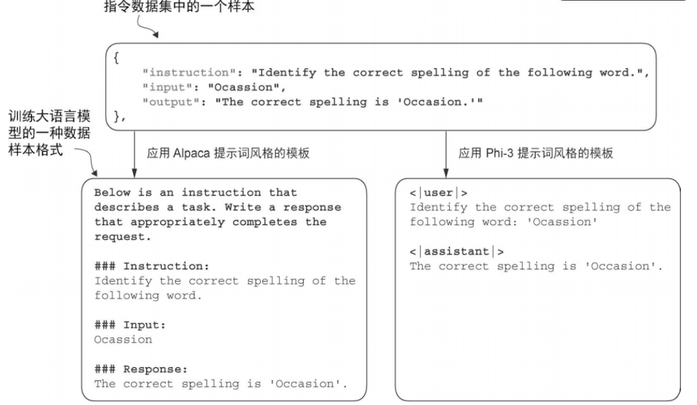

# 指令微调

有监督的指令微调

## 过程

1. 检查安装包情况，使用的

2. 准备数据集

   1. instruction
   2. input（可选）
   3. output

3. 数据条目整理成大模型可用的输入文本

   1. Alpaca
   2. Phi-3

   

4. 划分数据集（85%，10%，5%）

5. 数据组织成训练批次

   1. 预分词
   2. 补齐输入和目标（50256）：不同batch不同长度，同一batch相同长度
   3. 50256替换为-100

   所得结果，与只用前两个样本计算得到的损失是一样的。说明忽略了-100的这个样本。`cross_entropy` 默认就带有 `ignore_index=-100` 的设置，会自动跳过标签为 `-100` 的位置。留一个方便知道收尾的位置，即回答结束的时候。

6. 数据加载器

   1. 数据移到目标设备`.device()`
   2. 预先固定函数的部分参数

7. 加载预训练大语言模型（这次使用**中等规模的版本**`gpt2-medium (355M)`）

   1. `from gpt_download import download_and_load_gpt2`

   2. `from previous_chapters import GPTModel,load_weights_into_gpt`

      - `BASE_CONFIG`
      - `model_configs`
      - `BASE_CONFIG.update`(`CHOOSE_MODEL`)
      - `download_and_load_gpt2`(`model_size`)
      - `GPTModel`
      - `load_weights_into_gpt`

   3. ```python
      from previous_chapters import (
          generate,
          text_to_token_ids,
          token_ids_to_text
      )
      ```

      - `generate`(`text_to_token_ids`)
      -  `token_ids_to_text`

8. 指令数据上微调

9. 保存

10. 使用另一个大模型评估

### 整理提示词风格（3）

`instruction_text + input_text + desired_response`

```python
# 使用 Alpaca风格的提示词格式
def format_input(entry):
    # 统一引导话术
    # entry["input"],得到字典key对应的value值
    instruction_text = (
        f"Below is an instruction that describes a task. "
        f"Write a response that appropriately completes the request."
        f"\n\n### Instruction:\n{entry['instruction']}"
    )
    input_text = f"\n\n### Input:\n{entry['input']}" if entry["input"] else ""
    # 拼接
    return instruction_text + input_text

# 示例：
model_input=format_input(data[50])
desired_response=f"\n\n### Response:\n{data[50]['output']}"
print(model_input+desired_response)
```

### 数据组织成训练批次（5）

#### 过程

```python
"""
1.进行预先分词
"""
import torch
from torch.utils.data import Dataset

class InstructionDataset(Dataset):
    def __init__(self,data,tokenizer):
        self.data=data
        self.encoded_texts=[]
        for entry in data:
            instruction_plus_input=format_input(entry)
            response_text = f"\n\n### Response:\n{entry['output']}"
            full_text=instruction_plus_input + response_text
            self.encoded_texts.append(tokenizer.encode(full_text))
    def __getitem__(self,index):
        return self.encoded_texts[index]
    def __len__(self):
        return len(self.data)
   
"""
2.补齐 + ignore_index进行替换
"""
# 补齐
import tiktoken
tokenizer=tiktoken.get_encoding("gpt2")
# 50256：用于pad_token_id

# ignore_index:替换 padding，用于计算 loss的时候
# 50256替换为-100
# allowed_max_length:限制样本最大长度
import torch

def custom_collate_fn(
    batch,
    pad_token_id=50256,
    ignore_index=-100,
    allowed_max_length=None,
    device="cpu"
):
    batch_max_length = max(len(item) + 1 for item in batch)
    inputs_lst, targets_lst = [], []
    for item in batch:
        new_item = item.copy()
        new_item += [pad_token_id]
        padded = new_item + [pad_token_id] * (batch_max_length - len(new_item))
        inputs = torch.tensor(padded[:-1])
        targets = torch.tensor(padded[1:])

        # 找出 padding的位置,默认二维张量 (True的数量,mask的维度数)
        """
        tensor([[1],
        [3],
        [4]])
        """
        mask=targets==pad_token_id
        # 索引位置,从二维变为一维 ->tensor([1, 3, 4])
        indices=torch.nonzero(mask).squeeze()
        # .numel():返回 True的总个数
        if indices.numel()>1:
            targets[indices[1:]]=ignore_index # 留一个
        if allowed_max_length is not None:
            inputs=inputs[:allowed_max_length]
            targets=targets[:allowed_max_length]

        inputs_lst.append(inputs)
        targets_lst.append(targets)
    
    """
    torch.stack(tensors, dim=0)
    - tensors:要堆叠的张量，长度要一致
    - dim:新的维度要插入的位置

    eg.
    inputs_tensor = torch.stack([
    torch.tensor([10,11,12]),
    torch.tensor([20,21,50256]),
    torch.tensor([30,50256,50256])
    ])
    -- stack为batch
    inputs_tensor = tensor([
    [10, 11, 12],
    [20, 21, 50256],
    [30, 50256, 50256]
    ])
    """
    inputs_tensor=torch.stack(inputs_lst).to(device)
    targets_tensor=torch.stack(targets_lst).to(device)
    return inputs_tensor,targets_tensor

inputs,targets=custom_collate_fn(batch)
```

#### 使用

```python
# 目标:查看替换为 -100的效果
# 例:二分类任务
# 模型最后一层输出 logits
logits_1=torch.tensor(
    [[-1.0,1.0],
     [-0.5,1.5]]
)

targets_1=torch.tensor([0,1])
# 交叉熵计算:先softmax,再计算概率
loss_1=torch.nn.functional.cross_entropy(logits_1,targets_1)

targets_2 = torch.tensor([0, 1, 1])
# 其中一个进行替换
targets_3=torch.tensor([0,1,-100])
loss_3 = torch.nn.functional.cross_entropy(logits_2, targets_3)
print(loss_3)
print("loss_1 == loss_3:", loss_1 == loss_3)
```

### 数据加载器（6.2）

```python
# 预先固定好 device参数,后续调用无需重复传入
from functools import partial
# 用来预先固定函数的一部分参数

"""
from functools import partial

def add(a, b, c):
    return a + b + c

# 固定 b=2, c=3
add_partial = partial(add, b=2, c=3)

print(add_partial(1))  # 相当于 add(1,2,3)
"""
customized_collate_fn=partial(
    custom_collate_fn,
    device=device,
    allowed_max_length=1024 # 如遇到内存不足情况，可以下调
)

from torch.utils.data import DataLoader

num_workers=0
batch_size=2 # 如果显存充足，可以提高到 4和 8

torch.manual_seed(123)
train_dataset=InstructionDataset(train_data,tokenizer)
train_loader=DataLoader(
    train_dataset,
    batch_size=batch_size,
    # 用自定义 collate：padding、生成 targets、ignore_index、并搬到 device
    collate_fn=customized_collate_fn,

    shuffle=True,
    drop_last=True,
    num_workers=num_workers
)

# val和test相同（除了，shuffle=False,drop_last=False）
```

### 微调（8）

```python
from previous_chapters import(
    calc_loss_loader,
    train_model_simple
)
# 计算初始损失值
model.to(device)
torch.manual_seed(123)
with torch.no_grad():
    train_loss=calc_loss_loader(train_loader,model,device,num_batches=5)
    val_loss=calc_loss_loader(val_loader,model,device,num_batches=5)

# 正式开始微调训练
import time
start_time=time.time()
torch.manual_seed(123)
optimizer=torch.optim.AdamW(model.parameters(),lr=0.00005,weight_decay=0.1)
num_epochs=2
train_losses,val_losses,tokens_seen=train_model_simple(
    model,train_loader,val_loader,optimizer,device,
    num_epochs=num_epochs,eval_freq=5,eval_iter=5,
    start_context=format_input(val_data[0]),tokenizer=tokenizer
)

end_time=time.time()
execution_time_minutes=(end_time-start_time)/60
print(f"Training completed in {execution_time_minutes:.2f} minutes.")

# 绘制损失变化曲线
from previous_chapters import plot_losses
"""
torch.linspace(start, end, steps)
- start：起始值
- end：结束值（包含）
- steps：总共生成多少个数
返回一个 1维张量，长度 = steps，数字均匀分布在 [start, end] 之间。
"""
epochs_tensor=torch.linspace(0,num_epochs,len(train_losses))
plot_losses(epochs_tensor,tokens_seen,train_losses,val_losses)
```

### 保存（9）

```python
"""
抽取并保存模型回复
1.保存模型生成结果，下一节评估
2.微调后模型保存，方便复用
"""
# 保存结果
"""
from tqdm import tqdm 是在 Python 中导入 tqdm 库的进度条工具。它的作用是 
在循环中显示进度条，让你直观看到程序执行进度，特别适合训练模型、处理大数据或长循环任务。
"""

from tqdm import tqdm

for i,entry in tqdm(enumerate(test_data),total=len(test_data)):
    input_text=format_input(entry)
    token_ids=generate(
        model=model,
        idx=text_to_token_ids(input_text,tokenizer).to(device),
        max_new_tokens=256,
        context_size=BASE_CONFIG["context_length"],
        eos_id=50256
    )

    generated_text=token_ids_to_text(token_ids, tokenizer)
    response_text = generated_text[len(input_text):].replace("### Response:", "").strip()
    test_data[i]["model_response"]=response_text

with open("instruction-data-with-response.json", "w") as file:
    # dump写成文件,indent=4:缩进四个,格式更好看
    json.dump(test_data,file,indent=4)
   
# 保存模型
import re

"""
正则表达式:
- r'[ ()]' → 正则表达式，匹配 空格 ' '、左括号 '('、右括号 ')'
- '' → 替换为空，也就是删除这些字符
- CHOOSE_MODEL → 原始字符串
"""
file_name = f"{re.sub(r'[ ()]', '', CHOOSE_MODEL) }-sft.pth"
torch.save(model.state_dict(),file_name)
print(f"Model saved as {file_name}")
```

### 评估（10）

开放式文本回答的好坏往往有灰度空间，既涉及事实是否正确，也涉及表述是否完整、是否贴合指令、是否有细微概念偏差等。实际中，指令微调后的大模型通常会用多种方式评估。

采用类似 `AlpacaEval` 的思路，用另一个大模型来评估我们模型的回答质量，不过我们不会使用公开基准数据集，而是使用我们自己划分出来的测试集。

使用 Meta AI 的指令微调版 Llama 3（80 亿参数）模型，并通过 `ollama`（https://ollama.com） 在本地运行它来完成评审工作。

`Ollama` 是一款用于高效运行大语言模型的应用程序，本质上是对 llama.cpp的封装。llama.cpp 用纯 C/C++ 实现了大模型推理，`Ollama` 主要用于让大模型生成文本（推理），并不用于训练或微调大模型。

```python
"""
评估微调后的大模型
"""
# 检验是否正常运行
import psutil

def check_if_running(process_name):
    running = False
    for proc in psutil.process_iter(["name"]):
        if process_name in proc.info["name"]:
            running = True
            break
    return running

ollama_running = check_if_running("ollama")

if not ollama_running:
    raise RuntimeError("Ollama not running. Launch ollama before proceeding.")
print("Ollama running:", check_if_running("ollama"))

# 请求模型：phi3
import json
import requests

# 组织请求体：模型名、对话消息、推理参数
def query_model(
    prompt,
    model="phi3",
    url="http://localhost:11434/api/chat"   
):
    # POST请求调用 REST API，流式方式读取返回内容
    data = {
        "model": model,
        "messages": [
            {"role": "user", "content": prompt}
        ],
        "options": {
            "seed": 123,
            "temperature": 0,
            "num_ctx": 2048
        }
    }
    with requests.post(url,json=data,stream=True,timeout=30) as r:
        # 请求失败时，直接报错，便于定位问题
        r.raise_for_status()
        # 拼接模型逐段返回的文本
        response_data=""

        for line in r.iter_lines(decode_unicode=True):
            if not line:
                continue
            response_json=json.loads(line)
            if "message" in response_json:
                response_data+=response_json["message"]["content"]
    return response_data

model="phi3"

result = query_model("What do Llamas eat?", model)
print(result)

# 测试示例
for entry in test_data[:3]:
    # 进行评估，选择测试集前三条回答运行
    prompt=(
        f"Given the input `{format_input(entry)}` "
        f"and correct output `{entry['output']}`, "
        f"score the model response `{entry['model_response']}`"
        f" on a scale from 0 to 100, where 100 is the best score. "
    )
    print("\nDataset response:")
    print(">>", entry['output'])
    print("\nModel response:")
    print(">>", entry["model_response"])
    print("\nScore:")
    print(">>", query_model(prompt))
    print("\n-------------------------")
```


