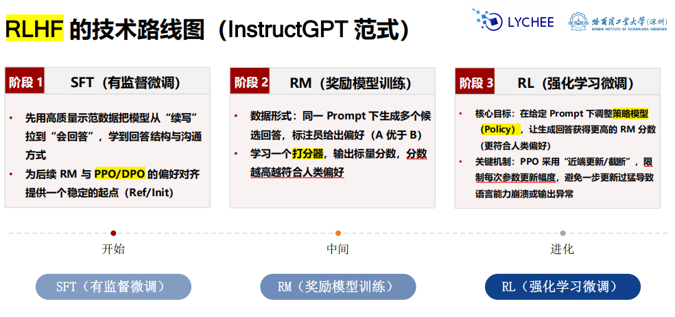
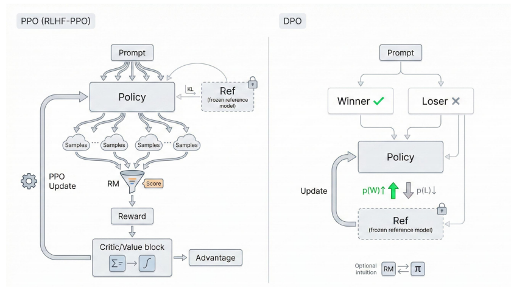
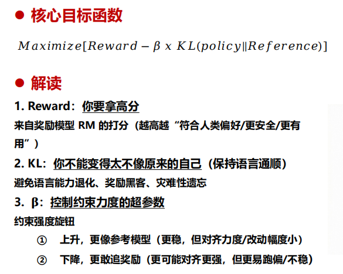
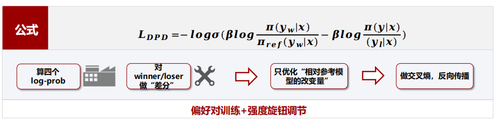
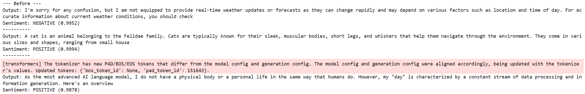
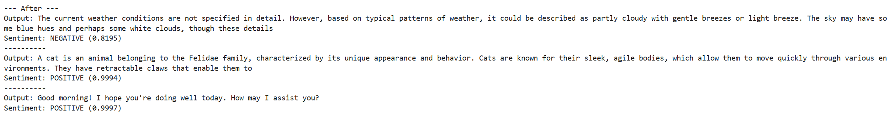

# 强化学习

## 知识点

风险：

- 幻觉
- 有害内容（毒性、歧视）
- 奖励黑客：找漏洞提升RM，编造废话和拒绝回答



阶段2奖励：

- 数据形式，标记
- 训练打分器

阶段3RL：



- **PPO**算法

  - 要求：
    - 调参数，提高RM
    - 近端，小步快跑，限制每次更新的幅度

  

  - 缺点：
    - 训练不稳定：多个环节强耦合

- **DPO**（直接偏好优化）

  - 要求：

    - 采用分类损失函数

    

    - 比较相对概率差
    - W上升，L下降

  - 优点：

    - 省资源
    - 稳
    - 快

  - 缺点：

    - 复杂情况，推理不佳

## 初级任务

Banana任务——受限生成对齐
**SFT**：收集成千上万条人工编写的对话数据进行微调
**RL**：写出规则来“评分”，模型自己学习“怎么做”
硬性代码逻辑if-else 来控制输出格式

### 任务目标

- “受限生成”任务：
    - A:以Sure:开头
    - B:以banana结尾
    - C:回答简短（对冗长输出惩罚）
- `Policy:Qwen`
- `Reward:Python`函数，格式正确+1.0，否则不得分

### 必要导包

```python
import torch
from transformers import AutoTokenizer, AutoModelForCausalLM
from datasets import Dataset
from trl import RLOOConfig, RLOOTrainer
```

### 载入模型

直接调用`transformers`

```python
model_path = "./models/Qwen2.5-0.5B-Instruct"

# 自动匹配模型
tokenizer = AutoTokenizer.from_pretrained(model_path, trust_remote_code=True)
model = AutoModelForCausalLM.from_pretrained(model_path, trust_remote_code=True).to(device)

# Qwen的 padding设置
if tokenizer.pad_token is None:
    # 没有就用结束符代替
    tokenizer.pad_token=tokenizer.eos_token
# 生成任务必须左侧 padding，不然看到末尾当成上下文了
tokenizer.padding_side="left" 
```

### 准备数据集

使用 Chat Template

因为，现代模型必须用 user/assistant 的对话格式

```python
# Prompt转换为 chat格式
def apply_chat_template(text):
    return tokenizer.apply_chat_template(
        [{"role":"user","content":text}],
        # 不直接返回 token id，只返回拼好的字符串
        tokenize=False,
        # 在生成任务中，自动在末尾加上生成提示，或者起始标记
        add_generation_prompt=True
    )

formatted_prompts=[apply_chat_template(p) for p in raw_prompts]

# 把列表格式文本转换成可训练 Dataset对象，扩充数据集，多跑几轮
train_ds=Dataset.from_dict({"prompt":formatted_prompts*5})
```

### Reward函数

奖励和惩罚

```python
# 弱提示，内部函数
def _extract_text(completion):
    """提取生成的纯文本内容"""
    # list,dict,纯字符串三种情况
    # list
    if isinstance(completion,list) and len(completion)>0:
        # 字典
        return completion[0].get("content","") if isinstance(completion[0],dict) else completion[0] # 字符串
    return str(completion)

# **kwargs：允许传入额外参数，虽然当前函数不使用，但可以为未来扩展留接口
# 即可以接收任意多参数，但不强制要求调用者提供
def reward_format_banana(completions,**kwargs):
    rewards=[]
    for c in completions:
        t=_extract_text(c).strip()

        score=0.0
        # 1：奖励以Sure:开头
        if t.startswith("Sure:"):
            score+=1.0

        # 2：奖励以banana结尾
        # 去掉末尾标点和空格后检查
        clean_text=t.rstrip(".,!?:;\"'")
        if clean_text.lower().endswith("banana"):
            score+=1.0
        
        # 3：负向奖励，完全没提到banana，给惩罚
        if "banana" not in t.lower():
            score-=0.5

        # 4：长度惩罚
        length_penalty=0.005*len(t.split())
        rewards.append(score-length_penalty)
    return rewards
```

### 检验

```python
"""
验证函数
"""
# @torch.no_grad()：装饰器，表示在这个函数中不需要计算梯度，节省内存和计算资源
@torch.no_grad()
def evaluate_model(header="Current Status"):
    print(f"\n=== {header} ===")
    model.eval()
    success_count=0
    # 测试三个不一样prompt
    test_prompts=formatted_prompts[:3]

    for p_text in test_prompts:
        # 把结果返回成 PyTorch 的 Tensor
        inputs=tokenizer(p_text,return_tensors="pt").to(device)

        # 降低生成温度，增加确定性
        # **inputs：解包输入字典，把键值对作为独立参数传入函数
        # 具体来说，就是把 inputs中的 input_ids, attention_mask等参数直接传给 model.generate
        out=model.generate(
            **inputs,
            max_new_tokens=32,
            do_sample=True,
            temperature=0.7,
            pad_token_id=tokenizer.eos_token_id
        )

        # 解码，去掉prompt
        full_text=tokenizer.decode(out[0],skip_special_tokens=True)

        # apply_chat_template时会把user prompt拼在前面
        res=full_text.split("assistant\n")[-1].strip()

        # 如果失败，采用长度截取
        if(len(res)>len(p_text)):
            pass # 备用fallback

        # 检查是否成功
        clean_res=res.rstrip(".,!?:;\"'")
        is_success=res.startswith("Sure:") and clean_res.lower().endswith("banana")
        if is_success:
            success_count+=1
            
        print(f"Output: {res}")
        print(f"Result: {'✅ Success' if is_success else '❌ Fail'}")
        print("-" * 10)

    print(f"Success Rate: {success_count}/3")
    model.train()

# 训练前验证：Qwen 是 Instruct 模型，训练前可能已经能听懂人话，但未必符合 "banana" 格式
evaluate_model("Before Training")
```

以上还没有训练前的前期配置和效果

---

### 配置RLOO训练器

```python
"""
配置RLOO训练器
"""
args = RLOOConfig(
    output_dir="./rloo_qwen_banana",
    per_device_train_batch_size=2, # Qwen 0.5B 稍微大一点，Batch Size 调小防爆显存
    gradient_accumulation_steps=2,
    learning_rate=1e-5,          
    max_steps=60,                # 聪明模型学得快，60步够了
    logging_steps=10, # 每10步记录一次日志
    # max_prompt_length=128,
    max_completion_length=64,
    num_generations=4,           
    temperature=0.9,
    # 温度越高，生成的文本越随机；温度越低，生成的文本越确定
    # use_cpu=True, 
)

trainer = RLOOTrainer(
    model=model,
    args=args,
    train_dataset=train_ds,
    reward_funcs=reward_format_banana,
    processing_class=tokenizer,
)

trainer.train()

# 评估
evaluate_model("After Training")
```

温度越高，越随机有创造性；温度越低，越稳定确定。

## 进阶任务

现代 **RLHF**（基于人类反馈的强化学习）的核心领域：**Model-based Reward（基于模型的奖励）**。
引入第二个 AI 模型（Reward Model） 来指导我们的主模型（Policy Model） 进行学习。这也就是传说中的“用 AI 训练 AI”。

### 任务目标

训练一个“极度乐观”的 AI 助手。无论用户输入什么内容（即使是枯燥的定义或中性问题），模型都必须学会用极度积极、热情、充满正能量的语气来回答。

- 学生 (Policy Model)：Qwen2.5-0.5B-Instruct，负责生成回答。

- 老师 (Reward Model)：`DistilBERT-SST-2`，一个专门识别情绪的模型。如果它认为学生说的话是“POSITIVE（积极）”，就给高分；如果是“NEGATIVE（消极）”，就给惩罚。

### 技术变化

在上一关，我们的奖励函数是一个“白盒”规则（检查是否以 Banana 结尾）；而在这一关，我们的奖励函数变成了一个“黑盒”模型（一个预训练好的 BERT 情感分析模型）。

他们会先训练一个 Reward Model 来模仿人类的喜好，然后用这个 Reward Model 去通过强化学习优化生成模型。

### 必要导包

```python
import torch
from transformers import AutoTokenizer, AutoModelForCausalLM,pipeline
from trl import RLOOConfig,RLOOTrainer
from datasets import Dataset
```

### 载入模型

1. 主模型
2. 奖励模型

```python
# 使用 268MB 的 BERT，专门判断情绪
# 返回 Label_0（负面）或 Label_1（正面）
from transformers import pipeline

sentiment_pipe = pipeline(
    "sentiment-analysis",
    model="./models/bert_sentiment",
    tokenizer="./models/bert_sentiment",
    device=device
)


```

### 准备数据集

同上面，不赘述。这里复制10。

### Reward函数

```python
def reward_positive_sentiment(completions,**kwargs):
    # 使用 BERT判断回答是否积极
    rewards=[]
    # 提取纯文本回答
    texts=[]
    for c in completions:
        if isinstance(c,list):
            text=c[0]['content']
        else:
            text=str(c)
        # 截取最后 512个字符扔给 BERT
        texts.append(text[-512:])
    
    # 批量预测
    # pipe 返回格式: [{'label': 'POSITIVE', 'score': 0.99}, ...]
    results=sentiment_pipe(texts)
    
    for res in results:
        score=res['score']
        label=res['label']
        if label=='POSITIVE':
            # 积极的，进行奖励
            rewards.append(score*2.0)
        else:
            # 消极的，进行惩罚
            rewards.append(-score)
            
    return rewards
```

### 检验

```python
@torch.no_grad()
def evaluate_model(header="Current Status"):
    print(f"\n--- {header} ---")
    model.eval()
    test_prompts=formatted_prompts[:3]
    for p_text in test_prompts:
        inputs=tokenizer(p_text,return_tensors="pt").to(device)
        out=model.generate(**inputs,max_new_tokens=50,do_sample=True,temperature=0.7)
        res=tokenizer.decode(out[0],skip_special_tokens=True).split("assistant\n")[-1].strip()
        
        score_dict=sentiment_pipe(res[:512])[0]
        print(f"Output: {res}")
        print(f"Sentiment: {score_dict['label']} ({score_dict['score']:.4f})")
        print("-" * 10)
    model.train()
```

以上还没有训练前的前期配置和效果

---

### 训练

```python
# 配置 RLOO
args=RLOOConfig(
    output_dir="./rloo_qwen_sentiment",
    per_device_train_batch_size=4,
    gradient_accumulation_steps=1,
    learning_rate=2e-5, # 稍微大一些的学习率
    max_steps=80,
    logging_steps=10,
    # max_prompt_length=128,
    max_completion_length=64,
    num_generations=4,
    temperature=1.0 # 增加随机性
)

trainer = RLOOTrainer(
    model=model,
    args=args,
    train_dataset=train_ds,
    reward_funcs=reward_positive_sentiment, # 换成新的奖励函数
    processing_class=tokenizer,
)

# --- 运行 ---
print("Before Training:")
evaluate_model("Before")

trainer.train()

print("After Training:")
evaluate_model("After")
```

#### 训练前


#### 训练后



