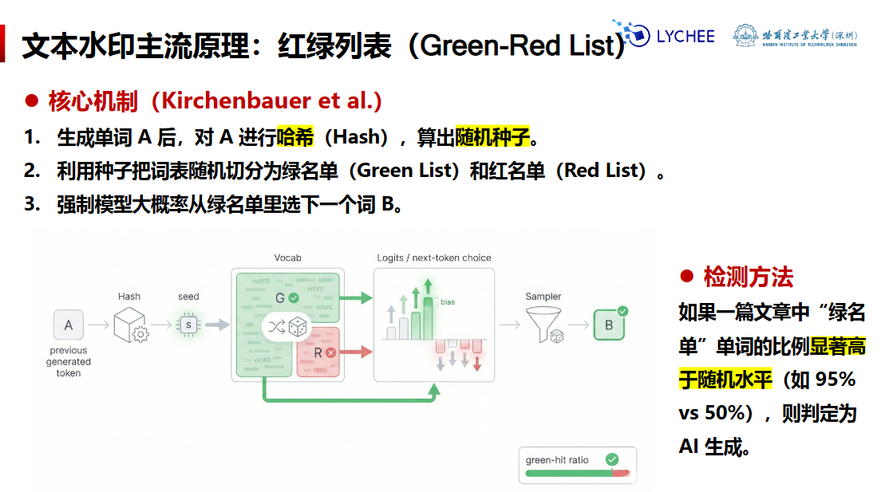
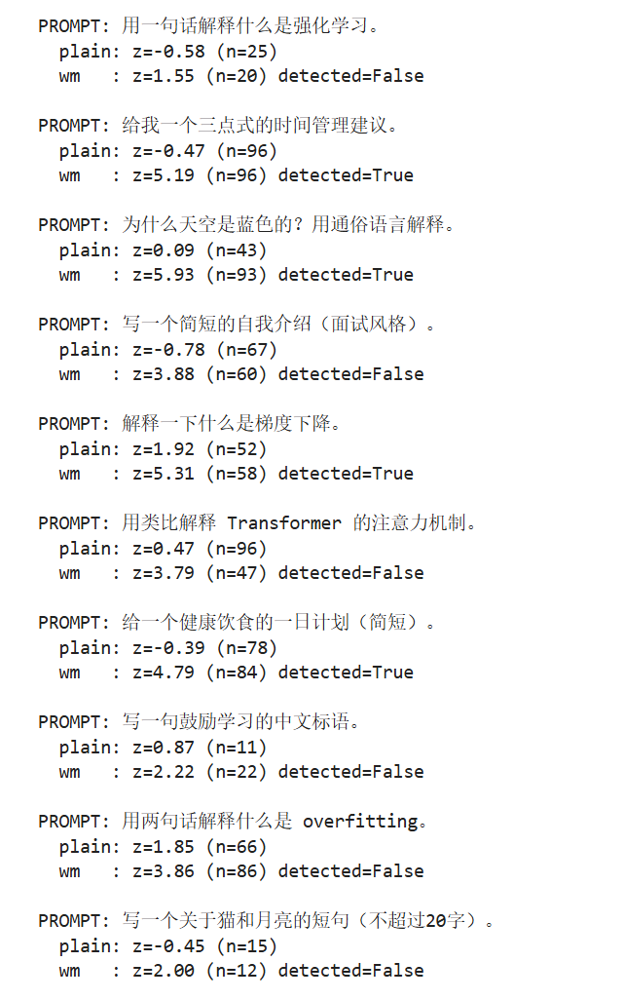
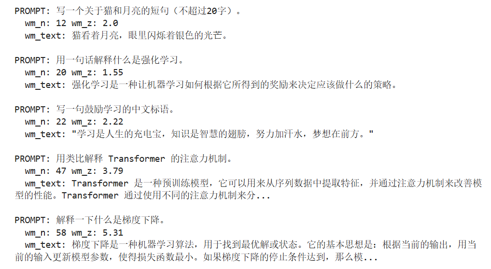
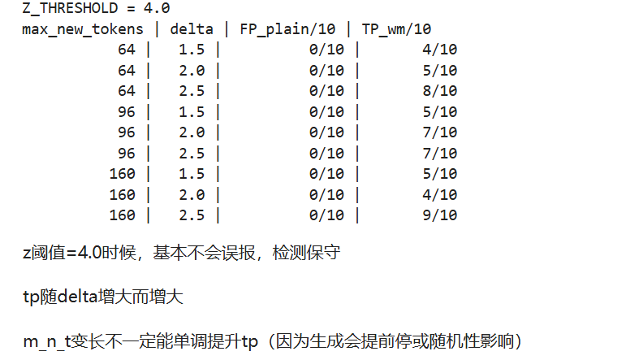

# 模型水印与防滥用

## 原理



**攻击手段**

1. **复述**：使用另一种生成模型进行改写和润色，改变token分布与相邻关系
2. **插入/删除**：少量编辑，造成链条错位，使得token的种子与绿/红名单分配发生偏移

**其他安全手段**

1. **指纹技术**：记录模型生成时的参数特质（留下可追溯的运行痕迹）

记录与这次生成绑定的参数特征/元数据（例如模型版本、解码设置、随机种子、调用方ID、时间戳，或对输出做哈希签名），形成一条“指纹记录”

2. **C2PA协议**：打上数字签名（一份内容凭证：数字签名+元数据清单，来源说明）

包含生成/拍摄工具、发布者标识、时间、以及关键编辑步骤的记录，形成一条“内容履历”

3. **红队测试**：发布前找专家攻击模型、挖掘漏洞

系统性设计高风险提示(越狱、提示注入、诱导泄露、仇恨/暴力/违法内容等)，记录模型在不同场景下的失败模式与触发条件。

## 代码过程

核心原理采用经典的 **Greenlist/Redlist 词表分割水印**（Kirchenbauer et al., 2023 的思路）：  
- **嵌入（embed）**：每步解码用密钥 + 上文生成一个“绿色 token 集合”，对绿色 token 的 logits 加偏置 `δ`（delta）。  
- **检测（detect）**：复现同样的绿色集合，统计绿色命中率是否显著高于期望 `γ`（gamma），用 **z-score** （显著性）做统计检验。

硬水印 = 强制只许用某些词，不许用另一些（像 “黑名单”，碰都不能碰）
- 缺点
    - 低熵句子会崩（比如固定搭配、代码、名言）例：“Barack Obama”，模型必须接 Obama，但 Obama 被分到红词，就会生成奇怪的话。
    - 文本质量会下降。

软水印 = 悄悄偏爱某些词，不禁止，但更爱选（像 “加分”，不强迫，但更容易被选中）

- 步骤
  同样随机分 绿词 / 红词
  绿词的概率悄悄提高一点（加个 δ）
  模型还是按概率选词，不禁止任何词，只是更爱选绿词

### 调包

```python
import os, math, hashlib, random
import torch
from transformers import AutoTokenizer, AutoModelForCausalLM
```

### 选择类型

```python
DEVICE = "cuda" if torch.cuda.is_available() else "cpu"

def pick_safe_dtype(device:str):
    """cuda上优先bf16,会测试torch.triu是否支持,不支持则回退到fp16"""
    if device != "cuda":
        return torch.float32
    
    # 先尝试BF16
    if torch.cuda.is_bf16_supported():
        try:
            x=torch.zeros((2,2),device="cuda",dtype=torch.bfloat16)
            # 测试上三角矩阵是否支持bf16
            # 选择一个既快又安全的半精度数据类型
            _ = torch.triu(x,diagonal=1) # 报错触发地方
            return torch.bfloat16
        except Exception as e:
            print("bf16 not supported due to:", e)
    # 使用FP16
    return torch.float16

DTYPE=pick_safe_dtype(DEVICE)
```

### 加载模型

```python
# 加载模型
MODEL_PATH = "./models/Qwen"

tokenizer = AutoTokenizer.from_pretrained(MODEL_PATH)

# pad token 兜底
if tokenizer.pad_token_id is None:
    tokenizer.pad_token = tokenizer.eos_token

model = AutoModelForCausalLM.from_pretrained(
    MODEL_PATH,
    dtype=DTYPE,
    # dtype=torch.float32,
    device_map="auto" if DEVICE == "cuda" else None,
    trust_remote_code=True
)
model.eval()

print("Model loaded on:", next(model.parameters()).device)
```

数据 `PROMPTS`

### 加水印

核心：PRF生成绿色集合，logits偏置（delta）

- gamma：绿色占比
- delta：对绿色token logits的偏置强度，水印强度（增加概率）
- context_width：生成绿色集合使用的上文token数，越大越上下文相关

```python
""" 
1.生成随机种子
2.判断绿色
3.对top_k里属于绿色的token logits加delta
"""
# 根据密钥和上下，生成随机种子
def _sha256_int(x:bytes) -> int:
    """
    哈希，前八个字节转为整数
    digest:转为字节
    big:大端序（最高位在前）
    signed:无符号数
    """
    return int.from_bytes(hashlib.sha256(x).digest()[:8], "big", signed=False)

# 根据 密钥 和 上下文 token 生成种子
def prf_seed(key:str,context_ids,context_width:int=4) ->int:
    # 只取 top的 h个
    # 拼接成字符串 "key|id1,id2,id3..." 并转成字节
    ctx=context_ids[-context_width:] if len(context_ids)>=context_width else context_ids
    payload=(key+"|"+",".join(map(str,ctx))).encode("utf-8")
    return _sha256_int(payload)

# 判断绿色
def is_green(token_id:int,seed:int,gamma:float=0.25)->bool:
    payload = f"{seed}-{token_id}".encode("utf-8")
    r=_sha256_int(payload)/float(2**64) # 映射到[0,1)
    return r<gamma

@torch.no_grad()
def apply_watermark_to_logits(
    logits:torch.Tensor,
    seed:int,
    gamma:float=0.25,
    delta:float=2.0,
    top_k:int=500,
)->torch.Tensor:
    """logits:(1,vacab)
    只对 top_k 候选 token 绿色偏置"""
    if top_k is None or top_k<=0:
        return logits
    values,indices=torch.topk(logits,k=min(top_k,logits.size(-1)),dim=-1)
    # 生成一个全0张量，用来标记哪些 top_k token 是绿色 token
    green_mask=torch.zeros_like(values,dtype=torch.bool)

    idx_list=indices[0].tolist()
    for j,tid in enumerate(idx_list):
        if is_green(tid,seed,gamma=gamma):
            green_mask[0,j]=True

    # 增加delta
    values=values+green_mask.to(values.dtype)*delta
    new_logits=logits.clone()
    # 原地更新张量，沿着 dim 维，把 src 的每个元素放到 index 指定的位置上
    new_logits.scatter_(dim=-1,index=indices,src=values)
    return new_logits
    # 返回加水印的 logits
```

### 逐个token生成进行解码

```python
# 逐 token解码
# 在每一步解码时插入 偏置，手写解码循环
"""
把普通文本 prompt 转换成模型可以理解的 token 张量。
"""
# def encode_prompt(prompt:str):
#     # 兼容 Qwen-Chat和普通 GPT2
#     # 判断有方法和有聊天模板
#     if hasattr(tokenizer,"apply_chat_template") and getattr(tokenizer,"chat_template",None):
#         messages=[{"role":"user","content":prompt}]
#         input_ids=tokenizer.apply_chat_template(
#             # eturn_tensors="pt" → 返回 PyTorch tensor 格式，方便直接输入模型
#             messages,
#             tokenize=True,
#             add_generation_prompt=True,
#             return_tensors="pt"
#         )
#     else:
#         input_ids=tokenizer(prompt,return_tensors="pt").input_ids
#     return input_ids

def encode_prompt(prompt: str):
    if hasattr(tokenizer, "apply_chat_template") and getattr(tokenizer, "chat_template", None):
        messages = [{"role": "user", "content": prompt}]

        text = tokenizer.apply_chat_template(
            messages,
            tokenize=False,   # 👈 强制先输出文本
            add_generation_prompt=True
        )

        input_ids = tokenizer(text, return_tensors="pt").input_ids
    else:
        input_ids = tokenizer(prompt, return_tensors="pt").input_ids

    return input_ids

"""
Top-p（nucleus）采样:
1.先对概率从大到小排序。
2.找出累计概率小于 top_p 的词（nucleus）。
3.保留这些词的概率并归一化。
4.从这些词里随机采样一个。

可以避免模型只选概率最大的词，同时也不让低概率词太容易出现。
"""
# top_p：核采样，保留累积概率 <= top_p的 token
def sample_top_p(probs:torch.Tensor,top_p:float=0.9)->int:
    # probs:(vocab,)
    # 从大到小排列 [概率值,索引]
    sorted_probs,sorted_idx=torch.sort(probs,descending=True)
    cum=torch.cumsum(sorted_probs,dim=0) # 概率进行累计和
    mask=cum<=top_p
    # 没有的话，保留概率最大的词
    if not torch.any(mask):
        mask[0]=True
    filtered_probs=sorted_probs[mask]
    filtered_idx=sorted_idx[mask]
    filtered_probs=filtered_probs/filtered_probs.sum()
    """
    从筛选后的概率中采样一个词：
    
    - torch.multinomial → 根据概率随机选择。
    - 1 → 选择一个词。
    - .item() → 转成 Python 整数。
    """
    choice=torch.multinomial(filtered_probs,1).item()
    return filtered_idx[choice].item()

"""
1.把 prompt 编码成 token。
2.循环生成 token：
    模型预测 logits
    可加水印
    根据 temperature 和 top-p 决定采样方式
    检查是否遇到 eos
    保存生成 token
3.输出生成的 token 和文本。
"""
@torch.no_grad()
def generate_tokens(
    prompt:str,
    max_new_tokens:int=128,
    temperature:float=0.8,
    top_p:float=0.9,
    do_sample:bool=True, # 是否随机采样，false则贪心
    watermark:bool=False,
    wm_key:str="demo-secret",
    wm_gamma:float=0.25,
    wm_delta:float=2.0,
    wm_context_width:int=4,
    wm_top_k:int=500,
):
    """返回：prompt_ids（list[int]）, gen_ids（list[int]）, gen_text（str）
    - prompt_ids → prompt 对应的 token id 列表。
    - gen_ids → 新生成的 token id 列表。
    - gen_text → 新生成文本。
    """
    input_ids=encode_prompt(prompt).to(model.device)
    prompt_ids=input_ids[0].tolist()

    past=None
    generated=[]
    cur_ids=input_ids

    for _ in range(max_new_tokens):
        out=model(cur_ids,use_cache=True,past_key_values=past)
        past=out.past_key_values
        logits=out.logits[:,-1,:] # (1,vocab)

        # 绿色加偏置
        if watermark:
            seed=prf_seed(wm_key,prompt_ids+generated,context_width=wm_context_width)
            logits=apply_watermark_to_logits(
                logits,seed,gamma=wm_gamma,delta=wm_delta,top_k=wm_top_k
            )

        # 采样 / 贪心
        if temperature <= 0:
            # 直接贪心选最大概率的 token
            next_id=torch.argmax(logits,dim=-1).item()
        else:
            logits=logits/temperature
            probas=torch.softmax(logits[0],dim=-1)
            if do_sample:
                next_id=sample_top_p(probas,top_p=top_p)
            else:
                next_id=torch.argmax(probas).item()

        # eos 则停止
        if tokenizer.eos_token_id is not None and next_id == tokenizer.eos_token_id:
            break

        generated.append(next_id)
        cur_ids=torch.tensor([[next_id]],device=model.device)

    text=tokenizer.decode(generated,skip_special_tokens=True)
    return prompt_ids,generated,text
```

### 检验

#### 7.1 检测统计量

对生成序列 `gen_ids`（长度 n）：

- 对每个位置 i：根据密钥 + 上文复现该步 seed  
- 判断该 token 是否“绿色”  
- 统计命中数 `k`

#### 7.2 z-score（单比例检验的常见形式）

- 期望命中率是 `γ`，所以期望命中数 `nγ`  
- 二项分布的标准差 `sqrt(nγ(1-γ))`

z值是偏差/标准差
- `z = (k - nγ) / sqrt(nγ(1-γ))`

观察到的结果和理论概率差异显著
|z| > 1.96 → p < 0.05（常用显著性水平），说明偏差可能不是随机的。

- `z` 越大：绿色 token 比随机情况“多很多” → 更像有水印  
- `n` 越小：统计不稳 → z 值很难大到超过阈值

```python
"""
检测器：统计绿色命中率 z-score
- n:长度
- k:统计命中率
- z:偏差/标准差
- gamma:期望命中率
"""
def detect_watermark(
    prompt_ids,
    gen_ids,
    wm_key:str="demo-secret",
    wm_gamma:float=0.25,
    wm_context_width:int=4,
):
    n=len(gen_ids)
    if n==0:
        return{"n":0,"k":0,"z":0.0}

    k=0
    full=prompt_ids.copy()
    for tid in gen_ids:
        seed=prf_seed(wm_key,full,context_width=wm_context_width)
        if is_green(tid,seed,gamma=wm_gamma):
            k+=1
        full.append(tid)

    # 标准差
    denom=math.sqrt(max(wm_gamma*(1-wm_gamma)*n,1e-9))
    z=(k-wm_gamma*n)/denom
    return {"n":n,"k":k,"z":float(z)}
```

### 结果比对

如果希望几乎全部detected=True
1. 增大max_new_tokens（n变大）
2. 增大wm_delta（水印更强）
3. 降低z（判断宽松）

```python
# wm配置
WM_KEY = "lecture-demo-2026"
WM_GAMMA = 0.25
WM_DELTA = 2.0
Z_THRESHOLD = 4.0   # 越大越严格：误报↓ 但漏报↑
# 生成配置
GEN_KWARGS = dict(max_new_tokens=96, temperature=0.8, top_p=0.9, do_sample=True)

results=[]
for p in PROMPTS:
    # plain
    pid0,gid0,txt0=generate_tokens(
        p,watermark=False,**GEN_KWARGS
    )
    det0=detect_watermark(pid0,gid0,wm_key=WM_KEY, wm_gamma=WM_GAMMA)

    # wm
    pid1,gid1,txt1=generate_tokens(
        p,watermark=True,wm_key=WM_KEY, wm_gamma=WM_GAMMA, wm_delta=WM_DELTA,**GEN_KWARGS
    )
    det1=detect_watermark(pid1,gid1,wm_key=WM_KEY, wm_gamma=WM_GAMMA)

    results.append({
        "prompt":p,
        "plain_z":det0["z"], "plain_n": det0["n"],
        "wm_z": det1["z"], "wm_n": det1["n"],
        "wm_detected": det1["z"] > Z_THRESHOLD,
        "plain_text": txt0,
        "wm_text": txt1,
    })

# 打印（看统计）
for r in results:
    print("\nPROMPT:", r["prompt"])
    print("  plain: z=%.2f (n=%d)" % (r["plain_z"], r["plain_n"]))
    print("  wm   : z=%.2f (n=%d) detected=%s" % (r["wm_z"], r["wm_n"], r["wm_detected"]))
```



- plain：没有加水印，z值接近0
- wm：加了水印，z值更大
- detected：判断是否加了水印
  - 一般如果加了水印，证明是ai生成，反之不是

### 分析

- FP（false positive）：plain 被判为有水印的次数（越低越好）  
- TP（true positive）：wm 被判为有水印的次数（越高越好）

- 阈值高，误报低，漏报多
- 阈值低，检出高，误报高

### 选取短和长的文本分别进行对比

```python
# 找到 n很小的样本
# lambda x: x["wm_n"] 是一个匿名函数：输入字典 x，输出它的 "wm_n" 值，供排序参考
# 默认从小到大排序
small = sorted(results, key=lambda x: x["wm_n"])[:5]
for r in small:
    print("\nPROMPT:", r["prompt"])
    print("  wm_n:", r["wm_n"], "wm_z:", round(r["wm_z"], 2))
    print("  wm_text:", r["wm_text"][:80].replace("\n"," ") + ("..." if len(r["wm_text"])>80 else ""))
```

### 分析



### 攻击/破坏：截断与噪声

水印不是万能的：
- 截断：把文本变短，n会下降
- 噪声替换：改写/编辑破坏绿色命中规律

破坏方式：
1. 截断到40%
2. 随机替换10%token

```python
def truncate_ids(gen_ids,keep_ratio=0.4):
    k=max(1,int(len(gen_ids)*keep_ratio))
    return gen_ids[:k]

def random_replace_ids(gen_ids,replace_ratio=0.1):
    if len(gen_ids)==0:
        return gen_ids
    vocab=tokenizer.vocab_size
    out=gen_ids[:]
    m=max(1,int(len(out)*replace_ratio))
    idxs=random.sample(range(len(out)),k=m)
    for i in idxs:
        out[i]=random.randrange(0,vocab)
    return out

# 挑一个样本演示
p=PROMPTS[0]
pid,gid,txt=generate_tokens(
    p, watermark=True, wm_key=WM_KEY, wm_gamma=WM_GAMMA, wm_delta=WM_DELTA,
    max_new_tokens=120, temperature=0.8, top_p=0.9, do_sample=True
)

det_clean = detect_watermark(pid, gid, wm_key=WM_KEY, wm_gamma=WM_GAMMA)
det_trunc = detect_watermark(pid, truncate_ids(gid, 0.4), wm_key=WM_KEY, wm_gamma=WM_GAMMA)
det_noisy = detect_watermark(pid, random_replace_ids(gid, 0.1), wm_key=WM_KEY, wm_gamma=WM_GAMMA)

# 原始带水印文本
print("CLEAN z=%.2f n=%d" % (det_clean["z"], det_clean["n"]))
# 截断
print("TRUNC z=%.2f n=%d" % (det_trunc["z"], det_trunc["n"]))
# 噪声
print("NOISY z=%.2f n=%d" % (det_noisy["z"], det_noisy["n"]))
```

### 分析

```
CLEAN z=2.53 n=23
TRUNC z=0.58 n=9
NOISY z=1.08 n=23
```

### 其他参数

delta和文本长度对检出率的影响

目标：清楚这些“可控旋钮”：
- `WM_DELTA` ↑ → 水印更强（TP ↑，可能影响流畅度）  
- `max_new_tokens` ↑ → 样本 n 更大（TP ↑，统计更稳）  
- `Z_THRESHOLD` ↓ → 判定更宽松（TP ↑，FP 可能 ↑）
  1. TP（true positive）：预测对了的样本
  2. FP（false postive）：误判为正样本的负样本

采用控制

```python
# 固定 gamma，扫 delta和 m_n_t
def run_eval(max_new_tokens=96, wm_delta=2.0, z_thr=4.0, prompts=PROMPTS):
    cfg=dict(max_new_tokens=max_new_tokens, temperature=0.8, top_p=0.9, do_sample=True)
    plain_fp=0
    wm_tp=0
    for p in prompts:
        pid0, gid0, _ = generate_tokens(p, watermark=False, **cfg)
        det0 = detect_watermark(pid0, gid0, wm_key=WM_KEY, wm_gamma=WM_GAMMA)
        plain_fp += int(det0["z"] > z_thr)

        pid1, gid1, _ = generate_tokens(p, watermark=True, wm_key=WM_KEY, wm_gamma=WM_GAMMA, wm_delta=wm_delta, **cfg)
        det1 = detect_watermark(pid1, gid1, wm_key=WM_KEY, wm_gamma=WM_GAMMA)
        wm_tp += int(det1["z"] > z_thr)

    return plain_fp,wm_tp

deltas=[1.5,2.0,2.5]
lengths=[64,96,160]
z_thr=4.0

grid=[]
for L in lengths:
    for d in deltas:
        fp,tp=run_eval(max_new_tokens=L, wm_delta=d, z_thr=z_thr)
        grid.append((L, d, fp, tp))

print("Z_THRESHOLD =", z_thr)
print("max_new_tokens | delta | FP_plain/10 | TP_wm/10")
for L, d, fp, tp in grid:
    # eg.把 L右对齐，占 13个字符宽，其他同理
    print(f"{L:>13} | {d:>5} | {fp:>10}/10 | {tp:>7}/10")
```

### 分析



### 其他

1. **密钥（WM_KEY）要保密**：  
   - 服务端持有密钥；检测端在需要溯源时调用（或授权第三方检测）。  

2. **阈值是策略选择**：  
   - 高阈值：几乎不误报，但可能漏掉短文本/被编辑文本。  
   - 低阈值：更敏感，但可能出现误报，需要配合更多证据。  

3. **攻击/鲁棒性**：  
   - 截断、改写、翻译、同义替换都会削弱检测。  
   - 实际系统要做更系统的对抗评估，并搭配其它治理手段。 


