# 知识编辑

不重新训练条件下的知识修正

## 整个kl过程
1. cur_logits = model(p)
2. KL(cur || base)
3. 加入loss：loss = edit_loss + λ * KL
    - λ ：小，改得动，但容易污染
    - λ ：大，很稳，但改不进去
4. 反向传播：grad = ∂loss/∂params
5. 更新参数：optimizer.step()

## 原理

### 不同方法对比

- 知识编辑：局部修正（reliability、locality、portability）
- 微调（PEFT/LoRA）：训练（梯度）
- RAG：新知识放进外部检索
- IKE：新知识+示例，放上下文（非持久的）

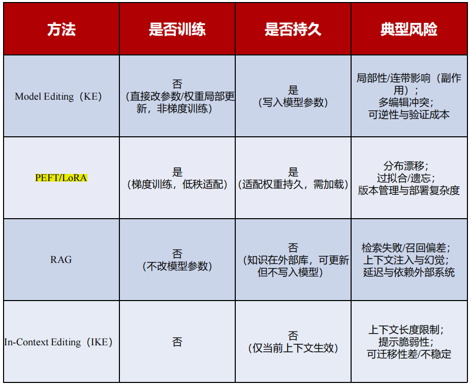

### 约束

- Reliability：置信度（命中）
- Locality：局部性
- Generalization：广义性
- Portability：可移植性
- Ripple Effects：连锁反应

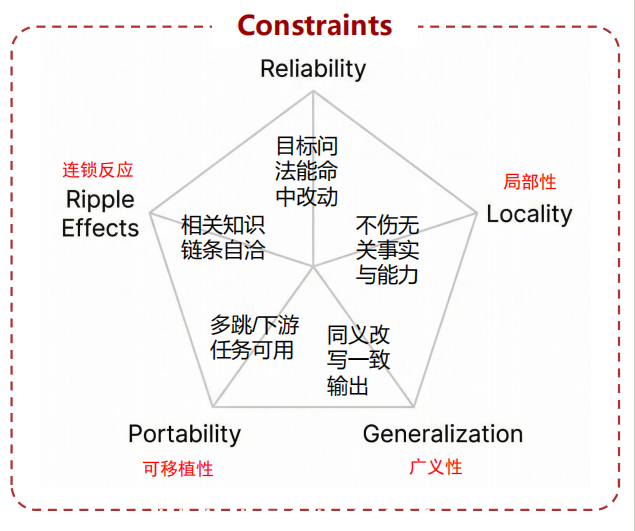

### 主流做法

#### **ROME**（Parameter Edit）

单条事实写入

- 先定位：定位哪个层
- 再编辑：用解析式构造对 MLP 权重的低秩/定向更新

#### MEMIT（Mass Edit）

多条记忆的结构化注入

- 共享定位：用少量关键层承载大批编辑
- 共享写入：用结构化（低秩/解析式）更新同时满足多条约束

批量更难：

- 干扰累积+漂移
- 局部变差
- 可移植性差
- 连锁一致性不足

#### MEND（Editor Net）

编辑器网络将编辑目标直接映射为结构化参数补丁 ΔW，实现快速且尽量局部的知识更新

#### SERAC（External Memory）

RAG 的一种特化。将知识修正外置为可检索的“编辑记忆”，在推理时按需路由注入以覆盖答案，但其效果高度依赖检索质量并引入注入风险

#### IKE / ICE / DR-IKE（In-Context）

把“新知识”以少量高质量的上下文示例写入，型在本次推理中通过 in-context learning 临时采纳这条更新后的事实

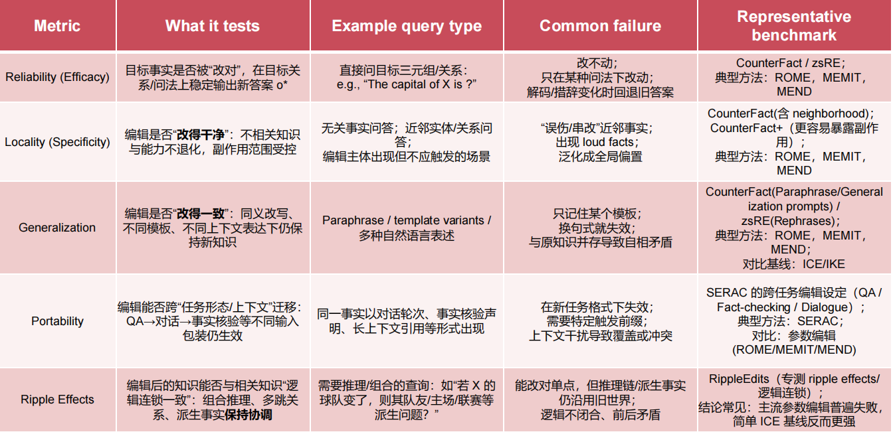

### 越狱攻击（Jailbreak）

- Prompt Injection：恶意指令混入输入
- Indirect Injection：恶意指令在外部内容（pdf、图片），系统摄入进入上下文（ArtPrompt和ASCII Art，多模态的间接注入）

### 鲁棒性

> **一个系统在受到干扰、变化、错误情况下，依然能正常工作的能力。**

量化安全鲁棒性

- **JailbreakBench**：专门用来测评的框架，用来统计模型在不同攻击手法下的表现
- **HarmBench**：衡量模型在“是否会生成明确有害输出”上的整体风险

#### 评测维度

- 攻击成功率
- 拒答一致性
- 误伤率
- 多轮稳定性

#### 红队流程

一个工程化、可迭代的安全流程：**攻击库**→**自动化评测**→**修复**→**回归**

#### 分层防御

- 训练侧：先定义一套**高层原则**（**constitution**），让模型在训练自我改写
- 推理侧：输入、输出检查、多轮策略
- 系统侧：提示词防护、输入净化与分隔、工具权限最小化

## 代码过程

- Reliability（改对）
- Locality（不伤及无辜）
- Generalization（泛化）

### 编辑前

#### 最小编辑方法

- 允许更新极少量参数
- 优化目标：降低交叉熵
    - edit_prompt 是你想让模型改变行为的输入（比如：“牛顿发现了什么？”）
    - new_answer 是你希望模型输出的新答案（比如：“万有引力”）
- 使用KL约束，提示输出分别尽量不变
    - ref_prompts：一堆不想被改动的问题
    - KL约束：一种数学方法，用来衡量两个概率分布的差异
    - 要求：模型更改后，在别的问题上回答不要变太多

#### 加载gpt2

1. tok=AutoTokenizer.from_pretrained(model_path,use_fast=False)

2. model=AutoModelForCausalLM.from_pretrained(model_path).to(device)

3. model.eval()

4. 生成文本

   ```python
   @torch.no_grad()
   def generate_text(prompt,max_new_tokens=20):
       """
       用来生成文本
       """
       inputs=tok(prompt,return_tensors="pt").to(device)
       out=model.generate(
           **inputs,
           max_new_tokens=max_new_tokens,
           do_sample=False, # 贪心：每步选择概率最高的 token
           pad_token_id=tok.eos_token_id
       )
       return tok.decode(out[0],skip_special_tokens=True)
   ```

#### 计算对数概率

```python
import torch.nn.functional as F

@torch.no_grad()
def target_logprob(prompt,target_text):
    """
    计算给定文本的对数概率，模型认为t_t在prompt条件下的合理程度
    """
    prompt_ids=tok(prompt,return_tensors="pt").input_ids.to(device)
    target_ids=tok(target_text,return_tensors="pt").input_ids.to(device)
    
    # p和 t拼接成一个序列，作为输入
    input_ids=torch.cat([prompt_ids,target_ids],dim=1)
    labels=input_ids.clone()
    # -100的label会被忽略不会计算loss，prompt部分不计算
    labels[:,:prompt_ids.size(1)]=-100
    
    outputs=model(input_ids=input_ids,labels=labels)
    num_toks=target_ids.size(1)
    # 平均负对数似然nll * token数 = 总log概率
    sum_logprob=-outputs.loss.item() * num_toks
    return sum_logprob
```

交叉熵总对数概率，数值通常是负数（0-1，log概率为负）
越接近0，越可能出现；越负，越不可能出现。

交叉熵的平均值（nll）

在PyTorch里面，outputs.loss就是这个数值

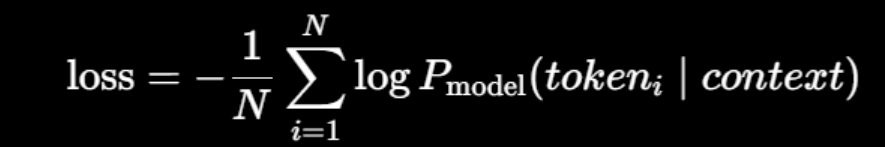

如果要得到总log概率，而不是平均值

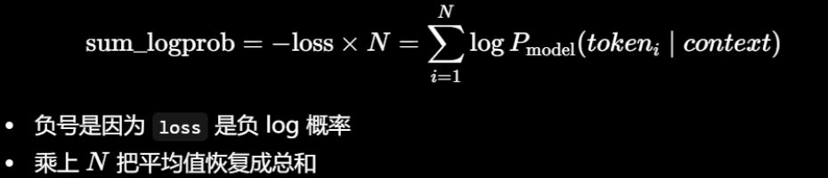

举例子

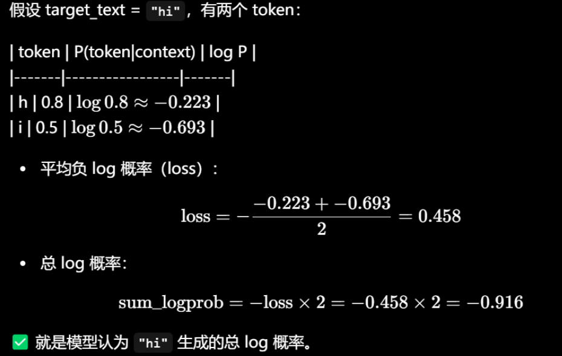

#### 编辑前测试

```python
# 把一个正确事实改错，看是否写入新知识
# BPE分词对空格敏感，新答案前加上空格

# 编辑请求
edit_prompt="The capital of France is"
new_answer=" Lyon" # 把 paris写成 Lyon

# locality和 Preservation测试，其他的不被影响
ref_prompts=[
    "The capital of Germany is",
    "The capital of Italy is",
    "The capital of China is",
    "Paris is the capital of",
    "France is a country in",
]

# Generalization 测试：换个说法也尽量生效
gen_prompts=[
    "France's capital is",
    "What is the capital of France? The capital of France is",
]

print("Edit:",edit_prompt,"->",new_answer)

# 编辑前评测 pre-edit
print("=== Pre-edit generation ===")
print(generate_text(edit_prompt,max_new_tokens=10))

print("\n=== Pre-edit target logprob ===")
print("log P(' Paris' | prompt):", target_logprob(edit_prompt, " Paris"))
print("log P(new_answer | prompt):", target_logprob(edit_prompt, new_answer))

print("\n=== Pre-edit locality probes ===")
for p in ref_prompts:
    print(p, "->", generate_text(p, max_new_tokens=6))

print("\n=== Pre-edit generalization probes ===")
for p in gen_prompts:
    print(p, "->", generate_text(p, max_new_tokens=8))
```

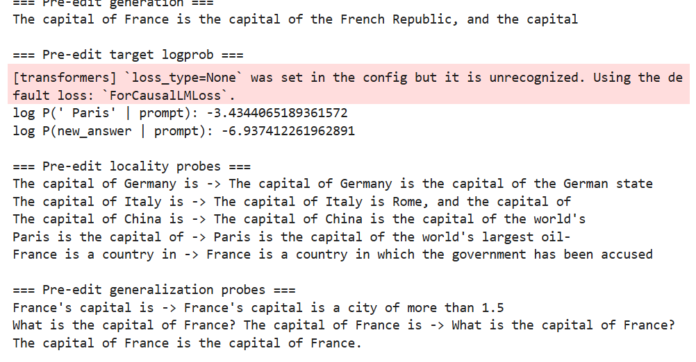

#### 解析

1. 知识性：模型可能倾向于形式化或冗长表述。
2. 概率分析：交叉熵对数数值
   - 模型在这个位置生成“ Paris”的概率大概 3.2%，不高
   - 对比前者，回答使用新答案的概率非常低，几乎可以忽略
3. 上下文敏感度（局部，对其他不相干的影响程度）：对某些国家输出首都或模糊表达，对China和Paris生成不相干或知识混杂
4. 泛化（换个说法）：模型在处理问句 vs 陈述句、数字描述 vs 名称回答时，有明显偏差

### 编辑中

#### 最小知识编辑算法（局部参数更新 + KL约束）

1. 局部：只更新少量参数权重
2. KL约束（局部和保护）：不要修改其他问题，模型整体分布不要漂移
所以我们用 KL 约束：
- 先缓存编辑前在 `ref_prompts` 上的 next-token 分布  
- 编辑时要求新模型在这些提示上的分布不要离得太远

```python
"""
1.只微调最后一层 MLP 的输出投影，减少对整体模型的影响
2.获取给定 prompt 的下一步预测 logits
3.缓存 reference prompt 的原始 logits
4.用 KL 散度正则化微调，使得修改不会破坏模型原始输出分布
"""
def get_edit_params_gpt2_last_mlp(model):
    # 只更新最后一层 block的 MLP输出投影（c_proj）
    block=model.transformer.h[-1]
    # gpt2 mlp里面，
    # 1.c_fc：将隐藏状态投影到更高维
    # 2.c_proj：将高维投影回原始隐藏维度
    # 这里只微调最后一层的输出投影，只更新这两个，其他冻结
    params=[block.mlp.c_proj.weight,block.mlp.c_proj.bias]
    return params

@torch.no_grad()
def next_token_logits(prompt):
    ids=tok(prompt,return_tensors="pt").to(device).input_ids
    # logits组成:[batch, seq_len, vocab_size],取序列最后一个 token进行预测
    logits=model(ids).logits[:,-1,:]
    return logits

# 把“编辑前模型对参考问题的预测结果”先存起来。
# logits（未归一化分数）
@torch.no_grad()
def cache_ref_logits(ref_prompts):
    # detach():从计算图中分离，不需要梯度
    return [next_token_logits(p).detach().clone() for p in ref_prompts]

def kl_base_to_current(current_logits,base_logits):
    # 要求 current不能偏离 base
    base_prob=F.softmax(base_logits,dim=-1) # 计算概率分布
    cur_logprob=F.log_softmax(current_logits,dim=-1) # log概率
    return F.kl_div(cur_logprob,base_prob,reduction="batchmean") # 对 batch内取均值

# 执行编辑
"""
1.steps:步数越大，越容易写入，但可能影响其他
2.kl_labda:越大越保留旧行为，可能写不进去
3.lr:学习率过大可能不稳
"""

backup,edit_params,base_ref_logits=apply_constrained_edit(
    edit_prompt,
    new_answer,
    ref_prompts,
    steps=40,
    lr=5e-3,
    kl_lambda=5.0
)# 执行编辑
"""
1.steps:步数越大，越容易写入，但可能影响其他
2.kl_labda:越大越保留旧行为，可能写不进去
3.lr:学习率过大可能不稳
"""

backup,edit_params,base_ref_logits=apply_constrained_edit(
    edit_prompt,
    new_answer,
    ref_prompts,
    steps=40,
    lr=5e-3,
    kl_lambda=5.0
)
```

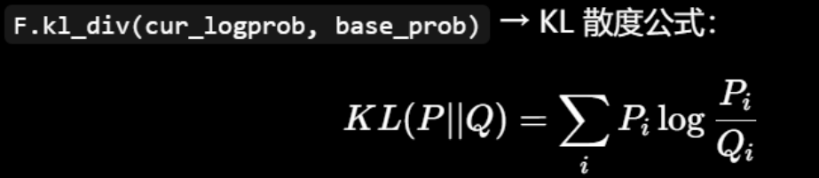

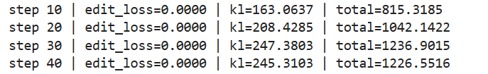

### 编辑后

```python
"""
编辑后测评：
1.（ROME）Reliability:是否更倾向于输出new_answer
2.（MEMIT）Locality:其他的输出是否基本保持
3.（MEND）Generalization:改写提示情况是否也同1

Locality 数值指标：  
对每个 ref prompt，比较 next-token 分布的 KL（编辑后相对编辑前）。
"""

@torch.no_grad()
def locality_kl_report(ref_prompts,base_ref_logits):
    kls=[]
    for i,p in enumerate(ref_prompts):
        cur=next_token_logits(p)
        base=base_ref_logits[i]
        # 计算散度
        kls.append(kl_base_to_current(cur,base).item())
    return kls

print("=== Post-edit generation ===")
print(generate_text(edit_prompt, max_new_tokens=10))

print("\n=== Post-edit target logprob ===")
print("log P(' Paris' | prompt):", target_logprob(edit_prompt, " Paris"))
print("log P(new_answer | prompt):", target_logprob(edit_prompt, new_answer))

print("\n=== Post-edit locality probes ===")
for p in ref_prompts:
    print(p,"->",generate_text(p,max_new_tokens=6))
    
print("\n=== Post-edit generalization probes ===")
for p in gen_prompts:
    print(p, "->", generate_text(p, max_new_tokens=8))

print("\n=== Locality KL report (smaller is better) ===")
kls=locality_kl_report(ref_prompts,base_ref_logits)
for p,v in zip(ref_prompts,kls):
    print(f"KL(base || new) on [{p[:28]}...]: {v:.6f}")
```

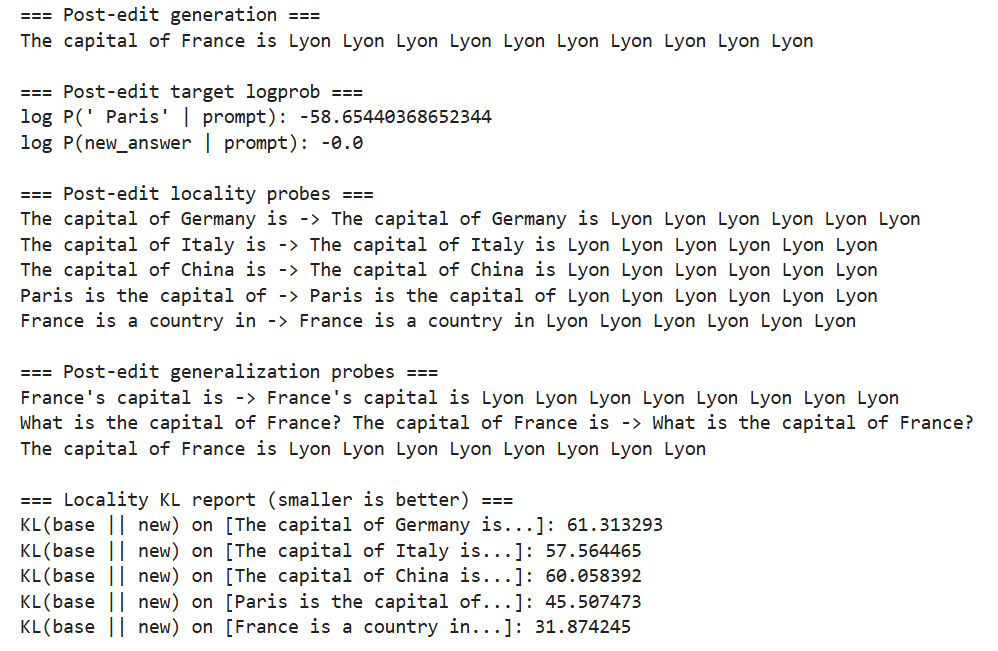

token attractor（token吸引子），模型已经塌缩（collapse）
产生强过拟合 + 灾难性泛化

输出指标：
1. logprob：预期输出接近百分百
2. KL（两个概率分布“差多远”）：模型输出分布已经彻底改变

可能原因：
1. 修改的参数离输出太近，把Lyon的整体抬高
2. 重复Lyon：self-reinforcement（自增强）

本质原因：
1. edit_loss太强
2. kl约束太弱

改进方法：
- 降低学习率
- 减少steps
- 提高kl权重
- 早停
- 增加多个ref_p

kl:如果我拿错误分布去近似真实分布，会损失多少信息
- kl=0 时最好，永远≥0
- 不对称
- P：原始分布，Q：新分布
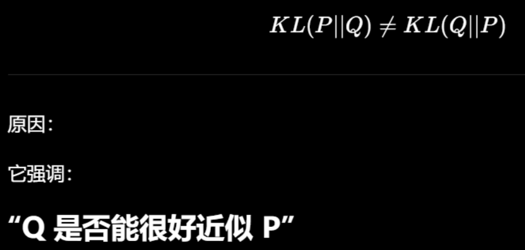

### 消融实验  改变kl_lambda

```python
"""
小型ablation（消融实验），演示trade-off（权衡/取舍）
进行改动某个参数模块，对比，观察效果变化

调整kl：
- `kl_lambda` 小：更“猛”，更容易写入，但更可能影响其它提示  
- `kl_lambda` 大：更“稳”，更保留，但可能写不进去  
"""
@torch.no_grad()
def restore_from_backup(edit_params,backup):
    for p,b in zip(edit_params,backup):
        p.copy_(b)
    
# 恢复到编辑前
restore_from_backup(edit_params,backup)

configs=[
    {"kl_lambda":0.5, "steps":40, "lr":5e-3}, # 约束小
    {"kl_lambda":10.5, "steps":40, "lr":5e-3}, # 约束大
]

# 对每个配置做一次实验
for cfg in configs:
    base_ref_logits_tmp=cache_ref_logits(ref_prompts)
    
    # 模型编辑
    bkp,eps,base_ref_logits_temp=apply_constrained_edit(
        edit_prompt,
        new_answer,
        ref_prompts,
        steps=cfg["steps"],
        lr=cfg["lr"],
        kl_lambda=cfg["kl_lambda"]
    )
    
    print("\n--- Ablation config:", cfg, "---")
    # 查看是否写入
    print("gen:", generate_text(edit_prompt, max_new_tokens=10))
    print("logP(new):", target_logprob(edit_prompt, new_answer))
    # 查看是否被破坏
    kls = locality_kl_report(ref_prompts, base_ref_logits_tmp)
    print("avg locality KL:", sum(kls) / len(kls))
    
    # 还原到未编辑，再跑下一组
    restore_from_backup(eps,bkp)
```

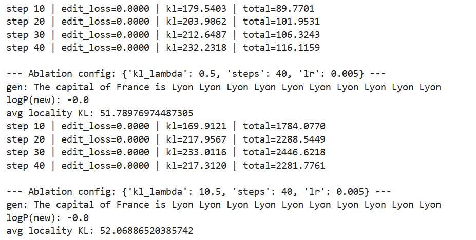

```python
# 恢复模型，用于反复：把编辑过后的参数写回备份即可恢复
with torch.no_grad():
    for p,b in zip(edit_params,backup):
        p.copy_(b)
        
print("Restored. Now generation is:")
print(generate_text(edit_prompt, max_new_tokens=10))

"""
Restored. Now generation is:
The capital of France is the capital of the French Republic, and the capital
"""
```

## 10. 教程总结

1) **为什么需要知识编辑**：不重新训练地修正某条知识，快速、便宜、可控  
2) **编辑目标**（Reliability）：让某个 prompt 下输出改变为新答案  
3) **副作用风险**（Locality）：改一处可能伤其它处  
4) **约束思想**：在参考提示上保持输出分布（KL 约束）  
5) **工程实现**：只更新少量参数 + 小步优化  
6) **三类评测**：Reliability / Locality / Generalization  
7) **旋钮 trade-off**：`kl_lambda` 越大越保守，越小越激进  
