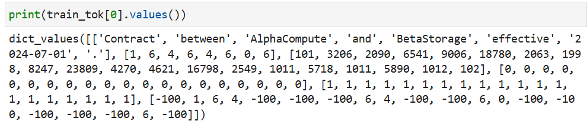

# 通用信息抽取（IE）与序列标注

## 概念

信息抽取 lnformation Extraction

### 分类

信息抽取：非结构化文本到结构化知识的桥梁，是`nlp`里的任务
任务包括：

- 命名实体识别（NER）：文本中识别出来实体，分类出类型
- 关系抽取（RE）：在实体识别后，找出它们之间的关系类型和关系结构
- 事件抽取（EE）：事件抽取依赖实体抽取和关系抽取

### 挑战

- 实体嵌套
- 非连续实体
- Schema依赖与零样本：依赖于预先定义的标签集

### 序列标注协议

标注范式：**将抽取任务转化为对序列中每个Token的分类任务**

- BIO：Begin, Inside, Outside
- BILOU：Begin, Inside, Last, Outside, Unit

应用于：中文分词、词性标注、NER、词法分析、文本加标点

### 实现技术

1. 深度学习
2. 条件随机场（CRF）
   - 发射矩阵：每个词对应什么标签的得分表
   - 转移矩阵：从一个标签转移到另一个标签的得分

### 解码方法

模型已经给出了每个Token的标签得分（发射矩阵）和标签间的转移规则（转移矩阵），解码算法要做的就是 筛选，找到**总得分最高的最优序列**

- 穷举
- 维特比解码：“局部最优累积”实现“全局最优”
- 束搜索：贪心策略，**每一步仅保留“得分最高的B个候选序列”**，B为束宽，减少计算量

 

### 范式转移

从判别式标注到生成式抽取

- 判别式：受限于预定义标签集
- 生成式：直接生成结构化文本，跨领域泛化，Schema-free

## 代码

### 所用库函数

```python
import random
import re
import numpy as np
import torch
from datasets import Dataset
from seqeval.metrics import f1_score, classification_report
from transformers import(
    AutoTokenizer,
    AutoModelForTokenClassification,
    DataCollatorForTokenClassification,
    TrainingArguments,
    Trainer,
    pipeline,
)
```

### IE数据构造

我们用“合同/公告/票据”风格文本，实体类型包括：
- `ORG` 机构
- `DATE` 日期
- `MONEY` 金额
- `INVOICE_NO` 票据号
- `DOC_TYPE` 文档类型

```python
# 每条样本 token（已分词）+实体跨度（start,end,label）
raw_samples = [
    {
        'tokens': ['Vendor','BeijingTech','signed','contract','with','ShanghaiCloud','on','2024-03-12','for','1.28M','CNY','.'],
        'entities': [(1,2,'ORG'), (5,6,'ORG'), (7,8,'DATE'), (9,11,'MONEY')],
    },
    {
        'tokens': ['Announcement',':','ShenzhenAI','acquired','DataBridge','on','2025-01-15','for','3.2','billion','USD','.'],
        'entities': [(0,1,'DOC_TYPE'), (2,3,'ORG'), (4,5,'ORG'), (6,7,'DATE'), (8,11,'MONEY')],
    },
    {
        'tokens': ['Invoice','INV-2024-0312','issued','to','DeltaFactory','amount','98000','CNY','on','2024-03-20','.'],
        'entities': [(0,1,'DOC_TYPE'), (1,2,'INVOICE_NO'), (4,5,'ORG'), (6,8,'MONEY'), (9,10,'DATE')],
    },
    {
        'tokens': ['Contract','between','AlphaCompute','and','BetaStorage','effective','2024-07-01','.'],
        'entities': [(0,1,'DOC_TYPE'), (2,3,'ORG'), (4,5,'ORG'), (6,7,'DATE')],
    },
    {
        'tokens': ['Invoice','INV-2024-0451','payer','NanoVision','total','120000','CNY','.'],
        'entities': [(0,1,'DOC_TYPE'), (1,2,'INVOICE_NO'), (3,4,'ORG'), (5,7,'MONEY')],
    },
]
```

### BIO/BILOU标签体系

```python
# bio
"""
tokens = ["张三","在","北京","工作"]
entities = [(0,1,"PER"), (2,3,"LOC")]  # 张三 是 PER，北京 是 LOC
spans_to_bio(tokens,entities)
# 输出: ['B-PER', 'O', 'B-LOC', 'O']
"""
def spans_to_bio(tokens,entities):
    tags=['O']*len(tokens) # 全部设置为 O（非实体）
    for s,e,label in entities:
        tags[s]=f'B-{label}' # 开始 B
        for i in range(s+1,e):
            tags[i]=f'I-{label}' # 内部 I
    return tags

# bilou
"""
bio：B/I/O
bilou：
单字实体 → 用 U-
实体开头 → B-，结尾 → L-
非实体 → O
实体中间 → I-

tags = ['B-PER','O','B-LOC','O']
bio_to_bilou(tags)
# 输出: ['U-PER','O','U-LOC','O']
"""
def bio_to_bilou(tags):
    out=[]
    for i,t in enumerate(tags):
        if t=='O':
            out.append('O')
            continue
        p,label=t.split('-',1) # 拆成 B/I +label
        if p =='B':
            # 实体，且当前 token是最后一个或下一个 token不以 I开头
            single=(i+1==len(tags)) or (not tags[i+1].startswith('I-'))
            out.append(f'U-{label}' if single else f'B-{label}')
        elif p == 'I':
            # 内部，且最后，且不以 I
            last = (i+1 == len(tags)) or (not tags[i+1].startswith('I-'))
            out.append(f'L-{label}' if last else f'I-{label}')
        else:
            out.append(t)
    return out

# 使用bio和bilou
processed=[]
for s in raw_samples:
    bio=spans_to_bio(s['tokens'],s['entities'])
    bilou=bio_to_bilou(bio)
    processed.append({'tokens':s['tokens'],'bio':bio,'bilou':bilou})
```

### 组装Dataset和标签映射

```python
"""
1.打乱样本
2.按比例划分训练/验证集
3.构建标签映射
4.转换成模型输入格式
5.用 HuggingFace Dataset 构建训练/验证集对象
"""
random.shuffle(processed)
sp=int(len(processed)*0.8) # 训练集 80%
train_samples,val_samples=processed[:sp],processed[sp:] # 8:2

# 收集bio标签的集合，先取s，再t满足
label_list=sorted({t for s in processed for t in s['bio']})
# 标签 - id
label2id={t:i for i,t in enumerate(label_list)}
# id - 标签
id2label={i:t for t,i in label2id.items()}

def to_rows(samples):
    return [{
        'tokens':s['tokens'],
        'ner_tags':[label2id[t] for t in s['bio']]
    } for s in samples]

train_ds=Dataset.from_list(to_rows(train_samples))
val_ds=Dataset.from_list(to_rows(val_samples))
```

### Tokenization+Label对齐

切分子词后，非首+特殊：-100，避免参与损失

对齐：把原来的标签对应到更小单位上

原词序列： 张三  在  北京  工作

```
 │
 ▼  BERT Tokenizer (subword) 进行分词

subwords: [CLS] 张 ##三 在 北 ##京 工 ##作 [SEP]

 │
 ▼  标签对齐 (align)

aligned_labels: -100 1 -100 0 2 -100 0 -100 -100

 │
 ▼  模型输出 logits

pred_ids: - 1 1 0 2 2 0 0 -

 │
 ▼  去掉 -100

有效 subwords: 张 在 北 工
labels/preds: 1,0,2,0 / 1,0,2,0

 │
 ▼  转成可读标签

y_true: ['B-PER', 'O', 'B-LOC', 'O']
y_pred: ['B-PER', 'O', 'B-LOC', 'O']

 │
 ▼  F1 计算

F1 = 1.0
```

```python
from transformers import BertTokenizer

MODEL='./models/bert-tiny'

"""
BertTokenizer vs AutoTokenizer
1.BertTokenizer
    针对bert模型，vocab.txt，慢速，无需tokenizer
2.AutoTokenizer
    通用接口，默认会尝试 fast tokenizer，支持 .word_ids() 方法 → 子词对齐方便
"""
tok=BertTokenizer.from_pretrained(MODEL)

# 对齐函数
def align(batch):
    """
    loss只计算subword的第一个token
    
    1.用 tokenizer 把词拆成 subwords
    2.给每个 subword 一个标签：
        (1 词的第一个 subword → 保留原来的标签
        (2 其他 subword → 用 -100 忽略（PyTorch loss 会自动跳过）
    3.返回对齐后的 input_ids、attention_mask 和 labels
    
    tokens = ["张三", "在", "北京", "工作"]
    ner_tags = [0, 1, 2, 1]  # 用数字代替 B/I/O

    subwords = ["[CLS]", "张", "##三", "在", "北", "##京", "工", "##作", "[SEP]"]
    word_ids = [None, 0, 0, 1, 2, 2, 3, 3, None]
    """
    # batch:词列表
    # is_split_into_words:每个输入是一个词、超长截断
    # truncation:超长截断
    z=tok(batch['tokens'],is_split_into_words=True,truncation=True)
    labels=[]
    for i,lab in enumerate(batch['ner_tags']):
        word_ids=z.word_ids(batch_index=i)
        cur=[]
        prev=None
        for wid in word_ids:
            if wid is None:
                cur.append(-100)
            elif wid != prev:
                cur.append(lab[wid]) # 第一个
            else:
                cur.append(-100) # 后面的
            prev=wid
        labels.append(cur)
    z['labels']=labels
    return z

train_tok=train_ds.map(align,batched=True)
val_tok=val_ds.map(align,batched=True)
print(train_tok[0].keys())
```



### 训练轻量NER模型

```python
from transformers import BertForTokenClassification

"""
模型：BERT-tiny + TokenClassification 输出层
数据：子词对齐后的 train_tok / val_tok
指标：只计算有效 token 的 F1
Trainer：封装训练、评估、batch、padding、梯度更新
注意点：
    分类层随机初始化 → 训练时会更新
    子词对齐很重要，否则 loss 会计算错
    batch size 太小会影响训练速度，但 tiny 模型可以跑
"""

model = BertForTokenClassification.from_pretrained(
    MODEL, num_labels=len(label_list), id2label=id2label, label2id=label2id
)
# 数据整理器：统一成张量，自动 padding
collator = DataCollatorForTokenClassification(tok)

# 指标函数
def compute_metrics(eval_pred):
    logits, labels = eval_pred
    preds = np.argmax(logits, axis=-1)
    # 这里得到预测概率向量
    y_pred, y_true = [], []
    for p_seq, l_seq in zip(preds, labels):
        cur_p, cur_t = [], []
        for p, l in zip(p_seq, l_seq):
            # 非首词、[CLS]、[SEP] 标签是 -100，跳过
            if l == -100:
                continue
            # 从向量label转向之前的 O、B-PER这些
            cur_p.append(id2label[int(p)])
            cur_t.append(id2label[int(l)])
        y_pred.append(cur_p)
        y_true.append(cur_t)
    return {'f1': f1_score(y_true, y_pred)}

import inspect

ta_kwargs = dict(
    output_dir='./tmp/ch10_ie',
    learning_rate=5e-5,
    per_device_train_batch_size=4,
    per_device_eval_batch_size=4,
    num_train_epochs=8,
    save_strategy='no',
    logging_strategy='epoch',
    report_to='none',
    fp16=torch.cuda.is_available(),
)

# 自动判断参数名，inspect用来兼容不同版本的Transformer
sig = inspect.signature(TrainingArguments.__init__).parameters
if 'evaluation_strategy' in sig:
    ta_kwargs['evaluation_strategy'] = 'epoch' 
else:
    ta_kwargs['eval_strategy'] = 'epoch' 

args = TrainingArguments(**ta_kwargs)

# 封装训练
trainer = Trainer(
    model=model,
    args=args,
    train_dataset=train_tok,
    eval_dataset=val_tok,
    data_collator=collator,
    compute_metrics=compute_metrics,
)

trainer.train()
print(trainer.evaluate())
```

### 基于NER的关系抽取（RE）

```python
# NER推理与结果可视化
ner=pipeline('token-classification',model=model,tokenizer=tok,aggregation_strategy='simple')
# aggregation_strategy 定义如何把子词的预测结果合并为 一个完整词的预测：
# 相邻子词预测相同类别的 token 合并为一个实体。
text = 'Contract between BeijingTech and ShanghaiCloud on 2025-03-01 for 450000 CNY.'
ents=ner(text) # 提取出实体
print('text:',text)
for e in ents:
    print(e)
    
"""
这里用最小规则演示（便于理解链路）。生产中可替换为 RE 模型或 LLM 指令抽取。
"""
def extract_relations(txt,ents):
    orgs=[e for e in ents if e.get('entity_group')=='ORG']
    dates = [e for e in ents if e.get('entity_group') == 'DATE']
    moneys = [e for e in ents if e.get('entity_group') == 'MONEY']
    rel=[]
    # 合同关系：文本包含 contract，至少两个公司实体
    if 'contract' in txt.lower() and len(orgs) >= 2:
        rel.append({'head': orgs[0]['word'], 'rel': 'CONTRACT_WITH', 'tail': orgs[1]['word']})
    # 金额生效关系：有日期和金钱
    if dates and moneys:
        rel.append({'head': moneys[0]['word'], 'rel': 'EFFECTIVE_ON', 'tail': dates[0]['word']})
    return rel

print(extract_relations(text, ents))
```

### 文档字段抽取（票据/发票）

演示“规则抽取”作为基线，真实项目可升级为 LLM 结构化抽取。

```python
invoice = 'Invoice No: INV-2025-2331; Buyer: NanoVision; Amount: 268000 CNY; Date: 2025-04-19'

def parse_invoice(t):
    return{
        'invoice_no': (re.search(r'INV-\d{4}-\d{4}', t).group(0) if re.search(r'INV-\d{4}-\d{4}', t) else None),
        'buyer': (re.search(r'Buyer:\s*([A-Za-z][A-Za-z0-9_-]+)', t).group(1) if re.search(r'Buyer:\s*([A-Za-z][A-Za-z0-9_-]+)', t) else None),
        'amount_cny': (float(re.search(r'(\d+(?:\.\d+)?)\s*CNY', t).group(1)) if re.search(r'(\d+(?:\.\d+)?)\s*CNY', t) else None),
        'date': (re.search(r'\d{4}-\d{2}-\d{2}', t).group(0) if re.search(r'\d{4}-\d{2}-\d{2}', t) else None),
    }

print(parse_invoice(invoice))
```

### 详细报告

```python
preds=trainer.predict(val_tok)
pred_ids=np.argmax(preds.predictions,axis=-1)

y_true,y_pred=[],[]
"""
logits转换为标签id，忽略padding和非首词
id转换成原始标签
"""
for p_seq,l_seq in zip(pred_ids,preds.label_ids):
    cur_t,cur_p=[],[]
    for p,l in zip(p_seq,l_seq):
        if l==-100:
            continue
        cur_t.append(id2label[int(l)])
        cur_p.append(id2label[int(p)])
    y_true.append(cur_t)
    y_pred.append(cur_p)

"""
输出每个标签的：

1.precision（精确率）
2.recall（召回率）
3.f1-score
4.support（每个标签出现次数）
"""
print(classification_report(y_true, y_pred, digits=4)) # 精确到小数点后四位
```
