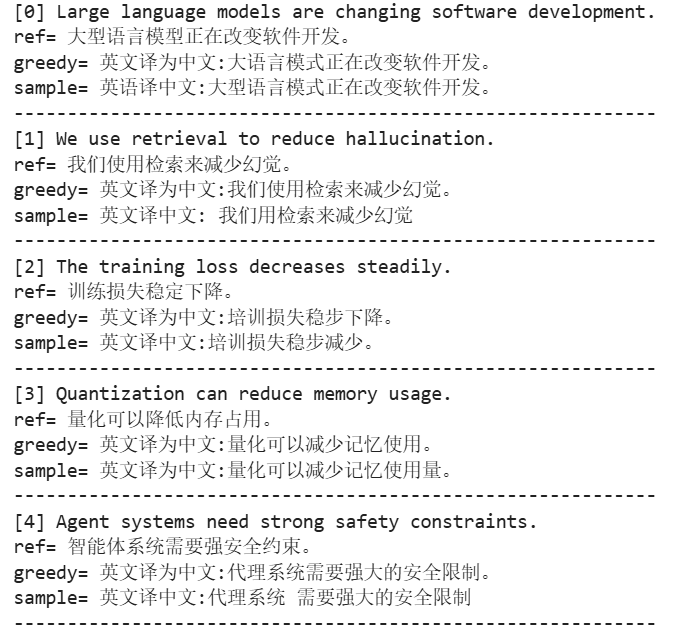
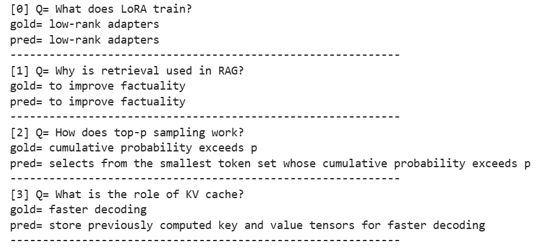
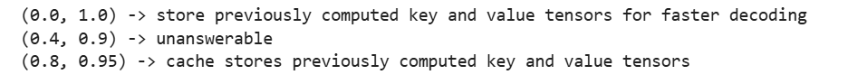

# 文本生成任务（翻译+问答）

## 原理

### 核心特征

- 任务约束性
- 语义一致性
- 格式规范性

### 训练

基座预训练 - 任务微调 - 落地适配

1. 语义对齐预训练
2. 任务指令微调

### 挑战展望

- 幻觉、长文本生成效率、低资源场景适配（数据稀缺）
- 轻量化、多模态、可控生成、事实增强

## 代码

### 调库

```python
import re
import numpy as np
import torch
import sacrebleu
from transformers import AutoTokenizer, AutoModelForSeq2SeqLM
```

### 加载模型

- 翻译：Helsinki-NLP/opus-mt-en-zh
- 问答：flan-t5-small

加载，同前，不再赘述。

- AutoTokenizer
- AutoModelForSeq2SeqLM
- model_mt.eval()

### 统一生成函数

```python
# 通过 temperature/top_p 切换 greedy 与采样
@torch.no_grad()
# top_p：概率截断采样，只从“概率最高的一小部分 token”里随机选
def gen(prompt,model,tok,max_new_tokens=96,temperature=0.0,top_p=1.0):
    inputs=tok(prompt,return_tensors='pt',truncation=True).to(device) # 如果太长，自动截断
    do_sample=temperature>0 # 随机采样
    outputs=model.generate(
        **inputs,
        max_new_tokens=max_new_tokens,
        do_sample=do_sample,
        # 温度越低，越稳定，容易被选中；温度越高，随机性越强
        temperature=max(temperature,1e-5),
        # 核采样：只保留累计概率达到 p 的 token 集合
        top_p=top_p,
        # 束搜索：每一步保留最优的 k 条路
        # 采样模式：不用；非采样模式：保留四路
        num_beams=1 if do_sample else 4,
    )
    # print(outputs)
    # print(outputs.shape)
    # print(tok.decode(outputs[0]))
    return tok.decode(outputs[0],skip_special_tokens=True).strip()

print(gen('translate English to Chinese: The model is robust.', model_mt, tok_mt))
```

### 机器翻译（MT）

```python
mt_data = [
    {"src":"Large language models are changing software development.","ref":"大型语言模型正在改变软件开发。"},
    {"src":"We use retrieval to reduce hallucination.","ref":"我们使用检索来减少幻觉。"},
    {"src":"The training loss decreases steadily.","ref":"训练损失稳定下降。"},
    {"src":"Quantization can reduce memory usage.","ref":"量化可以降低内存占用。"},
    {"src":"Agent systems need strong safety constraints.","ref":"智能体系统需要强安全约束。"},
]

# src:原句
# ref:人工参考翻译
def mt_prompt(src):
    return f"translate English to Chinese: {src}"

mt_greedy=[gen(mt_prompt(x['src']),model_mt,tok_mt,temperature=0.0)for x in mt_data]
mt_sample=[gen(mt_prompt(x['src']),model_mt,tok_mt,temperature=0.7,top_p=0.9) for x in mt_data]

for i,x in enumerate(mt_data):
    print(f"[{i}]", x['src'])
    print('ref=', x['ref'])
    print('greedy=', mt_greedy[i])
    print('sample=', mt_sample[i])
    print('-'*60)
```

**BLEU**评估

衡量 **模型翻译** 和 **人工标准翻译** 的相似程度

- 计算 n-gram 重合度
- 缺点：不懂语义

现在流行：
- ROUGE，摘要
- METEOR，考虑词形
- BERTScore，语义相似度
- COMET，神经网络评估
- BLEURT，Google 神经评估

```python
refs=[x['ref'] for x in mt_data]
print('BLEU greedy=',sacrebleu.corpus_bleu(mt_greedy,[refs]).score)
print('BLEU sample=',sacrebleu.corpus_bleu(mt_sample, [refs]).score)
```



```python
BLEU greedy= 0.0
BLEU sample= 0.0
```

### 问答QA

```python
qa_data = [
    {"ctx":"LoRA keeps the base model frozen and trains low-rank adapters.","q":"What does LoRA train?","a":"low-rank adapters"},
    {"ctx":"RAG retrieves relevant passages before generation to improve factuality.","q":"Why is retrieval used in RAG?","a":"to improve factuality"},
    {"ctx":"Top-p sampling selects from the smallest token set whose cumulative probability exceeds p.","q":"How does top-p sampling work?","a":"cumulative probability exceeds p"},
    {"ctx":"KV cache stores previously computed key and value tensors for faster decoding.","q":"What is the role of KV cache?","a":"faster decoding"},
]

def qa_prompt(ctx,q):
    return (
        "Answer the question using the context. If missing, say 'unknown'.\n"
         f"context: {ctx}\nquestion: {q}\nanswer:"
    )

qa_pred=[gen(qa_prompt(x['ctx'],x['q']),model_qa,tok_qa,temperature=0.0) for x in qa_data]
for i,x in enumerate(qa_data):
    print(f"[{i}] Q=", x['q'])
    print('gold=', x['a'])
    print('pred=', qa_pred[i])
    print('-'*60)
```



**EM/Token-F1** 评估

- em：完全匹配
- f1：部分匹配

50% 的答案完全正确

平均词级重合度是 71.6%

```python
def norm(s):
    """
    文本标准化：
    1.大小写
    2.标点
    3.多余空格
    """
    s=s.lower().strip()
    # 英文、数字、中文、空白 -> 替换为空格
    s = re.sub(r"[^a-z0-9一-龥\s]", " ", s)
    # 多个空格压缩为一个
    return re.sub(r"\s+"," ",s)

# 完全匹配
def em(p,g):
    return int(norm(p)==norm(g))

# 部分匹配
def f1(p,g):
    # 分词
    pt,gt=norm(p).split(), norm(g).split()
    if not pt and not gt: return 1.0 # 两边都空
    if not pt or not gt:return 0.0 # 一边为空
    bag={}
    # 词袋统计
    for t in pt:bag[t] = bag.get(t,0)+1
    # 计算交集
    inter=0
    for t in gt:
        if bag.get(t,0)>0:
            inter += 1;bag[t]-=1
    if inter==0:return 0.0
    pre=inter/len(pt) # 准确率-误判：预测里多少是对的
    rec=inter/len(gt) # 召回率-漏判：标准答案里多少被找到
    return 2*pre*rec / (pre+rec) # F1公式

ems=[em(p,x['a']) for p,x in zip(qa_pred,qa_data)]
f1s=[f1(p,x['a']) for p,x in zip(qa_pred,qa_data)]
print('EM=', 100*np.mean(ems))
print('F1=', 100*np.mean(f1s))
```

```python
EM= 50.0
F1= 71.66666666666667
```

### 对比QA

```python
x=qa_data[3] # 使用 2/3 效果显著
p=qa_prompt(x['ctx'],x['q'])
for cfg in [(0.0,1.0),(0.4,0.9),(0.8,0.95)]:
    print(cfg, '->', gen(p, model_qa, tok_qa, temperature=cfg[0], top_p=cfg[1]))
```



### 统一任务路由

```python
def run_task(task_type,**kw): # **kw：表示接收任意关键字参数
    if task_type == 'translation':
        return gen(mt_prompt(kw['source']),model_mt,tok_mt,temperature=kw.get('temperature',0.0))
    if task_type == 'qa':
        return gen(qa_prompt(kw['context'], kw['question']), model_qa, tok_qa, temperature=kw.get('temperature',0.0))
    raise ValueError(task_type)

print(run_task('translation', source='RAG combines retrieval and generation.'))
# ctx未明确给出时
print(run_task('qa', context='MoE activates a subset of experts.', question='How does MoE save computation?'))
# ctx明确给出
print(run_task('qa', context='MoE saves computation by activating only a subset of experts.', question='How does MoE save computation?'))
```

输出：

```python
英文译为中文:RAG结合检索和生成。
unknown
activating only a subset of experts
```


