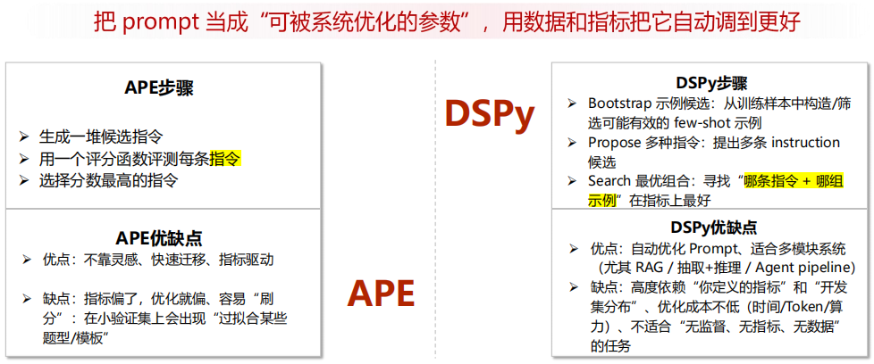
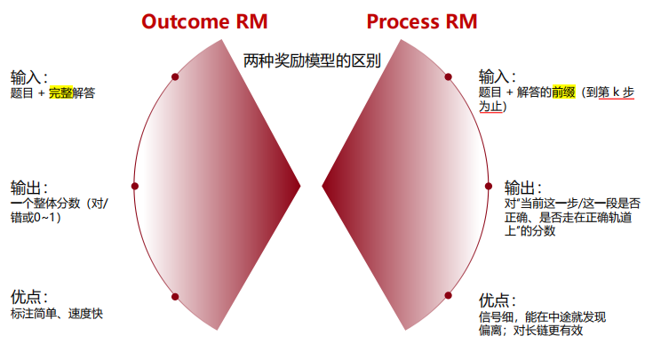
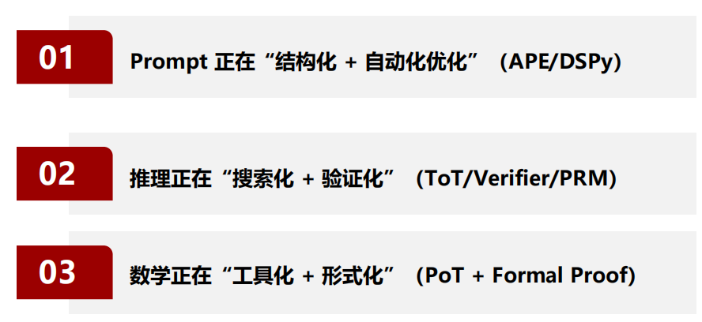
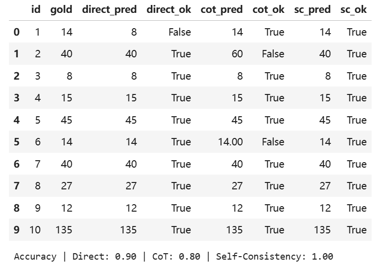
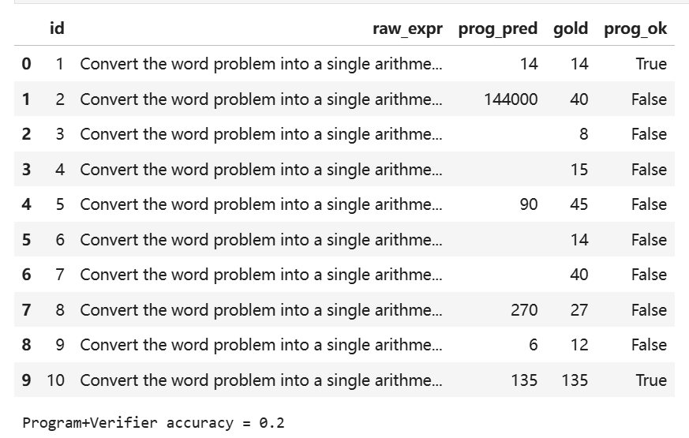

# 复杂推理（思维链）

## 原理

### 进阶推理

**CoT**作为草稿提供中间步骤 + 验证机制进行审计

- 步骤变长后，误差可能累积
- 事后编造
- 对提示敏感
- 为推理：看起来合理但实际不对
- token/时延成本增加

#### 结构化CoT

A：Plan-and-Solve：列计划再逐步执行，减少跳步。
B：Least-to-Most：先解最简单子问题，逐步递进。先从确定性最强的子问题出发，逐步收缩推理空间，适合多约束任务。

#### ToT与多路径探索

相当于优化问题：多分支推理 + 分步评估 + 回溯选择

同一个问题同时探索多个候选思路（分支），每走几步就评估质量，不行就剪枝/回溯，再探索别的分支

#### 工具调用 / ReAct思路

推理 - 行动（调用实际工具）- 更新修正

#### Prompt自动化



### 数学推理

#### PoT

把不擅长的环节交给擅长的工具：求 LLM在遇到需要精确计算的任务时，先生成一段可执行的程序（通常是 Python 代码或计算表达式），然后把计算交给解释器/计算器执行，再把执行结果组织成最终答案。

- 语义理解错误
- 代码生成错误

解决

- 强制分两段输出：可执行代码+最终答案

#### PRM

过程监督 / 验证器



#### 形式化数学

题目、定义、引理、证明步骤写成证明器（proof assistant）能理解的严格语言（例如Lean 等），然后由证明器做逐步类型检查/逻辑检查

#### 存在问题

- 数据污染/背题
- 泛化问题，表述更换性能下降
- 成本增加

### 垂直领域

#### 要求

- 可追溯（Traceable）：结论必须能“指回证据”
- 可验证（Verifiable）：关键步骤必须能“复核”
- 可控（Controllable）：输出要稳定、结构要可控、边界要清楚

#### 方法

- 转换成结构化对象
- 硬推理
- LLM读懂并抽取和解释输出，核心判断交给可验证的推理测

蒸馏：让强模型（Teacher）把“怎么推理”的过程写出来（分步解释/计算程序/中间结论），再用这些“推理轨迹（reasoning traces）”去监督微调小模型（Student），把推理能力迁移过去



## 代码

思维链

### 使用HuggingFace

#### 在线状态

`import os`
`os.environ['HF_ENDPOINT'] = 'https://hf-mirror.com'`

#### 离线/集群状态

- 先在有网的机器把模型下载到某目录（HF cache）。
- 集群离线时设置：
  - `export HF_HOME=/path/to/hf_cache`
  - `export TRANSFORMERS_OFFLINE=1`
  - `from_pretrained(MODEL_ID, local_files_only=True)`

### 导包

```python
import os, re, math, random
import torch
import pandas as pd
from transformers import AutoTokenizer, AutoModelForSeq2SeqLM
from transformers import AutoTokenizer, AutoModelForCausalLM
```

### 加载模型 + 数据准备

使用`Qwen2.5-0.5B-Instruct`

### prompt模板（3）

- direct answer：最终答案
- CoT：逐步推理，中间推理显式化
- Self-Consistency：采样多条CoT，多数投票

```python
def prompt_direct(q:str)->str:
    return f"""Solve the problem and give only the final answer as a number.

Question: {q}
Final answer:"""

def prompt_cot(q:str)->str:
    # 鼓励分布推理+明确 Final answer
    return f"""Solve the problem step by step. At the end, write 'Final answer: <number>'.

Question: {q}
Let's think step by step."""
```

### 抽取

```python
# 输出解析：从模型输出里面抽取最终答案
# 输出解释、单位、标点，用正则规则
def extract_number(text:str)->str:
    # 调试打印，方便观察（实际跑大量数据时可注释掉）
    # print(f"Extracting from: {text[:100]} ... (truncated)")

    # 0) 数字正则：匹配 整数 / 小数
    # 说明: [-+]? (可选正负) \d+ (数字) (?:\.\d+)? (可选小数)
    number_pattern = r"[-+]?\d+(?:\.\d+)?"

    # 1) 优先抓 fa 后面的数字
    pattern_final = r"final\s*answer.*?" + f"({number_pattern})"
    matches = re.findall(pattern_final, text, flags=re.IGNORECASE | re.DOTALL)
    if matches:
        return matches[-1]

    # 2) 未找到，抓 a 或者 r 后面数字
    pattern_answer = r"(?:answer|result).*?" + f"({number_pattern})"
    matches = re.findall(pattern_answer, text, flags=re.IGNORECASE | re.DOTALL)
    if matches:
        return matches[-1]

    # 3) 抓最后一个数字
    nums = re.findall(number_pattern, text)
    if nums:
        return nums[-1]

    return ""

# 进行匹配判断
def exact_match(pred:str,gold:str)->bool:
    if pred is None:pred=""
    if gold is None:gold=""

    return pred.strip()==gold.strip()
```

### 评测

三种方式

```python
def run_direct(example):
    out = generate_text(prompt_direct(example["question"]), max_new_tokens=64, 
                        do_sample=False # 不采样，使用贪心解码每一步选择概率最大的
                       )[0]
    return out, extract_number(out)
    # 返回完整文本和提取出的数字

def run_cot(example):
    out = generate_text(prompt_cot(example["question"]), 
                        max_new_tokens=160, # token更多 
                        do_sample=False)[0]
    return out, extract_number(out)

def run_self_consistency(example, n_samples=5): # 让模型随机思考5次
    outs=generate_text(
        prompt_cot(example["question"]),
        max_new_tokens=160,
        do_sample=True, # 开启随机采样
        temperature=0.8,
        top_p=0.95,
        num_return_sequences=n_samples
    )
    preds=[extract_number(t) for t in outs]
    # 多数投票 (ties 时第一个出现)
    counts={}
    for p in preds:
        # 统计每个答案出现次数
        counts[p] = counts.get(p,0)+1
    # 找票数最多的
    # -[x]:降序排序，票数相同，谁先出现选谁
    pred_sc=sorted(counts.items(), key=lambda x:(-x[1],preds.index(x[0])))[0][0]
    return outs,pred_sc,preds
```

评测指标

```python
    rows.append({
        "id": ex["id"],
        "question": ex["question"],
        "gold": gold,
        "direct_pred": direct_pred,
        "direct_ok": exact_match(direct_pred, gold), # 判断
        "cot_pred": cot_pred,
        "cot_ok": exact_match(cot_pred, gold),
        "sc_pred": sc_pred,
        "sc_ok": exact_match(sc_pred, gold),
        "direct_text": direct_text[:300],
        "cot_text": cot_text[:300],
        "sc_samples": "\n---\n".join([t[:200] for t in sc_texts]),
    })
```



- Direct：跳步
- CoT：步骤显式化，难函数拆成多个小函数
- SC：多条推理共识来抵消采样噪声

### 验证器和执行器

算术-Python来

在CoT后加一个verifier（规则/执行器/二次模型）来校验最终答案
演示：只对纯算术表达式做eval

- `safe_eval_arith(text)`
  - 清洗模型输出（去掉 `Expression:`、`=` 等）
  - 用正则提取合法算术表达式
  - 用安全 `eval` 计算结果
- `prompt_program(q)`
  - 把文字题包装成 `Prompt`
- `run_program_verifier(example)`
  - 执行完整 `Program Verifier` 流程
    - 调用`generate`生成
    - 调用`safe..`计算结果
    - 规范化输出

```python
def safe_eval_arith(text:str):
    """
    1.文字题转成算术表达式
    2.安全计算结果
    3.与答案对比
    先让模型输出可计算的表达式，再由程序验证。
    类 OpenAI 的 PAL
    """
    if not text: return None

    # 1.预处理：去掉标签
    text=text.replace("Expression:","").replace("expression:", "").strip()

    # 2.处理 = ，只取左边部分
    if "=" in text:
        text=text.split("=")[0]

    # 3.正则提取：寻找最长的合法算术子串
    # 允许字符：数字、小数点、加减乘除、括号、空格
    math_pattern = r"[0-9\.\+\-\*\/\(\)\s]+"
    matches = re.findall(math_pattern, text)

    if not matches:
        return None

    # 取最长的一段
    expr_candidate=max(matches,key=len).strip()

    # 安全执行算术表达式，不允许模型输出的其他 Python 代码运行
    # 禁掉 Python 内置函数
    try:
        return eval(expr_candidate,{"__builtins__":{}})
    except Exception:
        return None

# 问题转换成算术表达式
def prompt_program(q: str) -> str:
    return f"""Convert the word problem into a single arithmetic expression using numbers and + - * / parentheses.
Return only the expression.

Question: {q}
Expression:"""

def run_program_verifier(example):
    raw_out=generate_text(prompt_program(example["question"]),max_new_tokens=64,do_sample=False)[0].strip()
    val=safe_eval_arith(raw_out)
    if val is not None:
        # 判断整数：做四舍五入，并转成字符串
        if abs(val-round(val)) < 1e-6:
            pred=str(int(round(val)))
        else:
            pred=str(val)
    else:
        pred=""
    return raw_out,pred
```


