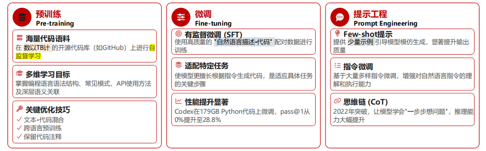
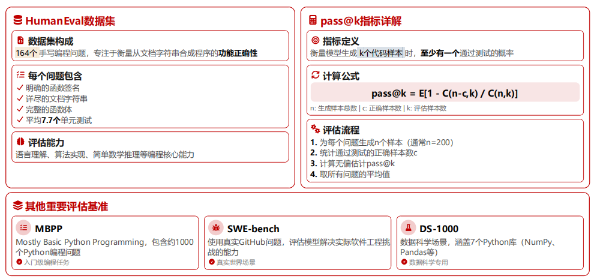

# 代码生成大模型

## 原理

任务：

- 生成代码
- 代码自动补齐
- 代码翻译与重构

要求：

- 语法严格
- 语义精确

代码大模型：在海量开源代码库（Github等）进行预训练或微调的大型语言模型（Codex和AlphaCode）

发展历史：

1. 预设规则
2. 补全功能
3. 编写转向描述



评估体系：

- HumanEval
- pass@k



挑战：

- 正确性
  - 语法错误
  - 逻辑错误
- 可靠性
  - 输出不稳定
  - 逻辑不一致
  - 性能波动
- 安全性
  - 生成漏洞代码
  - 泄露敏感信息
- 泛化能力

## 代码

### 导包

```python
import ast, builtins, math, re, traceback
import numpy as np, torch
from transformers import AutoTokenizer, AutoModelForCausalLM
```

### 模型选择

`bigcode/tiny_starcoder_py`

```python
AutoTokenizer
tok.pad_token=tok.eos_token
AutoModelForCausalLM
```

### 数据集构造

- name：任务名字
- inst：任务说明
- tests：测试代码字符串，使用断言

### prompt + 生成 

```python
def build_prompt(inst,feedback=''):
    # 约束:输出代码,不要解释
    p = "You are a precise Python coder. Output ONLY Python code.\n" + f"Task: {inst}\n"
    if feedback:
        p += f"Previous error:\n{feedback}\nFix it.\n"
    return p

@torch.no_grad()
def generate(prompt,max_new_tokens=220,temperature=0.0,top_p=0.95):
    x=tok(prompt,return_tensors='pt').to(device)
    y=model.generate(
        **x, # 输入张量
        max_new_tokens=max_new_tokens,
        do_sample=temperature>0,
        temperature=max(temperature,1e-5),
        top_p=top_p,
        pad_token_id=tok.eos_token_id,
    )
    # 模型输出 y[0]包含：原 prompt+新生成的 token
    gen_ids=y[0][x['input_ids'].shape[1]:]
    return tok.decode(gen_ids,skip_special_tokens=True)
```

### 代码提取

```python
def extract_code(text):
    """
    用来提取真正的代码
    """
    # 有 python 标记的情况
    b = re.findall(
        r"```python(.*?)```",
        text, 
        flags=re.S|re.I
    )
    
    if b: 
        return b[0].strip()

    # 没有 python 标记的情况
    b2 = re.findall(
        r"```(.*?)```", 
        text, 
        flags=re.S
    )
    
    if b2: 
        return b2[0].strip()
    return text.strip()
```

### 语法检查

```python
def syntax_ok(code):
    """
    检查语法
    """
    try:
        # ast:代码先被解析为语法树
        ast.parse(code);return True,'OK'
    except Exception as e:
        return False,str(e)
```

### 自动测试执行器

- 教学使用受限 builtins
- 生产使用 沙箱

```python
# 限制使用的内置函数,防止出现 os.sys 相关的
SAFE = {k:getattr(builtins,k) for k in [
    'abs','all','any','bool','dict','enumerate','float','int','len',
    'list','max','min','pow','print','range','set','str','sum','tuple','zip'
]}
# 允许导入标准模块 (math,re)等
SAFE['__import__'] = builtins.__import__

def run_tests(code_text,tests_text):
    # 先检查语法
    ok,msg=syntax_ok(code_text)
    if not ok:
        return False,'SyntaxError: ' + msg
        
    # 全局作用域
    g = {'__builtins__': SAFE, 'math': math, 're': re}
    # 局部作用域：代码和测试运行处
    l = {}
    
    try:
        exec(code_text, g, l)
        exec(tests_text, g, l)
        return True, 'PASS'
    except Exception:
        return False, traceback.format_exc(limit=1)
        # 获取 最近一层错误堆栈，方便调试
```

### 基线：一次生成（One-shot）

不进行任何错误修正，只让模型生成一次代码，直接测试，统计通过

等价于pass@1

```python
baseline=[] # 保存测试结果
for t in tasks:
    raw=generate(build_prompt(t['inst']),temperature=0.0)
    code_text=extract_code(raw)
    ok,rep=run_tests(code_text,t['tests'])
    baseline.append({
        'task': t['name'], 
        'ok': ok, 
        'report': rep[:120], 
        'code': code_text
    })
    print(raw[:500])
    print("---")

for r in baseline:
    print(r['task'], '->', r['ok'], '|', r['report'])
```

### 反馈修复（self-refine）

```python
def solve_refine(task,max_round=3): # 最多尝试修正 3 轮
    fb=''
    hist=[] # 保存历史记录
    for rd in range(1,max_round+1):
        raw = generate(build_prompt(task['inst'], fb), temperature=0.2 if rd>1 else 0.0)
        # 2,3: 增加一些随机性
        code_text = extract_code(raw)
        ok, rep = run_tests(code_text, task['tests'])
        hist.append({
            'round': rd, 
            'ok': ok, 
            'report': rep, 
            'code': code_text
        })
        if ok:
            return True,hist
        fb=rep
    return False,hist

refined=[]
for t in tasks:
    ok,h=solve_refine(t,3)
    refined.append({
        'task': t['name'], 
        'ok': ok, 
        'rounds': len(h)
    })
print(refined)
```

### pass@k 估计（小样本）

生成 k 次，只要一次通过测试，就算成功

```python
def pass_at_k(task,k=5,temp=0.8):
    # k=5:最多生成五次
    # tmp=0.8:提高随机性
    for _ in range(k):
        raw = generate(
            build_prompt(task['inst']), 
            temperature=temp,
            top_p=0.95
        )
        ok, _ = run_tests(
            extract_code(raw), 
            task['tests']
        )
        if ok:
            return 1
    return 0

K=5
print({t['name']: pass_at_k(t, K, 0.8) for t in tasks})
```

