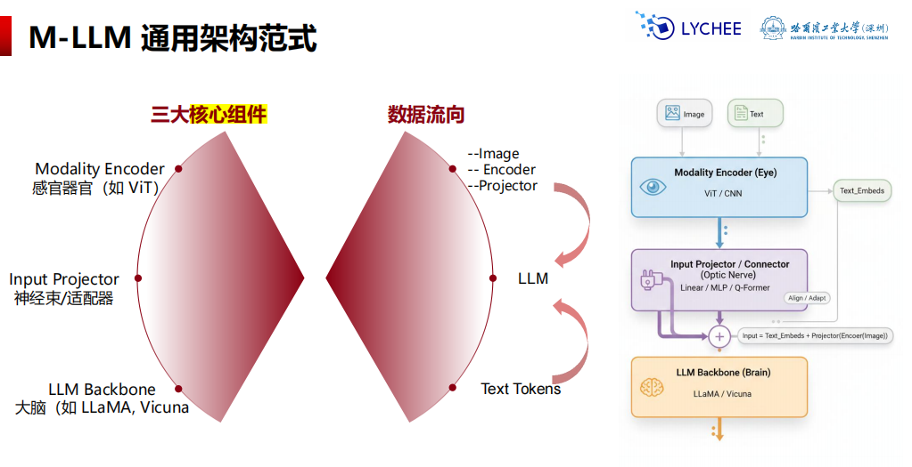
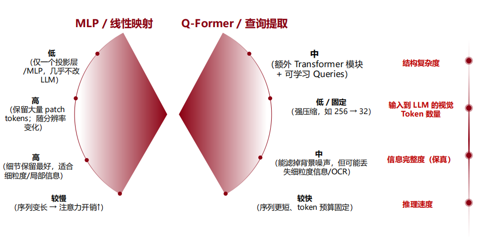
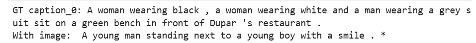
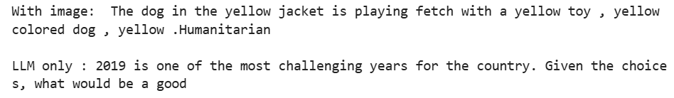

# 多模态大模型

“视觉编码器对齐到 LLM”的完整流程跑通，并做 ablation（有图 vs 无图）对比

## 原理

多模态：将其他信号通过模态对齐映射为 tokens，实现 Any-to-Any

### 发展历程

1. CLIP：跨模态对比学习，图像-文本对训练，映射，建立联系
2. BLIP-2 & LLaVA：翻译，预训练好的LLM，通过**Q - Forme r**(BLIP-2) 或 **线性投影层** (LLaVA)
3. GPT-4o & Gemini 1.5 pro：端到端全模态融合，训练初期视为同等信号

### 架构范式



**视觉编码器**：常用CLIP-ViT

**对齐方案**：

- 线性映射（LLaVA）：信息完整，token多，速度慢
  - 1）输入形态：视觉编码器（常见是 CLIP-ViT）把图像切成 patch，输出一串向量
  - 2）投影（Projector）：用一个线性层或两层 MLP 把每个 vi 映射到LLM 的维度di
  - 3）拼接进 LLM：把视觉向量当作一段前缀 token，与文本 token 拼在一起
- 查询提取（BLIP-2, InstructBLIP）：**抓重点**，压缩token，加速，但丢失细粒度信息
  - 1）输入：密集视觉 tokens，视觉编码器先产生大量 image tokens
  - 2）关键组件：可学习 Queries（Q），模型参数本身
  - 3）Cross-Attention：用 Q 去读 V，每个 query 关注图像中不同区域/语义（物体、关系、属性），把信息汇总到query 的输出里
  - 4）再映射到 LLM，把Q过一层线性/MLP 变到 LLM hidden size，然后作为视觉前缀输入 LLM



特征对齐+指令微调

### 音频与视频

- Video-LLM：**Time-Adapter**（时间适配器）的作用，在时间维度做“**压缩与对齐**”，让模型既保留关键动态信息，又能在 LLM 的上下文长度内工作
- Speech-LLM：ASR（语音转文字）- LLM - TTS（文字转语音）

### 图文生成

- 工具调用：LLM 当“导演”，扩散模型当“画师”。LLM 写出精确的 Text Prompt（+参数）→ 调用 Stable Diffusion / DALL·E 等**图像生成器** → 返回图片
- 原生生成： 把图像离散，再让 LLM 直接预测。先用 VQ-VAE / tokenizer 把图像压缩编码为离散 code，LLM像生成**文本**一样生成这些 image tokens，然后再解码还原

### 评估指标

- MMMU：专家级多学科知识
- MathVista：视觉数学推
- POPE：幻觉测试
- 可用性
- 格式稳定性
- 可微调+部署成本

训练对齐层（Projector/Prefix），冻结 CLIP（ViT）和 Qwen（LLM）

- 实验效果：实证明视觉信息成功进入了 LLM 并影响了生成结果（说明多模态机制有效），但模型目前只能粗略理解图片，还没有达到与标准描述（GT Caption）精确对齐的程度。
    - with image：更多名词
    - LLM only：不稳定

**图像 → ViT 得到特征 → Projector 映射到 LLM hidden space → 作为“视觉前缀 token”拼到文本 token 前面 → LLM 继续做因果语言建模。**

## 代码

### 导包

```python
import os, random
import torch
from torch import nn
from torch.utils.data import DataLoader
from tqdm import tqdm
import torch.nn.functional as F
```

### 超参数

- `NUM_VIS_TOKENS`：视觉前缀 token 数（8~32）
- `N_TRAIN`：训练样本数（演示用 256~1024 都可以）
- `EPOCHS`：训练轮数（2~5）

```python
# ====== tiny demo hyperparams ======
NUM_VIS_TOKENS = 16     # 8~32；越大越慢但信息更足
N_TRAIN = 256           # 训练集，少量就够演示
N_VAL   = 16 # 验证集，样本数量

BATCH = 4
EPOCHS = 2
LR = 5e-5
MAX_TEXT_LEN = 64       # 文本最大长度（prompt+caption）
GEN_MAX_NEW = 24        # 推理生成长度（控制输出更干净）

# 采样参数：比 greedy 更不复读，但别太大以免发散
TOP_P = 0.7
TEMPERATURE = 0.6
```

### 数据集（Flickr8k子集）

经典的图像描述数据集，来自 Flickr 的约 8000 张图片及其文字描述。

Flickr8k 是一个包含约 8000 张图片、每张图片配有 5 条人工描述的经典图像描述数据集，经常被用来学习和验证图像描述、多模态模型和视觉语言模型的基本原理。

```python
from datasets import load_dataset

ds = load_dataset("jxie/flickr8k")  # image + caption_0..caption_4
train_ds = ds["train"]

idx = list(range(len(train_ds)))
random.shuffle(idx)
train_idx = idx[:N_TRAIN]
val_idx   = idx[N_TRAIN:N_TRAIN+N_VAL]

# 按照指定的索引，挑选出对应样本，组成新数据集
train_small = train_ds.select(train_idx) 
val_small   = train_ds.select(val_idx)

print(train_small)
print("example keys:", train_small[0].keys())
```

### 视觉编码器（ViT/CLIP Vision）

使用`clip-vit-base-patch32`

```python
from transformers import CLIPVisionModel, CLIPImageProcessor

image_processor = CLIPImageProcessor.from_pretrained(vision_name)
vision = CLIPVisionModel.from_pretrained(vision_name).to(device)
vision.eval()

for p in vision.parameters():
    p.requires_grad=False # 冷冻
```

### 语言模型LLM

使用`Qwen2.5-0.5B-Instruct`

```python
from transformers import AutoTokenizer, AutoModelForCausalLM
llm_name = "./models/Qwen2.5-0.5B-Instruct"
tokenizer = AutoTokenizer.from_pretrained(llm_name, use_fast=True)

# pad_token 进行修正
if tokenizer.pad_token is None:
    tokenizer.pad_token = tokenizer.eos_token

llm = AutoModelForCausalLM.from_pretrained(
    llm_name,
    torch_dtype=torch.float16 if device=="cuda" else torch.float32,
).to(device)

llm.eval()
for p in llm.parameters():
    p.requires_grad = False

# 为了 ViT与 LLM进行拼接，先读取 LLM 当前使用的数据类型
llm_dtype = llm.get_input_embeddings().weight.dtype
```

### 图像 - tokens

输出形状：`[B, S, vision_dim]`，其中 `S = 1(CLS) + patches`

```python
@torch.no_grad()
def encode_image_to_patches(pil_images):
    inputs = image_processor(images=pil_images, return_tensors="pt").to(device)
    out = vision(**inputs)
    return out.last_hidden_state
```

### Prefix-style Projector对齐层

**使用prefix（图像特征映射成token）拼在文本token前面，让模型把视觉信息当上下文使用**

CLS token是整张图像的全局语义表示

步骤：
1. CLS token做图像摘要（ViT或CLIP输出每个patch特征 + CLS token）
2. MLP映射到LLM hidden size
3. 复制成num个prefix token，序列
4. 位置编码

```python
class PrefixProjector(nn.Module):
    """
    PrefixProjector：把“图像编码器输出”映射成一段 LLM 可读的“视觉前缀 token”。

    思想：
      - ViT/CLIP 的输出是 [B, S, vision_dim] 的序列（含 CLS + patches）
      - LLM 需要 [B, T, llm_dim] 的 token embedding
      - 所以我们把图像压缩成一个全局向量（CLS），再映射到 llm_dim，
        然后扩展成 num_tokens 个“视觉 token”，拼到文本 token 前面。

    为什么要 num_tokens 个而不是 1 个？
      - 多个 token = 更大的“信息带宽”，LLM 通过自注意力可以从多个位置读取视觉信息
      - 同时每个 token 需要区分“位置/角色”，所以加入可学习位置向量 prefix_pos
    """
    def __init__(self,vision_dim:int,llm_dim:int,num_tokens:int):
        super().__init__()
        self.num_tokens=num_tokens
        # 映射 Linear+GELU
        self.mlp = nn.Sequential(
            nn.Linear(vision_dim, llm_dim),
            nn.GELU(),
            nn.Linear(llm_dim, llm_dim),
        )
        # 前缀位置向量
        self.prefix_pos=nn.Parameter(torch.randn(num_tokens,llm_dim)*0.02)

    def forward(self,patches:torch.Tensor,llm_dtype:torch.dtype):
        """
        patches: [B, S, vision_dim]
          - B: batch size
          - S: 视觉序列长度（CLS + patch tokens），例如 1 + 49
          - vision_dim: CLIP-ViT 的 hidden size，例如 768

        llm_dtype:
          - LLM embedding 的 dtype（常见是 fp16 / bf16）
          - 重要：最终输出要转成 llm_dtype，否则后面和 LLM 做 matmul 会 dtype mismatch
        """
        # 1) cls: [B, vision_dim]
        cls=patches[:,0,:]
        
        # 2) 映射 base: [B, llm_dim]
        base=self.mlp(cls.float()).to(llm_dtype)

        # 3) 全局向量扩展成 v 个 prefix token
        # base: [B, 1, llm_dim] -> repeat -> [B, V, llm_dim]
        base=base[:,None,:].repeat(1,self.num_tokens,1)

        # 4) 学习位置向量
        #    prefix_pos: [V, D] -> [1, V, D] broadcast 到 [B, V, D]
        #    out: [B, V, llm_dim]
        out=base+self.prefix_pos[None,:,:].to(llm_dtype)

        return out

projector=PrefixProjector(
    vision_dim=vision.config.hidden_size,
    llm_dim=llm.config.hidden_size,
    num_tokens=NUM_VIS_TOKENS
).to(device)
```

### batch（ViT_prefix + text）

—> LLM

padding token 不参与 loss

caption：描述说明

```python
PROMPT = "Describe the image in one sentence:"

# 1) 图片 + 描述
def pick_caption(ex):
    k=random.randint(0,4)
    return ex[f"caption_{k}"]

def build_inputs(pil_images,captions):
    """
    1.图像 → patches → projector → prefix token
    2.caption + PROMPT → tokenizer → text embedding
    3.拼接 [视觉 prefix token + 文本 token]
    4.构建 attention_mask 和 labels（只计算 caption loss）

    return:
      inputs_embeds: [B, (V + T), llm_dim]
      attention_mask: [B, (V + T)]
      labels: [B, (V + T)]
    """
    # 2) 图片 - 视觉特征 - Prefix Token
    B=len(pil_images)
    patches=encode_image_to_patches(pil_images) # [B,S,vision_dim]
    vis_embeds=projector(patches,llm_dtype) # [B,V,vision_dim]

    # 3) 构造文本
    texts=[f"{PROMPT} {cap}" for cap in captions]

    # 4) tokenizer
    tok = tokenizer(
        texts,
        return_tensors="pt",
        padding=True,
        truncation=True,
        max_length=64,
    ).to(device)

    input_ids=tok["input_ids"] # [B, T], long
    attn_text=tok["attention_mask"] # [B, T], long

    # 5) 变成 Embedding
    text_embeds=llm.get_input_embeddings()(input_ids) # [B, T, llm_dim], llm_dtype

    # 6) 视觉与文本拼接 -> 作为 LLM的输入
    inputs_embeds = torch.cat(
        [vis_embeds, text_embeds], 
        dim=1
    ).to(llm_dtype)

    # 视觉 token 标记为有效输入，拼接
    vis_attn = torch.ones(B, NUM_VIS_TOKENS, device=device, dtype=attn_text.dtype)  # long
    attention_mask = torch.cat([vis_attn, attn_text], dim=1)

    labels_text = input_ids.clone()
    labels_text[:] = -100

    prompt_ids=tokenizer(PROMPT,add_special_tokens=False).input_ids
    prompt_len=len(prompt_ids)+1

    # prompt 不参与 loss，只有 caption
    for i in range(B):
        start=min(prompt_len,labels_text.size(1))
        labels_text[i,start:] = input_ids[i,start:]

    # 视觉 token 不参与 loss
    labels_vis = torch.full(
        (B, NUM_VIS_TOKENS), 
        -100, 
        device=device, 
        dtype=labels_text.dtype
    )
    labels = torch.cat([labels_vis, labels_text], dim=1)

    return inputs_embeds, attention_mask, labels
```

### 训练 projector

- 冻结其他
- 训练
- 使用梯度裁剪

```python
def collate_fn(batch):
    images = [ex["image"] for ex in batch]
    caps = [pick_caption(ex) for ex in batch]
    return images, caps

train_loader = DataLoader(
    train_small,
    batch_size=BATCH,
    shuffle=True,
    collate_fn=collate_fn,
    num_workers=0,
    pin_memory=(device=="cuda"),
)

opt=torch.optim.AdamW(projector.parameters(), lr=5e-4, weight_decay=0.0)

# eval:表示不更新 BN和 Dropout
llm.eval()
vision.eval()
projector.train()

# 训练循环
for epoch in range(EPOCHS):
    pbar = tqdm(train_loader, desc=f"epoch {epoch}")
    for images,caps in pbar:
        inputs_embeds, attn_mask, labels = build_inputs(images, caps)
        # 前向传播
        out = llm(inputs_embeds=inputs_embeds, attention_mask=attn_mask, labels=labels)
        loss = out.loss

        # 反向传播
        opt.zero_grad(set_to_none=True) # 清空梯度
        loss.backward() # 计算梯度
        torch.nn.utils.clip_grad_norm_(projector.parameters(), 1.0) # 防止梯度爆炸
        opt.step() # 更新 projector参数

        # 显示 loss
        pbar.set_postfix(loss=float(loss.detach().cpu()))

projector.eval()
llm.eval()
print("done.")
```

### 推理

- With image:vis_prefix + prompt
- LLM_only:prompt
---

- top_p + temperature 采样
- gen_max_new 长度限制
- decode 后保留第一句
---
vlm：vision-language-model

```python
# 不使用 trans.gen,手写 “prefill + decode” 的 token-by-token 解码流程
@torch.no_grad()
def _sample_top_p(logits,top_p=0.9,temperature=0.8):
    """
    从模型输出的logits中采样下一个token
    1.计算概率
    2.保留概率最大的一批
    3.随机抽取一个
    """
    # 1) 温度放缩
    logits=logits/max(temperature,1e-6)
    probs=F.softmax(logits,dim=-1) # 概率
    sorted_probs,sorted_idx=torch.sort(probs,descending=True) # 降序
    # 2) 计算累积概率
    cum=torch.cumsum(sorted_probs,dim=-1)
    keep=cum<=top_p
    keep[...,0]=True # 至少留一个
    filtered_probs=sorted_probs * keep
    filtered_probs=filtered_probs/filtered_probs.sum(dim=-1,keepdim=True)
    # 3) 随机采样
    next_in_sorted = torch.multinomial(filtered_probs, num_samples=1)
    # 4) 映射回原词表 vocab id
    next_token=sorted_idx.gather(-1,next_in_sorted)

    return next_token.squeeze(-1)

# with image
@torch.no_grad()
def vlm_greedy_answer(pil_image,question,max_new_tokens=32,top_p=0.9,temperature=0.8):
    # 1) 得到 dtype
    llm_dtype = llm.get_input_embeddings().weight.dtype
    
    # 2) 图像 - CLIP-ViT - patch tokens（切块）
    # patches: [1, S, vision_dim]，S 含 CLS + patches（通常 fp32）
    patches=encode_image_to_patches([pil_image])

    # 3) 视觉前缀 token, 视觉映射到 LLM（翻译）（
    # vis_embeds: [1, V, llm_dim]，V = NUM_VIS_TOKENS
    vis_embeds=projector(patches,llm_dtype)

    # 4) 构造文本 prompt
    prompt=f"{PROMPT} "

    # 5) 分词 input_ids（文本 - 数字）
    tok = tokenizer(prompt, return_tensors="pt").to(device)
    input_ids = tok["input_ids"].to(dtype=torch.long)

    # 6) （数字 - 向量）
    # text_embeds: [1, T, llm_dim],input_ids 进行 token embeddings 
    text_embeds=llm.get_input_embeddings()(input_ids)

    # 7) 拼接：inputs_embeds: [1, V+T, llm_dim]
    inputs_embeds=torch.cat([vis_embeds, text_embeds], dim=1).to(llm_dtype)
    attn=torch.ones((1, inputs_embeds.size(1)), device=device, dtype=torch.long)
    
    # prefill：把已有上下文一次性喂给模型，并建立 KV Cache 的阶段
    out=llm(inputs_embeds=inputs_embeds, attention_mask=attn, use_cache=True)
    past=out.past_key_values # KV Cache 像草稿纸一样

    next_id = int(_sample_top_p(out.logits[:, -1, :], top_p=top_p, temperature=temperature).item())
    generated = [next_id]

    # decode
    for _ in range(max_new_tokens - 1):
        # 当前要喂给模型的 token（shape [1,1]）
        cur = torch.tensor([[generated[-1]]], device=device, dtype=torch.long)

        # attention_mask 也要增长 1（因为序列长度增加）
        attn = torch.cat([attn, torch.ones((1, 1), device=device, dtype=torch.long)], dim=1)

        # 只输入 cur + cache：计算成本大幅降低（这就是 decode 的系统瓶颈来源）
        out = llm(input_ids=cur, attention_mask=attn, past_key_values=past, use_cache=True)
        past = out.past_key_values

        # 采样下一个 token
        next_id = int(_sample_top_p(out.logits[:, -1, :], top_p=top_p, temperature=temperature).item())
        generated.append(next_id)

        # 碰到 EOS 就停止
        if next_id == tokenizer.eos_token_id:
            break

    # 把生成 token 序列 decode 成文本（这里只 decode “生成部分”，不包含 PROMPT）
    return tokenizer.decode(generated, skip_special_tokens=True)

# llm_only：作为对照
def llm_only_answer(question, max_new_tokens=32, top_p=0.9, temperature=0.8):
    prompt = f"{PROMPT} "
    tok = tokenizer(prompt, return_tensors="pt").to(device)
    input_ids = tok["input_ids"].to(dtype=torch.long)
    attn = tok["attention_mask"].to(dtype=torch.long)
    # prefill
    out = llm(input_ids=input_ids, attention_mask=attn, use_cache=True)
    past = out.past_key_values
    next_id = int(_sample_top_p(out.logits[:, -1, :], top_p=top_p, temperature=temperature).item())
    generated = [next_id]
    # decode
    for _ in range(max_new_tokens - 1):
        cur = torch.tensor([[generated[-1]]], device=device, dtype=torch.long)
        attn = torch.cat([attn, torch.ones((1, 1), device=device, dtype=torch.long)], dim=1)

        out = llm(input_ids=cur, attention_mask=attn, past_key_values=past, use_cache=True)
        past = out.past_key_values

        next_id = int(_sample_top_p(out.logits[:, -1, :], top_p=top_p, temperature=temperature).item())
        generated.append(next_id)

        if next_id == tokenizer.eos_token_id:
            break

    return tokenizer.decode(generated, skip_special_tokens=True)
```

KV Cache = 模型的“临时记忆”或“草稿纸”

模型把中间计算结果存起来，往后每一次继续更新。
- Q = Query（问题）
- K = Key（索引）
- V = Value（内容）

Cache缓存 KV

### 单样本展示

GT 是参考caption，看描述是否与文本有关联

```python
ex=val_small[0]
img=ex["image"]
print("GT caption_0:", ex["caption_0"])
print("With image:", vlm_greedy_answer(img, "", max_new_tokens=24))
```



- 已经学会按 caption 风格续写，但是对齐不稳，出现与图片不相关的胡编。更多学会生成格式，而非准确 grounding。

### 消融

```python
print("With image:", vlm_greedy_answer(img, "", max_new_tokens=24))
print("LLM only :", llm_only_answer("", max_new_tokens=24))
```



- `With image`：输出 图像描述 风格，视觉前缀改变了生成分布，但容易退化为重复模板
- `LLM only`：语言先验随意续写的结果


