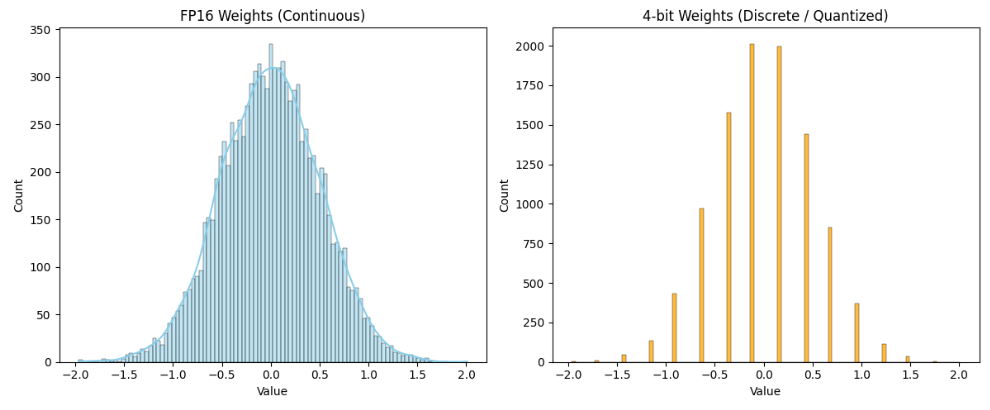
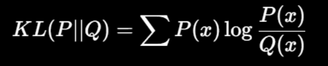
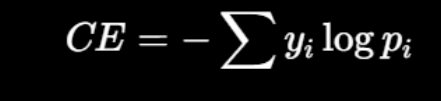
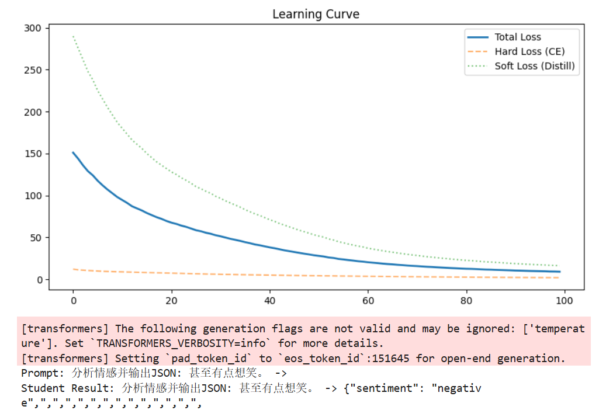
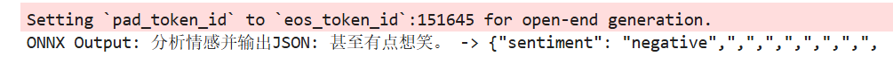

# 量化、蒸馏、部署

## 原理

### 量化

从**高精度****浮点**（FP16/BF16/FP32）转换为**更低比特**的表示（INT8、INT4等），刻度变少，降低显存内存占用。会导致一定精度下降。

- 量化权重：模型参数权重进行压缩
- 量化激活：推理时各层产生的中间激活也转换为低比特
- KV缓存：注意力机制中的Key/Value缓存用低比特存储，**避免每生成一个新 token 都重复计算之前的注意力信息**

#### PTQ

训练完成后再把权重/激活从浮点转换为低比特，不再训练或只做少量校准

#### QAT

在训练/微调阶段把量化误差加入前向，让模型在训练中适应低比特噪声

### 蒸馏

- logits蒸馏：匹配输出概率分布，学习**概率分配方式**
- 特征蒸馏：中间层
- 任务蒸馏：把教师当作“数据生成器/标注器”，生成高质量训练数据，训练学生进行SFT

#### 训练要素

- 温度
- 损失
  - 蒸馏损失
  - 监督损失
- 权重

### 部署

- 训练框架（PyTorch）完成训练与验证
- 到处为更合适的形式（ONNX）
- 推理引擎在目标硬件（GPU/CPU/NPU）高效执行
  - NPU：低功耗下提供高推理效率，适合移动端与嵌入式

算子融合：将操作合并到一次kernel中完成，减少启动与调度开销

## 代码

### 导包

```python
import torch
import torch.nn as nn
import torch.nn.functional as F
from transformers import AutoModelForCausalLM, AutoTokenizer, BitsAndBytesConfig, Qwen2Config
import matplotlib.pyplot as plt
import seaborn as sns
from tqdm import tqdm
import numpy as np
```

### 大模型量化

大模型的参数用更少的位数来表示

比如，原本16位或32位记录，现在用4位。存储空间明显变小

**关键：quantization_config=bnb_config**

```python
# Teacher
model_id = "./models/Qwen2.5-0.5B-Instruct"

tokenizer = AutoTokenizer.from_pretrained(model_id)
print(">>> 正在加载 4-bit 量化 Teacher 模型 (Qwen2.5-0.5B)...")

# 量化加载的规则：配置 4-bit NF4量化参数
bnb_config=BitsAndBytesConfig(
    # 权重：4-bit存
    # 矩阵计算：更高精度 bfloat16
    load_in_4bit=True,
    bnb_4bit_quant_type="nf4",
    bnb_4bit_compute_dtype=torch.bfloat16
)

teacher_model=AutoModelForCausalLM.from_pretrained(
    model_id,
    # 传入量化配置
    quantization_config=bnb_config,
    device_map="auto"
)
```



​	原本（FP16/FP32）是连续实数，量化后，逼近到有限个离散取值上，变成例如台阶的形状

### 知识蒸馏

学生模仿老师在输出前的那一组分数分布（logits），对每个可能输出的偏好程度

`train_data`：情感分析数据

```python
# 白纸学生,使用同一模型配置当模板
student_config = Qwen2Config.from_pretrained(model_id)

student_config.num_hidden_layers = 2 # 层数
student_config.hidden_size = 512 # 维度
student_config.intermediate_size = 1024 # FFN宽度
student_config.num_attention_heads = 4 # 注意力头数

if hasattr(student_config, "layer_types") and isinstance(student_config.layer_types, list):
    student_config.layer_types = student_config.layer_types[:2]
    
# 用配置初始化学生模型
student_model = AutoModelForCausalLM.from_config(student_config).to("cuda")

print(f"Teacher 参数量: {teacher_model.get_memory_footprint()/1024**2:.0f} MB")
print(f"Student 参数量: {student_model.num_parameters()/1e6:.2f} M (随机初始化)")
```

```python
Teacher 参数量: 430 MB
Student 参数量: 82.51 M (随机初始化)
```

### 训练

正式开始训练：
- 任务做对，按要求输出JSON
- 尽量模仿老师的logits获取判断方法

tok - input - 1.t / 2.stu - KL（蒸馏损失） - CE（监督损失） - 总loss - 更新stu

#### KL



- P：Teacher
- Q：Student

#### CE



- Yi：真实标签
- Pi：预测概率

```python
optimizer = torch.optim.AdamW(student_model.parameters(), lr=5e-4)
temperature = 2.0 # 用于软化概率分布
alpha = 0.5 # 控制损失权重

inputs = tokenizer(train_data, return_tensors="pt", padding=True, truncation=True, max_length=64).to("cuda")

losses, ce_losses, distill_losses = [], [], []

teacher_model.eval()
student_model.train()
# Teacher 固定不更新；Student 开启训练用于反向传播

print(">>> 开始蒸馏训练 (100 Steps)...")
progress_bar = tqdm(range(100))

for step in progress_bar:
    with torch.no_grad():
        t_outputs = teacher_model(**inputs)
        # (batch, seq_len, vocab_size)
        t_logits = t_outputs.logits

    s_outputs = student_model(**inputs)
    s_logits = s_outputs.logits

    # KL(Pte || Pstu):接近 0，像老师；过大，不像
    loss_distill = F.kl_div(
        F.log_softmax(s_logits / temperature, dim=-1),
        F.softmax(t_logits / temperature, dim=-1),
        reduction='batchmean'
    ) * (temperature ** 2) # 温度放大后梯度会缩小

    # 监督损失：相当于变成下一个预测
    # 删 最后一个
    shift_s_logits = s_logits[..., :-1, :].contiguous().view(-1, s_logits.size(-1))
    # 删 第一个
    shift_labels = inputs["input_ids"][..., 1:].contiguous().view(-1)
    loss_ce = F.cross_entropy(shift_s_logits, shift_labels)

    loss = alpha * loss_distill + (1 - alpha) * loss_ce

    # 梯度清空 - 反向传播 - 更新参数
    optimizer.zero_grad()
    loss.backward()
    optimizer.step()

    losses.append(loss.item())
    ce_losses.append(loss_ce.item())
    distill_losses.append(loss_distill.item())
    # 进度条左侧的文字
    progress_bar.set_description(f"Loss: {loss.item():.4f}")

print("训练完成！")
```



### 部署

模型导出成更通用、更易加速的格式，使用专门的推理引擎。导出为ONNX，使用ONNX Runtime在CPU上做推理，模拟移动端/边缘设备运行方式。

```python
from optimum.onnxruntime import ORTModelForCausalLM

print(">>> 正在导出模型为 ONNX 格式...")

# 训练好的，按标准格式进行保存
save_path = "./student_model_trained"
student_model.save_pretrained(save_path)
tokenizer.save_pretrained(save_path)

# 加载并执行，得到 ONNX Runtime 
ort_model=ORTModelForCausalLM.from_pretrained(
    save_path,
    export=True,
    use_cache=True,
    use_io_binding=False
)

# ONNX模型和tok一起保存到新目录
onnx_path = "./onnx_output"
ort_model.save_pretrained(onnx_path)
tokenizer.save_pretrained(onnx_path)
```

使用

```python
onnx_loaded = ORTModelForCausalLM.from_pretrained(
    onnx_path,
    provider="CPUExecutionProvider" # 使用cpu执行器，模拟边缘端无 cpu
)

gen_tokens = onnx_loaded.generate(
    **tokenizer(test_prompt, return_tensors="pt"),
    max_new_tokens=20
)

print(f"ONNX Output: {tokenizer.decode(gen_tokens[0], skip_special_tokens=True)}")
```



结果与原PyTorch模型保持一致，导出过程没有改变模型逻辑。
