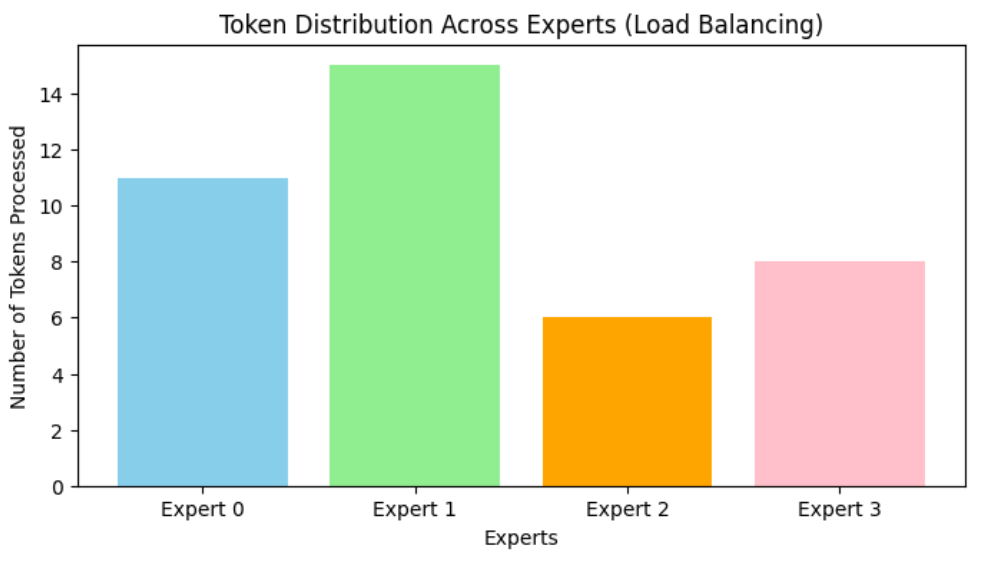

# MoE混合专家模型

用于解决参数规模与计算成本的矛盾：

- Dense（传统模型）：参数变大，计算量线性增长
- Sparse（MoE模型）：参数量巨大，每次推理只激活其中一小部分

## 原理

### 一、MoE 是什么

**稀疏激活大模型**：总参数极大，但每个 token 只激活**Top‑k 个专家**，计算量不随参数暴涨。

- 普通 Dense：参数↑→计算 / 显存 / 带宽全↑
- MoE：参数↑→每 token 计算可控

### 二、结构与位置

- 只替换**FFN/MLP**，Attention 保持 Dense
- 专家 = 独立 FFN 模块
- 现代 MoE 三件套：
  1. **共享专家**：所有 token 必走，稳通用能力
  2. **路由专家**：按 token 选 Top‑k，做专业化
  3. **细粒度专家**：多而小，分工更细

### 三、路由 Router（怎么选专家）

1. 给 token 打专家分数
2. Softmax 转概率
3. 选**Top‑k**
4. 选中专家权重重归一化
5. 输出加权合并

**Top‑1 vs Top‑2**

- Top‑1：省计算 / 通信，训练易不稳
- Top‑2：更稳、防塌缩，成本更高
- 经验：**训练 Top‑2，推理 Top‑1**

### 四、系统核心：专家并行 EP

- 专家分散在多 GPU
- 必须做**all‑to‑all**通信（token 发去专家卡→算→收回）
- **拖后腿者 Straggler**：最慢卡 / 最堵专家决定 p99 尾延迟

### 五、计算三步流水线

1. **Dispatch**：token 分桶→跨卡发专家
2. **Compute**：各专家算自己的小 batch
3. **Combine**：结果回传→加权→归位

### 六、训练三大坑 + 解法

1. **负载不均**

   问题：热门专家挤爆，冷门闲置

   解法：Aux LB 损失强制均匀

2. **路由塌缩**

   问题：少数专家被垄断，logits 极端

   解法：z‑loss\+ 温度 / 噪声

3. **容量溢出**

   问题：专家装不下太多 token

   解法：Dropless 块稀疏核（不丢 token）

### 七、混合并行

- Dense 层（Attention）：**TP 张量并行**
- MoE 层：**EP 专家并行**+all‑to‑all
- 数据同步：DP/FSDP
- 瓶颈：**TP 与 EP 抢带宽**

### 八、推理：Prefill vs Decode

- **Prefill**：批量处理，吞吐高、通信少
- **Decode**：逐 token 生成，**通信频繁 + 带宽墙 + 尾延迟爆炸**（线上最难）

### 九、推理延迟来源

1. Router 额外计算
2. 权重读取慢（显存带宽瓶颈）
3. all‑to‑all 跨卡通信
4. 专家负载不均

### 十、线上优化

- 动态 batch、专家分桶、负载感知路由
- 权重全放 GPU
- **量化 + KV 压缩**（减显存 / 带宽）

### 十一、三句终极总结

1. **架构**：稀疏激活扩能力不扩计算，共享 + 路由 + 细粒度专家
2. **系统**：TP+EP 混合，通信与尾延迟决定性能
3. **线上**：Decode 优先优化带宽、all‑to‑all、p99 延迟

## 代码

- **Qwen2.5-0.5B **作为基座
- 前馈神经网络（FFN/MLP）挖掉，换成`MoE Layer`
- 实现 `Top-2`路由和负载均衡损失计算
- 一次前向传播和反向传播，`Token`分发

关键代码：

- **门控网络 (Gate)**： `self.gate = nn.Linear(...)`。它就像一个“交通指挥官”，根据输入 Token 的特征，计算它去往每个专家的“推荐分数”。
- **稀疏路由 (Top-K Routing)**：`torch.topk(gate_logits, ...)`。这是 MoE 效率高的关键。虽然我们有 4 个专家，但每个 Token 只计算**前 2 个**分数最高的专家。剩下的专家处于“休眠”状态，不消耗算力。
- **辅助损失 (Aux Loss)**： 用于防止**“路由塌缩” (Routing Collapse)**。如果没有这个 Loss，Router 很可能会“偷懒”，把所有任务都丢给同一个专家，导致负载极度不均衡。

### 导包

```python
import torch
import torch.nn as nn
import torch.nn.functional as F
from transformers import AutoModelForCausalLM, AutoConfig
import copy
import matplotlib.pyplot as plt
```

### MoE Layer 代替前馈神经网络FFN

 - 专家集合：`self.experts = nn.ModuleList(...)`：创建4个结构完全相同的MLP，各自处理不同类型的知识。
 - 门控：`self.gate = nn.Linear(...)`：全连接层，给每个token打分，`torch.topk(gate_logits, ...)`，实现Top-2路由，也是MoE的稀疏激活。
 - 辅助损失：计算了 `aux_loss`（负载方差），不均衡 loss变大，迫使反向传播进行调整

```python
class MoELayer(nn.Module):
    """
    专家混合层:只经过少数几个专家网络
    """
    def __init__(self, hidden_size, intermediate_size, num_experts=4, top_k=2):
        super().__init__()
        self.num_experts = num_experts
        self.top_k = top_k
        
        # 记录上一次前向传播的辅助信息（用于外部获取）
        self.last_aux_loss = 0 # 负载均衡损失
        self.last_expert_load = None # 每个专家被选择的token数量

        # 专家网络，小型 FFN
        self.experts = nn.ModuleList([
            nn.Sequential(
                nn.Linear(hidden_size, intermediate_size),
                nn.SiLU(),
                nn.Linear(intermediate_size, hidden_size)
            ) for _ in range(num_experts)
        ])

        self.gate = nn.Linear(hidden_size, num_experts, bias=False)

    def forward(self, x):
        # x shape: [batch_size, seq_len, hidden_size]
        batch_size, seq_len, hidden_size = x.shape
        
        # 展平维度：(batch_size*seq_len, hidden_size)
        x_flat = x.view(-1, hidden_size)

        # 1. 路由
        gate_logits = self.gate(x_flat)
        routing_weights, selected_experts = torch.topk(gate_logits, self.top_k, dim=-1)
        routing_weights = F.softmax(routing_weights, dim=-1)

        # 2. 计算
        final_output = torch.zeros_like(x_flat)
        expert_load = torch.zeros(self.num_experts, device=x.device)

        for i in range(self.num_experts):
            expert_mask = (selected_experts == i)
            expert_load[i] = expert_mask.sum().item()
            
            if expert_mask.any():
                batch_idx, k_idx = torch.where(expert_mask)
                inputs_for_expert = x_flat[batch_idx]
                expert_output = self.experts[i](inputs_for_expert)
                
                current_weights = routing_weights[batch_idx, k_idx].unsqueeze(-1)
                final_output[batch_idx] += expert_output * current_weights

        # 3. 计算 Aux Loss
        gate_softmax = F.softmax(gate_logits, dim=-1)
        load = gate_softmax.mean(dim=0)
        aux_loss = torch.sum(load ** 2) * self.num_experts
        
        # 将 loss 和 load 存在 self 里，返回类型 Tensor
        self.last_aux_loss = aux_loss
        self.last_expert_load = expert_load
        
        return final_output.view(batch_size, seq_len, hidden_size)
```

### 加载基座模型

使用模型`Qwen2.5-0.5B`

- 对配置微调：Qwen2.5 默认头数是 14。如果不修改，计算 `512 / 14` 会得到小数，导致 Transformers 库报错（维度无法对齐）
- 头数改为16
- from_config 表示是未经训练的空壳模型（权重随机）

```python
# 修改配置
config.hidden_size = 512
config.intermediate_size = 1024 
config.num_hidden_layers = 4 

# 修正头数，使为整数
config.num_attention_heads = 16 
config.num_key_value_heads = 16 # Qwen2.5 使用 GQA，为了简化报错，我们把 KV 头数也设为一样

model = AutoModelForCausalLM.from_config(config)
model = model.to(device)
```

模型架构 `model.model.layers[2].mlp`

```python
Qwen2MLP(
  (gate_proj): Linear(in_features=512, out_features=1024, bias=False)
  (up_proj): Linear(in_features=512, out_features=1024, bias=False)
  (down_proj): Linear(in_features=1024, out_features=512, bias=False)
  (act_fn): SiLUActivation()
)
```

### 模型手术：Dense转为 MoE

- 定位：`model.model.layers[2].mlp`,是一个稠密网络,任何token经过都要计算所有参数
- 切除与移植 moe_layer 覆盖 mlp

`model.model.layers[target_layer_index].mlp = moe_layer`

打印模型结构：
* **Before**: `Qwen2MLP` (Gate+Up+Down Proj)
* **After**: `MoELayer` (包含 Experts 列表和 Gate 路由)

经过第二层的Token都会被强制执行路由，分给不同专家

```python
# 设置 MoE 参数
target_layer_index = 2 # 替换第 2 层
num_experts = 4        # 设置 4 个专家
top_k = 2              # 每个 token 选 2 个专家

# 创建 MoE 实例
moe_layer = MoELayer(
    hidden_size=config.hidden_size,
    intermediate_size=config.intermediate_size,
    num_experts=num_experts,
    top_k=top_k
).to(device)

# 关键替换
model.model.layers[target_layer_index].mlp=moe_layer

moe_layer = moe_layer.to(
    device=device,
    dtype=torch.bfloat16
)
```

模型架构 `model.model.layers[target_layer_index].mlp | [Layer2]`

```python
MoELayer(
  (experts): ModuleList(
    (0-3): 4 x Sequential(
      (0): Linear(in_features=512, out_features=1024, bias=True)
      (1): SiLU()
      (2): Linear(in_features=1024, out_features=512, bias=True)
    )
  )
  (gate): Linear(in_features=512, out_features=4, bias=False)
)
```

### 前向传播与数据观测

注意专家负载分布

Aux Loss量化不平衡成都，是Router的惩罚项。反向传播时，优化器会降低该loss，迫使均匀

```python
# Batch Size=2，Seq_len=10
input_text = "MoE models are efficient and powerful."
input_ids = torch.randint(0, 1000, (2, 10)).to(device)

model.train()

outputs = model(input_ids, labels=input_ids)
lm_loss = outputs.loss
print(f"1. 语言模型交叉熵 Loss: {lm_loss.item():.4f}")

moe_layer_ref = model.model.layers[target_layer_index].mlp

aux_loss = moe_layer_ref.last_aux_loss
expert_load = moe_layer_ref.last_expert_load

print(f"2. MoE 辅助损失 (Aux Loss): {aux_loss.item():.4f}")
print(f"3. 专家负载分布: {expert_load.tolist()}")
```

1. 语言模型交叉熵 Loss: 12.0706
2. MoE 辅助损失 (Aux Loss): 1.0078
3. 专家负载分布: [11.0, 15.0, 6.0, 8.0]

### 反向传播

`total_loss = lm_loss + 0.01 * aux_loss`

* **lm_loss**: 让模型学会预测下一个字（说话通顺）
* **aux_loss**: 让模型学会均衡分配任务（团队协作）
* **0.01**: 这是一个超参数（系数）。我们通常希望模型优先学好语言（权重大），其次兼顾负载均衡（权重小）

```python
# 训练循环中，每次 forward 后都要重新获取 aux_loss
aux_loss = model.model.layers[target_layer_index].mlp.last_aux_loss

total_loss = lm_loss + 0.01 * aux_loss
print(f"总 Loss: {total_loss.item():.4f}")

# 反向传播
optimizer = torch.optim.AdamW(model.parameters(), lr=1e-4)
optimizer.zero_grad()
total_loss.backward()
optimizer.step()
```

`总 Loss: 12.0807`

### 路由分布可视化


