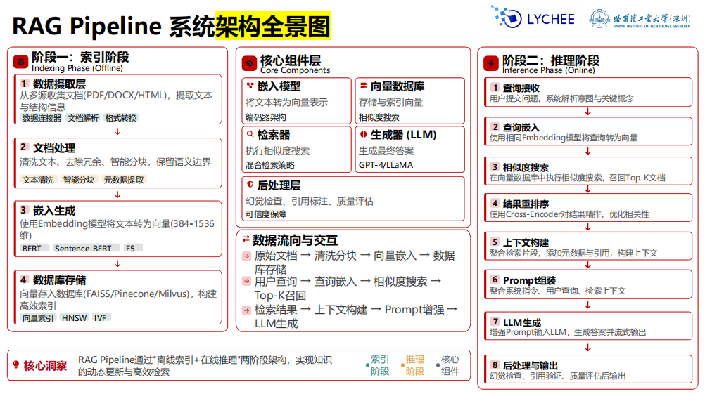
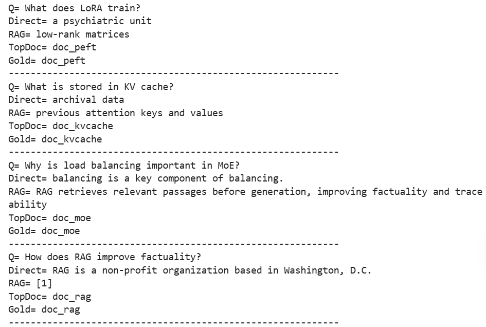

# RAG检索增强生成

是将**信息检索**与**文本生成**深度融合的架构

## 原理

- 稀疏检索：关键词匹配与词频统计
- 稠密检索：词义嵌入向量的相似度匹配
  - 嵌入编码：文本转为低维稠密向量
  - 索引构建：存入向量数据库
  - 相似度检索：余弦相似度，召回Top_k

1. 编码融合生成：问题与检索文档一同输入编码器
2. Prompt拼接生成：将检索片段拼接在用户问题Prompt中

### 整体架构



### 挑战

- 检索准确性问题
  - 稀疏+稠密混合检索
  - 重排序模块
  - 查询扩展与改写
- 多文档融合难度
- 系统效率瓶颈
- 知识时效性与更新
- 可信度与可追溯性
  - 生成、校验
  - 多源验证、置信度评分

## 代码

### 导包

```python
import numpy as np, torch
from sklearn.feature_extraction.text import TfidfVectorizer
from sklearn.metrics.pairwise import cosine_similarity
from transformers import AutoTokenizer, AutoModelForSeq2SeqLM
```

### 构建知识库

共六条：

- id
- text

### 文本切块 chunking

词窗口 + overlap（重叠）

```python
def chunk_text(text,chunk_size=24,overlap=6):
    """
    把长文档切分成多个重叠的小文本块（chunk）
    
    - chunk_size:每个chunk最多24单词
    - overlap:相邻重叠6个单词

    Chunk1: 1 2 3 4 5
    Chunk2:       4 5 6 7 8
    Chunk3:             7 8 9 10
    重叠防止被硬生生截断，而导致检索时丢失语义
    """
    w=text.split()
    out=[]
    s=0
    while s<len(w):
        e=min(s+chunk_size,len(w))
        out.append(' '.join(w[s:e]))
        if e==len(w):
            break
        s=e-overlap
    return out

chunks=[]
for d in docs:
    for i,ch in enumerate(chunk_text(d['text'])):
        chunks.append({'chunk_id': f"{d['id']}_c{i}", 'doc_id': d['id'], 'text': ch})

print('chunks=', len(chunks))
print(chunks[0])
```

### 检索器

```python
# 1.向量化器
vec=TfidfVectorizer(ngram_range=(1,2), lowercase=True) # 包含单词和连续两个,全转为小写
X=vec.fit_transform([c['text'] for c in chunks]) # 转换为向量
# X(chunk数量, 词汇表大小)

# 2.检索
def retrieve(q,top_k=3):
    qv=vec.transform([q])
    sims=cosine_similarity(qv,X)[0] # 余弦相似度，数值越大，越相关
    ids=np.argsort(sims)[::-1][:top_k] # 从高到低，找前 top_k个
    out=[]
    for i in ids:
        item=dict(chunks[i])
        item['score']=float(sims[i])
        out.append(item)
    return out

# 3.使用检索
for h in retrieve('How does LoRA reduce parameters?', 3):
    print(h['doc_id'], h['score'])
```

- `doc_peft`： 0.2871094019135437
- `doc_kvcache`： 0.0
- `doc_rag`： 0.0

### 加载生成模型

使用`flan-t5-small`

- tok
- model
- model.eval()

### RAG生成函数

```python
def rag_prompt(q,hits):
    ctx="\n".join([f"[{i+1}] {h['text']}" for i, h in enumerate(hits)])
    return (
        "Answer with retrieved evidence. If insufficient, say insufficient evidence.\n"
        f"Question: {q}\nContext:\n{ctx}\nAnswer:"
    )

@torch.no_grad()
def generate(prompt,max_new_tokens=96):
    x = tok(prompt, return_tensors='pt', truncation=True).to(device)
    y = model.generate(
        **x, 
        max_new_tokens=max_new_tokens, 
        num_beams=4
    )
    return tok.decode(y[0], skip_special_tokens=True).strip()

def rag_answer(q,top_k=3):
    # 找出关联的 chunks
    hits = retrieve(q, top_k)
    # 构造提示词，并输入大模型
    ans = generate(rag_prompt(q, hits))
    return {'q': q, 'ans': ans, 'hits': hits}    
```

### 基线

无检索直接回答

```python
def direct_answer(q):
    return generate(f"Answer briefly.\nQuestion: {q}\nAnswer:")

q = 'Why is retrieval useful in RAG?'
print('direct=', direct_answer(q))

out = rag_answer(q, 3)
print('rag=', out['ans'])

# 打印 Top-k hits
for h in out['hits']: print(h['doc_id'], h['score'])
```

- direct = retrieval is useful in RAG.
- rag = improving factuality and traceability
- doc_rag：0.23400230699614644
- doc_kvcache：0.0
- doc_moe：0.0

### 评测集



### 检索指标

命中率：`Hit@k`，命中则+1

```python
if x['gold'] in doc_ids: hit += 1
```

### 可解释证明

打印出分数和文本


