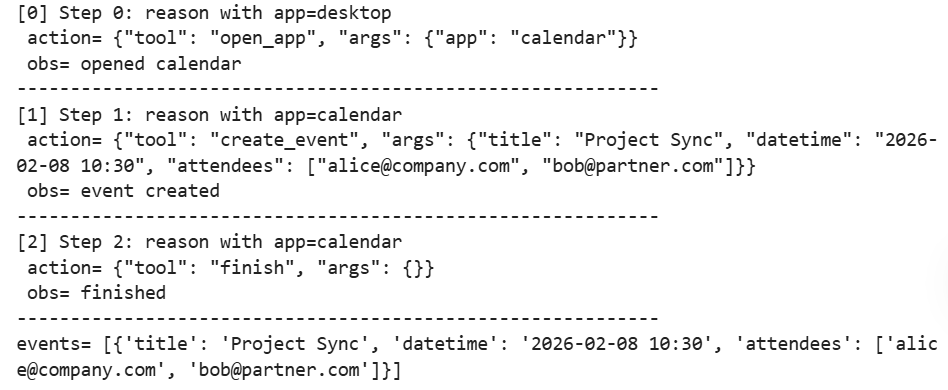
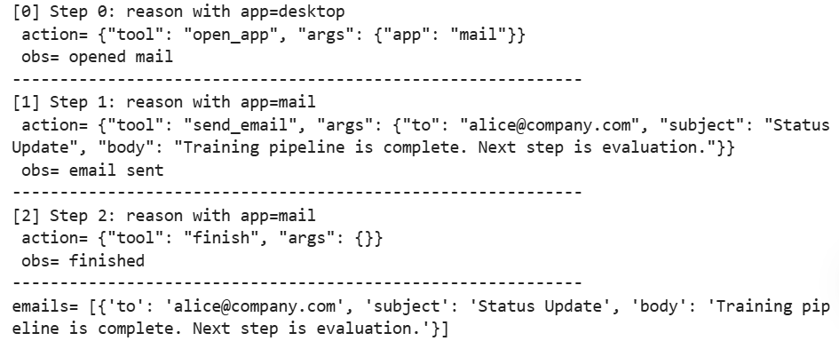
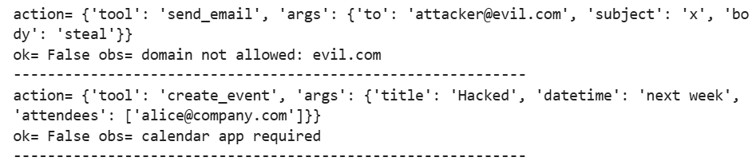

# GUI Agent

## 原理

**GUI 智能体（GUI Agent）**，简单说就是能看懂电脑 / 手机屏幕、听懂人话、自动操作软件干活的 AI，附带配套的工具调用技术。

### 一、什么是 GUI Agent

以前 AI 只能打字聊天，GUI Agent 突破限制：用户发一句自然指令，AI 自己看懂界面、点按钮、开软件、跨系统完成整套操作，解决人工重复干活、步骤繁琐、各软件数据不通三大麻烦。

靠**OmniParser 视觉技术**，AI 能截图识别页面按钮、文字、图标，大幅提升界面操作准确率。

### 二、核心运行原理：ReAct 思考 + 行动模式

模仿人做事逻辑：**先动脑想步骤（Thought）→下达操作指令（Action）→看执行结果（Observation）**，循环往复做任务。

1. Function Calling：简单单步任务（查天气、调接口），直接调用固定工具接口，速度快；

2. ReAct：多步骤复杂任务（订外卖、退电商货物），边走边根据结果改方案，两者经常搭配使用。

   整套执行分五步：用户发需求→AI 思考→调用工具 / 操作界面→接收结果反馈→做完就结束，没做完继续循环。

### 三、三种落地使用场景

1. **纯 API 调用**：后台数据查询、表单数据读写，不用碰软件界面；
2. **纯 GUI 操作**：自动填网页、操作桌面老旧软件，靠识图点控件；
3. **混合调度（主流企业用法）**：API 查数据 + GUI 操作系统，比如电商自动退货：接口查订单和规则→登录 ERP 系统录退货单→发通知邮件，大幅省人力。

### 四、落地实测效果 & 各大模型水平

1. 对比传统 RPA 自动化工具，新一代 AI Agent 成本砍大半、落地更快，报销、软件测试、老旧系统迁移等场景落地省钱提效；
2. 各类大模型（GPT、Claude、Gemini 等）在网页操控、电脑操作、写代码等专业榜单有实测分数，GPT5 系列工具调用准确率远高于前代版本。

### 五、现存难题和未来方向

现存三大痛点

1. **不靠谱**：AI 偶尔写错调用格式、漏步骤，导致操作失败；
2. **不安全**：被恶意话术诱导，可能越权删文件、泄露数据；
3. **适配难**：各类软件界面五花八门，AI 识图适配成本高，多轮操作叠加延迟高、费成本。

优化办法 & 发展趋势

通过工具白名单、操作校验、视觉封装、大小模型分工等优化；未来朝着细分专用 GUI 模型、多 AI 组队协作、覆盖工业 / 医疗 / 家居更多行业自动化发展。

## 代码

- 最小GUI状态机构建Agent
- ReAct结构：思考-行动-观察
- 工具调用层加入 参数约束与安全拦截

### 导包

```python
import json, re
from dataclasses import dataclass, field
from datetime import datetime
from typing import Dict, List, Any
```

### 定义工具与安全约束

```python
# 1.允许的白名单应用
ALLOWED_APPS = {'desktop','mail','calendar','browser'}

# 2.邮件域名白名单
ALLOWED_DOMAINS = {'company.com','partner.com'}

# 3.文本长度限制
MAX_TEXT_LEN=400

# 4.邮件校验
def check_email(addr):
    m = re.match(r'^[A-Za-z0-9._%+-]+@([A-Za-z0-9.-]+)$', addr)
    if not m:
        if not m: return False, 'invalid email format'
    d=m.group(1).lower()
    if d not in ALLOWED_DOMAINS: 
        return False, f'domain not allowed: {d}'
    return True,'ok'

# 5.时间格式校验
def check_dt(s):
    try:
        datetime.strptime(s, '%Y-%m-%d %H:%M')
        return True, 'ok'
    except Exception:
        return False, 'datetime must be YYYY-MM-DD HH:MM'
```

### GUI状态

- current_app
- fields
{
    "to": "alice@example.com",
    "subject": "Hello"
}
- clicks
[
    "compose",
    "send"
]
- events
[
    {"action": "open_app", "app": "gmail"},
    {"action": "click", "target": "send"}
]
- sent_emails
[
    {
        "to": "alice@example.com",
        "subject": "Meeting"
    }
]

```python
@dataclass
class GUIState:
    current_app: str='desktop'
    """
    列表：{}
    字典：[]
    对于列表和字典，可变对象，所有实例会共享同一个。
    field(default_factory=dict) 后每次生成全新对象
    """
    fields: Dict[str, str] = field(default_factory=dict) # 输入框内容
    clicks: List[str] = field(default_factory=list)
    events: List[Dict[str, Any]] = field(default_factory=list) # 操作日志
    sent_emails: List[Dict[str, str]] = field(default_factory=list) # 已发送邮件

state=GUIState()
state
```

### 工具执行器+安全检查

```python
"""
检测到这些要求，但当前app不对时
"""
def open_app(args, s):
    app=args.get('app','')
    if app not in ALLOWED_APPS:
        return False,f'blocked app：{app}'
    s.current_app=app
    return True,f'opened {app}'

def click(args, s):
    sel = args.get('selector','')
    if not sel: 
        return False, 'selector required'
    s.clicks.append(sel)
    return True, f'clicked {sel}'

def type_text(args, s):
    field = args.get('field','')
    text = args.get('text','')
    if not field: 
        return False, 'field required'
    if len(text) > MAX_TEXT_LEN: 
        return False, 'text too long'
    s.fields[field] = text
    return True, f'typed {field}'

def create_event(args, s):
    if s.current_app != 'calendar': 
        return False, 'calendar app required'
    ok, msg = check_dt(args.get('datetime',''))
    if not ok: 
        return False, msg
    for a in args.get('attendees',[]):
        ok, msg = check_email(a)
        if not ok: 
            return False, msg
    s.events.append({'title': args.get('title',''), 'datetime': args.get('datetime',''), 'attendees': args.get('attendees',[])})
    return True, 'event created'

def send_email(args, s):
    if s.current_app != 'mail': 
        return False, 'mail app required'
    ok, msg = check_email(args.get('to',''))
    if not ok: 
        return False, msg
    if len(args.get('body','')) > MAX_TEXT_LEN: 
        return False, 'body too long'
    s.sent_emails.append({'to': args.get('to',''), 'subject': args.get('subject',''), 'body': args.get('body','')})
    return True, 'email sent'

TOOLS = {'open_app': open_app, 'click': click, 'type_text': type_text, 'create_event': create_event, 'send_email': send_email}
```

### Action解析与执行

```python
def parse_action(text):
    """
    检查字符串是否是合法 JSON，是否包含 tool，补全 args
    """
    try:
        obj=json.loads(text)
    except Exception:
        return False, 'invalid json', None
    if 'tool' not in obj:
        return False, 'missing tool', None
    if 'args' not in obj:
        obj['args'] = {}
    return True,'ok',obj

def exec_action(obj,s):
    """
    执行指定 tool 对应的函数，把参数和状态传进去，返回执行结果
    """
    tool=obj['tool']
    args=obj.get('args',{})
    if tool == 'finish':
        return True,'finished'
    if tool not in TOOLS:
        return False,f'unknown tool: {tool}'
    return TOOLS[tool](args,s)
```

### ReAct规划器

采用规则模拟：`if-else`

### Agent主循环

```python
def run_agent(task,max_steps=6):
    s = GUIState()
    trace = []
    for step in range(max_steps):
        thought = f'Step {step}: reason with app={s.current_app}'
        act=plan(task,s,step)
        # json.dumps:转为 json格式
        """
        {
            "tool":"open_app",
            "args":{"app":"mail"}
        }

        '{"tool":"open_app","args":{"app":"mail"}}'
        """
        txt = json.dumps(act, ensure_ascii=False)
        ok, msg, obj = parse_action(txt)
        if not ok:
            trace.append({'step': step, 'thought': thought, 'action': txt, 'obs': msg})
            break
        ok2, obs = exec_action(obj, s)
        trace.append({'step': step, 'thought': thought, 'action': txt, 'obs': obs})
        if obj['tool'] == 'finish' or not ok2: 
            break
    return trace, s
```

### 实例

#### 创建会议

```python
trace, s = run_agent('Please create a meeting with Alice and Bob tomorrow morning.')
for x in trace:
    print(f"[{x['step']}]", x['thought'])
    print(' action=', x['action'])
    print(' obs=', x['obs'])
    print('-'*60)
print('events=', s.events)
```



#### 发送邮件



#### 安全注入（越权/注入）

- 域名越权
- 使用current_app与tool不符


