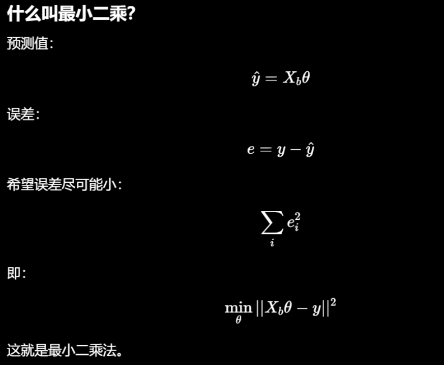
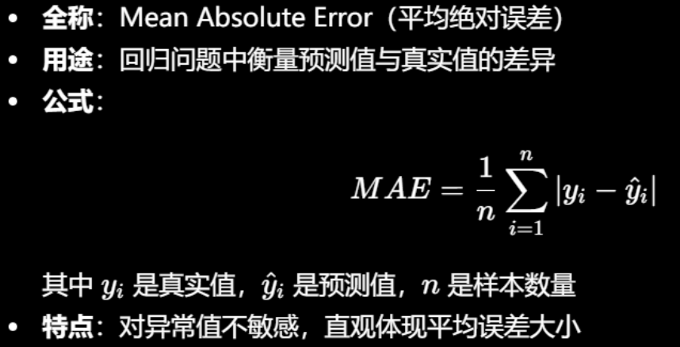

# AI for Science

## 原理

构建 **数据提取 - 科学发现 - 优化求解** 的完整科研闭环，减少试错，提高研发效率。

### 四大核心任务类型

- 预测型任务：构建 “输入 - 结果” 映射关系。将科研问题转化为可学习的映射模型，用 AI 预测替代高成本实验与仿真。
- 生成与设计型任务：主动产出全新候选方案。主动设计新对象与实验方案，需同时满足多目标约束。
- 因果与机理型任务：从相关性挖掘科学机理。
- 自动化实验闭环：将 AI 决策与自动化实验平台结合，形成设计 - 执行 - 数据回流 - 模型更新的循环系统。

### 科学数据体系：类型、差异与预处理

- 科学数据与互联网数据
- AI4S常见数据形态及表征
- 科学数据预处理要点

### 模型架构选型：依据数据特征匹配模型、

- **序列数据（蛋白、基因、SMILES）**：选用**Transformer**，依托注意力机制解决长距离依赖问题。
- **图结构数据（分子图、知识图谱）**：选用**GNN（图神经网络）**，通过消息传递聚合节点与邻域信息。
- **图像数据**：传统图像用**CNN**捕捉局部特征；复杂全局图像用 **ViT（视觉 Transformer）** 建模全局关系。
- **多模态数据（融合文本、图像、谱图、结构）**：采用**多模态融合模型**，通过跨注意力实现多源信息对齐与联合推理。

### 主流生成式模型（用于分子 / 材料 / 序列设计）

- **VAE（变分自编码器）**：将离散结构映射为连续隐空间，把离散组合问题转为连续优化，支持结构插值与局部编辑。
- **扩散模型（Diffusion Model）**：通过逐步去噪生成结构，擅长打造精细、符合物理 / 化学约束的多尺度构型。
- **自回归模型**：将结构转为序列逐一生成，优势是**强可控性**，可嵌入领域规则、限定结构片段，实现条件化生成。

## 代码

- AI4S的基础工作流

  - 流程：数据 - 特征 - 训练 - 评估 - 结构化抽取（可选LLM）

- 简单特征构建科学属性预测的基线模型

  - 根据化学公式，转换计数

  - 向量化后的矩阵，并得到材料对应的能带宽度

  - 训练最小基线模型，使用最小二乘

    

    

    ```python
    # 加偏置项后做最小二乘
    Xb = np.c_[np.ones(len(X_train)), X_train] # 添加全为 1的偏置项，c_按列拼接
    """
    用最小二乘法（Least Squares）求出线性回归的参数 θ
    Xb @ θ ≈ y_train
    """
    theta, *_ = np.linalg.lstsq(Xb, y_train, rcond=None) 
    
    # 预测 
    Xb_test = np.c_[np.ones(len(X_test)), X_test] 
    y_pred = Xb_test @ theta 
    
    mae = np.mean(np.abs(y_pred - y_test)) 
    ```

- LLM进行科学文本结构化抽取

  - 使用规则提取
  - 使用LLM大模型


