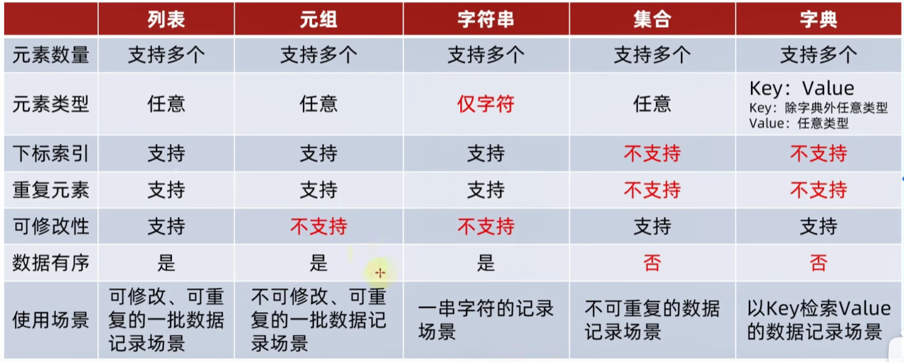
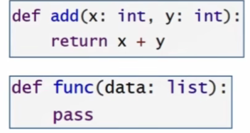
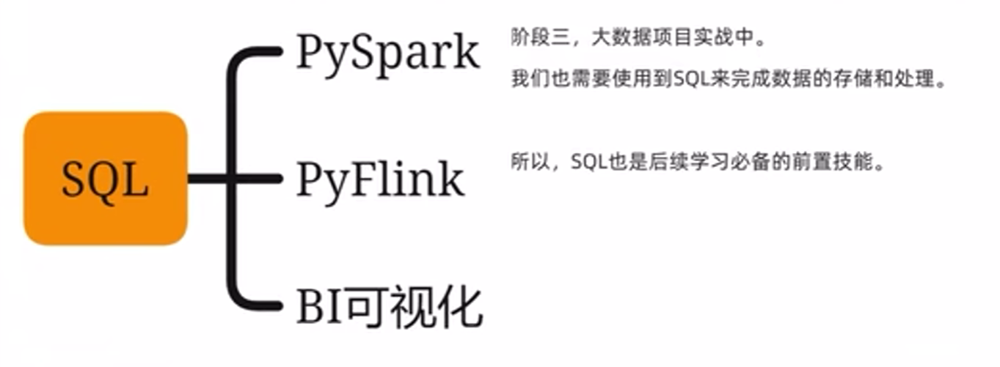
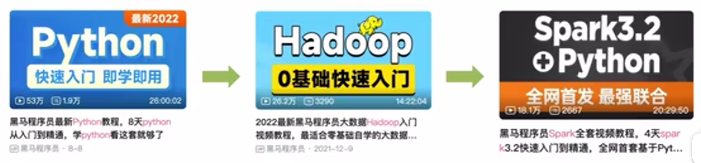

### Python_note

pycharm的便捷方式：

1. `alt+shift+alt+鼠标左键`
2. `ctrl+home`光标移到第一行
3. `ctrl+end`光标移到最后一行
4. `ctrl+g`输入要跳转的行数

#### 字符串格式化

```python
message = "Python是%s的编程语言，能让我们%s" %(num1, num2)
```

```python
print(f"我是{name}")
```

#### 精度控制

```python
print("数字11.345宽度限制7，小鼠精度2，结果：%7.3f" % num)
```

#### 输入

```
name = input("你是谁？") # 输入的都是字符串
```

`List`（列表）有序的可变序列

`Tuple`（元组）有序的不可变序列

`Set`（集合）无序不重复集合

`Dictionary`（字典）无需Key-Value集合

#### 条件、循环语句

```python
"""
条件
"""
if a>b :
	# 缩进
elif a<b:
    # 缩进
else:
    # 缩进
    
"""
循环
"""
while i < 100:
    # 缩进
```

可嵌套，保持缩进即可

```python
import random
num = random.randint(1,100) # 随机生成1-100的整数
```

```python
name = "it"
for i in name:
	# 缩进
    
range(num1, num2, step) # 序列，步长
```

#### 函数说明文档规范

```python
def func(x, y):
    """
    函数说明
    :param x:形参x的说明
    :param y:形参y的说明
    :return:返回值的说明
    """
```

#### 全局

```py
# global 关键字声明是全局变量
global x
```

#### 容器常用函数

如果要定义任何空的容器，就用他们的名字 `set_empty = set()`

##### 序列

< 列表、元组、字符串 > -- 序列

可以使用切片

```python
str[::2] # 从头到尾，步长为2
list[::-1] # 相当于反转
```

##### 列表

`list = [1,2,3]`

特性：

1. 上限 2**63-1
2. 混装
3. 有序
4. 允许重复
5. 可以修改

```python
# 查找下标索引
list.index(元素)
# 修改特定下标索引的值
list[0] = 1
# 指定下标插入新元素
list.insert(1,"best")
# 追加
list.append(元素)
# 追加新列表
mylist2 = [1,2,3]
list.extend(mylist2)
# 删除元素
del list[2] -- 删除元素
element = list.pop(下标) -- 删除同时，取出
# 删除元素在列表第一个匹配项
list.remove(元素)
# 清空列表
list.clear()
# 统计列表内某元素的数量
list.count(元素)
# 统计全部元素数量
len(list)
```

##### 元组

tuple = (1, 2, 3)

特性：

1. 不可修改
2. 如果是元组里嵌套了List，则可以修改

```python
# 查找下标索引
list.index(元素)
# 统计列表内某元素的数量
list.count(元素)
# 统计全部元素数量
len(list)
```

##### 字符串

`item = "hello"`

特性：

1. 无法修改
2. 只能存储字符串

```python
# index
# 替换
new_str = str.replace() -- 是一个新字符串
# 分割，存入列表
list = str.split(" ")
# 去掉前后空格
str.strip()
# 去掉前后指定字符串
str.strip("12") -- 按照单个字符，都会去掉
# count
# len
```

##### 集合

`set = {1,2,3}`

特性：

1. 无序 （不支持下标访问）
2. 允许修改
3. 去重

```python
# 添加
set.add()
# 移除元素
set.remove(元素)
# 清空
set.claer()
# 随机取出一个元素
set.pop()
# 取出两个集合的差集
集合1.difference(集合2) -- 集合1，2保持不变，得到一个新集合
# 消除两个集合的差集
集合1.difference_update -- 集合1修改，集合2保持不变
# 两个集合合并
集合1.union(集合2) -- 得到新集合
# len()
# 不支持下标索引，不能用while
```

##### 字典

`dict = {"苏嘉莉":99, "苏小弟":98}`

特性：

1. 不能用下标，但能用Key，不能while
2. 重复后，新盖旧
3. 可以是任意数据类型，但Key不能是字典

```python
# 可以取出Value
dict[Key]
# 新增和修改
dict[Key] = Value
# 删除
dict.pop(Key)
# clear
# 获取全部Key
dict.keys()
# len()
```



##### 通用操作

```python
# 字典只看Key
max()
min()
# 通用转换
list()
str()
tuple()
set()
# 字典转换其他，除了字符串时其他的Value都丢失
# 排序 从小到大 都会放入列表中 字典的Value丢失
sorted(容器,[reverse = True]) -- 加上True就会从大到小
```

#### 函数

##### 返回值

```python
def test_return():
    return 1, 2
x, y = test_return()
```

1. 支持不同类型数据返回

##### 传参

1. 位置参数在前，且匹配参数顺序

###### 不定长

```python
# 所有参数都会被args收集，合并为元组，位置传递
def user_info(*args)
# 参数时"键=值"形式下，组成字典
def user_info(**kwargs)
```

###### 函数参数

函数也可作为参数传入，计算逻辑的传递，而非数据的传递。

###### 匿名函数

特性：

1. 只能单行函数体
2. 只能使用一次

```python
test_func(lambda x,y: x+y)
```

#### 文件

##### 读取

1. r 只读，默认
2. w 写入
3. a 追加

```python
open(文件名/路径, 'r', encoding="UTF-8")
```

文件不存在会创造文件

```python
# 读取
f.read(num) # num是长度
f.readlines() # 一次性读取，返回列表，每行数据一个元素
f.readline() # 一次读取一行
f.close()

with open("p.txt","r") as f:
    f.readlines()
# 自动关闭
```

##### 写入

```python
f.open()
f.write("内容") # 内容写入
f.flush()

# f.close内置了flush
```

#### 异常

```python
try:
	pass
except:
	pass

# 指定异常
try:
    pass
except (NameError,ZeroDivsionError) as e: # Exception是全部异常
    print("...")
finally:
    # 无论有没有异常都会执行
```

异常具有传递性，如果最高级最后都没有抛出异常，就会报错。且异常处就不再继续。

#### 模块

```python
# 控制可以用
__all__ = ['test_a'] # 调用模块时，只有test_a可以用

# 只在本模块，用在测试时
if __name__ == '__main__':
    pass
```

#### 包

```python
# python包，里面用__all__来做限制
__init__.py
```

#### JSON

1. 列表内嵌套字典
2. 字典

```python
import json
# python数据转化为json数据
data = json.dumps(data, ensure_ascii=False) # 不转为ascii，否则unicode
# json数据转换为python数据
data = json.loads(data)
```

#### pyecharts

全局配置

```python
line.set_global_opts( # ctrl+p
	title_opts = Title0pts("测试", pos_left="center", pos_botton="1%"),
	legend_opts = Legend0pts(is_show=True),
    toolbox_opts = Toolbox0pts(is_show=True),
    visualmap_opts = VisualMap0pts(is_show=True),
    tooltip_opts = Tooltip0pts(is_show=True),
)
```

#### 类

##### 成员方法

1. `self`必须写
2. 使用`self`来访问类的成员变量

##### 直接传参

1. 自动执行
2. 构造类传入的参数会自动提供给__init__

```python
class student:
    # 可以省略
    name = None
    age = None
    
    def __init__(self, name, age):
        self.name = name
        self.age = age
        
stu = Student("周杰伦", 31)
```

##### 类内置，魔术方法

```python
# print:内存地址->指定字符串
class Student:
    def __str__(self):
        return # 字符串，内容自行定义

stu = Student("周杰伦", 31)
print(stu) # 输出__str__内的内容

# print(stu1 < stu2),规定两个对象比大小的规则（小于和大于）
	def __lt__(self, other):
        return self.age < other.age

stu1 = Student("周杰伦", 31)
stu2 = Student("周杰", 21)
print(stu1 < stu2) # 返回True和False

# 大于/小于 等于
	def __le__(self, ohter):
        return pass
    
# 判断相等，若不使用，则一定False，比较内存地址
	def __eq__(self, other):
        return self.age == other.age
```

##### 封装

```python
__current = None # 私有成员变量
def __keep(self):
    pass # 私有成员方法
```

1. 私有对象/成员方法，我们的类对象没办法直接使用
2. 私有成员，其他成员可以使用

##### 继承

```python
# 单继承
class 类名(父类名):
    类内容体

# 多继承
class 类名(父亲1, 父亲2, ...):
    类内容体
    # 对于同名，谁最先继承，谁优先级最高
```

##### 复写

复写后调用父类同名成员

```python
-- 方法1
# 成员变量：
父类名.成员变量
super().成员变量
# 成员方法
父类名.成员方法(self)
super().成员方法()
```

##### 类型注解

```python
-- 语法1
# 数据
var:int = 10
# 类对象
class Student:
    pass
stu: Student = Student()
# 容器注解
-- 简略
-- 详细
my_list : list[int] = [1, 2, 3]
my_tuple: tuple[str, int ,bool]
my_set: set[int]
my_dict: dict[str, int]

-- 语法2
# type:类型
```

1. 元组类型详细注解，需要每个元素都标记出来
2. 字典类型详细注解，需要2个类型
3. 无法直接看出变量类型才需要



```python
def func(data:list) -> list: # data为list形参，返回值为list
    pass
```

定义联合类型注解

```python
from typing import Union
my_list: list[Union[str, int]] = [1, "list"]

def func(data: Union[int, str]) -> Union[int, str]:
```

###### 多态

###### 抽象类

父类用pass定义抽象方法，在子类实现

```python
class AC:
    def cool_wind(self):
        """制冷"""
        pass
    def hot_wind(self):
        """制热"""
        pass
    def swing_l_r(self):
        """左右摇摆"""
        pass
    
class Midea_AC(AC):
    def cool_wind(self):
        print("美的空调制冷")
    
    def hot_wind(self):
        print("美的空调制热")
        
    def swing_l_r(self):
        print("美的空调左右摆风")
        
class GREE_AC(AC):
    def cool_wind(self):
        print("格力空调制冷")
    
    def hot_wind(self):
        print("格力空调制热")
        
    def swing_l_r(self):
        print("格力空调左右摆风")
        
def make_cool(ac:AC):
    ac.cool_wind()
    
midea_ac = Midea_AC()
gree_ac = GREE_AC()

make_cool(midea_ac)
make_cool(gree_ac)
```

### SQL



1. 数据定义：DDL
   - 库 / 表 创建删除
2. 数据操纵：DML
   - 数据 新增、删除、修改
3. 数据控制：DCL
   - 用户 新增、删除；密码修改；权限管理
4. 数据查询：DQL
   - 查询和计算

### Python - - 数据库

```python
# 非查询性质
from pymysql import Connection

conn = Connection(
    host='localhost',
    port=3306,
    user='root',
    password='Su.040121'
)
# print(conn.get_server_info())
cursor = conn.cursor()
conn.select_db("data")
cursor.execute("CREATE TABLE test_pymysql(id INT, info VARCHAR(255))")
conn.close()
```

```python
# 查询性质

from pymysql import Connection

conn = Connection(
    host='localhost',
    port=3306,
    user='root',
    password='Su.040121'
)
cursor = conn.cursor()
conn.select_db("data")
cursor.execute("SELECT * FROM 留存率") # 执行SQL语句

# 获取查询结果
results: tuple = cursor.fetchall() # 得到全部的查询结果，元组
for r in results:
    print(r)
    
conn.close()
```

`pymysql`进行数据更改的`SQL`语句需要提交更改，通过代码来"确认"。

```python
-- 方法1
conn.execute(插入语句)
conn.commit() # 通过commit确认

-- 方法2
conn = Connection(
	...
    autocommit = True # 设置自动提交
)
```

## PySpark

1. 进行数据处理
2. 提交到Spark集群进行分布式集群计算



编程模型

1. 数据输入
   - `SparkContext`进行数据读取
2. 数据处理计算
   - 读取数据转换为`RDD`对象，调用`RDD`的成员方法完成计算
3. 数据输出
   - 调用`RDD`的数据输出相关成员方法，输出到`list、tuple、dict、txt`和`database`里面