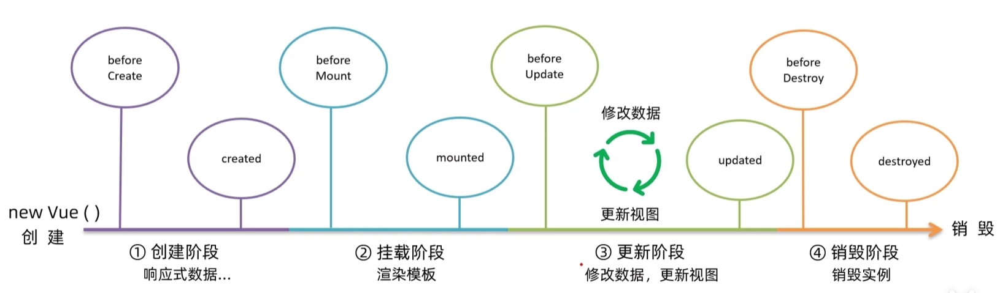
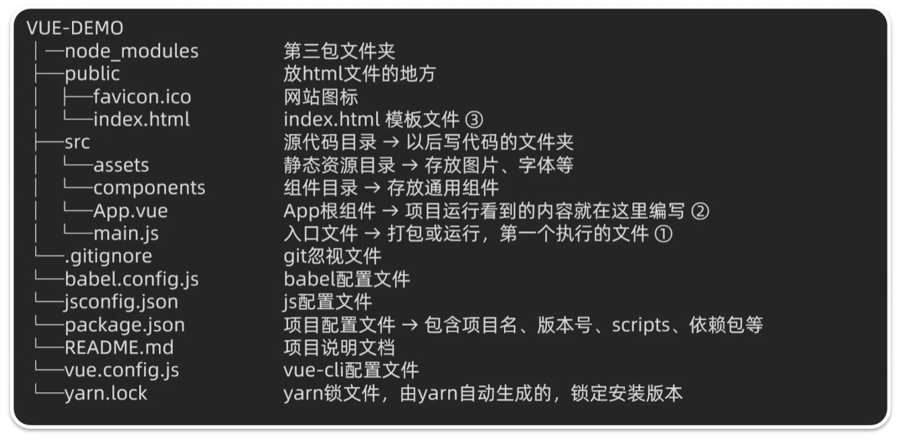
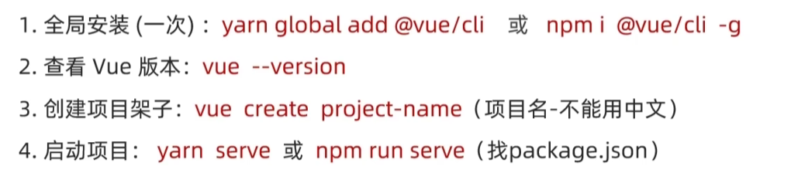
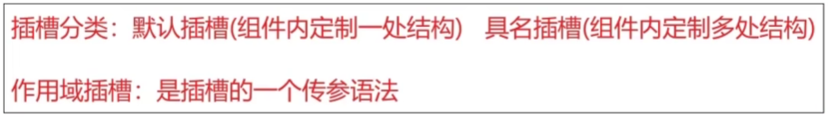
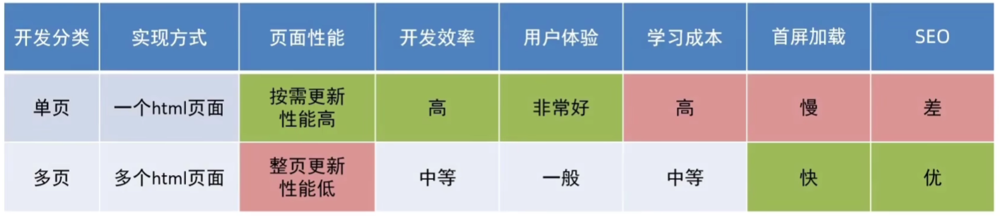

渐进式框架

10.1—10.13，学习了半个月，Vue3 快速入门和 Vue2 基础大体学完了。应该还会有部分补充，Vue3 实操和项目。

## 遇到的问题

### 启动错误

```
PS D:\桌面\Vue\day04\day04\准备代码\08-事件总线-扩展> npm run serve  > day04@0.1.0 serve > vue-cli-service serve  'vue-cli-service' 不是内部或外部命令，也不是可运行的程序
```

解决方法

```
node -v
vue --version
-- 查看版本
npm install @vue/cli-service --save-dev
-- 安装核心服务模块
npm run serve
-- 启动服务
```

### 不同符号

```js
alert(`姓名: ${item.name} 年纪: ${item.age}`);
// 模板字面量：使用反引号 ` 包裹字符串，可以在其中嵌入变量或表达式。
```

## 单文件组件

```vue
<script setup> // js逻辑
import { ref } from 'vue'
const count = ref(0)
</script>

<template> // Vue2特性：有且只有一个根元素
  <button @click="count++">Count is: {{ count }}</button>
</template>

<style scoped> // 可以用lang="less"
button {
  font-weight: bold;
}
</style>
```

## `API`风格

### 选项式`API`

包含多个选项的对象来描述组件的逻辑，选项所定义的数学会暴露在函数内部上，指向当前的组件实例。

```vue
<script>
export default {
  // data() 返回的属性将会成为响应式的状态
  // 并且暴露在 `this` 上
  data() {
    return {
      count: 0
    }
  },

  // methods 是一些用来更改状态与触发更新的函数
  // 它们可以在模板中作为事件处理器绑定
  methods: {
    increment() {
      this.count++
    }
  },

  // 生命周期钩子会在组件生命周期的各个不同阶段被调用
  // 例如这个函数就会在组件挂载完成后被调用
  mounted() {
    console.log(`The initial count is ${this.count}.`)
  }
}
</script>

<template>
  <button @click="increment">Count is: {{ count }}</button>
</template>
```

### 组合式`API`

导入的`API`函数描述组件逻辑，与`<script setup>`搭配

```vue
<script setup>
import { ref, onMounted } from 'vue'

// 响应式状态
const count = ref(0)

// 用来修改状态、触发更新的函数
function increment() {
  count.value++
}

// 生命周期钩子
onMounted(() => {
  console.log(`The initial count is ${count.value}.`)
})
</script>

<template>
  <button @click="increment">Count is: {{ count }}</button>
</template>
```

- 不需要构建工具/低复杂度场景下，使用选项式`API`
- 构建完整的单页应用，使用组合式`API+`单文件组件

## 基础代码

### 声明式渲染

- `reactive()`只适用于对象（Map和Set）
- `ref()`可以接受任何值类型，`.value`返回内部数值

```vue
<script setup>
import { reactive, ref } from 'vue'

const counter = reactive({ count: 0 })
const message = ref('Hello World!')
</script>

<template>
  <h1>{{ message }}</h1>
  <p>Count is: {{ counter.count }}</p>
</template>

// 倒装
{{ me.split('').reverse().join('') }}
```

### Attribute绑定

双大括号只适用文本插值，给`attribute`绑定动态值，使用`v-bind`指令

```vue
<div :id="dynamicId"></div>
```

示例

```vue
<script setup>
import { ref } from 'vue'

const titleClass = ref('title')
</script>

<template>
  <h1 :class="titleClass">Make me red</h1>
</template>

<style>
.title {
  color: red;
}
</style>
```

### 事件监听

```vue
<button @click="increment">{{ count }}</button>
```

示例

```vue
<script setup>
import { ref } from 'vue'

const count = ref(0)

function increment() {
  count.value++
}
</script>

<template>
  <button @click="increment">Count is: {{ count }}</button>
</template>
```

### 表单绑定

```vue
<input v-model="text">
```

示例

```vue
<script setup>
import { ref } from 'vue'

const text = ref('')
</script>

<template>
  <input v-model="text" placeholder="Type here">
  <p>{{ text }}</p>
</template>
```

### 条件渲染

```vue
<h1 v-if="awesome">Vue is awesome!</h1>
<h1 v-else>Oh no 😢</h1>
```

示例

```vue
<script setup>
import { ref } from 'vue'

const awesome = ref(true)

function toggle() {
  awesome.value = !awesome.value
}
</script>

<template>
  <button @click="toggle">Toggle</button>
  <h1 v-if="awesome">Vue is awesome!</h1>
  <h1 v-else>Oh no 😢</h1>
</template>
```

### 列表渲染

```vue
// <template>
<ul>
  <li v-for="todo in todos" :key="todo.id">
    {{ todo.text }}
  </li>
</ul>

//</script> -- function 
// 源数组上调用变更方法
todos.value.push(newTodo)
// 使用新数组代替原数组
todos.value = todos.value.filter(/* ... */)
```

示例

```vue
<script setup>
import { ref } from 'vue'

// 给每个 todo 对象一个唯一的 id
let id = 0

const newTodo = ref('')
const todos = ref([
  { id: id++, text: 'Learn HTML' },
  { id: id++, text: 'Learn JavaScript' },
  { id: id++, text: 'Learn Vue' }
])

function addTodo() {
  todos.value.push({ id: id++, text: newTodo.value })
  newTodo.value = ''
}

function removeTodo(todo) {
  todos.value = todos.value.filter((t) => t !== todo)
}
</script>

<template>
  <form @submit.prevent="addTodo">
    <input v-model="newTodo" required placeholder="new todo">
    <button>Add Todo</button>
  </form>
  <ul>
    <li v-for="todo in todos" :key="todo.id">
      {{ todo.text }}
      <button @click="removeTodo(todo)">X</button>
    </li>
  </ul>
</template>
```

### 计算属性

它可以让我们创建一个计算属性 `ref`，这个` ref` 会动态地根据其他响应式数据源来计算其 `.value`

```vue
import { ref, computed } from 'vue'

const hideCompleted = ref(false)
const todos = ref([
  /* ... */
])

const filteredTodos = computed(() => {
  return hideCompleted.value
    ? todos.value.filter(t => !t.done) // Filter out completed todos
    : todos.value;
})
```

示例

```vue
<script setup>
import { ref } from 'vue'

let id = 0

const newTodo = ref('')
const hideCompleted = ref(false)
const todos = ref([
  { id: id++, text: 'Learn HTML', done: true },
  { id: id++, text: 'Learn JavaScript', done: true },
  { id: id++, text: 'Learn Vue', done: false }
])

function addTodo() {
  todos.value.push({ id: id++, text: newTodo.value, done: false })
  newTodo.value = ''
}

function removeTodo(todo) {
  todos.value = todos.value.filter((t) => t !== todo)
}
</script>

<template>
  <form @submit.prevent="addTodo">
    <input v-model="newTodo" required placeholder="new todo">
    <button>Add Todo</button>
  </form>
  <ul>
    <li v-for="todo in todos" :key="todo.id">
      <input type="checkbox" v-model="todo.done">
      <span :class="{ done: todo.done }">{{ todo.text }}</span>
      <button @click="removeTodo(todo)">X</button>
    </li>
  </ul>
  <button @click="hideCompleted = !hideCompleted">
    {{ hideCompleted ? 'Show all' : 'Hide completed' }}
  </button>
</template>

<style>
.done {
  text-decoration: line-through;
}
</style>
```

### 生命周期和模块引用

```vue
//模块引用
<p ref="pElementRef">hello</p>
// 访问引用
const pElementRef = ref(null) //当执行时，DOM元素还不存在，为null

//进行组件挂载
import { onMounted } from 'vue'

onMounted(() => {
  // 此时组件已经挂载。
})
```

示例

```vue
<script setup>
import { ref, onMounted } from 'vue'

const pElementRef = ref(null)
onMounted(()=>{
  pElementRef.value.textContent = "nihao"
})
</script>

<template>
  <p ref="pElementRef">Hello</p>
</template>
```

### 侦听器

响应执行一些“副作用”

```vue
import { ref, watch } from 'vue'

const count = ref(0)

watch(count, (newCount) => {
  // 没错，console.log() 是一个副作用
  console.log(`new count is: ${newCount}`)
})
```

示例

当 ID 改变时抓取新的数据。该组件被挂载时，会从模拟 API 中抓取 todo 数据，同时还有一个按钮可以改变要抓取的 todo 的 ID。现在，尝试实现一个侦听器，使得组件能够在按钮被点击时抓取新的 todo 项目

```vue
<script setup>
import { ref, watch } from 'vue'

const todoId = ref(1)
const todoData = ref(null)

async function fetchData() {
  todoData.value = null
  const res = await fetch(
    `https://jsonplaceholder.typicode.com/todos/${todoId.value}`
  )
  todoData.value = await res.json()
}

fetchData()

watch(todoId, fetchData)
</script>

<template>
  <p>Todo id: {{ todoId }}</p>
  <button @click="todoId++" :disabled="!todoData">Fetch next todo</button>
  <p v-if="!todoData">Loading...</p>
  <pre v-else>{{ todoData }}</pre>
</template>
```

### 组件

父组件可以在模板中渲染另一个组件作为子组件

```vue
// 导入
import ChildComp from './ChildComp.vue'

// 使用
<ChildComp />
```

示例

```vue
<script setup>
import ChildComp from './ChildComp.vue'
</script>

<template>
  <!-- render child component -->
  <ChildComp />
</template>
```

### props

可以通过props从父组件接受动态数据

```vue
// 声明所接受的props
<script setup>
const props = defineProps({ //编译时宏
    msg: String
})
</script>
```

`msg prop` 可以在子组件的模板中使用，通过`defineProps()`返回的对象，在`javaScript`使用

父组件传递给`props`，传递动态值，使用`v-bind`  

```vue
<ChildComp :msg="greeting" />
```

示例

```vue
<script setup>
import { ref } from 'vue'
import ChildComp from './ChildComp.vue'

const greeting = ref('Hello from parent')
</script>

<template>
  <ChildComp :msg="greeting"/>
</template>
```

### Emits

向父组件触发时间

```vue
<script setup>
// 声明触发的事件
const emit = defineEmits(['response'])

// 带参数触发
emit('response', 'hello from child')
</script>
```

第一个参数是事件的名称，其他所有参数传给事件监听器。父组件用 `v-on`监听子组件触发的事件

示例

```vue
<script setup>
import { ref } from 'vue'
import ChildComp from './ChildComp.vue'

const childMsg = ref('No child msg yet')
</script>

<template>
  <ChildComp @response="(msg) => childMsg = msg"/>
  <p>{{ childMsg }}</p>
</template>
```

### 插槽

插槽 `(slots)` 将模板片段传递给子组件：

```vue
<ChildComp>
  This is some slot content!
</ChildComp>

//没有传递时
<slot>Fallback content</slot>
```

## `Vue2`基础补充

用于构建用户界面的渐进式框架。

声明式渲染 -- 组件系统 -- 客户端路由`（VueRouter）`-- 大规模状态管理`（Vuex）`-- 构建工具`（Webpack/Vite）`

```vue
<script src="https://cdnjs.cloudflare.com/ajax/libs/vue/2.7.16/vue.js"></script>
```

### 指令

- v-html：动态解析标签
- v-show：显示/隐藏，频繁
- v-if：创建/删除，不频繁
- v-else-if
- v-else
- v-on:事件名="内联语句"，，@事件名
- v-on:事件名="methods中的函数名"，，this
- v-on:事件名="fn(参数1,参数2)"，，可传参
- v-bind:属性名="表达式"，动态设置html的标签属性（src,url,title），，:属性名...
- v-for="(item, index) in 数组"，，item是每一项，index是下标，，后面加key

```vue
<!-- 进行列表清除并更新 -->
this.list = this.list.filter(item => item.id !== id)
```

```vue
<!-- 列表添加在开头 -->
this.content.unshift(
	{
 	id: +new Date(),
    con: this.todoName
 	}
)
```

v-for默认行为会尝试原地修改元素（就地复用），加key作为唯一标识符

### 指令修饰符

```vue
<!-- 键盘回车监听 -->
@keyup.enter

<!-- 去除首尾空格 -->
v-model.trim
<!-- 转数字 -->
v-model.number

<!-- 阻止冒泡，里层执行后，不希望外层执行 -->
@事件名.stop
<!-- 阻止默认行为，原本的无效 -->
@事件名.prevent
```

### 样式控制

对class类名和style行内样式进行控制

``

```vue
<!-- 对象，自主选择添加 -->
<div class="box" :class="{类名1:true, 类名2:false}"></div>
<!-- 数组，全部添加 -->
<div class="box" :class="['类名1'，'类名2']"></div>
```

```vue
<!-- 某个具体属性的动态设置 -->
<div class="box" :style="{CSS属性名1: CSS属性值, CSS属性名2:CSS属性值}"></div>
```

```vue
<td :class="{ red: item.price > 500 }"</td>
```

### model

```vue
checkbox：true or false
radio：name相同，value
select：value
```

### 计算属性

computed 缓存结果， 再次调用，只执行一次

```vue
<div>
    总和：{{ totalCount }}
</div>
<script>
    computed:{
	totalCount(){
	let total = this.list.reduce((sum, item) => sum + item.num ,0 ) //0是求和的起始值，前面是计算逻辑
    return total
}
}
</script>
```

完整写法

```vue
computed:{
计算属性名:{
	get(){
	计算逻辑
	return 结果
	},
	set(修改值){
	修改逻辑
		}
	}
}
```

### 监视

持久化存储

```vue
<script>
    watch:{
        words(newValue){
            //业务逻辑
        }
		'obj.words'(newValue, oldValue){
		// 业务逻辑
		}
}
</script>
```

一些无关不需要渲染的数据，可以直接`this.`对象名，当作当前实例

```vue
<script>
    const app = new Vue({
        el: '#app',
        data: {
            obj:{
                words: ''
            },
            result: '',
        },
        watch:	{
            'obj.words'(newValue){
                clearTimeout(this.timer)
                this.timer = setTimeout(async ()=>{
                    const res = await axios({
                        url:
                        params:	{
                        words: newValue
                    }
                    })
                    this.result = res.data.data
                }, 300)
            }
        }
    })
</script>

```

完整写法 ——> 添加额外配置项

（复杂型深度监视）

```vue
<script>
data: {
    obj: { // 对对象里所有属性都监视
        words: '苹果',
        lang: 'italy'
    },
},
 
watch: {
    数据属性名:{
        deep: true, //深度监视
        immediate: true //立即执行，已进入页面就立刻执行一次
        handler (newValue){
            //业务处理
        }
    }
}
</script>
```

### 生命周期钩子



```vue
// Axios 是一个基于 promise 的网络请求库，可以用于浏览器和 node.js
<script src="https://unpkg.com/axios/dist/axios.min.js"></script>

<script src="https://cdn.jsdelivr.net/npm/axios/dist/axios.min.js"></script>
```

一进入页面就发送请求

```vue
<script>
const app = new Vue(
{
  data: {
	list: []
},
async created(){
    // 1.发送请求
    const res = await axios.get('接口地址')
    // 2.获取数据
    this.list = res.data.data
}  
})
</script>
```

一进入页面，渲染完成后，就出现光标

```vue
// 输入框
<div class="search-box">
	<input type="text" v-model="words" id="inp">
    <button>
        搜索一下
    </button>
</div>

// 进行获取焦点
<script>
	const app = new Vue({
        mounted(){
            document.querySelector('#inp').focus()
        }
    })
</script>
```

### 图表

```vue
item.price.toFixed(2) // 保留两位小数
```

```vue
``和''
``是模板字符串，里面可以快速拼接一些变量和表达式
```

```vue
<script>
// 图表加载
    mounted () {
        this.myChart = echarts.init(document.querySelector('#main'))
        this.myChart.setOption({
            //标题
            title: {
                text: '消费账单列表',
                left: 'center'
            },
            //提示框
            tooltip: {
                trigger: 'item'
            },
            //图例
            legend: {
                top: '5%',
                left: 'center'
            },
            //数据项
            series: [
                {
                    name: '消费账单',
                    type: 'pie',
                    radius: ['40%', '70%'],
                    avoidLabelOverlap: false,
                    itemStyle: {
                        borderRadius: 10,
                        borderColor: '#fff',
                        borderWidth: 2
                    },
                    label: {
                        show: false,
                        position: 'center'
                    },
                    emphasis: {
                        label: {
                            show: true,
                            fontSize: 40,
                            fontWeight: 'bold'
                        }
                    },
                    labelLine: {
                        show: false
                    },
                    data: [
                        // { value: 1048, name: 'Search Engine' },
                        // { value: 735, name: 'Direct' },
                        // { value: 580, name: 'Email' },
                        // { value: 484, name: 'Union Ads' },
                        // { value: 300, name: 'Video Ads' }
                    ]
                }
            ]
        })
    }
// 数据映射
    this.myChart.setOption({
        //数据项
        series: [
            {
                data: this.list.map(item => ({ value: item.price, name: item.name}))
            }
        ]
    })
</script>
```

## 工程化开发

脚手架结构剖析



基础介绍：Vue CLI是Vue官方提供的全局命令工具，快速创建开发Vue的标准化基础架子（集成webpack配置）

### 启动

Vue2



Vue3

创建项目

```
npm create vue@latest
```

安装依赖，启动开发服务器

```
cd <your-project-name>
npm install
npm run dev
```

发布生产环境

```
npm run build
```

### index.html

```vue
<noscript>
	// 兼容没有js的网页，显示提示
</noscript>
<div id="app">
	// 只作为容器
</div>
```

### main.js

根组件

```js
//基于此创建结构渲染index.html
// 1. 导入Vue核心包
import Vue from 'vue'
// 2. 导入App.vue根组件
import App from './App.vue'

// 提示：当前环境（生产 / 开发）
Vue.config.productionTip = false
    
// 3. Vue实例化，提供render方法 -> 基于App.vue创建结构渲染index.html
new Vue({
    render:h =>h(App),
}).$mount('#app')

// 补充：全写
render: (createElement) => {
    return createElemnt(App)
}
```

### App.vue

参考 单文件组件 模块

```vue
<script>
// 导出当前组件的配置项，可提供data、methods、computed、watch、生命周期等
export default
</script>

<style>
    .App{
        
    }
    .App .box{
        
    }
</style>
```

组件格式支持 `less`

1. `lang='less'`开启功能
2. 装包：`yarn add less less-loader`

###  普通组件注册

1. 先创建Vue
2. App.vue 导入组件
3. 使用时候当作`html`使用， `<html></html>`

```vue
<template>
  <div class="App">
    <HmFooter></HmFooter>
  </div>
</template>

<script>
import HmFooter from './components/HmFooter.vue';

export default {
  components: {
    HmFooter: HmFooter
  }
}
</script>

<style>
.App {
  width: 600px;
  height: 700px;
  background-color: #87ceeb;
  margin: 0 auto;
  padding: 20px;
}
</style>
```

### 全局注册

1. 创建Vue
2. `main.js` 中进行全局注册
3. 在需要用的地方当作`html`使用， `<html></html>`

```js
import Vue from 'vue'
import App from './App.vue'
import HmButton from './components/HmButton.vue' // 导入

Vue.config.productionTip = false
// Vue.component(HmButton: HmButton)
Vue.component(HmButton) // 全局注册

new Vue({
  render: h => h(App),
}).$mount('#app')
```

## `VSCODE`组合技能

```
全部折叠-- ctrl+K ctrl+0
全部展开-- ctrl+K ctrl+J
多行选中-- 滑轮往下
多行选择-- 选择多行后按shift
```

###  scoped 和 data

默认状态下是全局样式，影响所有组件。

```vue
<style scoped></style>
```

原理：

1. 当前组件模板元素添加上自定义属性 `data-v-hash` 值
2. `CSS`选择器被自动处理，添加属性选择器

**Data**

格式为函数。保证每个组件实例，维护独立的数据对象。好处是各自独立，修改一个不影响其他。

```vue
<template>
{{ count }}
</template>
<script>
export default{
    data(){
        return{
            count:999
        }
    }
}
</script>
```

### 组件通信

组件间传输数据，单向数据流

#### 父子关系（props & $emit）

父组件通过 `props` 传递给子组件，任意数量和类型

检验：

1. 类型检验
2. 非空检验
3. 默认值
4. 自定义检验

```vue
props: {
	w: {
	type: Number,
	required: true,
	default: 默认值,
	validator(value){
	// 自定义校验逻辑
	return 是否通过校验
		}
	}
}
```

```vue
<template>
  <div id="app">
    我是App组件
    <SonComponent :title="myTitle" :age="age"></SonComponent> <!-- 使用多字词名称 -->
  </div>
</template>

<script>
import SonComponent from './components/MySon.vue' // 导入 Son 组件

export default {
  data() {
    return {
      myTitle: '你好',
      age: 18
    }
  },
  components: {
    SonComponent // 使用多字词名称
  }
}
</script>

<style>
.app {
  width: 600px;
  height: 700px;
  background-color: #87ceeb;
  margin: 0 auto;
  padding: 20px;
}
</style>

```

子组件

```vue
<template>
  <div>
    <h>标题{{ title }}</h>
    <h>年龄{{ age }}</h>
  </div>
</template>

<script>
export default {
  name: 'SonComponent', // 使用多字词名称
  props: ['title','age']
}
</script>

<style>
/* 这里可以添加样式 */
</style>
```

子组件通过 `$emit` 通知父组件修改更新

父组件

```vue
<template>
  <div id="app">
    <!-- 我是App组件 -->
    <MySon :title="myTitle" @changeTitle="ChangeFn"></MySon> 
    <!-- 使用多字词名称 -->
  </div>
</template>

<script>
import SonComponent from './components/MySon.vue' // 导入 Son 组件

export default {
  data() {
    return {
      myTitle: '你好'
    }
  },
  components: {
    MySon :SonComponent // 使用多字词名称
  },
  methods:{
    ChangeFn(newTitle){ // 调用 更新
      this.myTitle = newTitle
    }
  }
}
</script>

<style>
.app {
  width: 600px;
  height: 700px;
  background-color: #87ceeb;
  margin: 0 auto;
  padding: 20px;
}
</style>
```

子组件

```vue
<template>
  <div>
    我是Son组件 {{ title }}
    <button @click="handleClick">修改</button>
  </div>
</template>

<script>
export default {
  name: 'SonComponent', // 使用多字词名称
  props: ['title'],
  methods:{
    handleClick(){
      this.$emit('changeTitle','我是超人') // 使用这个
    }
  }
}
</script>

<style>

</style>
```

补充

```vue
.join()方法就是将array数据中每个元素都转为字符串，用自定义的连接符分割
```

#### 非父子关系

provide & inject 或者 `eventbus`

##### event bus

1. 创建都能访问的事件总线

```vue
-- utils/EventBus.js

import Vue form 'vue'
const Bus = new Vue()
export default Bus
```

2. A组件（接收），监听Bus实例的事件

```vue
created(){
	Bus.$on('sendMsg',(msg) => {
	this.msg = msg
})
}

<template>
    <p>{{msg}}</p>  
</template>

<script>
import Bus from '../utils/EventBus'
export default {
  data() {
    return {
      msg: '',
    }
  },
  created() {
    Bus.$on('sendMsg', (msg) => {
      // console.log(msg)
      this.msg = msg
    })
  },
}
</script>
```

3. B组件（发送），触发Bus实例

```vue
Bus.$emit('sendMsg','消息')

<template>
    <button @click="sendMsgFn">发送消息</button>
</template>

<script>
import Bus from '../utils/EventBus'
export default {
  methods: {
    sendMsgFn() {
      Bus.$emit('sendMsg', '今天天气不错，适合旅游')
    },
  },
}
</script>
```

##### provide & inject（跨层级）

1. 父组件提供数据

```vue
export default{
	provide(){
		return{
			//普通类型
			colot: this.colot
			//复杂类型
			userInfo: this.userInfo
		}
	}
}
```

2. 子孙 inject 取值

```vue
export default{
	inject: ['color','userInfo'],
	created(){
		console.log(this.color, this.userInfo)
	}
}
```

#### 通用方案

`vuex`

### 进阶语法

#### 模块化后双向绑定

`model` 和`.sync`应用，进行子组件和父组件的双向绑定

`v-model`语法糖，本质是 `value + input`

```vue
<template>
	<div id="app">
        <input v-model="msg" type="text">
        
        <input :value="msg" @input="msg = $event.target.value">
    </div>
</template>
```

表单类组件封装

```vue
-- 父
<template>
	<BaseSelect :cityId="selectId" @事件名="selecteId" = $event></BaseSelect>
</template>

-- 子
<select :value-"cityId" @Change="handleChange">
    ...
</select>

<script>
	props:{
        cityId:String
    },
    methods:{
        handleChange(e){
            this.$emit('事件名',e.target.value)
        }
    }
</script>
```

可以使用 `v-model` 代替版

```vue
-- 父
<template>
	<BaseSelect v-model="selectId"></BaseSelect>
</template>

-- 子
<select :value-"value" @Change="handleChange">
    ...
</select>

<script>
	props:{
        value:String // 改为value
    },
    methods:{
        handleChange(e){
            this.$emit('input',e.target.value) //事件名固定为input
        }
    }
</script>
```

`.sync`

特点：属性名可以自定义，本质： 属性名 + @update:属性名

应用场景：封装弹窗类基础组件，visible

```vue
-- 父
<BaseDialog :visible.sync="isShow"></BaseDialog>
-------------------------------------------------------------
<BaseDialog :visible="isShow" @update:visible="isShow = $event"></BaseDialog>
```

```vue
-- 子
<script>
props:{
	visible: Boolean
},
...
this.$emit('update:visible', false)
</script>
```

#### 查找范围

利用 ref 和 $ref 用于获取 `dom` 元素

查找范围从整个页面控制在当前组件内更精确稳定

```vue
<template>
	<div ref="mychart">
        ...
    </div>
</template>

<script>
	mounted(){
        console.log(this.$refs.mychart)
        const myChart = echarts.init(this.$refs.mychart)
        // 替代 document.queryselect
    }
</script>
```

获取组件实例

```vue
-- App.vue

<template>
<BaseForm ref="baseForm"></BaseForm>
</template>

<script>
import BaseForm form './components/BaseForm.vue'

export default{
    data(){
      return{
          
      }  
    },
    methods:{
        handleGet(){
            console.log(this.$refs.baseForm.getValues) // 调用方法
        },
        handleReset(){
            
        }
    }
}
</script>

-- BaseForm.vue

<script>
methods:{
    // 里面的方法都会给App.vue
    getValues(){
        return{
            account: this.account,
            password: this.password
        }
    },
    resetValues(){
        this.account = ''
        this.password = ''
    }
}
</script>
```

#### Vue异步更新

异步更新：适当时机让更新有序的执行。
`$nextTick`：等`DOM`更新后，才会触发执行此方法里的函数体。

```vue
<template>
  <div class="app">
    <div v-if="isShowEdit">
      <input type="text" v-model="editValue" ref="inp" />
      <button>确认</button>
    </div>
    <div v-else>
      <span>{{ title }}</span>
      <button @click="handleEdit">编辑</button>
    </div>
  </div>
</template>

<script>
export default {
  data() {
    return {
      title: '大标题',
      isShowEdit: false,
      editValue: '',
    }
  },
  methods: {
   handleEdit(){
    // 1. 显示输入框 (异步 dom 更新)
    this.isShowEdit = true
    // 2. 让 输入框 获取焦点 (要等dom更新完才能)
    this.$nextTick(() => {
      this.$refs.inp.focus()
    })
   }
  },
}
</script>

<style>
</style>
```

### 自定义指令

v-foucs：自动聚焦
v-loading：控制加载效果
v-lazy：图片加载
...

- 全局
- 局部

```vue
-- 全局(main.js)
Vue.directive('指令名',{
	"inserted" (el){
	//可以对el标签，扩展额外功能
	el.focus()
	}
})

-- 局部(各自的vue)
<script>
export default{
    directives:{
	"指令名":{
	inserted(el){
	// 可以对el标签，扩展额外功能
	el.focus()
		}
	}
}
}
</script>

-- 使用
<input v-指令名 type="text">
```

指令可以获取数值

#### v-color更改颜色

```vue
<template>
<h1 v-color="color1">指令1</h1>
<h2 v-color="color2">指令2</h2>
</template>

<script>
export default{
    data(){
        return{
            color1:'red',
            color2:'green'
        }
    },
    directives:{
        color:{
            inserted(el, binding){
                el.style.color = binding.value
            },
            update(el, binding){
                el.style.color = binding.value
            }
        }
    }
}
</script>
```

#### v-loading

功能：

1. 蒙层，盖在盒子上
2. 数据请求后，loading开启，增加蒙层
3. 数据请求完毕，loading关闭，移除蒙层

实现：

1. 类，移除增加类即可，自定义指令来复用

```vue
<template>
<h1 v-loading="isLoading">指令1</h1>
</template>

<script>
export default{
    data(){
        return{
            list: [],
            isLoading: true
        }
    },
    async created(){
        // 1. 发送请求获取数据
        const res = await axios.get('链接')
        
        setTimeout(() => {
         // 2. 更新到list种，用于页面渲染
            this.list = res.data.data
            this.isLodaing = false
        },2000)
    }
    directives:{
        loading:{
            inserted(el, binding){
                binding.value ? el.classList.add('loading') : el.classList.remove('loading')
            },
            update(el, binding){
                binding.value ? el.classList.add('loading') : el.classList.remove('loading')
            }
        }
    }
}
</script>

<style>
    .loading:before{
        content: '';
        position: absolute;
        left: 0;
        top: 0;
        width: 100%;
        height: 100%;
        background: #fff url('./loading.gif') no-repeat center;
    }
</style>
```

### 插槽

当组件内某一部分结构不确定，想要自定义：使用**插槽**占位封装

```vue
-- App.vue
<template>
<MyDialog>输入需要的内容</MyDialog>
</template>

-- MyDialog.vue
<template>
<div>    
    <slot>默认文本</slot> // 进行占位
</div>
</template>
```

组内有多处不确定的结构，使用**具名插槽**

```vue
-- App.vue
<template>
<MyDialog>
    <template v-slot:head>
	<div>
        我是标题
    </div>
	</template>

    <template #content>
	<div>
        我是内容
    </div>
	</template>

</MyDialog>
</template>

-- MyDialog.vue
<template>
<div>    
    <slot name="head"></slot>
    <slot name="content"></slot>
</div>
</template>
```



**作用域插槽**

```vue
-- App.vue
<template>
  <div>
    <MyTable :data="list">
      <template #default="obj">
        <button @click="del(obj.row.id)">
          删除
        </button>
      </template>
    </MyTable>
    <MyTable :data="list2" #default="obj">
      <button @click="show(obj.row)">查看</button>
    </MyTable>
  </div>
</template>

<script>
import MyTable from './components/MyTable.vue'
export default {
  data () {
    return {
      list: [
        { id: 1, name: '张小花', age: 18 },
        { id: 2, name: '孙大明', age: 19 },
        { id: 3, name: '刘德忠', age: 17 },
      ],
      list2: [
        { id: 1, name: '赵小云', age: 18 },
        { id: 2, name: '刘蓓蓓', age: 19 },
        { id: 3, name: '姜肖泰', age: 17 },
      ]
    }
  },
  components: {
    MyTable
  },
  methods:{
    del(id){
      this.list = this.list.filter(item => item.id !== id)
    },
    show(row){
      alert(`姓名: ${row.name} 年纪: ${row.age}`);
    }
  }
}
</script>
```

```vue
-- MyTable.vue
<template>
  <table class="my-table">
    <thead>
      <tr>
        <th>序号</th>
        <th>姓名</th>
        <th>年纪</th>
        <th>操作</th>
      </tr>
    </thead>
    <tbody>
      <tr v-for="(item, index) in data" :key="item.id">
        <td>{{ index + 1 }}</td>
        <td>{{ item.name }}</td>
        <td>{{ item.age }}</td>
        <td>
          <slot :row="item" msg="测试"></slot>
        </td>
      </tr>
    </tbody>
  </table>
</template>

<script>
export default {
  props: {
    data: Array,
  },
}
</script>

<style scoped>
.my-table {
  width: 450px;
  text-align: center;
  border: 1px solid #ccc;
  font-size: 24px;
  margin: 30px auto;
}
.my-table thead {
  background-color: #1f74ff;
  color: #fff;
}
.my-table thead th {
  font-weight: normal;
}
.my-table thead tr {
  line-height: 40px;
}
.my-table th,
.my-table td {
  border-bottom: 1px solid #ccc;
  border-right: 1px solid #ccc;
}
.my-table td:last-child {
  border-right: none;
}
.my-table tr:last-child td {
  border-bottom: none;
}
.my-table button {
  width: 65px;
  height: 35px;
  font-size: 18px;
  border: 1px solid #ccc;
  outline: none;
  border-radius: 3px;
  cursor: pointer;
  background-color: #ffffff;
  margin-left: 5px;
}
</style>
```

### 路由入门



SEO搜索引擎，搜素引擎性能较差

- 单页面：系统类、内部、文档类、移动端站点
- 多页面：公司官网、电商类网站

页面按需更新：访问路径和组件的对应关系（**路由**）

`VueRouter`插件：修改地址栏路径时，切换显示匹配的组件

版本：233 344

#### 路由基本使用

一、 5个基础步骤：

1. 下载

```
npm add vue-router@3.6.5
```

2. 引入
3. 安装注册
4. 创建路由对象
5. 注入，建立联系

二、 2个核心步骤

1. 创建组件，配置规则（main.js）
2. 配导航和路由出口

```js
-- main.js

import Vue from 'vue'
import App from './App.vue'
import './styles/index.css'
import VueRouter from 'vue-router' // 引入
import Find from './views/Find.vue'
import My from './views/My.vue'
import Friend from './views/Friend.vue'

Vue.use(VueRouter) // 安装注册

const router = new VueRouter({ // 创建路由对象
  routes: [
    {path:'/find', component: Find},
    {path:'/my', component: My},
    {path:'/friend', component: Friend}
  ]
})

Vue.config.productionTip = false

new Vue({
  render: h => h(App),
  router // 注入，建立联系
}).$mount('#app')
```

```vue
-- App.vue

<template>
  <div>
    <div class="footer_wrap">
      <a href="#/find">发现音乐</a>
      <a href="#/my">我的音乐</a>
      <a href="#/friend">朋友</a>
    </div>
    <div class="top">
      <!-- 路由出口 → 匹配的组件所展示的位置 -->
      <router-view></router-view>
    </div>
  </div>
</template>

<script>
export default {};
</script>

<style>
body {
  margin: 0;
  padding: 0;
}
.footer_wrap {
  position: relative;
  left: 0;
  top: 0;
  display: flex;
  width: 100%;
  text-align: center;
  background-color: #333;
  color: #ccc;
}
.footer_wrap a {
  flex: 1;
  text-decoration: none;
  padding: 20px 0;
  line-height: 20px;
  background-color: #333;
  color: #ccc;
  border: 1px solid black;
}
.footer_wrap a:hover {
  background-color: #555;
}
</style>
```

```vue
-- 示例）Find.vue

<template>
    <div>
      <p>发现音乐</p>
      <p>发现音乐</p>
      <p>发现音乐</p>
      <p>发现音乐</p>
    </div>
  </template>
  
  <script>
  export default {
    name: 'FindMusic'
  }
  </script>
  
  <style>
  
  </style>
```

#### 组件分类

- `src/views` 页面组件 - 页面展示 - 配合路由使用
- `src/components` 复用组件 - 展示数据 - 用于复用
