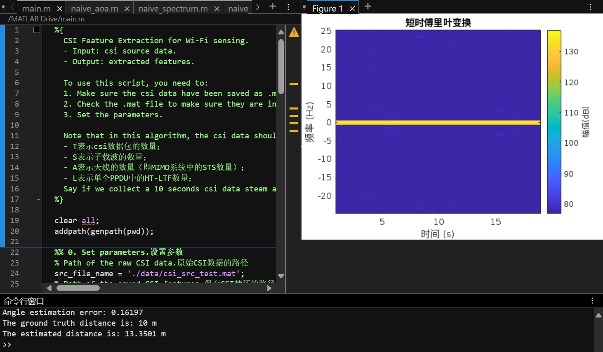
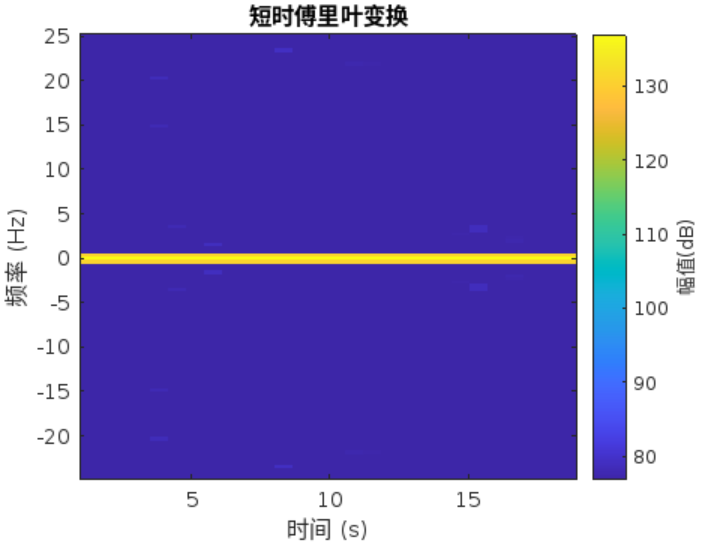

##### 全文使用matlab

#### main

```matlab
%{
  CSI Feature Extraction for Wi-Fi sensing.  
  - Input: csi source data.
  - Output: extracted features.

  To use this script, you need to:
  1. Make sure the csi data have been saved as .mat files.
  2. Check the .mat file to make sure they are in the correct form. 
  3. Set the parameters.
  
  Note that in this algorithm, the csi data should be a 4-D tensor with the size of [T S A L]:
  - T表示csi数据包的数量；
  - S表示子载波的数量；
  - A表示天线的数量（即MIMO系统中的STS数量）；
  - L表示单个PPDU中的HT-LTF数量；
  Say if we collect a 10 seconds csi data steam at 1 kHz sample rate (T = 10 * 1000), from a 3-antenna AP (A = 3),  with 802.11n standard (S = 57 subcarrier), without any extra spatial sounding (L = 1), the data size should be [10000 57 3 1].
%}

clear all;
addpath(genpath(pwd));

%% 0. Set parameters.设置参数
% Path of the raw CSI data.原始CSI数据的路径
src_file_name = './data/csi_src_test.mat';
% Path of the saved CSI features.保存CSI特征的路径
dst_file_name = './data/csi_feature_test.mat';

% Speed of light.光速
global c;
c = physconst('LightSpeed');
% Bandwidth.带宽
global bw;
bw = 20e6;
% Subcarrier frequency.子载波频率
global subcarrier_freq;
subcarrier_freq = linspace(5.8153e9, 5.8347e9, 57);
% Subcarrier wavelength.子载波波长
global subcarrier_lambda;
subcarrier_lambda = c ./ subcarrier_freq;

% Antenna arrangement.天线排列
antenna_loc = [0, 0, 0; 0.0514665, 0, 0; 0, 0.0514665, 0]';
% Set the linear range of the CSI phase, which varies with NIC types.
% 设置CSI相位的线性范围，范围会因NIC类型而异
linear_interval = (20:38)';

%% 1. Read the csi data for calibration and sanitization.
% 读取用于校验和清洗的csi数据
% Load the raw CSI data. 加载原始数据
csi_src = load(src_file_name).csi;      % Raw CSI.

%% 2. Extract wireless features.提取无线特征
% Test example 1: angle/direction estimation with imperfect CSI.
% 用例测试1：使用不完美CSI进行角度/方向估计
[packet_num, subcarrier_num, antenna_num, ~] = size(csi_src);
aoa_mat = naive_aoa(csi_src, antenna_loc, zeros(3, 1));
aoa_gt = [0; 0; 1];
error = mean(acos(aoa_gt' * aoa_mat));
disp("Angle estimation error: " + num2str(error));

% Test example 2: distance estimation with CSI.
% 用CSI进行距离分析
tof_mat = naive_tof(csi_src);
est_dist = mean(tof_mat * c, 'all');
disp("The ground truth distance is: 10 m");
disp("The estimated distance is: " + num2str(est_dist) + " m");

% Test example 3: 
% 频谱分析
sample_rate = 50;
visable = true;
stft_mat = naive_spectrum(csi_src, sample_rate, visable);

%% 3. Save the extracted feature as needed.
% 根据需要保存所提取的特征
save(dst_file_name, 'aoa_mat', 'tof_mat', 'stft_mat');

%% Please refer to our website page or our tutorial paper on arXiv for more detailed information. 
```

#### TOF计算

`naive_tof`旨在基于傅里叶逆变换提取最强路径（通常是最短路径）的ToF

```matlab
function [tof_mat] = naive_tof(csi_data)
    % naive_tof
    % Input:
    %   - csi_data 是用于距离估计的CSI数据; [T S A L]
    % Output:
    %   - tof_mat 是粗略的飞行时间（TOF）估计结果; [T A]

    % The bandwidth parameter.
    global bw;
    [~, subcarrier_num, ~, ~] = size(csi_data);
    % Exponential powers of 2, based on the rounded up subcarrier number.
    % 根据取整后的子载波熟练，计算2的指数幂
    ifft_point = power(2, ceil(log2(subcarrier_num)));
    % Get CIR from each packet and each antenna by ifft(CFR);
    % 通过ifft（CFR）获取每个数据包和每个天线的CIR
    cir_sequence = ifft(csi_data, ifft_point, 2); % [T ifft_point A L]
    cir_sequence = squeeze(mean(cir_sequence, 4)); % [T ifft_point A]
    % Only consider half of the ifft points.只考虑一半的ifft点数
    half_point = ifft_point / 2;
    half_sequence = cir_sequence(:, 1:half_point, :); % [T half_point A]
    % Find the peak of the CIR sequence.找到CIR序列的峰值
    [~, peak_indices] = max(half_sequence, [], 2); % [T 1 A]
    peak_indices = squeeze(peak_indices); % [T A]
    % Calculate ToF for each packet and each antenna, based on the CIR peak.
    % 基于CIR峰值计算每个数据包和每个天线的ToF
    tof_mat = peak_indices .* subcarrier_num ./ (ifft_point .* bw); % [T A]
end
```

#### AoA计算

`naive_aoa`旨在从 CSI 数据中估计到达角

```matlab
function [aoa_mat] = naive_aoa(csi_data, antenna_loc, est_rco)
    % naive_aoa
    % Input:
    %   - csi_data 是用于角度估计的CSI数据; [T S A L]
    %   - antenna_loc 是以第一个天线为参考的天线位置排列; [3 A]
    %   - est_rco 是估计的射频链路偏移（RCO）; [A 1]
    %     you may ignore the est_rco if you don't know what it is. RCO will be introduced in Sec. 5.
    % Output:
    %   - aoa_mat 是角度估计的结果; [3 T]

    global subcarrier_lambda;
    % 消除相位跳跃
    csi_phase = unwrap(angle(csi_data), [], 2);    % [T S A L]
    % Get the antenna vector and its length.获取天线向量及其长度
    ant_diff = antenna_loc(:, 2:end) - antenna_loc(:, 1); % [3 A-1]
    ant_diff_length = vecnorm(ant_diff); % [1 A-1]
    ant_diff_normalize = ant_diff ./ ant_diff_length; % [3 A-1]
    % Calculate the phase difference.计算相位差
    phase_diff = csi_phase(:, :, 2:end, :) - csi_phase(:, :, 1, :) - permute(est_rco(2:end, :), [4 3 1 2]); % [T S A-1 L]
    phase_diff = unwrap(phase_diff, [], 2);
    phase_diff = mod(phase_diff + pi, 2 * pi) - pi;
    % Broadcasting is performed, get the value of cos(theta) for each packet and each antenna pair.
    % 进行广播操作，为每个数据包和天线对计算cos(theta)的数值
    cos_mat = subcarrier_lambda .* phase_diff ./ (2 .* pi .* permute(ant_diff_length, [3 1 2])); % [T S A-1 L]
    cos_mat_mean = squeeze(mean(cos_mat, [2 4])); % [T A-1]
    % Solve the linear equations: ant_diff_normalize' * aoa_sol = cos_mat_mean(p, :)'.
    % 解线性方程
    aoa_mat_sol = ant_diff_normalize' \ cos_mat_mean'; % [3 T]
    % Normalize the result and resolve the singularity.归一化结果并解决奇异性问题
    % Find the invalid dimensions, where the ant_diff_normalize equals to
    % 0.找到无效维度（ant_diff_normalize等于0的地方）
    invalid_dim = find(sum(ant_diff_normalize, 2) == 0);
    valid_dim = setdiff([1 2 3], invalid_dim);
    % The value of aoa_mat_sol on the invalid dimension is estimated based on the value on the valid dimention.
    % 无效维度上的aoa_mat_sol值基于有效维度上的数值进行估计
    aoa_mat_sol(invalid_dim, :) = repmat(sqrt((1 - sum(aoa_mat_sol(valid_dim, :) .^ 2, 1)) / length(invalid_dim)), 1, length(invalid_dim));
    aoa_mat = aoa_mat_sol;
end 
```

##### 相位转换

`naive_spectrum`旨在计算通道状态信息（CSI）数据的短时傅里叶变换（STFT），并可以选择性地可视化结果。

```matlab
function stft_mat = naive_spectrum(csi_data, sample_rate, visable)
    % naive_spectrum
    % Input:
    %   - csi_data 是用于生成STFT频谱的CSI数据; [T S A L]
    %   - sample_rate 确定时域和频域的分辨率;
    % Output:
    %   - stft_mat 是生成的STFT频谱; [sample_rate/2 T]

    % Conjugate multiplication.共轭相乘
    csi_data = mean(csi_data .* conj(csi_data), [2 3 4]);
    % Calculate the STFT and visualization.计算STFT并可视化
    stft_mat = stft(csi_data, sample_rate);
    % Visualization (optional).可视化（可选）
    if visable
        stft(csi_data, sample_rate);
    end
end
```

#### 代码运行结果


