##### 公式推导

- RSS：接收信号强度，计算公式：R=10lgp(p：接收端接收到的信息强度 / 发射端的信号强度)。一般是负值，-50dbm~0dbm则信号很好，理想状态下0。
- RSSI：（MAC层信息）接收信号强度指示，人为处理得到的信号强度，RSS通过变换转为正值RSSI（无单位）。
- CSI：（物理层信息）信号状态信息（通信链路的信道属性），描述信号在每条传输路径的衰弱因子：信号散射、环境衰弱、距离衰减等。

##### 自由空间损耗模型——弗里斯传输公式

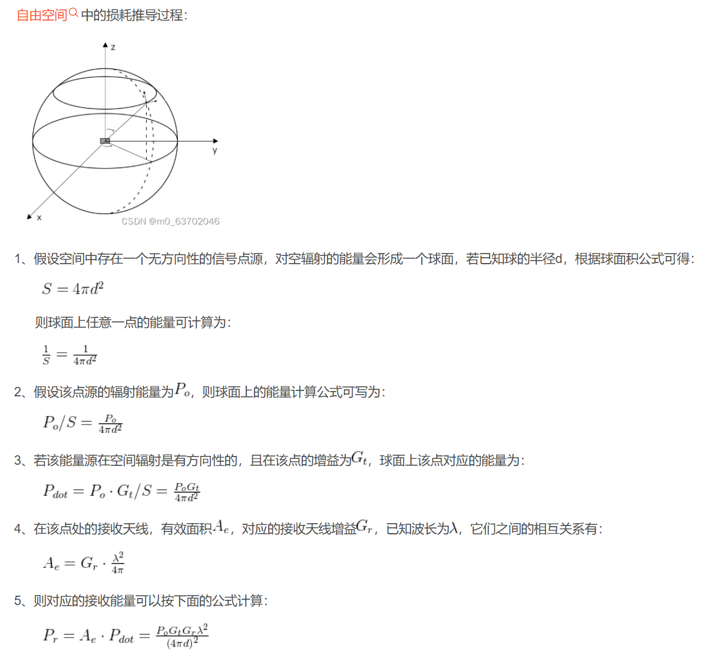

[公式推导](https://blog.csdn.net/wordwarwordwar/article/details/80494899)

以上两个推导过程结合来看

自由空间的路径损耗：RSS，是PL=10lg(Pt/Pr)

##### 概念笔记

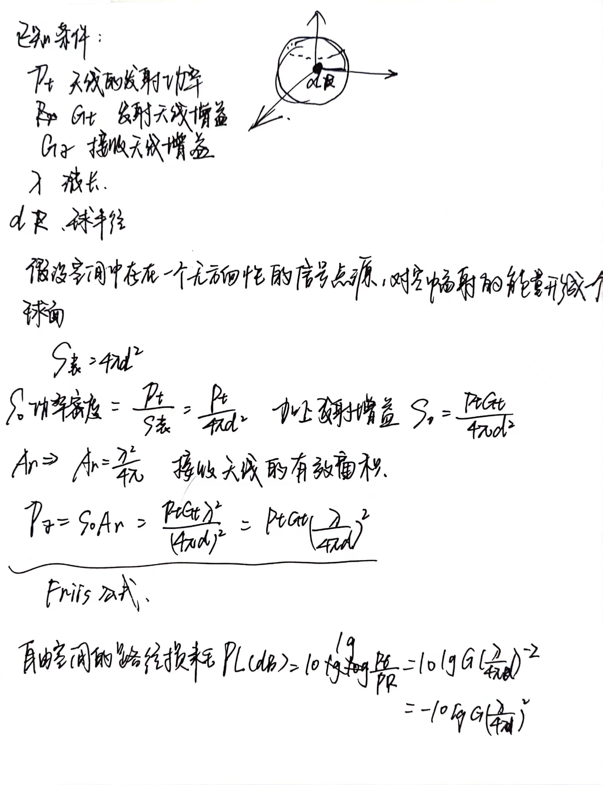

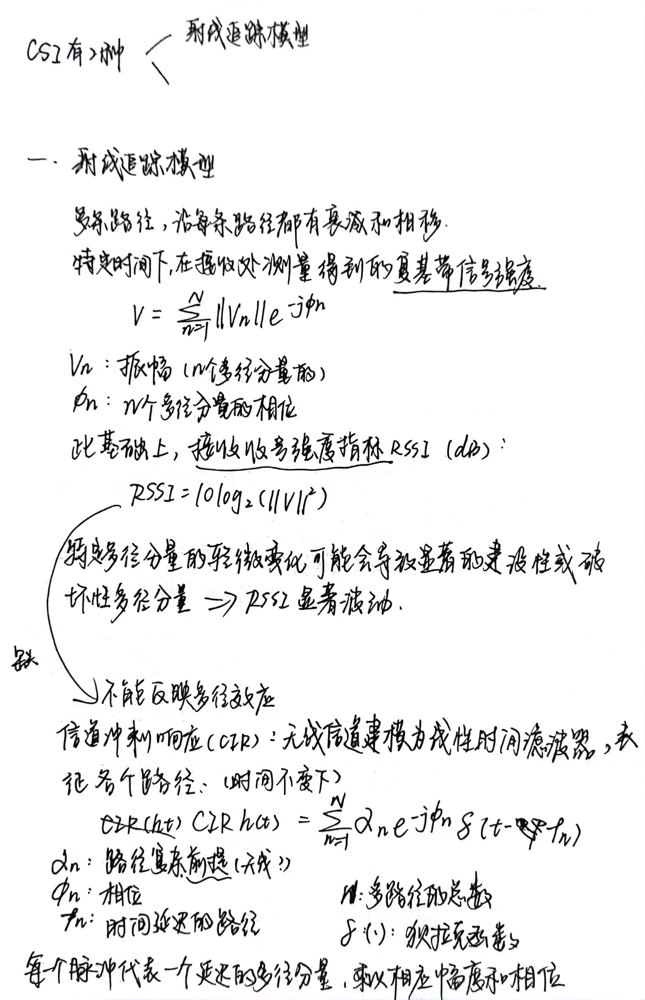

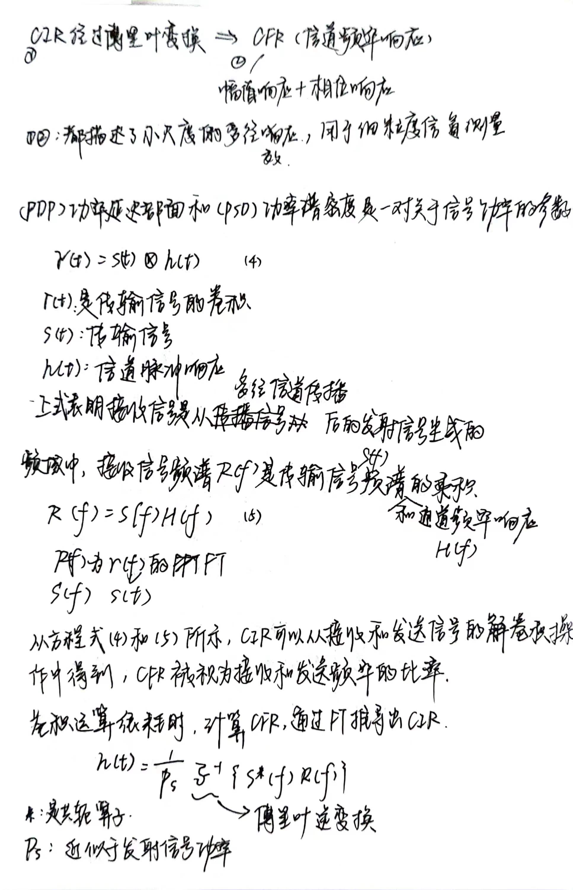

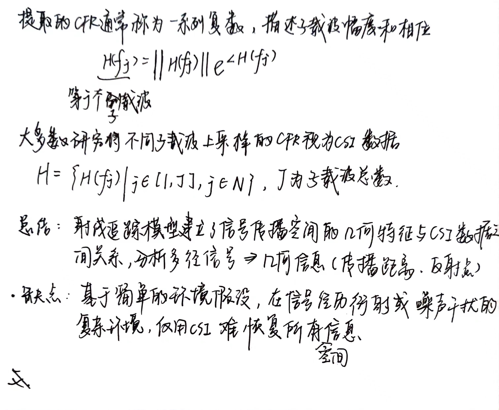

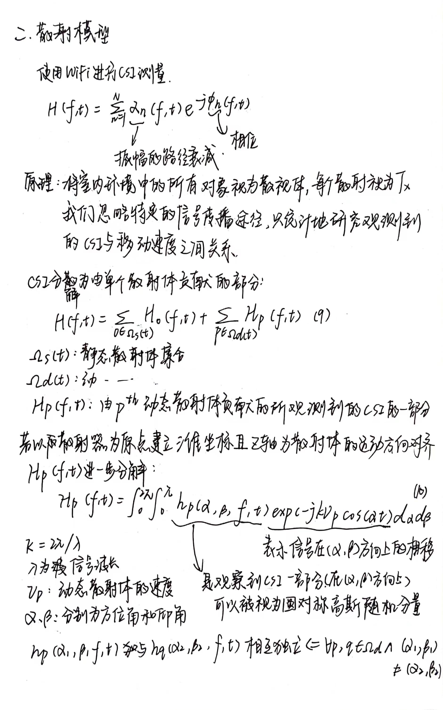

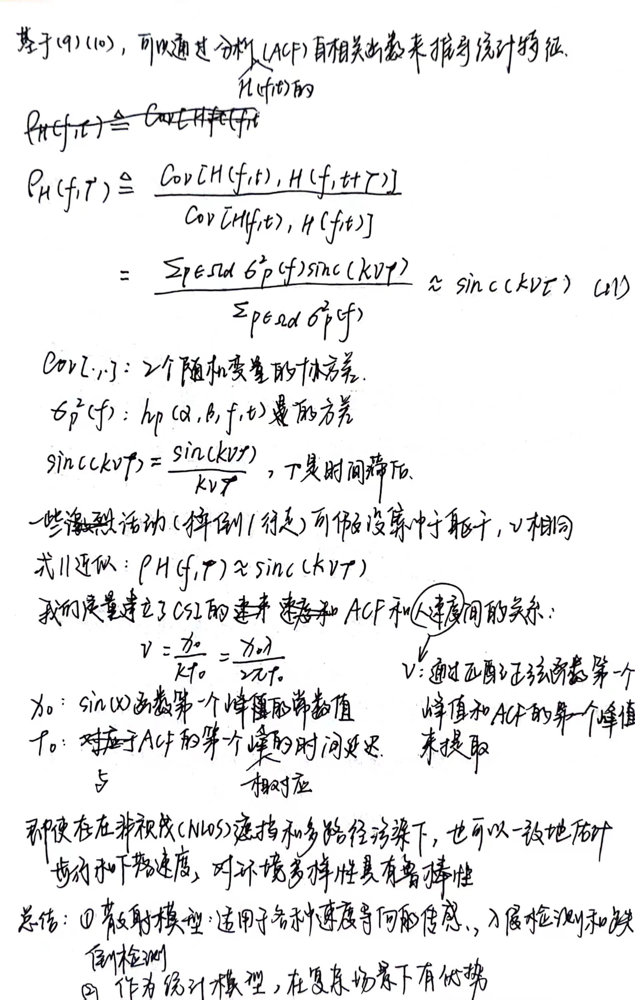
---

### 复现笔记

[基于WiFi的人体行为感知技术研究_朱旭.caj](https://kns.cnki.net/reader/flowpdf?invoice=WhCyJc4ooaSz1G644vQ%2FW29PsnzjsPD24FbyQxdD42UG1SsS7wlcFFz3bJrNUhHHHB%2BRoDXMr5i1pNK9hJZ7hqVfMrd%2FJf9KHCd5QfWWXkZD1A%2FtJvHHC6AHzglQRiQ3SfCqWA1z4zE7j%2FlV7vTj3utRAXH8i2EUQaLV0UW6Rxg%3D&platform=NZKPT&product=CMFD&filename=1022784760.nh&tablename=cmfd202301&type=DISSERTATION&scope=trial&cflag=pdf&dflag=pdf&pages=&language=CHS&trial=&nonce=7111ED0BF5D446A4BE72255443EF1C89)

#### 总流程图

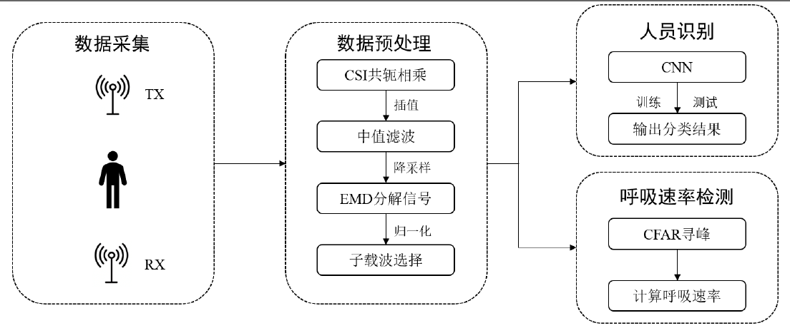

数据信息：3接收、3发射，30个子载波，采样率200Hz

##### 数据预处理

1. 从CSI分离出与呼吸相关的动态分量

（1）时频分析
（2）相位差
（3）相位比
（4）共轭相乘

本论文采用CSI共轭相乘理论模型，结合MIMO技术，消除部分相位偏移。

2. 滤除（中值滤波）

Monitor模式采取数据可能丢包，为使数据更准确。先进行**线性插值**，插值长度=采样率*时间长度。使用[**中值滤波**](https://blog.csdn.net/qq_38251616/article/details/115426742)滤除CSI数据中的部分高频和脉冲噪声。

是一种常见的去噪方法，是一种简单的非线性平滑滤波器。可以抑制噪声同时保持信号值的边缘信息，在降低脉冲型信号方面有效。

3. 降采样

人的呼吸频率小于1Hz（10bpm到37bpm），相应信号频率：0.1667Hz到0.6167Hz需要提取低频。为了减少数据量，新的采样频率20Hz

3. EMD算法分离出具有高周期性的呼吸曲线

（1）EMD

pip END包

```python
pip install EMD-signal
```

`END`是一种基于时域进行信号分解的手段，适用于分解非线性和非平稳的信号序列。与传统小波分解相比，`EMD`没有基函数并且只依赖于原始信号本身。`EMD`的过程基于信号的最大最小值、局部平均值和时间尺度特征自动进行，将信号分解为从高频倒低频的一系列本征模函数（`IMF`），每个模函数都包含有关原始信号频率如何随时间变化的信息。
由于`EMD`分解出的`IMF`依次从高频到低频排列，所以本系统选择去除最开始的两个`IMF`，将剩下的IMF相加来重构呼吸信号。重构的呼吸信号周期性更强，信号波形更加平滑，一定程度上也减少了高频噪声的影响。

（稍后补伪代码来代替下图
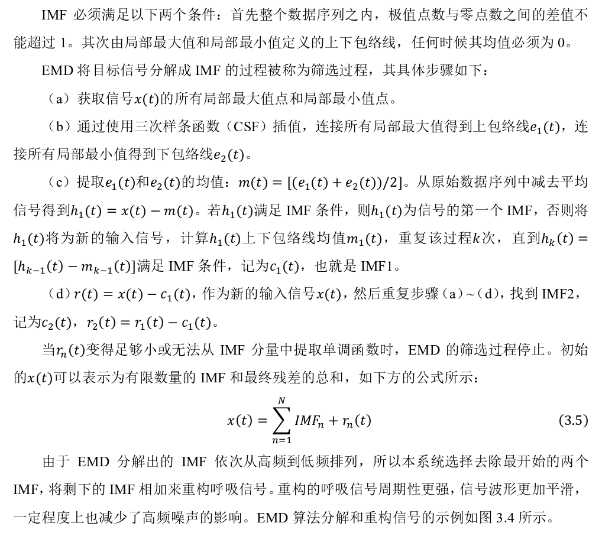

（2）DWT（小波变换）
都可以用于重建呼吸信号曲线，相较于DWT，EMD能够在没有预选基函数情况下，分解原始分号，只依赖信号本身。
另外采用基于**FFT**的子载波选择策略，筛选周期波动明显的子载波，提高呼吸数据的可靠性。

[EMD](https://blog.csdn.net/fengzhuqiaoqiu/article/details/127779846)分解，去除高频噪声

4. FFT设定选择指标，对子载波筛选

[ref](https://blog.csdn.net/zhengyuyin/article/details/127499584)

不同的子载波对于呼吸的感知粒度不同

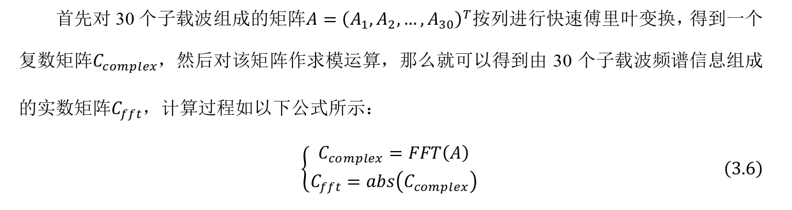

人正常情况下的呼吸频率范围为[0.1667Hz，0.6167Hz]，系统在这里选取的频率范围则是
[0.15Hz,0.5Hz]

（1）确定C(fft)中子载波序列的第n个数，与频率f，采样频率f(s)和序列总长N之间的关系，公式如下：

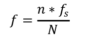

（2）基于FFT的筛选指标的计算公式，如下：

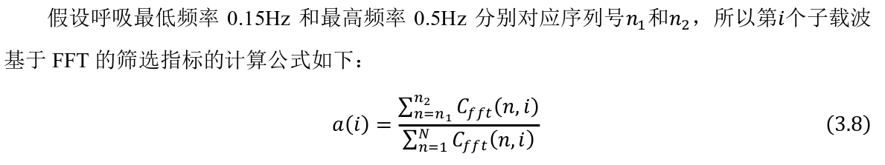

##### 呼吸速率检测

5. CFAR寻峰操作，精确计算呼吸速率

[ref](https://github.com/msvorcan/FMCW-automotive-radar/blob/master/cfar.py)

与传统相比，CFAR可以较好分辨假峰和重峰，保证检测概率前提下，实时改变门限阈值。

一般将两个相邻峰值之间数据片段视为完整呼吸片段，主流寻找峰值的方法：

（1）比较法：对平滑后的曲线进行基于最大值的比较，只适合找强单峰，易受噪声影响。

（2）导数法：对平滑后的曲线，进行一、二、三阶求导，根据数据的均值设置门限值，再峰值筛选，缺点是对弱峰和强峰分辨效果不理想。

（3）CFAR寻峰算法：自适应算法，用于在噪声和杂波下监测目标回波，超过阈值的被人为来自目标。

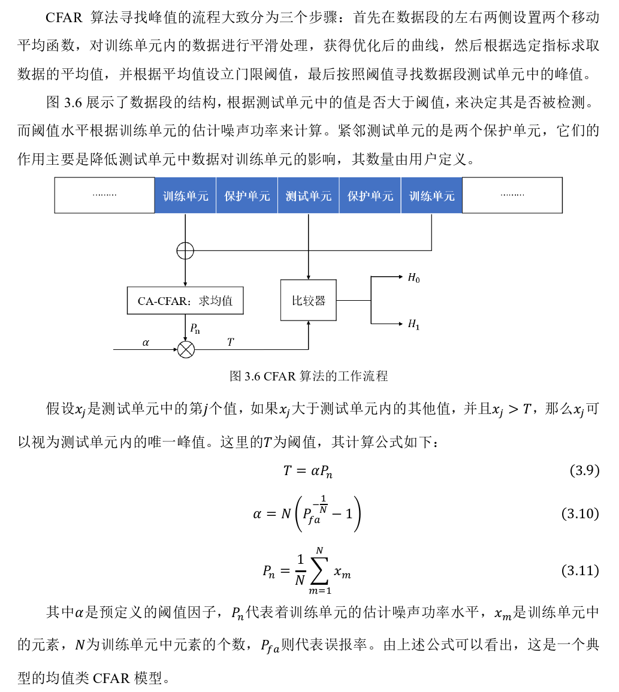

（4）对称零面积法：选择对称零面积简单函数作为变换函数，按照对称零面积设置窗函数，计算峰的净面积和总面积的标准片擦汗，阈值判断是否为真。计算复杂。

（5）线性拟合寻峰法：最小二乘法得出线性函数系数，根据拟合函数得出拟合曲线，计算相应峰的高度和宽度。计算复杂。

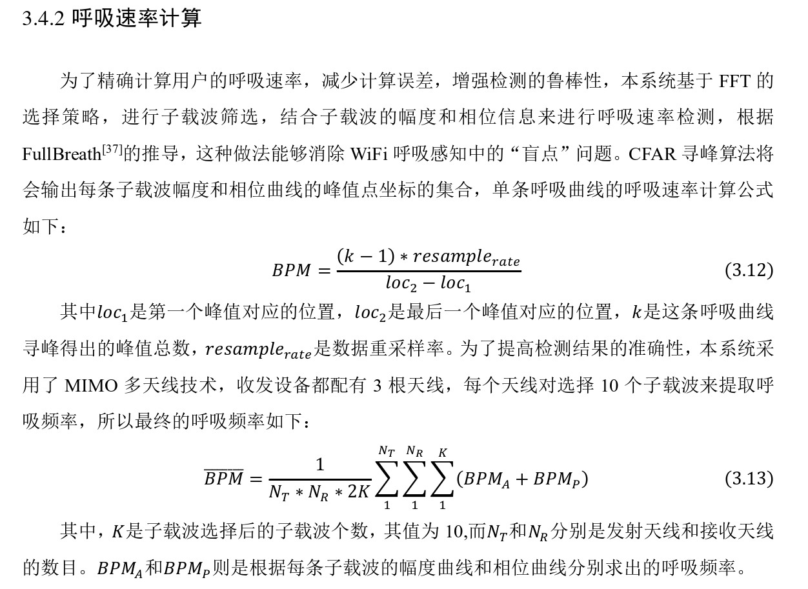

---

[相位校准](http://tns.thss.tsinghua.edu.cn/wifiradar/papers/QianKun-TECS2017.pdf)

---

6. 人员检测

使用滑动窗口算法，将CSI呼吸序列分割，生成用于分类任务的数据集。数据集送入CNN进行分类。

---

菲涅尔阈：当用户呼吸时，其对应的胸部位移距离在5mm~12mm之间，跨越了菲涅尔域的边界，所以接收到的信号会产生相应的峰值。 
