## 用于后续手写python进行转换参考
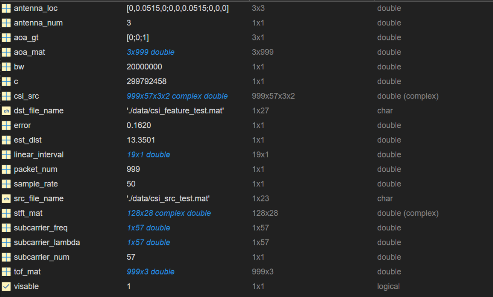

## main

1. 计算子载波波长

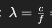

2. 天线排列

`linspace(5.8153e9, 5.8347e9, 57);`创建一个等间隔的频率数组。 
`linspace`函数用于生成一个在指定区间内均匀分布的数值序列，起始频率5.8153GHz，终止频率5.8347GHz，生成的间隔数值57。

`num2str` 将数值转换为字符串

3. 计算偏差

- 计算AoA估计

`aoa_mat = naive_aoa(csi_src, antenna_loc, zeros(3, 1));` zeros(3,1)适用于RCO（射频链路偏移）的零向量，在这个例子里，RCO被假设为0

`aoa_gt = [0; 0; 1];` 给定的地面真实AoA向量，假设实际AoA沿着z的单位向量

`error = mean(acos(aoa_gt' * aoa_mat));` 里面先计算点积，得到余弦相似度，acos(cos(theta))就得到theta，两个向量之间的夹角，取平均，得到所有估计值的平均角度误差

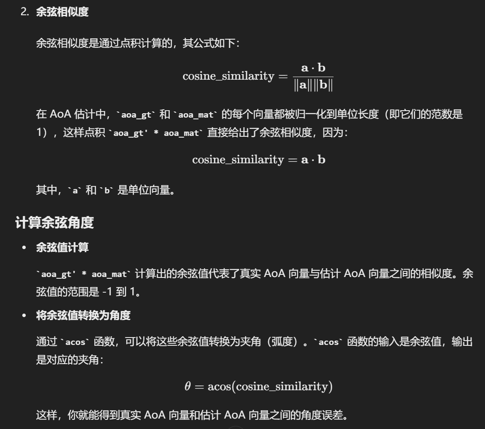

## TOF

### 概念

[TOF](https://www.lumimetric.com/cn/new/TOF-time-of-flight-definition-and-principle.html#:~:text=TOF%EF%BC%8C%E5%8D%B3%E9%A3%9E%E8%A1%8C%E6%97%B6%E9%97%B4%EF%BC%8C%E6%98%AF%E4%B8%80%E7%A7%8D%E9%80%9A%E8%BF%87%E8%AE%A1%E7%AE%97%E5%85%89%E5%9C%A8%E4%BB%8B%E8%B4%A8%E4%B8%AD%E4%BC%A0%E6%92%AD%E4%B8%80%E5%AE%9A%E8%B7%9D%E7%A6%BB%E6%89%80%E9%9C%80%E6%97%B6%E9%97%B4%E6%9D%A5%E6%B5%8B%E9%87%8F%E8%B7%9D%E7%A6%BB%E7%9A%84%E6%96%B9%E6%B3%95%E3%80%82%20%E4%B8%BB%E8%A6%81%E5%BA%94%E7%94%A8%E4%BA%8E%E5%85%89%E5%AD%A6TOF%E5%9C%BA%E6%99%AF%EF%BC%8C%E5%85%B6%E5%8E%9F%E7%90%86%E7%9B%B8%E5%AF%B9%E7%9B%B4%E6%8E%A5%E3%80%82,%E5%A6%82%E5%9B%BE%E6%89%80%E7%A4%BA%EF%BC%8C%E4%B8%80%E4%B8%AA%E5%85%89%E6%BA%90%E5%8F%91%E5%B0%84%E4%B8%80%E6%9D%9F%E5%85%89%EF%BC%8C%E5%B9%B6%E8%AE%B0%E5%BD%95%E5%8F%91%E5%B0%84%E6%97%B6%E9%97%B4%E3%80%82%20%E8%BF%99%E6%9D%9F%E5%85%89%E5%8F%8D%E5%B0%84%E5%9C%A8%E7%9B%AE%E6%A0%87%E4%B8%8A%E5%B9%B6%E8%A2%AB%E6%8E%A5%E6%94%B6%E5%99%A8%E6%8D%95%E8%8E%B7%EF%BC%8C%E8%AE%B0%E5%BD%95%E6%8E%A5%E6%94%B6%E6%97%B6%E9%97%B4%E3%80%82)

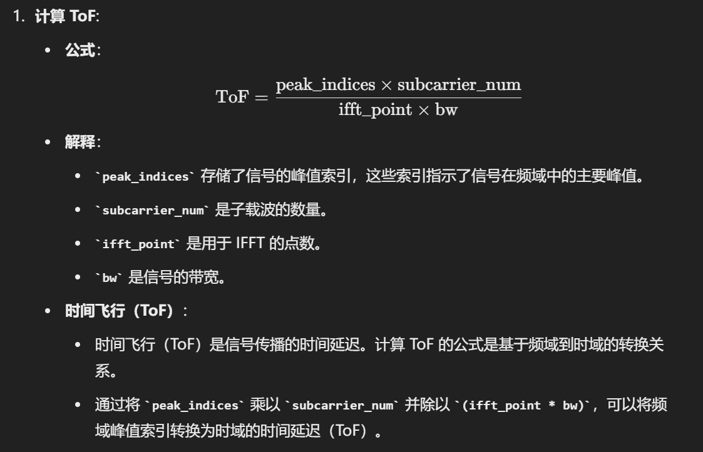

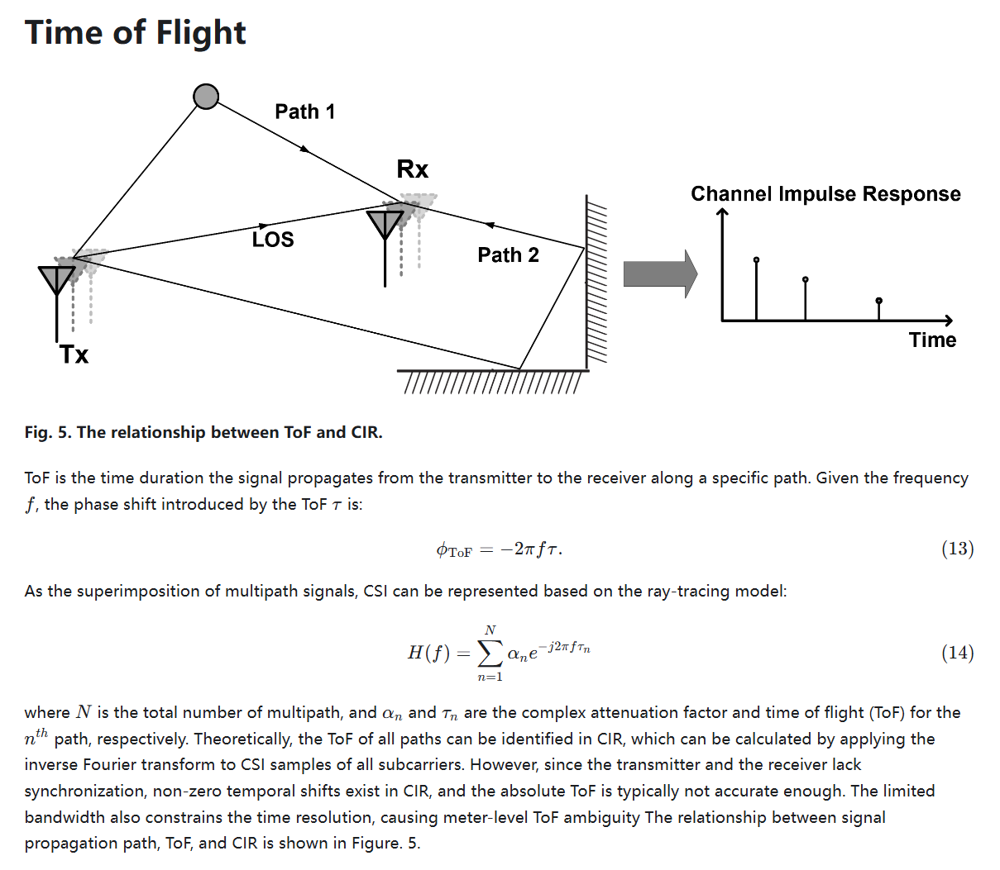

英文翻译中文

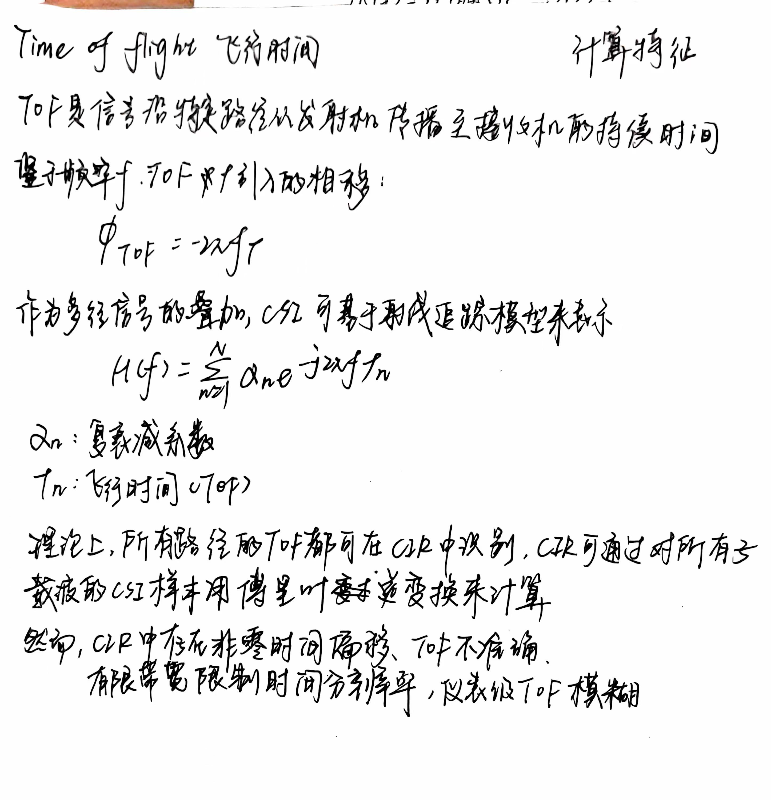 

### 代码注解

输入:
- csidata csi数据 [T S A L]，T为时间点，S为子载波，A为天线数量，L是CSI数据的其他维度
输出：
- tof_mat 粗略的飞行时间估计结果 [T A] 表示每个时间点和每个天线的飞行时间估计

1. 计算IFFT点数

`ifft_point = power(2, ceil(log2(subcarrier_num)));`

将点数调整到最接近的2的幂次方，以优化IFFT的计算。快速傅里叶变换（FFT）和逆快速傅里叶变换（IFFT）算法的计算复杂度对于2的幂次方的点数具有最佳性能。计算效率会随着点数的增加而提高，特别是在处理大规模数据时。

2. 计算CIR（信道脉冲响应）

`cir_sequence = ifft(csi_data, ifft_point, 2);`在第二个维度（子载波维度）进行IFFT。

先对第四维度求均值，然后`squeeze`去除维度为1的单一维度。旨在操作去除第4维（L维）的影响，通过对该维度求均值来得到每个时间点和天线的平均CIR。

3. 只考虑一半的IFFT点数，因为信道的时域通常是对称的

4. 查找CIR峰值

`[~, peak_indices] = max(half_sequence, [], 2); % [T 1 A]`第二维度（子载波维度）上计算最大值。
第一个返回：每个时间点和每个天线在指定维度的最大值
第二个返回：最大值的位置索引

然后`squeeze`去除维度为1的单一维度。

5. 计算飞行时间

用于确定信号从发送端到接收端所花费的时间，计算到达时间与发射时间之间的差异。

`(峰值位置 * 子载波数) / (IFFT点数 * dw) `

最后，再 `*c` 就是距离

## AoA

从 CSI 数据中估计到达角

### 概念

物理背景：天线阵列的相位差。为了得到theta

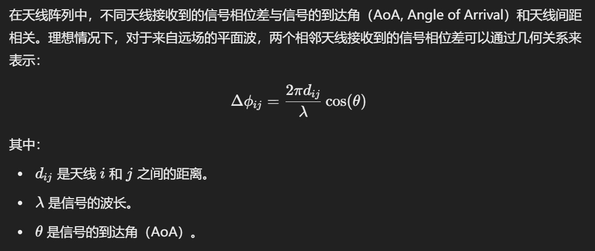

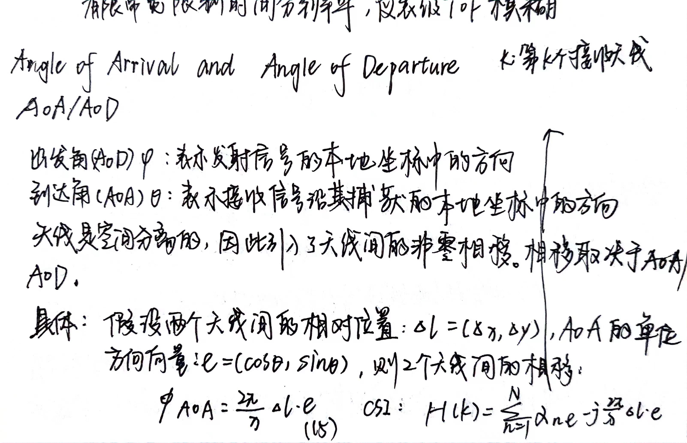

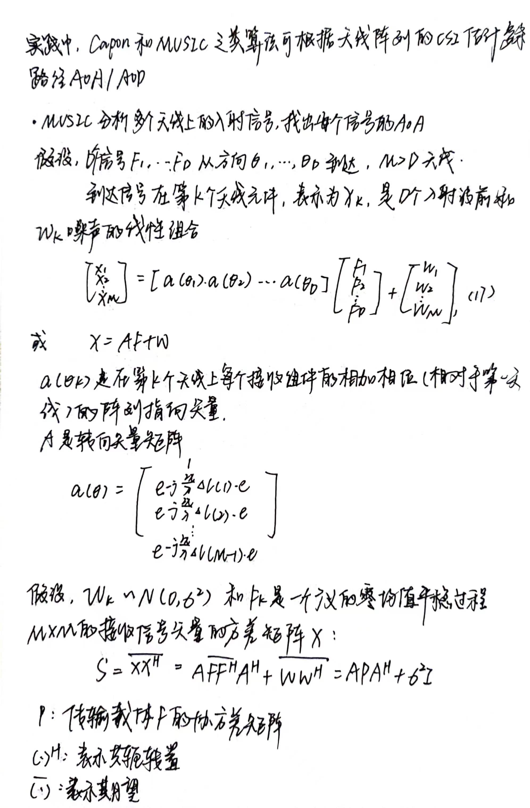

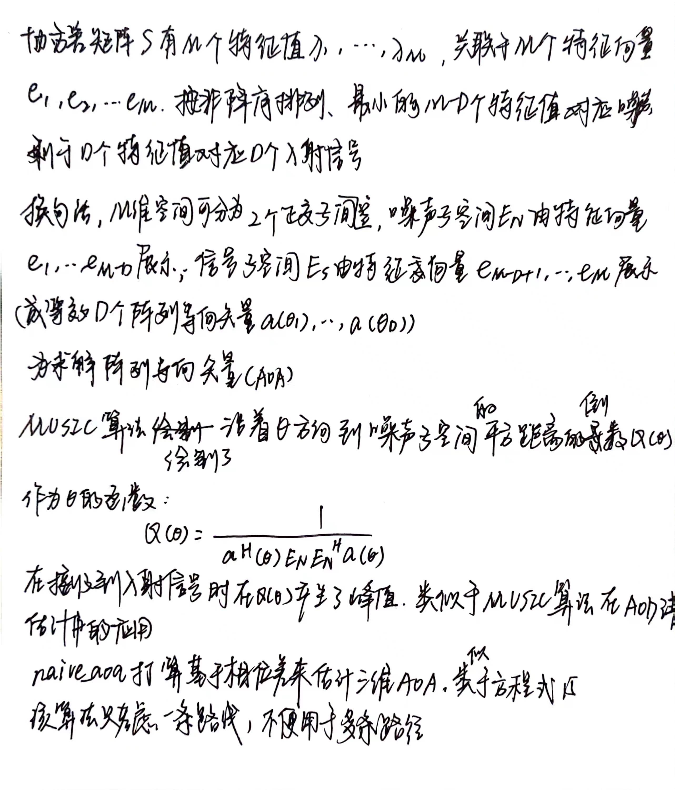

### 代码注解

输入:
- csidata 用于角度估计的csi数据 [T S A L]
- antenna_loc 以第一个天线为参考的天线位置排列 [3 A]
- est_rco 估计的射频链路便宜（RCO）[A 1]
输出：
- aoa_mat 角度估计的结果 [3 T]

1. 相位解包（消除相位跳跃）

消除相位跳跃（unwrap phase）是信号处理中的一个重要步骤，用于处理由于相位周期性而导致的相位不连续问题。在处理相位信息时，由于相位值的周期性（通常是-2𝜋到2π），相位在不同周期之间可能会出现不连续的跳跃。相位跳跃会导致相位数据的分析和计算结果出现错误。

常见消除相位的方法：
- 相位解包，标准方法，通过加上或减去适当的2𝜋整数倍。
- 数学处理，例如线性插值和平滑算法。

2. 计算天线差向量及其长度

- 计算天线差向量

`ant_diff = antenna_loc(:, 2:end) - antenna_loc(:, 1); % [3 A-1]`

第一个天线与其他天线之间的差异向量 = 选择从第二个天线到最后一个天线的所有位置向量 - 选择的第一个天线的位置向量

- 计算天线差向量长度

`ant_diff_length = vecnorm(ant_diff); % [1 A-1]`

计算每个差向量的欧几里得范数（向量长度），`vecnorm`会沿列计算

- 规范化天线差向量

对每个差向量进行归一化，转换为单位向量

3. 计算相位差

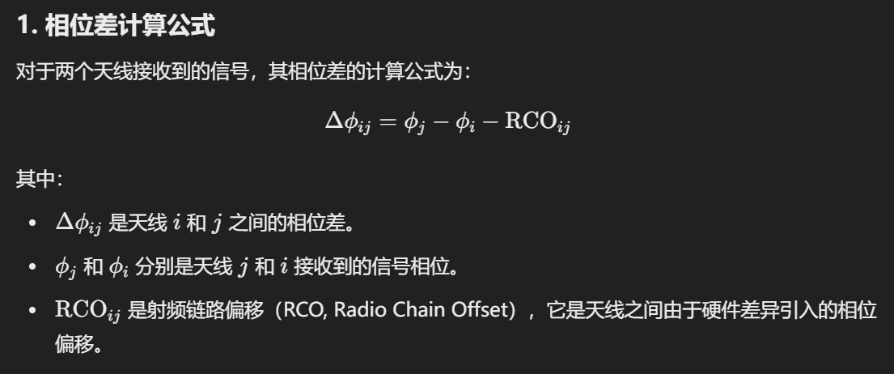

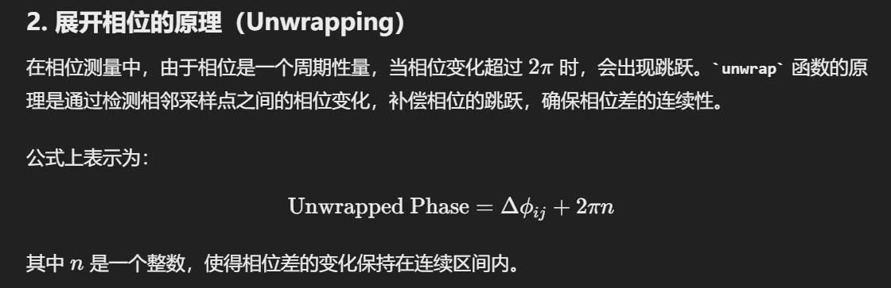

这里，沿第二维（子载波维度）展开相位，得到一个连续的相位差值

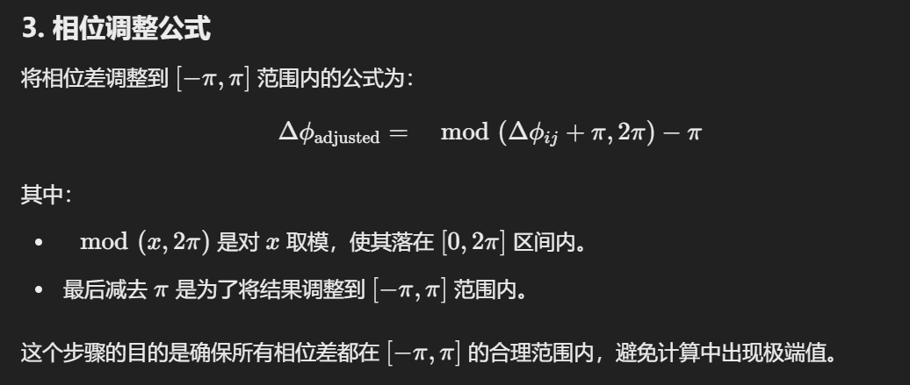

4. 计算cos(theta)

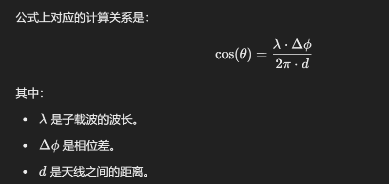

`permute(ant_diff_length, [3 1 2])` 调整维度使得能与`phase_diff`进行广播运算 [1 1 A-1 1]，第三维度默认1

`cos_mat_mean = squeeze(mean(cos_mat, [2 4])); % [T A-1]` 
- 在第二维（子载波）和第四维（链路）上取平均值，得到数据包和天线对的平均cos(theta)
- 去除维度为1的单一维度，简化矩阵大小。不会改变结果，仅仅改变矩阵的形状，去掉无意义的单一矩阵。

5. 解线性方程

`\`在matlab中，是求解线性方程组，求解最小二乘法。使用线性方程组解 AoA 估计值。

6. 结果归一化并处理奇异性问题

- 找出无效维度。先计算矩阵在第二维度上的总和，若维度对应的天线对之间差异为0，则无法进行有效的角度估计。

- 找出有效维度。

`setdiff(A, B)` 是 MATLAB 中的一个函数，用于计算集合 A 中那些不在集合 B 中的元素

- 对无效维度进行处理。

    - 计算有效维度上角度估计结果的平方和。
    `sum(aoa_mat_sol(valid_dim, :) .^ 2, 1)` `sum(...,1)`对每列（每个样本）的平方和进行求和
    - 计算无效维度的估计值
    `sqrt((1-有效维度平方和)/无效维度数量)`
    - 填充无效维度
    `repmat(..., 1, length(invalid_dim))`

- 结果更新

## STFT 短时傅里叶变换

### 概念

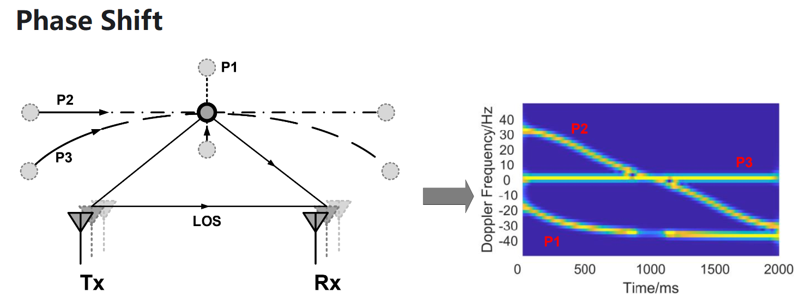

短时傅里叶变换（STFT）是一种用于分析信号在时间和频率域上变化的方法。它的主要作用是将时间域信号转换为时间-频率域。

`sample_rate` 采样率，指定了信号的采样频率。

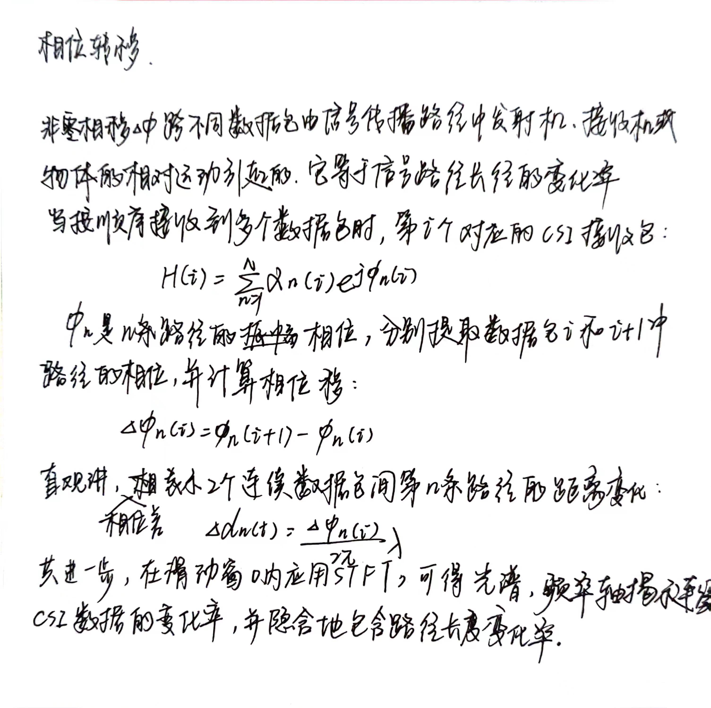

### 代码注解

输入:
- csidata 用于生成STFT频谱的csi数据 [T S A L]
- sample_rate 确定时域和频域的分辨率
输出：
- stft_mat 生成的STFT频谱 [sample_rate/2 T]

1. 共轭相乘

`csi_data .* conj(csi_data)` 对每个时间点、子载波、天线和其他，计算共轭相乘，得到功率谱密度。

再对第二、三、四维度取均值，得到具有时间密度的功率谱密度图。可以将[T S A L]维度减小到[T]

2. 计算STFT

3. 可视化

## BVP体坐标速度剖面

### 概念

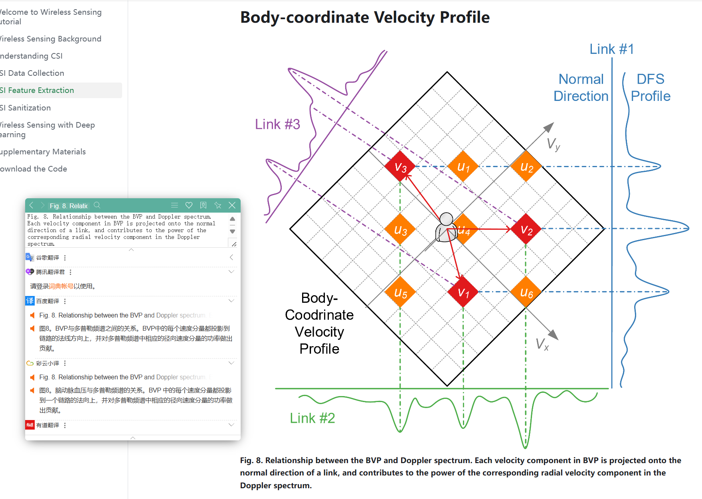

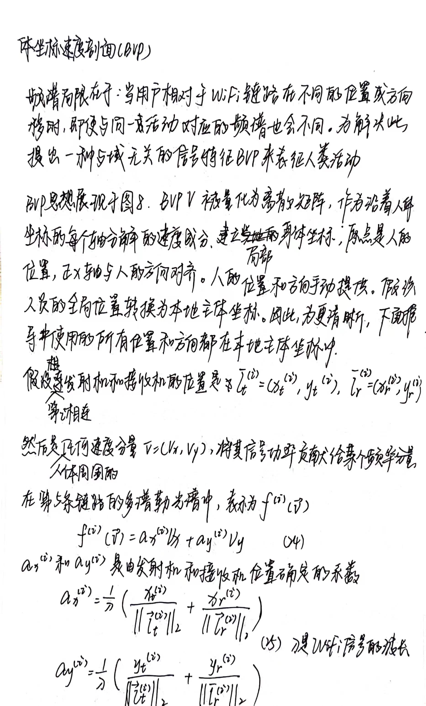

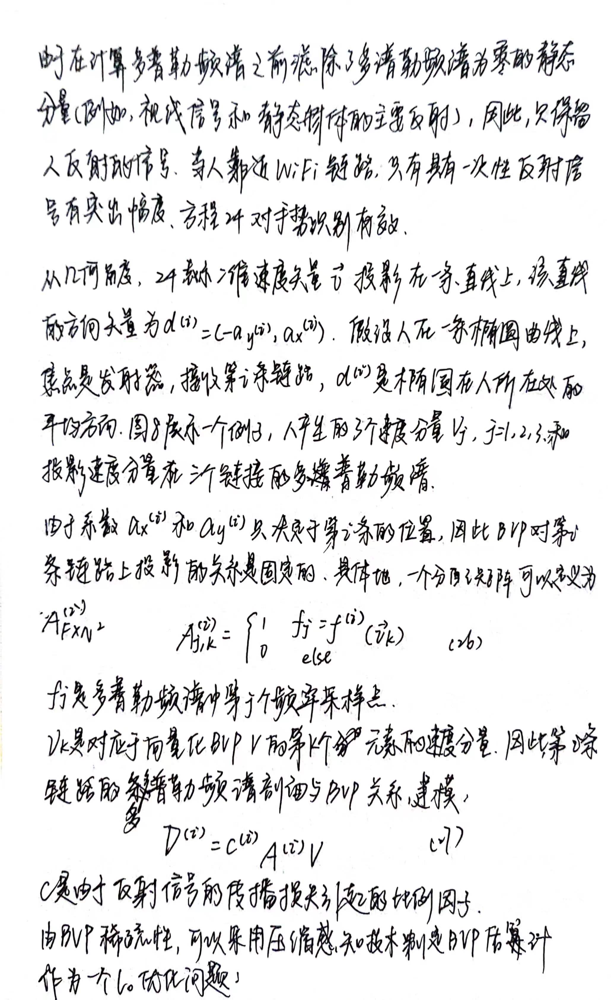

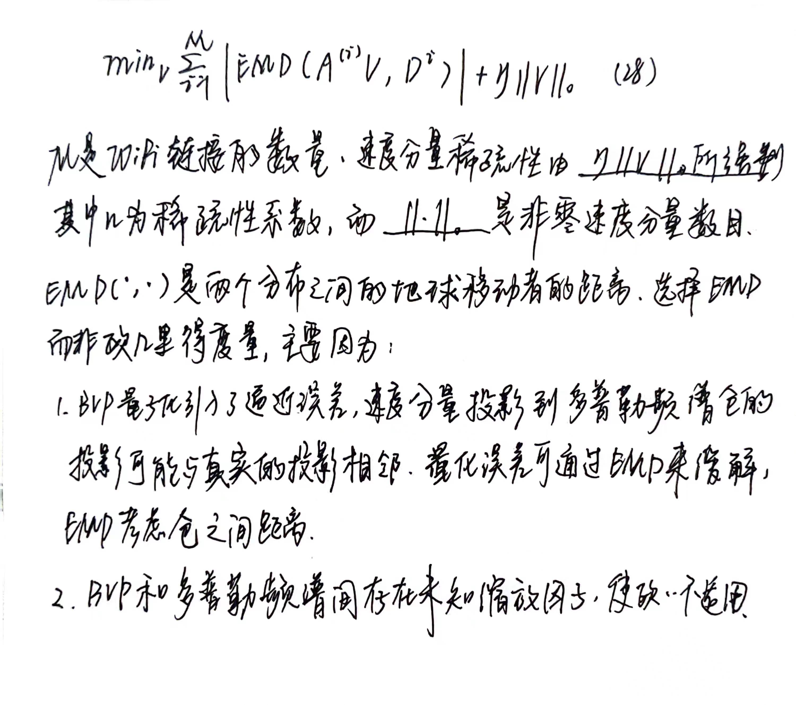