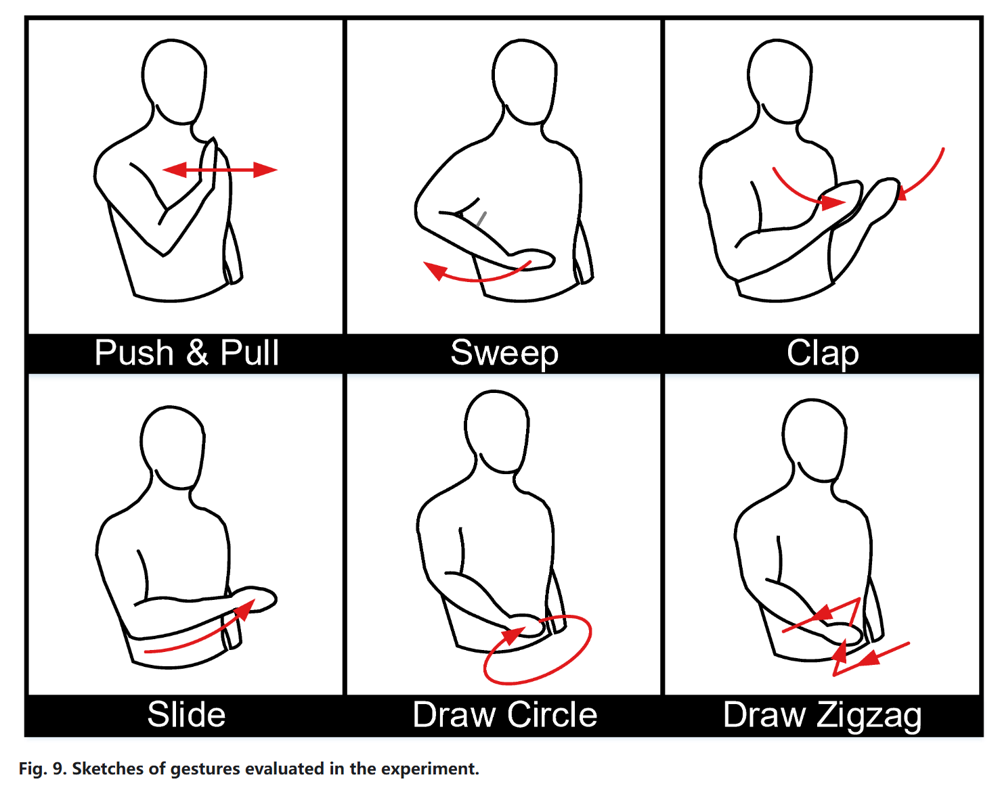
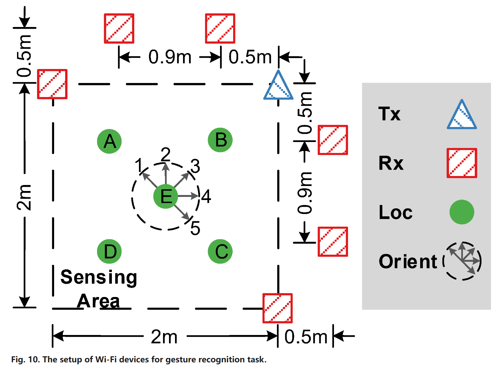
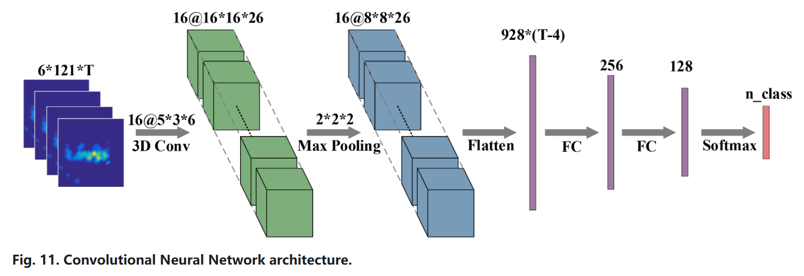

使用一些流行的深度神经网络模型，如CNN和RNN，以及它们在无线传感中的应用。还提出了一种复值神经网络，可以有效地完成基于无线特征的学习和推理。

#### CNN（Convolutional Neural Network）卷尺神经网络

本节将提供一个工作示例，演示如何将CNN应用于无线传感。具体来说，我们使用商品Wi-Fi来识别六种人类手势。手势如图9所示。

我们在一个典型的教室中部署了一个Wi-Fi发射器和六个接收器，设备设置如图10所示。用户被要求在五个标记的位置和五个方向上执行手势。

我们从原始CSI信号中提取DFS，并将其馈送到CNN网络中。神经网络的架构如图11。

