## 2024.7.22 最终版本（安装软件+数据采集）
收发硬件配置就到这里完成了，这篇不会再改动和新增。

---
2024.7.15 19：46

想起我之前和朋友留下的**誓言**，昨天开完会确定了一些东西后，我也开始认真去做了（不过这点不能让老师知道，我是现在才开始想好好认真对待emm哈哈）。估计是个人性格和思想，总有些莫名的叛逆哈哈，只想做自己想做的，不想的都很拖拉，也就难以开始。但是不管是项目组还是这学期的javaweb，我都能感觉到逃避不是一个很好的解决方式，特别是对于你之后一定会要去做的事情上面，这样累积起来的疲惫会成倍，不如踏实好好做完，再毫无负担地开始些新的东西。所以呢，咳咳，我的总结就是：对于不想且之后一定不做的，一丁点心思也不花；对于不想但之后还是要做的（这种事嘛，多半是还蛮重要的）就去按部就班做完。

ok，不想说这么多了，开始正文。主要讲kernel的配置和安装。

# 搭建硬件平台

搭建的是Ubuntu version of Atheros CSI tool，主要用于收发CSI信号，用于后续实验收集数据做支撑来使用。

## 购买网卡

## 安装网卡和Ubuntu

由于这步的内容是组内其他伙伴做的，所以我不了解，可自行网上查找资料。如有需要我再去请教他们作为补充。

## Ubuntu

系统：14.04

## 配置和安装kernel

参考文献：

[英文官方文件github](https://github.com/xieyaxiongfly/Atheros_CSI_tool_OpenWRT_src/wiki/Install-Ubuntu-version-of-Atheros-CSI-tool)

[中文CSDN](https://blog.csdn.net/zhoubao_z/article/details/107180837?ops_request_misc=%257B%2522request%255Fid%2522%253A%2522172102551916800215076862%2522%252C%2522scm%2522%253A%252220140713.130102334..%2522%257D&request_id=172102551916800215076862&biz_id=0&utm_medium=distribute.pc_search_result.none-task-blog-2~all~sobaiduend~default-1-107180837-null-null.142^v100^pc_search_result_base4&utm_term=ubuntu%E7%B3%BB%E7%BB%9F%E5%AE%89%E8%A3%85atheros%20csi%20tool&spm=1018.2226.3001.4187)

### 前期准备

Ubuntu里打开终端的操作：
        ctrl+alt+t

首先，安装若干前期准备

1. Git用于下载最新的Atheros-CSI-Tool

         $ sudo apt-get install git

2. 用于后续能成功执行"make menuconfig"

         $ sudo apt-get install libncurses5-dev libncursesw5-dev 

3. 配置Hostapd

         $ sudo apt-get install libnl-dev libssl-dev 

### 从Github上克隆源码

         $ git clone https://github.com/xieyaxiongfly/Atheros-CSI-Tool.git

### 配置和安装

首先，一定要 cd 进入Atheros-CSI-Tool 文件夹下，否则会出现 ***make: 没有规则可制作目标"defconfig-iwlwifi-public"*** 报错
**在该文件下**，来执行以下指令

1. 配置内核

          $ make menuconfig

默认配置即可。如何默认配置呢？

刚进入时候显示的是菜单页面，通过键盘右键，移动光标到**Save**上，按键盘Enter，看到.config的配置提示，按Enter。

接下来，就又返回到了菜单页面，再键盘右键，移动光标到**Exit**上，按键盘Enter，结束。

2. 使用下列命令，配置和安装kernel moudles

          $ make -j16
          $ make modules
          $ sudo make modules_install
          $ sudo make install 

为啥是-j16呢，16代表什么，能不能换成其他的？大家看英文官方文件内容即可，这里不做解释，只教安装。

3. 重启

          $ sudo reboot

4. 查看当前版本

          $ uname -r 

如果显示是" 4.1.10+ "，证明安装成功啦！

### 注意

在安装过程中，并不如官方文件这样直接就成功了。

遇到的若干问题：

1. 显示不存在该软件包

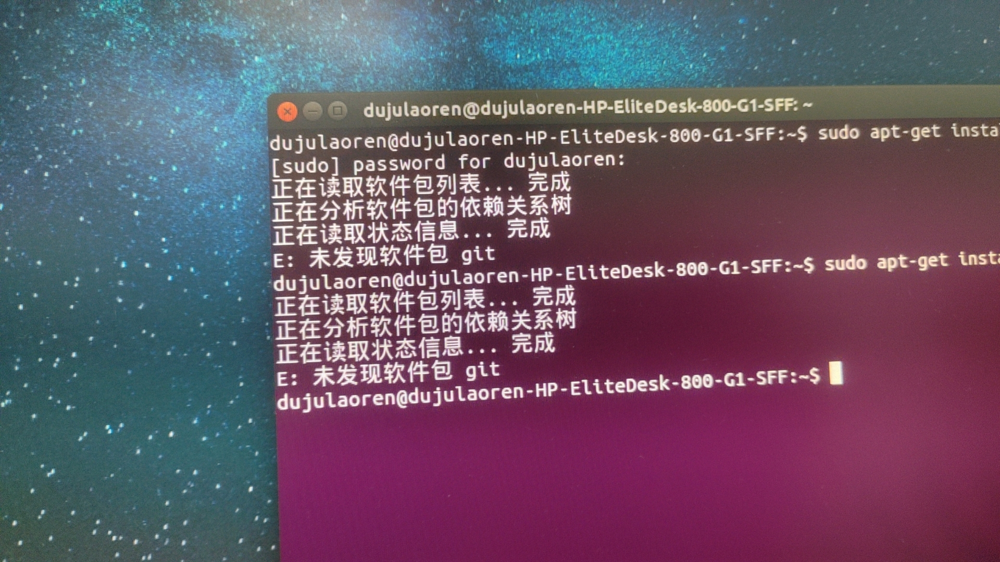

2. 查看当前版本时候，版本不正确

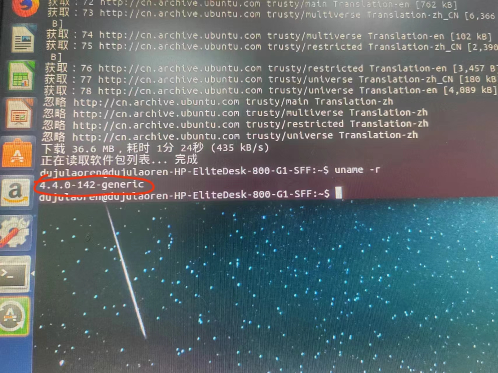

这里做出解释，希望能帮到大家：

#### 不存在该软件包

命令行更新一下：

记得需要联网哈哈哈，因为我下午第一次时候忘记联网，结果失败。

         $ sudo apt update

接下来就可以正常安装了。

#### 版本不同

首先，我们有两种可能：（1）没安装好 （2）内核切换失败

这里，我们就要对他做一个检验。

##### 检验

这步我是请教gpt的，唉总之，但是暂时它应该是取代不了我的，因为我可以操作，但它只能给出一些可能的方法，我有手 更胜一筹吧。

方法1：用于检验当前版本

         $ uname -r

方法2：用于列出自己安装得到的内核包（一般只有从官网上下载、解压、安装配置的才会显现。比如，我们这次这个它不会显现）

         $ dpkg --list | grep linux-image

方法3：用于检查 /boot 目录下的内核文件，可以检查所有

         $ ls /boot | grep vmlinuz

方法4：检查 /lib/modules 目录下的文件，好像也可以检查所有，我忘记了

         $ ls /lib/modules

这里，我们的检验就是看输入指令：方法3和4后，有没有要的4.1.10+存在。只要按照之前的配置和安装步骤，那么一般都是有的。

ok

##### 更改GRUB配置

这个是用于，当Ubuntu启动后的情况，目前我只知道两种方式，一种是默认去启动所要的内核，第二种是弹出选项自己选择。

可以参考 [Linux编译并更新内核](https://blog.csdn.net/qq_36393978/article/details/118391685)，写的真的很好，给我很大帮助，感谢！

这里 我只写出第二种方式，第一种可以自己看上述的链接

1. 进入grub下

         $ sudo nano /etc/default/grub

我们的电脑是需要输入密码的。

2. 更改

按照下面的这个，改动一下原本内容。

        # 2. 开机进入grub菜单可以主动选择以哪个内核进入系统
        GRUB_DEFAULT=0
        #************* Display grub *************
        GRUB_HIDDEN_TIMEOUT_QUIET=true
        GRUB_TIMEOUT=10
        #************** End Display *************
        GRUB_DISTRIBUTOR=`lsb_release -i -s 2> /dev/null || echo Debian`
        GRUB_CMDLINE_LINUX_DEFAULT="quiet splash"
        GRUB_CMDLINE_LINUX=""

关掉，退出终端。

打开终端，重新更新下grub。

         $ sudo update-grub

输入密码。

关掉，退出终端。

打开终端，更新Ubuntu，重启。

         $ sudo reboot

这下，电脑重启后，不会直接进入Ubuntu，而是出现GRUB菜单选择页面

选第二个：高级选项

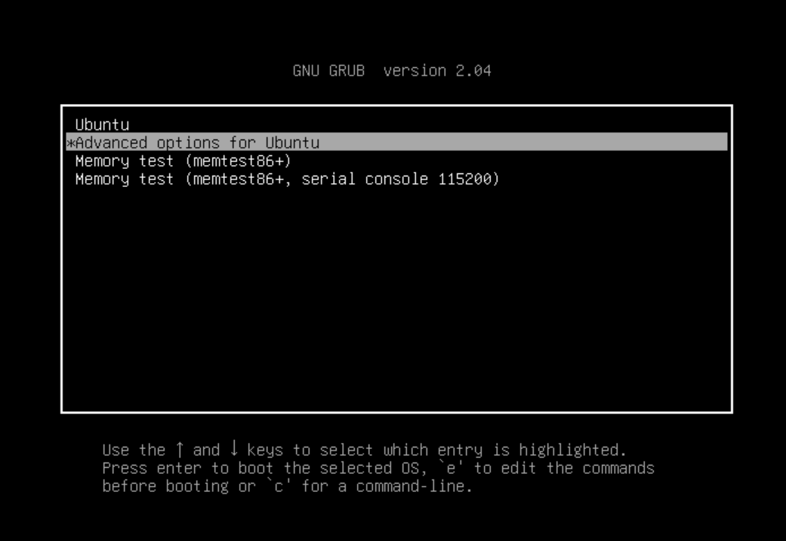

选择我们要的版本：4.1.10+

ok

进入后，再次输入

         $ uname -r

这次显现的是我们要的版本啦

如图：

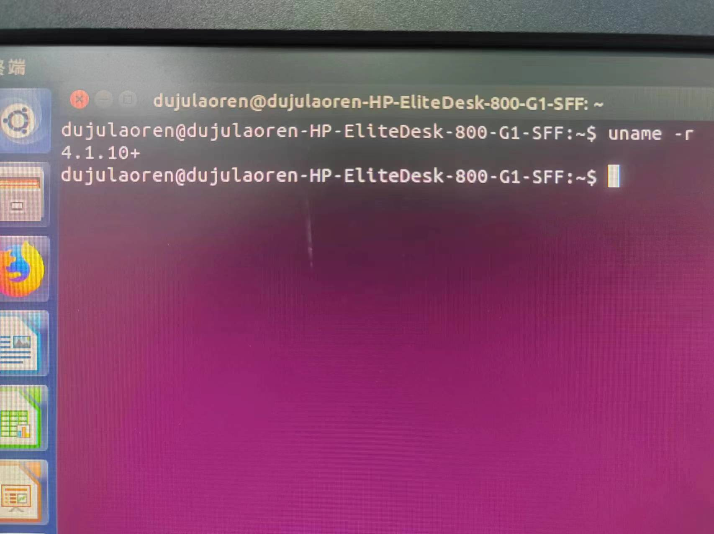

##### 为什么要退出终端再打开

因为，我后来发现，我们的Ubuntu系统，当在指令行输入一些重要更改命令时，是需要输入密码的（有点类似于给个管理员权限），才能执行。但如果一旦前期有输入密码，执行完成前期指令回到命令行页面后，当我们再输入别的指令时，它不会要求输入密码。这样看起来很方便，但它也相当于没有开启管理员权限。有些步骤会导致一些不必要的麻烦。

大获全胜！

## 写在后面

其实通过这一次安装，我了解到了Ubuntu的一些部件或命令使用，真的真的比课堂上Linux课程来的实用多。理论真的不够，需要实操来加持。
以及，因为网上资料真的很少，在安装Atheos-CSI-Tool这一块，但却可以细分为每一小块问题去搜素。我弄到很烦的时候，也有点不想弄了，那边又热又闷又痒。
不过呢，还是坚持下来，查清楚安装好了哈哈。毕竟我是谁呢，鼎鼎有名的Carrie（臭屁下）。

这周再找时间去把后续的收集CSI的配置下，emm明天去不去再说吧hh

--------

时隔大概8天哈哈，才弄完。可恶，其实可以很快结束的，但我总是拖拉和有点懒惰。但是终于结束啦！可喜可贺。

2024-07-22 18：59

----

接下来，记录的是软件安装完成后的一些**采集准备**，进行数据采集。

## 采集数据

#### 在“Atheros-CSI-Tool-UserSpace-APP”中，包含了四个子文件夹：
- Hostapd-2.5：作用是通过启动文件夹里面的“ start_hostapd.sh”将主机设置为AP；
- matlab：解析接收到的包含CSI数据的文件；
- recvCSI：通过里面的命令控制主机作为接受方接受CSI数据；
- sendData：通过里面的命令控制主机作为放射方放射CSI数据。

### 编译recvCSI

参考recvCSI里面的“makefile”，编译recvCSI里面的.c文件，进入./ Atheros-CSI-Tool-UserSpace-APP/recvCSI 路径，依次进行编译：

         $ gcc -c main.c -o main.o
         $ gcc -c csi_fun.c -o csi_fun.o
         $ gcc csi_fun.o main.o -o recv_csi

### 编译sendData

如果编译过，就不用管，没有的话参照makefile将其编译为send_Data

### 采集数据

#### 主机A启动发射无线网络

选择**主机A**作为发射方，进入“/Atheros-CSI-Tool-UserSpace-APP/hostapd-2.5/hostapd/”启动批处理文件“start_hostapd.sh”

         $ cd Atheros-CSI-Tool-UserSpace-APP/hostapd-2.5/hostapd
         $ sudo bash start_hostapd.sh

输入指令，效果如下

发送方A：

**接收方B** 连接WIFI“Atheros_csi_tool”，发送方命令窗口给出连接信息。

发送方A：

请记住接收方B的mac地址，一会会需要用到。

#### 主机B连接wifi后，运行接收命令

         $ cd /Atheros-CSI-Tool-UserSpace-APP/recvCSI/
         $ sudo ./recv_csi filename.dat /* 这里的filename替换为你的文件名 */

输入指令，效果如下

接收方B：

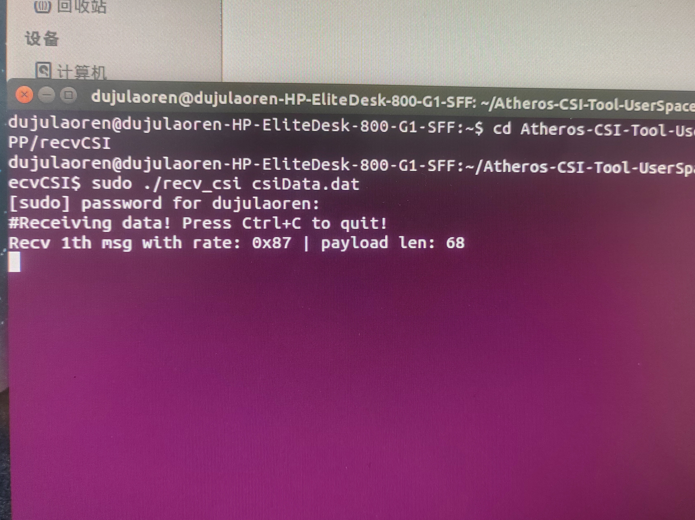

#### 主机A重新打开命令行，运行发送数据命令

         $ cd /Atheros-CSI-Tool-UserSpace-APP/sendData/
         $ sudo ./sendData wlan0 e4:ce:8f:53:cd:b1

这里 "e4:ce:8f:53:cd:b1" 是前面得到的接收方B的mac地址

输入指令，效果如下

发射方A：

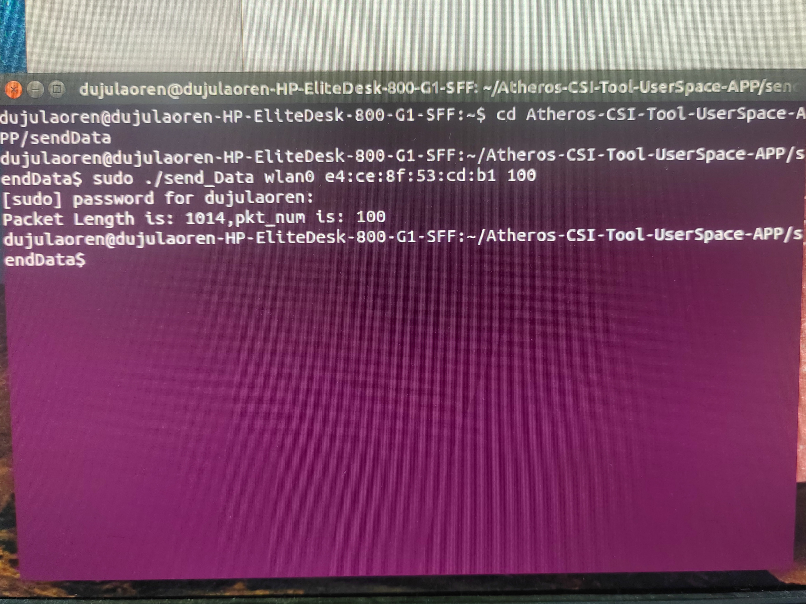

接收方B:

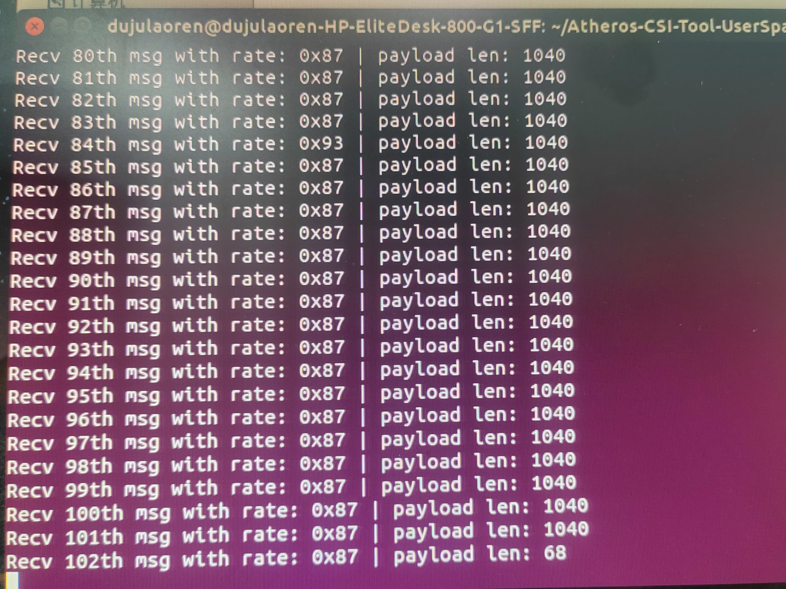

收集到的文件，在recvCSI内

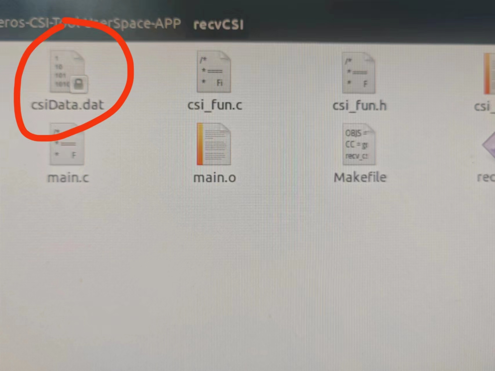

至此，就完成了采集数据。数据是否有误，还需要进一步分析。

---

原CSDN教程给的一些报错和解决方案：

（我刚好都没有遇到，或者说解决方法不是这个）

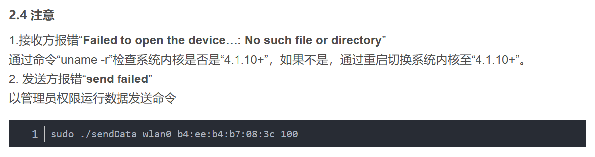

---

### 我遇到的一些问题和相应解决方案：

#### 1. 电脑右上角没有网络标志，且显示网络管理器未运行

如图，不清楚是操作了哪个地方，导致网络服务器被关闭。

##### 重新启动 NetworkManager 服务

方法1：

         $ sudo systemctl restart NetworkManager

如果没有 systemctl ，可以尝试使用 service 命令：

方法2：

         $ sudo service network-manager restart

输入命令后，右上角弹出网络标志。

但输入发射数据命令时候，还是显示没有wlan0

         $ sudo ifconfig wlan0 up

输入，上述命令：显示没有wlan0，证实wlan0可能不存在了。

于是，我们输入：

         $ iwconfig

可以看到若干的无线网络设备，我看到的是wlan1和其他，这里只有wlan1是新增的，其他之前也看到过。也就是多了wlan1，少了wlan0

我们查看内核日志：

         $ dmesg | grep -i wlan

输入了下面这堆

         dujulaoren@dujulaoren-HP-EliteDesk-800-G1-SFF:~$ dmesg | grep -i wlan
         [    3.721466] ath9k 0000:03:00.0 wlan1: renamed from wlan0
         [    3.736427] systemd-udevd[284]: renamed network interface wlan0 to wlan1
         [  240.494211] IPv6: ADDRCONF(NETDEV_UP): wlan1: link is not ready

证明wlan0被重命名为wlan1（虽然不知道是为什么）

##### 重命名wlan1为wlan0

1. 查看wlan1的mac地址

         $ ip link show

类似下面这种：

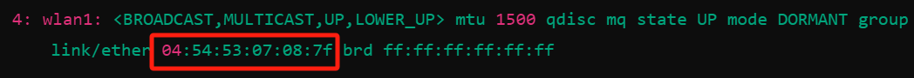

2. 打开或创建一个新的 udev 规则文件：

         $ sudo nano /etc/udev/rules.d/70-persistent-net.rules

3. 添加规则（或者重命名规则）

在文件中添加一条规则，将 wlan1 重命名为 wlan0。假设无线网卡的硬件地址（MAC 地址）是 04:54:53:07:08:7f（我们的电脑是这个mac地址），规则如下：

         $ SUBSYSTEM=="net", ACTION=="add", ATTR{address}=="04:54:53:07:08:7f", NAME="wlan0"

将 04:54:53:07:08:7f 替换为您的实际 MAC 地址。

4. 重启系统或重新加载 udev 规则：
要使新规则生效，可以选择重启系统，或通过以下命令重新加载 udev 规则

         $ sudo udevadm control --reload-rules
         $ sudo udevadm trigger

然后，最好是再重新启动一下电脑。

5. 验证

在重启系统或重新加载 udev 规则后，检查接口名称是否已更改为 wlan0：

         $ ip link show

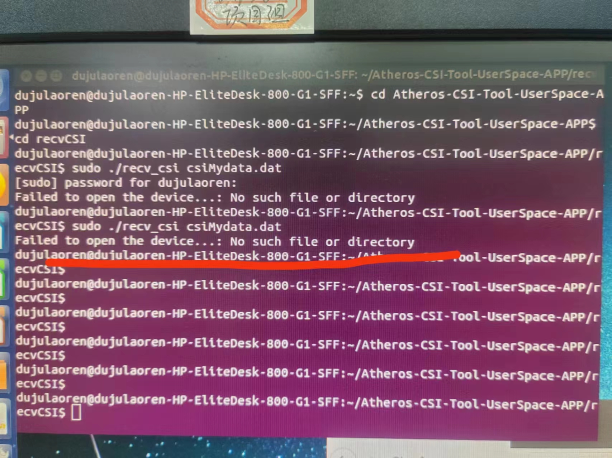

在解决这一步后，重新进行发射和接收数据，上图中我遇到的问题就解决了。

---

硬件平台搭建过程中，可能不同人不同电脑不同配置会遇到的问题都不一样，希望大家保持耐心、独立思考、网上查找文档和借助GPT来解决他们。

--- 
接下来嘿嘿，继续学习

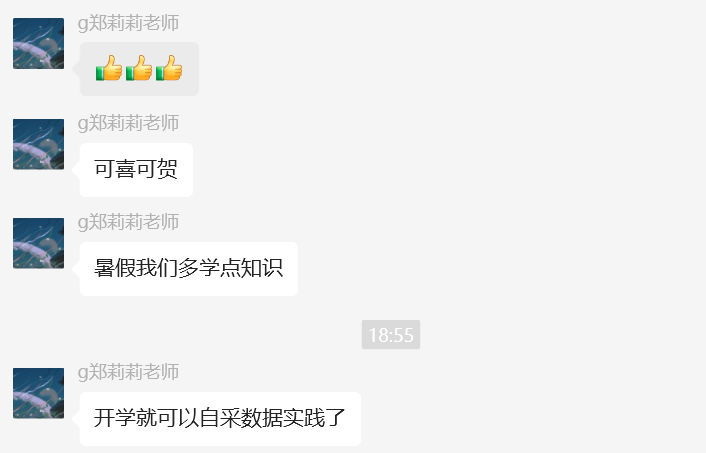