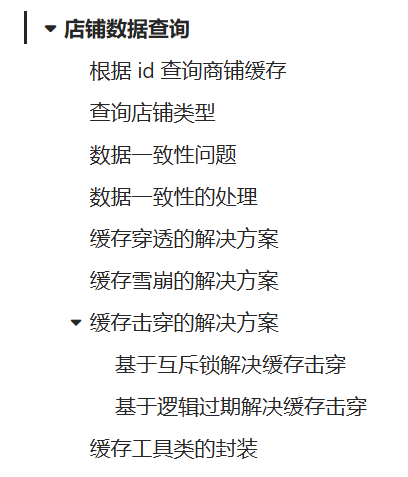
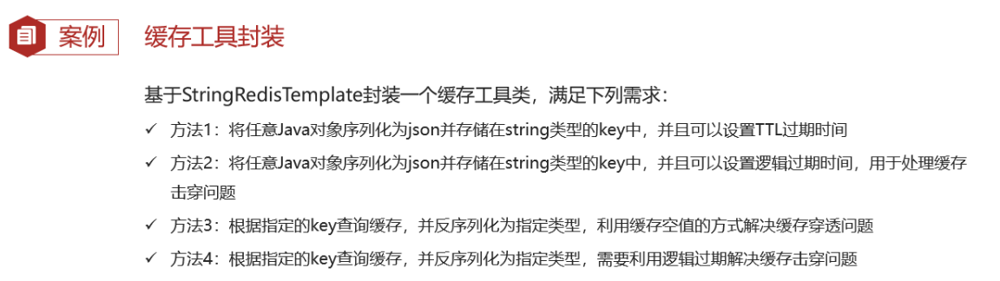

# 商户查询缓存

缓存适用于读多写少的场景，变动频率低



#### 根据id查询缓存

```java
/**
    根据id查询商铺数据
*/
@Override
public Result queryById(Long id) {
    String key = CACHE_SHOP_KEY + id;
    // 1、从Redis中查询店铺数据
    String shopJson = stringRedisTemplate.opsForValue().get(key);

    Shop shop = null;
    // 2、判断缓存是否命中
    if (StrUtil.isNotBlank(shopJson)) {
        // 2.1 缓存命中，直接返回店铺数据
        shop = JSONUtil.toBean(shopJson, Shop.class);
        return Result.ok(shop);
    }
    // 2.2 缓存未命中，从数据库中查询店铺数据
    shop = this.getById(id);

    // 4、判断数据库是否存在店铺数据
    if (Objects.isNull(shop)) {
        // 4.1 数据库中不存在，返回失败信息
        return Result.fail("店铺不存在");
    }
    // 4.2 数据库中存在，写入Redis，并返回店铺数据
    stringRedisTemplate.opsForValue().set(key, JSONUtil.toJsonStr(shop));
    return Result.ok(shop);
}
```

#### 查询店铺类型

更换以下内容：

- `String key = CACHE_SHOP_TYPE_KEY + UUID.randomUUID().toString(true);`
- `shopTypeJSON`
- `typeList = this.list(new LambdaQueryWrapper<ShopType>().orderByAsc(ShopType::getSort));`
- `stringRedisTemplate.opsForValue().set(key, JSONUtil.toJsonStr(typeList),CACHE_SHOP_TYPE_TTL, TimeUnit.MINUTES);`

## 缓存更新策略

### 内存淘汰

### 超时剔除

给缓存数据添加TTL，到期后自动删除

### 主动更新

修改数据库同时，更新缓存

**最佳实践**

   

```java
/**
     * 根据id查询商铺数据（查询时，重建缓存）
*/
@Override
public Result queryById(Long id) {
    String key = CACHE_SHOP_KEY + id;
    // 1、从Redis中查询店铺数据
    String shopJson = stringRedisTemplate.opsForValue().get(key);

    Shop shop = null;
    // 2、判断缓存是否命中
    if (StrUtil.isNotBlank(shopJson)) {
        // 2.1 缓存命中，直接返回店铺数据
        shop = JSONUtil.toBean(shopJson, Shop.class);
        return Result.ok(shop);
    }
    // 2.2 缓存未命中，从数据库中查询店铺数据
    shop = this.getById(id);

    // 4、判断数据库是否存在店铺数据
    if (Objects.isNull(shop)) {
        // 4.1 数据库中不存在，返回失败信息
        return Result.fail("店铺不存在");
    }
    // 4.2 数据库中存在，重建缓存，并返回店铺数据
    stringRedisTemplate.opsForValue().set(key, JSONUtil.toJsonStr(shop), CACHE_SHOP_TTL, TimeUnit.MINUTES);
    return Result.ok(shop);
}

/**
     * 更新商铺数据（更新时，更新数据库，删除缓存）
*/
@Transactional
@Override
public Result updateShop(Shop shop) {
    // 1、更新数据库中的店铺数据
    updateById(shop);
    // 2、删除缓存
    stringRedisTemplate.delete(CACHE_SHOP_KEY + shop.getId());
    return Result.ok();
}
```

## 缓存穿透

客户端请求的**数据在 Redis 缓存和数据库中都不存在**，这样缓存永远不会生效，请求都会打到数据库。

解决方法：

- 缓存空值

  ```java
  /**
       * 根据id查询商铺数据
  */
  @Override
  public Result queryById(Long id) {
      String key = CACHE_SHOP_KEY + id;
      // 1、从Redis中查询店铺数据
      String shopJson = stringRedisTemplate.opsForValue().get(key);
  
      Shop shop = null;
      // 2、判断缓存是否命中
      if (StrUtil.isNotBlank(shopJson)) {
          // 2.1 缓存命中，直接返回店铺数据
          shop = JSONUtil.toBean(shopJson, Shop.class);
          return Result.ok(shop);
      }
  
      // 2.2 判断缓存中查询的数据是否是空字符串
      if (shopJson != null){
          // 此时缓存数据为空值
          return Result.fail("店铺不存在");
      }
      shop = this.getById(id);
  
      // 4、判断数据库是否存在店铺数据
      if (Objects.isNull(shop)) {
          // 4.1 数据库中不存在，缓存空值（解决缓存穿透）
          stringRedisTemplate.opsForValue().set(key, "", CACHE_NULL_TTL, TimeUnit.MINUTES);
          return Result.fail("店铺不存在");
      }
      // 4.2 数据库中存在，重建缓存，并返回店铺数据
      stringRedisTemplate.opsForValue().set(key, JSONUtil.toJsonStr(shop), 
                                        CACHE_SHOP_TTL, TimeUnit.MINUTES);
      return Result.ok(shop);
  }
  ```

- 布隆过滤器

## 缓存雪崩

在同一时段大量的缓存key同时失效或者Redis服务宕机，导致大量请求到达数据库，带来巨大压力。

解决方法：

- 给不同的Key的TTL添加随机值
- 利用Redis集群提高服务的可用性
- 给缓存业务添加降级限流策略，让请求尽可能打不到数据库上
- 给业务添加多级缓存

## 缓存击穿

**热点Key问题**，就是一个**被高并发访问**并且**缓存重建业务较复杂**的key突然失效了，无数的请求访问会在瞬间给数据库带来巨大的冲击

解决方法：

- 互斥锁

  - 只需要一个线程去重建缓存（加上互斥锁）其他的线程获取锁失败，则重试直到缓存重建完成。

  ```java
      // 互斥锁解决缓存击穿
      public Shop queryWithMutex(Long id) {
          String key = CACHE_SHOP_KEY + id;
          // 1.从Redis中查询店铺数据
          String shopJson = stringRedisTemplate.opsForValue().get(key);
  
          Shop shop = null;
          // 2.判断缓存是否命中
          if (StrUtil.isNotBlank(shopJson)) {
              // 3.缓存命中，直接返回店铺数据
              return JSONUtil.toBean(shopJson, Shop.class);
          }
          // 判断缓存中查询的数据是否是空字符串
          if (shopJson != null){
              return null;
          }
          // 4.实现缓存重建
          String lockKey = LOCK_SHOP_KEY + id;
          try {
              boolean isLock = tryLock(lockKey);
              if (!isLock) {
                  // 获取锁失败，已有线程在重建缓存，则休眠重试
                  Thread.sleep(50);
                  return queryWithMutex(id);
              }
              // 获取锁成功，根据id查询数据库
              shop = this.getById(id);
              // 模拟重建的延时
              Thread.sleep(200);
              // 5. 判断数据库是否存在店铺数据
              if (Objects.isNull(shop)) {
                  // 数据库中不存在，缓存空值（解决缓存穿透）
                  stringRedisTemplate.opsForValue().set(key, "", CACHE_NULL_TTL, TimeUnit.MINUTES);
                  return null;
              }
              // 6. 数据库中存在，重建缓存，并返回店铺数据
              stringRedisTemplate.opsForValue().set(key, JSONUtil.toJsonStr(shop),
                      CACHE_SHOP_TTL, TimeUnit.MINUTES);
          } catch (InterruptedException e) {
              throw new RuntimeException(e);
          }finally {
              // 7. 释放互斥锁
              unlock(lockKey);
          }
          return shop;
      }
  
  
      /**
       * 获取锁
       */
      private boolean tryLock(String key) {
          Boolean flag = stringRedisTemplate.opsForValue().setIfAbsent(key, "1", 10, TimeUnit.SECONDS);
          // 拆箱要判空，防止NPE
          return BooleanUtil.isTrue(flag);
      }
  
      /**
       * 释放锁
       */
      private void unlock(String key) {
          stringRedisTemplate.delete(key);
      }
  ```

- 逻辑过期

  - 不设置TTL，但在Value中加一个**过期时间字段**，在获取key时检查过期时间字段是否过期，发现过期则加互斥锁。本线程暂时**返回旧数据**。其他线程：获取key->发现过期->获取互斥锁失败->暂时返回旧数据。

    ```java
    @Data
    public class RedisData {
        /**
         * 过期时间
         */
        private LocalDateTime expireTime;
        /**
         * 缓存数据
         */
        private Object data;
    }
    
        // 逻辑过期解决缓存击穿
        public Shop queryWithLogicExpire(Long id) {
            String key = CACHE_SHOP_KEY + id;
            // 1、从Redis中查询店铺数据
            String shopJson = stringRedisTemplate.opsForValue().get(key);
            // 2、判断缓存是否命中
            if (StrUtil.isBlank(shopJson)) {
                // 3.未命中,直接返回
                return null;
            }
            // 4.命中, 判断过期时间, 反序列化
            RedisData redisData = JSONUtil.toBean(shopJson, RedisData.class);
            JSONObject data = (JSONObject) redisData.getData();
            Shop shop = JSONUtil.toBean(data, Shop.class);
            LocalDateTime expireTime = redisData.getExpireTime();
            // 5.判断是否过期
            if (expireTime.isAfter(LocalDateTime.now())) {
                // 5.1.未过期,直接返回店铺信息
                return shop;
            }
            // 5.2.已过期,需要缓存重建
            // 6.1. 获取互斥锁
            String lockKey = LOCK_SHOP_KEY + id;
            boolean isLock = tryLock(lockKey);
            // 6.2. 获取锁成功,开启独立线程，实现缓存重建
            if (isLock) {
                CACHE_REBUILD_EXECUTOR.submit(() -> {
                    try {
                        this.saveShop2Redis(id, 20L);
                    } catch (Exception e) {
                        throw new RuntimeException(e);
                    } finally {
                        unlock(lockKey);
                    }
                });
            }
            // 6.3. 返回过期的店铺信息
            return shop;
        }
    
        // 线程池
        private static final ExecutorService CACHE_REBUILD_EXECUTOR = Executors.newFixedThreadPool(10);
    
    
        /**
         * 预热：将数据保存到缓存中
         * 重建缓存
         */
        public void saveShop2Redis(Long id, Long expireSeconds) throws InterruptedException {
            // 从数据库中查询店铺数据
            Shop shop = this.getById(id);
            Thread.sleep(200);
            // 封装逻辑过期数据
            RedisData redisData = new RedisData();
            redisData.setData(shop);
            redisData.setExpireTime(LocalDateTime.now().plusSeconds(expireSeconds));
            // 将逻辑过期数据存入Redis中
            stringRedisTemplate.opsForValue().set(CACHE_SHOP_KEY + id, JSONUtil.toJsonStr(redisData));
        }
    ```

    先进行数据预热，热点数据加载到缓存中

    编写一个`CommandLineRunner`继承类，然后SpringBoot程序启动时就执行启动的`run`方法，实现数据预热，或者像下面一样编写一个测试类

    ```java
    /**
      * 预热店铺数据
    */
    @Test
    public void testSaveShop(){
        shopService.saveShop2Redis(1L, 10L);
    }
    ```

## 缓存工具类的封装

利用**泛型**抽取出一个工具类，编写几个通用的方法，解决缓存穿透、缓存击穿，只需要**调用工具类**的方法解决。



**使用工具类：**

```java
@Component
@Slf4j
public class CacheClient {

    private final StringRedisTemplate stringRedisTemplate;

    public CacheClient(StringRedisTemplate stringRedisTemplate) {
        this.stringRedisTemplate = stringRedisTemplate;
    }

    /**
     * 将数据加入Redis，并设置有效期
     */
    public void set(String key, Object value, Long timeout, TimeUnit unit) {
        stringRedisTemplate.opsForValue().set(key, JSONUtil.toJsonStr(value), timeout, unit);
    }

    /**
     * 将数据加入Redis，并设置逻辑过期时间
     */
    public void setWithLogicalExpire(String key, Object value, Long timeout, TimeUnit unit) {
        RedisData redisData = new RedisData();
        redisData.setData(value);
        // unit.toSeconds()是为了确保计时单位是秒
        redisData.setExpireTime(LocalDateTime.now().plusSeconds(unit.toSeconds(timeout)));
        stringRedisTemplate.opsForValue().set(key, JSONUtil.toJsonStr(value), timeout, unit);
    }

    /**
     * 缓存空值解决缓存穿透
     *
     * @param keyPrefix  key前缀
     * @param id         查询id
     * @param type       查询的数据类型
     * @param dbFallback 根据id查询数据的函数
     * @param timeout    有效期
     * @param unit       有效期的时间单位
     * @param <T>
     * @param <ID>
     * @return
     */
    public <T, ID> T queryWithPassThrough(String keyPrefix, ID id, Class<T> type,
                                            Function<ID, T> dbFallback, Long timeout, TimeUnit unit) {
        String key = keyPrefix + id;
        // 1. 从Redis中查询店铺数据
        String json = stringRedisTemplate.opsForValue().get(key);

        T t = null;
        // 2. 判断缓存是否命中
        if (StrUtil.isNotBlank(json)) {
            // 3. 缓存命中，直接返回店铺数据
            return JSONUtil.toBean(json, type);
        }
        // 判断命中的是否是空值
        if (json != null) {
            // 直接返回失败信息
            return null;
        }
        
        // 缓存未命中, 根据id查数据库
        t = dbFallback.apply(id);

        // 4. 判断数据库是否存在店铺数据
        if (Objects.isNull(t)) {
            // 5. 数据库中不存在，缓存空值（解决缓存穿透），返回失败信息
            this.set(key, "", CACHE_NULL_TTL, TimeUnit.SECONDS);
            return null;
        }
        // 6. 数据库中存在，重建缓存，并返回店铺数据
        this.set(key, t, timeout, unit);
        return t;
    }

    /**
     * 缓存重建线程池
     */
    public static final ExecutorService CACHE_REBUILD_EXECUTOR = Executors.newFixedThreadPool(10);

    /**
     * 逻辑过期解决缓存击穿
     *
     * @param keyPrefix  key前缀
     * @param id         查询id
     * @param type       查询的数据类型
     * @param dbFallback 根据id查询数据的函数
     * @param timeout    有效期
     * @param unit       有效期的时间单位
     * @param <T>
     * @param <ID>
     * @return
     */
    public <T, ID> T queryWithLogicExpire(String keyPrefix, ID id, Class<T> type,
                                          Function<ID, T> dbFallback, Long timeout, TimeUnit unit) {
        String key = keyPrefix + id;
        // 1、从Redis中查询店铺数据，并判断缓存是否命中
        String jsonStr = stringRedisTemplate.opsForValue().get(key);
        if (StrUtil.isBlank(jsonStr)) {
            // 1.1 缓存未命中，直接返回失败信息
            return null;
        }
        // 1.2 缓存命中，将JSON字符串反序列化未对象，并判断缓存数据是否逻辑过期
        RedisData redisData = JSONUtil.toBean(jsonStr, RedisData.class);
        JSONObject data = (JSONObject) redisData.getData();
        T t = JSONUtil.toBean(data, type);
        LocalDateTime expireTime = redisData.getExpireTime();
        if (expireTime.isAfter(LocalDateTime.now())) {
            // 当前缓存数据未过期，直接返回
            return t;
        }

        // 2、缓存数据已过期，获取互斥锁，并且重建缓存
        String lockKey = LOCK_SHOP_KEY + id;
        boolean isLock = tryLock(lockKey);
        if (isLock) {
            // 获取锁成功，开启一个子线程去重建缓存
            CACHE_REBUILD_EXECUTOR.submit(() -> {
                try {
                    // 查询数据库
                    T t1 = dbFallback.apply(id);
                    // 将查询到的数据保存到Redis
                    this.setWithLogicalExpire(key, t1, timeout, unit);
                } finally {
                    unlock(lockKey);
                }
            });
        }
        // 3、返回过期数据
        return t;

    }

    /**
     * 获取锁
     */
    private boolean tryLock(String key) {
        Boolean flag = stringRedisTemplate.opsForValue().setIfAbsent(key, "1", 10, TimeUnit.SECONDS);
        // 拆箱要判空，防止NPE
        return BooleanUtil.isTrue(flag);
    }

    /**
     * 释放锁
     */
    private void unlock(String key) {
        stringRedisTemplate.delete(key);
    }
}
```

**ShopServiceImpl的代码：**

```java
/**
     * 根据id查询商铺数据
     *
     * @param id
     * @return
     */
@Override
public Result queryById(Long id) {
    // 调用解决缓存穿透的方法
    // Shop shop = cacheClient.queryWithPassThrough(CACHE_SHOP_KEY, id, Shop.class,
    //            this::getById, CACHE_SHOP_TTL, TimeUnit.MINUTES);
    // if (Objects.isNull(shop)){
    //     return Result.fail("店铺不存在");
    // }
    // 调用解决缓存击穿的方法
    Shop shop = cacheClient.queryWithLogicExpire(CACHE_SHOP_KEY, id, Shop.class,
                                             this::getById, CACHE_SHOP_TTL, TimeUnit.SECONDS);
    if (Objects.isNull(shop)) {
        return Result.fail("店铺不存在");
    }
    return Result.ok(shop);
}
```


