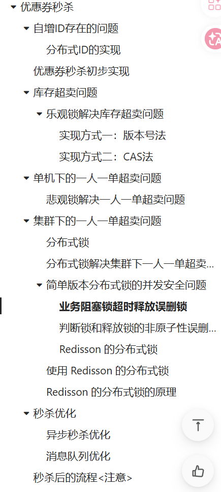
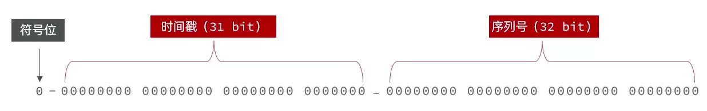
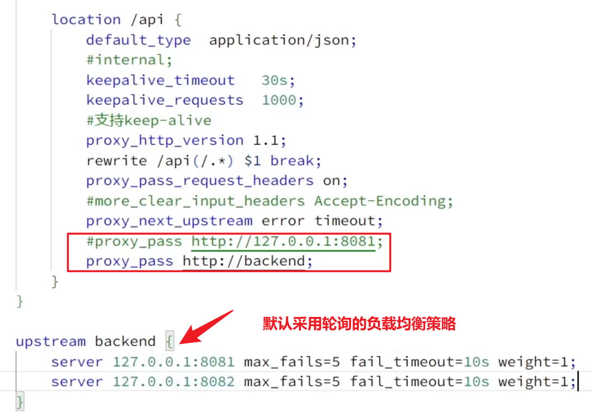
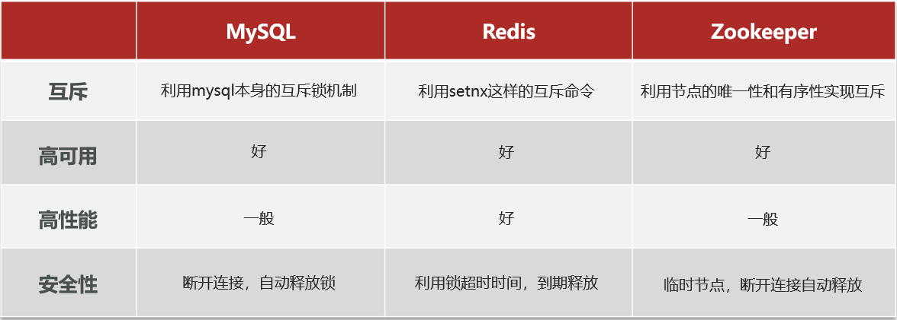
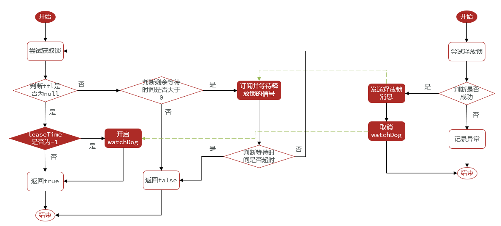
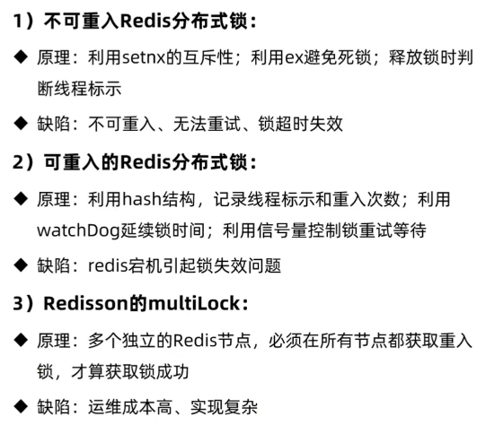
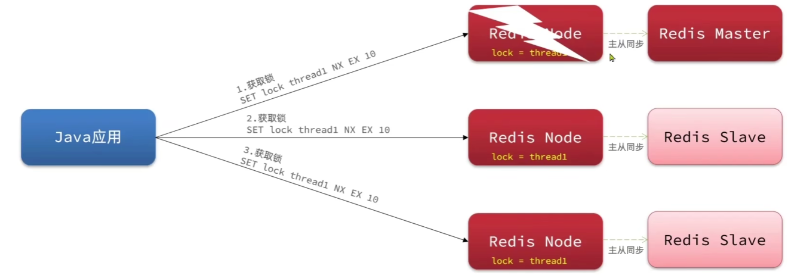
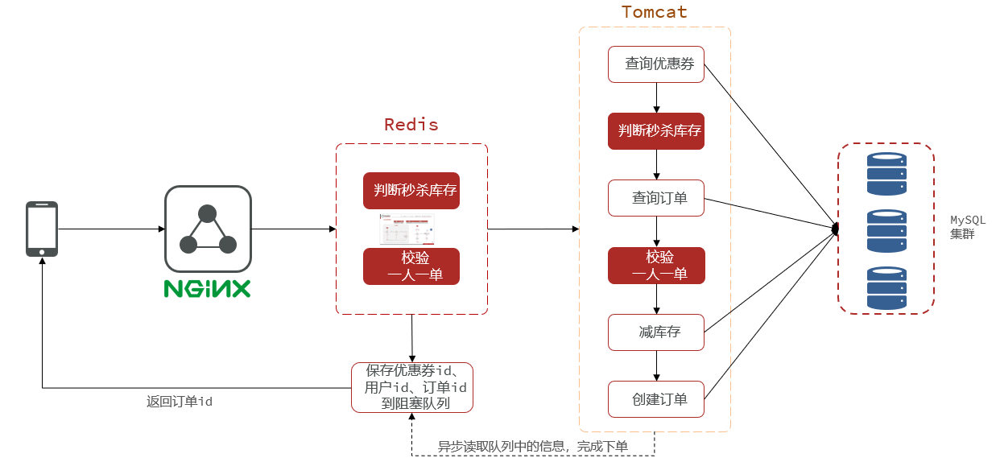
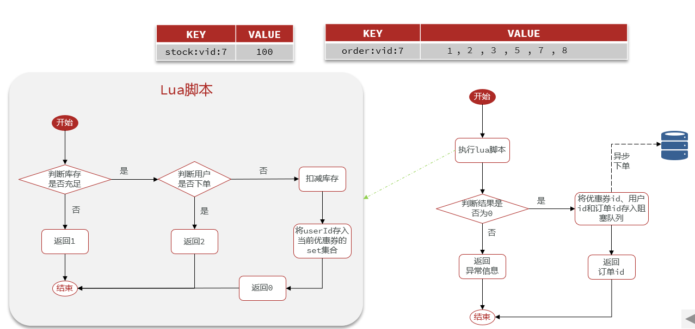
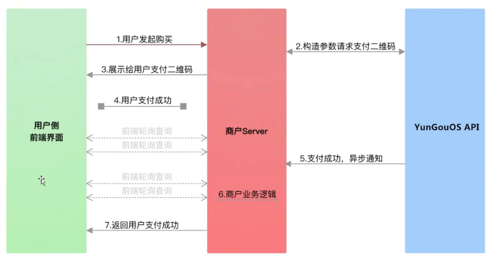

# 优惠券秒杀



自增id存在问题：

- id规律性明显
- 受单表数据量限制，违背唯一性

使用分布式ID（全局唯一ID）：

- 全局唯一性
- 高可用性
- 高性能
- 安全性
- 递增性

## 分布式ID实现



符号位、时间戳、序列号

**分布式ID生成器**

```java
@Component
public class RedisIdWorker {

    @Resource
    private StringRedisTemplate stringRedisTemplate;
    /**
     * 开始时间戳
     */
    private static final long BEGIN_TIMESTAMP = 1640995200;
    /**
     * 序列化位数
     */
    private static final int COUNT_BITS = 32;

    /**
     * 生成分布式ID
     * @param keyPrefix 业务前缀，不同的业务使用不同的key
     * @return
     */
    public long nextId(String keyPrefix){
        // 1、生成时间戳
        LocalDateTime now = LocalDateTime.now();
        long nowSecond = now.toEpochSecond(ZoneOffset.UTC);
        long timestamp = nowSecond - BEGIN_TIMESTAMP;
        // 2、生成序列号
        // 以当天的时间戳为key，防止一直自增下去导致超时，这样每天的极限都是 2^{31}
        String date = now.format(DateTimeFormatter.ofPattern("yyyy:MM:dd"));
        Long count = stringRedisTemplate.opsForValue().increment("icr:" + keyPrefix + ":" + date);
        // 3、拼接并返回
        return timestamp << COUNT_BITS | count;
    }

    public static void main(String[] args) {
        LocalDateTime time = LocalDateTime.of(2022, 1, 1, 0, 0, 0);
        long second = time.toEpochSecond(ZoneOffset.UTC);
        System.out.println("second = " + second);
    }
}
```

**测试类**

```java
@SpringBootTest
public class RedisIdWorkerTest {

    @Resource
    private RedisIdWorker redisIdWorker;

    private ExecutorService es = Executors.newFixedThreadPool(500);

    /**
     * 测试分布式ID生成器的性能，以及可用性
     */
    @Test
    public void testNextId() throws InterruptedException {
        // 使用CountDownLatch让线程同步等待
        CountDownLatch latch = new CountDownLatch(300);
        // 创建线程任务
        Runnable task = () -> {
            for (int i = 0; i < 100; i++) {
                long id = redisIdWorker.nextId("order");
                System.out.println("id = " + id);
            }
            // 等待次数-1
            latch.countDown();
        };
        long begin = System.currentTimeMillis();
        // 创建300个线程，每个线程创建100个id，总计生成3w个id
        for (int i = 0; i < 300; i++) {
            es.submit(task);
        }
        // 线程阻塞，直到计数器归0时才全部唤醒所有线程
        latch.await();
        long end = System.currentTimeMillis();
        System.out.println("生成3w个id共耗时" + (end - begin) + "ms");
    }
}
```

**业务流程**

1. 库存是否充足
2. 秒杀时间是否到

扣减库存、创建订单 是两次MySQL操作，所以使用**@Transactional**保证事务同成功同失败

```java
@Service
public class VoucherOrderServiceImpl extends ServiceImpl<VoucherOrderMapper, VoucherOrder> implements IVoucherOrderService {

    @Resource
    private ISeckillVoucherService seckillVoucherService;

    @Resource
    private RedisIdWorker redisIdWorker;

    /**
     * 抢购秒杀券
     */
    @Transactional
    @Override
    public Result seckillVoucher(Long voucherId) {
        // 1、查询秒杀券
        SeckillVoucher voucher = seckillVoucherService.getById(voucherId);
        // 2、判断秒杀券是否合法
        if (voucher.getBeginTime().isAfter(LocalDateTime.now())) {
            // 秒杀券的开始时间在当前时间之后
            return Result.fail("秒杀尚未开始");
        }
        if (voucher.getEndTime().isBefore(LocalDateTime.now())) {
            // 秒杀券的结束时间在当前时间之前
            return Result.fail("秒杀已结束");
        }
        // 3、判断库存是否充足
        if (voucher.getStock() < 1) {
            return Result.fail("秒杀券已抢空");
        }
        // 4、扣减库存
        boolean success = seckillVoucherService.update()
                .setSql("stock = stock -1")
                .eq("voucher_id", voucherId).update();
        if (!success) {
            throw new RuntimeException("秒杀券扣减库存失败");
        }
        // 5、创建订单
        VoucherOrder voucherOrder = new VoucherOrder();
        // 分布式ID作为订单主键ID
        long orderId = redisIdWorker.nextId("order");
        voucherOrder.setId(orderId);
        voucherOrder.setUserId(UserHolder.getUser().getId());
        voucherOrder.setVoucherId(voucherId);
        save(voucherOrder);
        // 6、返回订单id
        return Result.ok(orderId);
    }
}
```

## 库存超卖（客观锁+悲观锁）

 Jmeter 进行压力测试，并发出现安全问题

解决方法：

- **悲观锁**：先获取锁，方法：`synchronized`、`lock`

- **乐观锁**：不加锁，只会在更新数据库的时候去判断有没有其它线程对数据进行修改。方法：版本号法、CAS操作、乐观锁算法

  - 方法1：版本号法

    - 为 tb_seckill_voucher 表新增一个版本号字段 version 。
    - 查询时不仅查库存，还要查版本号
    - 更新时检查版本号是否未变化(通过where条件实现)，若未变化则更新库存并递增版本号。

  - 方法2：CAS法

    - 直接使用库存替代版本号

      ```java
      // 4、扣减库存
      boolean success = seckillVoucherService.update()
              .setSql("stock = stock -1")
              .eq("voucher_id", voucherId)
              .eq("stock", voucher.getStock())
              .update();
      ```

乐观锁的**弊端**：只要发现数据有修改，就直接终止操作了，导致成功率低。
更改为：只要库存大于0就可以进行修改。

```java
// 4、扣减库存
boolean success = seckillVoucherService.update()
        .setSql("stock = stock -1")
        .eq("voucher_id", voucherId)
        .gt("stock", 0)
        .update();
```

## 一人一单

### 单机一人一单

同一个优惠券，一个用户只能下一单

方法：增加 根据优惠券id和用户id查询订单

```java
@Service
public class VoucherOrderServiceImpl extends ServiceImpl<VoucherOrderMapper, VoucherOrder> implements IVoucherOrderService {

    @Resource
    private ISeckillVoucherService seckillVoucherService;

    @Resource
    private RedisIdWorker redisIdWorker;

    /**
     * 抢购秒杀券
     */
    @Transactional
    @Override
    public Result seckillVoucher(Long voucherId) {
        // 1、查询秒杀券
        SeckillVoucher voucher = seckillVoucherService.getById(voucherId);
        // 2、判断秒杀券是否合法
        if (voucher.getBeginTime().isAfter(LocalDateTime.now())) {
            // 秒杀券的开始时间在当前时间之后
            return Result.fail("秒杀尚未开始");
        }
        if (voucher.getEndTime().isBefore(LocalDateTime.now())) {
            // 秒杀券的结束时间在当前时间之前
            return Result.fail("秒杀已结束");
        }
        // 3、判断库存是否充足
        if (voucher.getStock() < 1) {
            return Result.fail("秒杀券已抢空");
        }
        // 4、一人一单校验
        Long userId = UserHolder.getUser().getId();
        int count = query().eq("user_id", userId).eq("voucher_id", voucherId).count();
        if(count > 0){
            // 用户已购买过该优惠券
            return Result.fail("用户已购买过该优惠券");
        }
        // 5、扣减库存
        boolean success = seckillVoucherService.update()
                .setSql("stock = stock -1")
                .eq("voucher_id", voucherId)
                .gt("stock", 0)
                .update();
        if (!success) {
            throw new RuntimeException("秒杀券扣减库存失败");
        }
        // 6、创建订单
        VoucherOrder voucherOrder = new VoucherOrder();
        long orderId = redisIdWorker.nextId("order");
        voucherOrder.setId(orderId);
        voucherOrder.setUserId(userId);
        voucherOrder.setVoucherId(voucherId);
        save(voucherOrder);
        // 7、返回订单id
        return Result.ok(orderId);
    }
}
```

但同时存在并发安全问题，这个业务中是判断用户是否购买过，即判断是否存在数据库记录，而不是判断是否修改过，所以无法使用乐观锁方案，而是使用悲观锁方案

即：

- 乐观锁：判断修改过
- 悲观锁：判断是否存在数据库记录（只能）

最终使用悲观锁

```java
@Service
public class VoucherOrderServiceImpl extends ServiceImpl<VoucherOrderMapper, VoucherOrder> implements IVoucherOrderService {

    @Resource
    private ISeckillVoucherService seckillVoucherService;

    @Resource
    private RedisIdWorker redisIdWorker;

    /**
     * 抢购秒杀券
     */
    @Override
    public Result seckillVoucher(Long voucherId) {
        // 1、查询秒杀券
        SeckillVoucher voucher = seckillVoucherService.getById(voucherId);
        // 2、判断秒杀券是否合法
        if (voucher.getBeginTime().isAfter(LocalDateTime.now())) {
            // 秒杀券的开始时间在当前时间之后
            return Result.fail("秒杀尚未开始");
        }
        if (voucher.getEndTime().isBefore(LocalDateTime.now())) {
            // 秒杀券的结束时间在当前时间之前
            return Result.fail("秒杀已结束");
        }
        // 3、判断库存是否充足
        if (voucher.getStock() < 1) {
            return Result.fail("秒杀券已抢空");
        }
        Long userId = UserHolder.getUser().getId();
        // 去字符串常量池找字符串对象,使得加锁同一个对象
        // 先获取锁，再开启事务，事务结束后，才会释放锁
        synchronized (userId.toString().intern()) {
            // spring的事务是基于代理对象的,这里直接调用相当于this.xxx,并非代理对象,因此事务不会生效,所以要拿到代理对象
            IVoucherOrderService proxy = (IVoucherOrderService) AopContext.currentProxy();
            return proxy.createVoucherOrder(voucherId);
        }
    }

    @Transactional
    public Result createVoucherOrder(Long voucherId) {
        Long userId = UserHolder.getUser().getId();
        // 4、一人一单校验
        int count = query().eq("user_id", userId).eq("voucher_id", voucherId).count();
        if (count > 0) {
            // 用户已购买过该优惠券
            return Result.fail("用户已购买过该优惠券");
        }
        // 5、扣减库存
        boolean success = seckillVoucherService.update()
                .setSql("stock = stock -1")
                .eq("voucher_id", voucherId)
                .gt("stock", 0)
                .update();
        if (!success) {
            throw new RuntimeException("秒杀券扣减库存失败");
        }
        // 6、创建订单
        VoucherOrder voucherOrder = new VoucherOrder();
        long orderId = redisIdWorker.nextId("order");
        voucherOrder.setId(orderId);
        voucherOrder.setUserId(userId);
        voucherOrder.setVoucherId(voucherId);
        save(voucherOrder);
        // 7、返回订单id
        return Result.ok(orderId);
    }
}
```

**细节**

1. 锁的**范围尽量小**。`synchronized`尽量锁代码块，而不是方法，锁的范围越大性能越低
2. 锁的对象一定要是一个不变的值。我们不能直接锁 `Long` 类型的 userId，每请求一次都会创建一个新的 userId 对象，synchronized 要锁不变的值，所以我们要将 **Long 类型的 userId** 通过 **toString()方法** 转成 `String` 类型的 userId，`toString()`方法底层（可以点击去看源码）是直接 new 一个新的String对象，显然还是在变，所以我们要使用 **`intern()` 方法**从**常量池中寻找与当前字符串值一致的字符串对象**，这就能够保障一个用户 发送多次请求，每次请求的 userId 都是不变的，从而能够完成锁的效果（并行变串行）
3. 我们要**锁住整个事务**，而不是锁住事务内部的代码。 先获取锁，再开启事务，事务结束后，才会释放锁。如果我们锁住事务内部的代码会导致锁释放时，事务未提交，其它线程能够获取锁，仍然会存在超卖问题
4. Spring 的 @Transactional 事务是基于代理对象的，这里直接调用相当于 this.xxx， 并非代理对象，因此事务不会生效，所以**要拿到代理对象**

*（补）*

**生成代理对象生效步骤：**

1. 引入AOP依赖，动态代理

   ```java
   <dependency>
     <groupId>org.aspectj</groupId>
     <artifactId>aspectjweaver</artifactId>
   </dependency>
   ```

2. 暴露动态代理对象，启动类上加入（默认关闭）

​	`@EnableAspectJAutoProxy(exposeProxy = true)`

### 集群一人一单

高并发，部署到多个不同机器

**步骤：**

- `Ctrl+D`：IDEA中启动两个SpringBoot程序，一个端口号是8081，另一个端口是8082

- 在Nginx中配置负载均衡

  

- 准备两个接口，打断点

**存在问题**：存在两个JVM，synchronized不能跨 JVM 进行上锁

因此，使用分布锁。

## 分布式锁

解决集群下一人一单问题，在整个系统的全局中设置一个锁监视器。

**分布式锁的常见实现方法：**



- 基于MySQL：[链接](https://blog.csdn.net/weixin_45683778/article/details/144564485)
- 基于Redis：
- 基于ZooKeeper：[链接](https://blog.csdn.net/baidu_28068985/article/details/108385992)

### 简单分布式锁 setnx

**Redis的`setnx`指令**

- 获取锁`SET lock thread1 NX EX 10`
- 释放锁`DEL key`

**创建分布式锁**

```java
public class SimpleRedisLock implements ILock {

    private String name;
    private StringRedisTemplate stringRedisTemplate;
    private static final String KEY_PREFIX = "lock:";

    public SimpleRedisLock(String name, StringRedisTemplate stringRedisTemplate) {
        this.name = name;
        this.stringRedisTemplate = stringRedisTemplate;
    }

    @Override
    public boolean tryLock(long timeoutSec) {
        String key = KEY_PREFIX + name;
        String value = Thread.currentThread().getId() + "";
        Boolean res = stringRedisTemplate.opsForValue()
                .setIfAbsent(key, value, timeoutSec, TimeUnit.SECONDS);
        return Boolean.TRUE.equals(res);
    }

    @Override
    public void unlock() {
        String key = KEY_PREFIX + name;
        stringRedisTemplate.delete(key);
    }
}
```

**使用分布式锁**

```java
/**
     * 抢购秒杀券
     */
    @Override
    public Result seckillVoucher(Long voucherId) {
        // 1、查询秒杀券
        SeckillVoucher voucher = seckillVoucherService.getById(voucherId);
        // 2、判断秒杀券是否合法
        if (voucher.getBeginTime().isAfter(LocalDateTime.now())) {
            // 秒杀券的开始时间在当前时间之后
            return Result.fail("秒杀尚未开始");
        }
        if (voucher.getEndTime().isBefore(LocalDateTime.now())) {
            // 秒杀券的结束时间在当前时间之前
            return Result.fail("秒杀已结束");
        }
        // 3、判断库存是否充足
        if (voucher.getStock() < 1) {
            return Result.fail("秒杀券已抢空");
        }
        Long userId = UserHolder.getUser().getId();
        // 去字符串常量池找字符串对象,使得加锁同一个对象
        // 先获取锁，再开启事务，事务结束后，才会释放锁
        String key = "order:" + userId;
        // 锁定范围是用户ID
        SimpleRedisLock lock = new SimpleRedisLock(key, stringRedisTemplate);
        boolean isLock = lock.tryLock(1200);
        if(!isLock){
            // 获取锁失败,返回错误或重试,但此时是同一个用户并发多个请求,应该返回错误
            return Result.fail("不允许重复下单");
        }
        // 获取锁成功
        try{
            // spring的事务是基于代理对象的,这里直接调用相当于this.xxx,并非代理对象,因此事务不会生效,所以要拿到代理对象
            IVoucherOrderService proxy = (IVoucherOrderService) AopContext.currentProxy();
            return proxy.createVoucherOrder(voucherId);
        }finally {
            lock.unlock();
        }
    }
```

运行，使用postman发送请求

**存在问题：**线程获取锁后，由于业务阻塞导致超时释放。

### 增加 Value 线程标识

**解决方法：**设置Value作为线程标识，判断是否是自己的锁

```java
public class SimpleRedisLock implements ILock {

    private String name;
    private StringRedisTemplate stringRedisTemplate;
    private static final String KEY_PREFIX = "lock:";
    // ID_PREFIX 区分不同JVM
    private static final String ID_PREFIX = UUID.randomUUID().toString(true) + "-";

    public SimpleRedisLock(String name, StringRedisTemplate stringRedisTemplate) {
        this.name = name;
        this.stringRedisTemplate = stringRedisTemplate;
    }

    @Override
    public boolean tryLock(long timeoutSec) {
        String key = KEY_PREFIX + name;
        // value存入线程标识
        String value = ID_PREFIX + Thread.currentThread().getId();
        Boolean res = stringRedisTemplate.opsForValue()
                .setIfAbsent(key, value, timeoutSec, TimeUnit.SECONDS);
        return Boolean.TRUE.equals(res);
    }

    @Override
    public void unlock() {
        String key = KEY_PREFIX + name;
        String value = ID_PREFIX + Thread.currentThread().getId();
        // 判断value是否一致
        String curValue = stringRedisTemplate.opsForValue().get(key);
        if(value.equals(curValue)) {
            // 释放锁
            stringRedisTemplate.delete(key);
        }
    }
}
```

**存在问题：**判断锁和释放锁的非原子性误删锁

当**线程1**获取锁，执行完业务然后并且**判断完**当前锁是自己的锁时，但就在此时发生了**阻塞**，结果锁被超时释放了。
**线程2**立马就趁虚而入了，获得锁执行业务，但就在此时线程1阻塞完成，由于已经判断过锁，已经确定锁是自己的锁了，于是直接就删除了锁，结果**删的是线程2的锁**。
这就又导致**线程3**趁虚而入了，从而继续发生线程安全问题。

### Lua脚本

注意：在IDEA中编写Lua脚本，需要先下载一个Lua脚本插件 `Tarantool-EmmyLua`

ref：https://www.runoob.com/lua/lua-tutorial.html

**Lua脚本**

```lua
-- 比较缓存中的线程标识与当前线程标识是否一致
if (redis.call('get', KEYS[1]) == ARGV[1]) then
  -- 一致，直接删除
  return redis.call('del', KEYS[1])
end
-- 不一致，返回0
return 0
```

**编写Java代码，使用Lua实现释放锁**

```java
public class SimpleRedisLock implements ILock {

    private StringRedisTemplate stringRedisTemplate;
    // 锁的Key的业务名称
    private String name;
    // 锁的Key的前缀
    private static final String KEY_PREFIX = "lock:";
    // ID_PREFIX 区分不同JVM
    private static final String ID_PREFIX = UUID.randomUUID().toString(true) + "-";
    // Lua脚本
    private static final DefaultRedisScript<Long> UNLOCK_SCRIPT;
    static {
        UNLOCK_SCRIPT = new DefaultRedisScript<>();
        UNLOCK_SCRIPT.setLocation(new ClassPathResource("unlock.lua"));
        UNLOCK_SCRIPT.setResultType(Long.class);
    }

    public SimpleRedisLock(String name, StringRedisTemplate stringRedisTemplate) {
        this.name = name;
        this.stringRedisTemplate = stringRedisTemplate;
    }

    @Override
    public boolean tryLock(long timeoutSec) {
        String key = KEY_PREFIX + name;
        // value存入线程标识
        String value = ID_PREFIX + Thread.currentThread().getId();
        Boolean res = stringRedisTemplate.opsForValue()
                .setIfAbsent(key, value, timeoutSec, TimeUnit.SECONDS);
        return Boolean.TRUE.equals(res);
    }

    @Override
    public void unlock() {
        // 判断锁和释放锁的非原子性误删锁 使用Lua脚本解决
        stringRedisTemplate.execute(
                UNLOCK_SCRIPT,
                Collections.singletonList(KEY_PREFIX + name),
                ID_PREFIX + Thread.currentThread().getId()
        );
    }
}
```

**存在问题：**

- 不可重入：同一线程不能重复获取同一把锁
- 不可重试
- 超时释放：超时释放机制虽然避免了死锁发生，但是如果业务执行耗时过长，也会导致锁释放，另外的线程同样可以获取到锁（TTL不好设置）
- 主从一致性

**解决方法：**使用`Redisson`

**1）引入依赖**

```xml
<dependency>
  <groupId>org.redisson</groupId>
  <artifactId>redisson</artifactId>
  <version>3.13.6</version>
</dependency>
```

**2）配置客户端**

```java
@Configuration
public class RedissonConfig {

    /**
     * 创建Redisson配置对象，然后交给IOC管理
     */
    @Bean
    public RedissonClient redissonClient() {
        // 配置类
        Config config = new Config();
        // 添加redis地址，这里添加的是单节点地址，也可以通过 config.userClusterServers()添加集群地址
        config.useSingleServer().setAddress("redis://127.0.0.1:6379").setPassword("123321");
        // 获取获取Redisson客户端对象，并交给IOC进行管理
        return Redisson.create(config);
    }
}
```

**3）使用Redisson的分布式锁**

```java
@Override
    public Result seckillVoucher(Long voucherId) {
        // 1、查询秒杀券
        SeckillVoucher voucher = seckillVoucherService.getById(voucherId);
        // 2、判断秒杀券是否合法
        if (voucher.getBeginTime().isAfter(LocalDateTime.now())) {
            // 秒杀券的开始时间在当前时间之后
            return Result.fail("秒杀尚未开始");
        }
        if (voucher.getEndTime().isBefore(LocalDateTime.now())) {
            // 秒杀券的结束时间在当前时间之前
            return Result.fail("秒杀已结束");
        }
        // 3、判断库存是否充足
        if (voucher.getStock() < 1) {
            return Result.fail("秒杀券已抢空");
        }
        Long userId = UserHolder.getUser().getId();
        // 去字符串常量池找字符串对象,使得加锁同一个对象
        // 先获取锁，再开启事务，事务结束后，才会释放锁
        String key = "order:" + userId;
        // 锁定范围是用户ID
        RLock lock = redissonClient.getLock(key);
        boolean isLock = lock.tryLock();
        // SimpleRedisLock lock = new SimpleRedisLock(key, stringRedisTemplate);
        // boolean isLock = lock.tryLock(1200);
        if(!isLock){
            // 获取锁失败,返回错误或重试,但此时是同一个用户并发多个请求,应该返回错误
            return Result.fail("不允许重复下单");
        }
        // 获取锁成功
        try{
            // spring的事务是基于代理对象的,这里直接调用相当于this.xxx,并非代理对象,因此事务不会生效,所以要拿到代理对象
            IVoucherOrderService proxy = (IVoucherOrderService) AopContext.currentProxy();
            return proxy.createVoucherOrder(voucherId);
        }finally {
            lock.unlock();
        }
    }
```

`tryLock`

1. 无参
   - waitTime 的默认值是-1，代表不重试，只尝试一次，成功返回 `true`，失败返回 `false`，
   - `leaseTime`锁超时自动释放的时间，防死锁，如果不设置默认情况下是会开启看门狗机制
   - `unit`默认值是 seconds ，也就是锁超过30秒还没有释放就自动释放
2. 有参
   - `waitTime`：在等待时间内不断重试获取锁（超时返回 `false`）
   - `leaseTime`：锁超时自动释放的时间，防死锁
   - `unit`：时间单位（如 `TimeUnit.SECONDS`）

### Redisson分布式锁原理



- 如何解决可重入问题：利用 **Hash结构** 能记录线程标识和线程重入次数
  - 只有减为0的时候，才释放锁
- 如何解决可重试问题：利用信号量和`PubSub`功能实现等待、唤醒，获取锁失败的重试机制
- 如何解决超时续约问题：设计`watchDog`机制，每隔一段时间（releaseTime / 3），重置超时时间
- 如何解决主从一致性问题：在多主多从的情况下，使用Redisson的 联锁或红锁



1. Redisson底层通过利用Lua脚本确保原子性（可重入性、原子性）

2. 底层通过 **信号量**+**发布订阅模式** 实现可重试机制（可重试性）

3. 看门狗，国企自动续约，递归调用直到订阅结束（防止超时释放）

4. multiLock，只有全都取到才可以运行该线程

   

## Redis优化秒杀

**存在问题**：有大量的数据库的操作，整个业务的性能并不好

**解决方法**：如下图

优惠券库存信息和订单信息 存在Redis里



**数据类型**

- 优惠券库存信息：因为只需要存储一个库存信息
  - 使用 String 即可，key：业务前缀+优惠券的ID  ； value：剩余库存
  - 当想要校验库存时，只需要判断value库存是否大于0
  - 注意，当判断用户有下单资格后，需要将value值-1，相当于在Redis预减库存

- 订单信息：因为要记录下一个优惠券被哪些用户(集合)购买了，
  - 使用 Set 即可，key：业务前缀+优惠券的ID  value：所有购买过该优惠券的用户ID
  - 当想要校验一人一单时，只需要判断对应优惠券里是否已有该用户ID



将订单ID返回给用户，用户就可以依靠订单ID去下单支付

**代码过程**

- 将优惠券保存到Redis
- 基于Lua脚本，判断秒杀库存、一人一单 -> 是否抢购成功
- 抢购成功，优惠券id和用户id封装后存入阻塞队列
- 开启线程，从阻塞队列获取信息，实现异步下单

**存储优惠券信息**

```java
 @Override
    @Transactional
    public void addSeckillVoucher(Voucher voucher) {
        // 保存优惠券
        save(voucher);
        // 保存秒杀信息
        SeckillVoucher seckillVoucher = new SeckillVoucher();
        seckillVoucher.setVoucherId(voucher.getId());
        seckillVoucher.setStock(voucher.getStock());
        seckillVoucher.setBeginTime(voucher.getBeginTime());
        seckillVoucher.setEndTime(voucher.getEndTime());
        seckillVoucherService.save(seckillVoucher);
        // 保存秒杀库存到Redis中
        stringRedisTemplate.opsForValue().set(SECKILL_STOCK_KEY + voucher.getId(), voucher.getStock().toString());
    }
```

**Lua脚本，判断**

```java
-- 优惠券id
local voucherId = ARGV[1];
-- 用户id
local userId = ARGV[2];

-- 库存的key
local stockKey = 'seckill:stock:' .. voucherId;
-- 订单key
local orderKey = 'seckill:order:' .. voucherId;

-- 判断库存是否充足 get stockKey > 0 ?
local stock = redis.call('GET', stockKey);
if (tonumber(stock) <= 0) then
  -- 库存不足，返回1
  return 1;
end

-- 库存充足，判断用户是否已经下过单 SISMEMBER orderKey userId
if (redis.call('SISMEMBER', orderKey, userId) == 1) then
  -- 重复下单，返回2
  return 2;
end

-- 库存充足，没有下过单，扣库存、下单
redis.call('INCRBY', stockKey, -1);
redis.call('SADD', orderKey, userId);
-- 返回0，标识下单成功
return 0;
```

秒杀接口

```java
@Slf4j
@Service
public class VoucherOrderServiceImpl extends ServiceImpl<VoucherOrderMapper, VoucherOrder> implements IVoucherOrderService {

    @Resource
    private ISeckillVoucherService seckillVoucherService;

    @Resource
    private RedisIdWorker redisIdWorker;

    @Resource
    private StringRedisTemplate stringRedisTemplate;

    // Lua脚本
    private static final DefaultRedisScript<Long> SECKILL_SCRIPT;
    static {
        SECKILL_SCRIPT = new DefaultRedisScript<>();
        SECKILL_SCRIPT.setLocation(new ClassPathResource("seckill.lua"));
        SECKILL_SCRIPT.setResultType(Long.class);
    }

    // 存储订单的阻塞队列,参数为队列长度
    private BlockingQueue<VoucherOrder> orderTasks = new ArrayBlockingQueue<>(1024 * 1024);
    // 执行任务的线程池, ctrl+shift+U 转换大写
    private static final ExecutorService SECKILL_ORDER_EXECUTOR = Executors.newSingleThreadExecutor();
    // 任务
    private class VoucherOrderHandler implements Runnable {
        @Override
        public void run() {
            while (true) { // 并不会对CPU造成负担,因为下面有take
                // 从阻塞队列中获取订单信息，完成库存扣减和订单生成
                try {
                    // take() 获取和删除该队列的头部,如果需要则等待直到元素可用
                    VoucherOrder voucherOrder = orderTasks.take();
                    handleVoucherOrder(voucherOrder);
                } catch (Exception e) {
                    log.error("处理订单异常", e);
                }
            }
        }
    }

    // 完成库存扣减和订单生成
    private void handleVoucherOrder(VoucherOrder voucherOrder) {
        // 在Redis已经做了库存是否充足和一人一单的校验,能够到这里说明用户已经秒杀成功了,所以这里其实不需要加锁
        // 1.扣减库存
        boolean success = seckillVoucherService.update()
                .setSql("stock = stock -1")
                .eq("voucher_id", voucherOrder.getId())
                .gt("stock", 0)
                .update();
        if(!success){
            // 扣减库存失败
            log.error("库存不足");
            return;
        }
        // 2.创建订单
        save(voucherOrder);
    }

    // 当前类初始化完毕就立马执行该方法
    @PostConstruct
    private void init() {
        // 执行线程任务
        SECKILL_ORDER_EXECUTOR.submit(new VoucherOrderHandler());
    }

    /**
     * 抢购秒杀券
     */
    @Override
    public Result seckillVoucher(Long voucherId) {
        Long userId = UserHolder.getUser().getId();
        // 1.执行lua脚本,判断是否有资格下单
        Long result = stringRedisTemplate.execute(
                SECKILL_SCRIPT,
                Collections.emptyList(),
                voucherId.toString(),
                userId.toString()
        );
        if(result == 1){
            return Result.fail("库存不足");
        }
        if(result == 2){
            return Result.fail("重复下单");
        }
        // 有购买资格
        long orderId = redisIdWorker.nextId("order");
        // 2.保存信息到阻塞队列,会有一个线程不断从当中取出信息,执行扣库存和生成订单
        VoucherOrder voucherOrder = new VoucherOrder();
        voucherOrder.setId(orderId);    // 订单ID
        voucherOrder.setUserId(userId); // 用户ID
        voucherOrder.setVoucherId(voucherId); // 优惠券ID
        orderTasks.add(voucherOrder);
        return Result.ok(orderId);
    }
}
```

**存在问题**：使用的是JVM使用阻塞队列，会有 **内存限制和数据安全**

- 超出队列的上限
- 没有持久化机制，宕机重启时，订单任务会丢失

**解决方法**：使用消息队列代替阻塞队列

- 处于jvm外部，不依赖内存，独立存储
- 做消息持久化
- 需要消费者做消息确认

Redis里面用来做数据存储的都支持持久化

## 消息队列

### 使用Redis的消息队列

不需要再新引入消息队列组件，降低(费用和运维)成本

#### list

Redis的数据类型

使用 **BRPOP** 和 **BLPOP**

**优点**

- Redis存储，不受限JVM内存上限
- 基于Redis持久化
- 满足有序性

**缺点**

- 消息丢失
- 单消费者

#### pubsub

**优点**

- 订阅模型，多生产多消费

**缺点**

- 不支持持久化
- 消息丢失
- 堆积上限，超出数据丢失

#### Stream

Redis引入的新数据类型

- XADD
- XREAD

**缺点**：多条消息出现，但只能获取最新的一条，出现漏读消息问题

##### 消费者组

- XGROUP
- XREADGROUP

### 更成熟的消息队列

Kafka、RocketMQ、RabbitMQ，

## 总结

1. 自增ID问题：分布式ID
2. 单机下库存超卖：乐观锁
3. 一人一单：悲观锁synchronized
4. 集群下（悲观锁synchronized只能在一个JVM中可见，并不能保证一人一单）：分布式锁`setnx`
5. 存在并发安全问题：进行优化，Value线程标识、Lua脚本
6. 优化后，不可重入、不可重试、TTL不好设置、主从一致性问题：`Redisson`
7. 以上造成业务性能差，因此进行优化，采用异步方式
8. 会有内存限制和数据安全，使用消息队列

## 最后

秒杀接口最终返回给前端一个订单ID 

只返回订单ID其实应该是简化的，例如接入第三方支付，应该是需要调用第三方支付API，去构造一个凭证，返回这个凭证。用户端根据凭证其实就会拉起支付页面，例如接入第三方支付，支付结果(成功或失败)，第三方能够感知到。并且第三方应该会有一个异步回调到后台服务，告知支付结果，后台服务再去做订单状态的更新或其他处理

1. 后台判断用户下单资格
2. 后台调用第三方支付API获取拉起支付页面的参数
3. 后台异步生成订单
4. 用户端展示支付页面，用户支付成功或失败
5. 第三方感知支付结果
6. 第三方回调后台服务，通知支付结果
7. 后台接收支付结果，做订单状态的更新或其他处理




