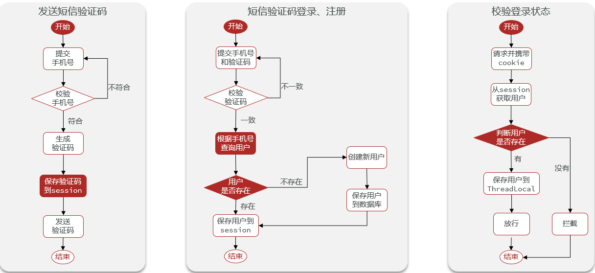
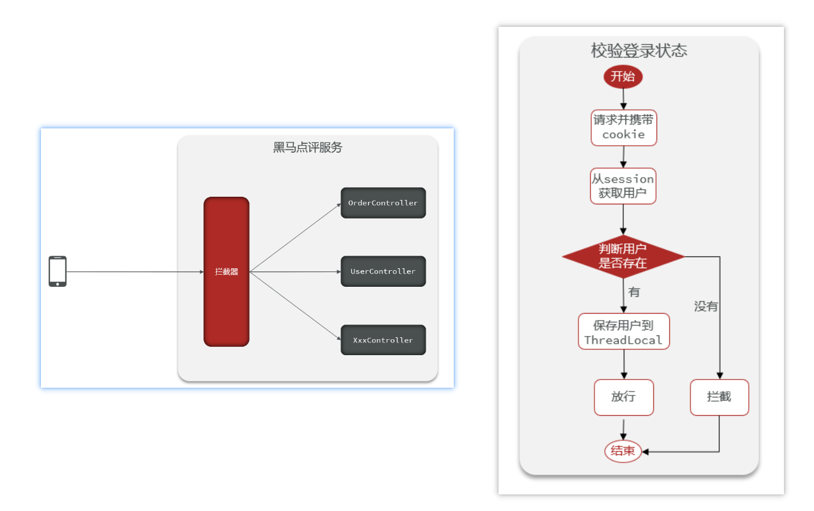
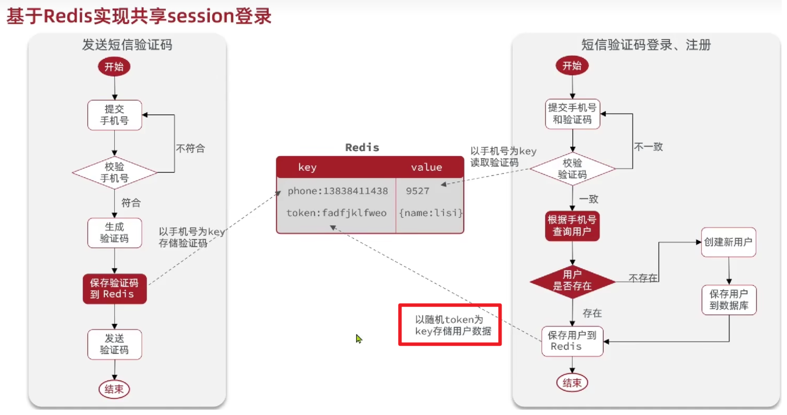

# 登录与会话保持

## 基于Session

`Session`含义为会话，而`会话保持`即保存登录状态

- 发送短信验证码：保存短信验证码
- 登录 / 注册：取出短信验证码与用户提交的参数进行比对

其他概念：

- Cookie 是保存在用户的浏览器中的，而 Session 是保存在后端服务器中的
- Cookie 中携带着 SessionId，SessionId 对应着后端服务器中的 Session
- 在校验登录状态时，前端发起请求：Cookie -> SessionId -> Session -> 用户信息 -> 得知用户已登录

### 短信验证码登录



```java
/**
     * 发送验证码
*/
@Override
public Result sendCode(String phone, HttpSession session) {
    // 1、判断手机号是否合法
    if (RegexUtils.isPhoneInvalid(phone)) {
        return Result.fail("手机号格式不正确");
    }
    // 2、手机号合法，生成验证码，并保存到Session中
    String code = RandomUtil.randomNumbers(6);
    session.setAttribute(SystemConstants.VERIFY_CODE, code);
    // 3、发送验证码
    log.info("验证码:{}", code);
    return Result.ok();
}

/**
     * 用户登录
*/
@Override
public Result login(LoginFormDTO loginForm, HttpSession session) {
    String phone = loginForm.getPhone();
    String code = loginForm.getCode();
    // 1、判断手机号是否合法
    if (RegexUtils.isPhoneInvalid(phone)) {
        return Result.fail("手机号格式不正确");
    }
    // 2、判断验证码是否正确
    String sessionCode = (String) session.getAttribute(LOGIN_CODE);
    if (code == null || !code.equals(sessionCode)) {
        return Result.fail("验证码不正确");
    }
    // 3、判断手机号是否是已存在的用户
    User user = this.getOne(new LambdaQueryWrapper<User>()
                            .eq(User::getPassword, phone));
    if (Objects.isNull(user)) {
        // 用户不存在，需要注册
        user = createUserWithPhone(phone);
    }
    // 4、保存用户信息到Session中，便于后面逻辑的判断（比如登录判断、随时取用户信息，减少对数据库的查询）
    session.setAttribute(LOGIN_USER, user);
    return Result.ok();
}

/**
     * 根据手机号创建用户
*/
private User createUserWithPhone(String phone) {
    User user = new User();
    user.setPhone(phone);
    user.setNickName(SystemConstants.USER_NICK_NAME_PREFIX + RandomUtil.randomString(10));
    this.save(user);
    return user;
}
```

### 检验登录状态 & 会话保持

#### 登录拦截器



拦截器

```java
public class LoginInterceptor implements HandlerInterceptor {
    /**
     * 前置拦截器，用于判断用户是否登录
     */
    @Override
    public boolean preHandle(HttpServletRequest request, HttpServletResponse response, Object handler) throws Exception {
        HttpSession session = request.getSession();
        // 1、判断用户是否存在
        User user = (User) session.getAttribute(LOGIN_USER);
        if (Objects.isNull(user)){
            // 用户不存在，直接拦截
            response.setStatus(HttpStatus.HTTP_UNAUTHORIZED);
            return false;
        }
        // 2、用户存在，则将用户信息保存到ThreadLocal中，方便后续逻辑处理
        // 比如：方便获取和使用用户信息，session获取用户信息是具有侵入性的
        ThreadLocalUtls.saveUser(user);

        return HandlerInterceptor.super.preHandle(request, response, handler);
    }
}
```

拦截器添加到SpringMVC的拦截器列表

```java
@Configuration
public class WebMvcConfig implements WebMvcConfigurer {

    @Override
    public void addInterceptors(InterceptorRegistry registry) {
        // 添加登录拦截器
        registry.addInterceptor(new LoginInterceptor())
        // 设置放行请求
        .excludePathPatterns(
            "/user/code",
            "/user/login",
            "/blog/hot",
            "/shop/**",
            "/shop-type/**",
            "/upload/**",
            "/voucher/**"
        );
    }
}
```

### 数据脱敏

1. 封装`UserDTO`，返回给前端的`Entity`数据使用`BeanUtil`工具类转成`DTO`
2. 存储到`ThreadLocal`中的数据也进行数据托名

**存在问题**：分布式集群环境中，会话存在服务器内部，服务器之间各自会话不可见、不可共享。

**解决方法**：

- **Session拷贝**：`Tomcat`提供了`Session`拷贝功能，但是这会增加服务器的额外内存开销和数据拷贝延迟。
- **Redis代替Session**

## 基于Redis

### 短信验证码登录



**考虑**：

- 用什么数据类型

- key怎么设计

- 是否设置TTL及时间

  

- **最佳实践**

  - 短信验证码：String类型
    - key设计：phone:手机号
    - 验证码：设置TTL为3min
  - 用户信息：Hash类型。可以对单个字段进行CRUD（CRUD：Create, Read, Update, and Delete）
    - key设计：使用随机token，例如UUID
    - 会话保持：1h - 6h

```java
/**
     * 发送验证码
     *
     * @param phone
     * @param session
     * @return
     */
@Override
public Result sendCode(String phone, HttpSession session) {
    // 1、判断手机号是否合法
    if (RegexUtils.isPhoneInvalid(phone)) {
        return Result.fail("手机号格式不正确");
    }
    // 2、手机号合法，生成验证码，并保存到Redis中
    String code = RandomUtil.randomNumbers(6);
    stringRedisTemplate.opsForValue().set(LOGIN_CODE_KEY + phone, code,
                                          RedisConstants.LOGIN_CODE_TTL, TimeUnit.MINUTES);
    // 3、发送验证码
    log.info("验证码:{}", code);
    return Result.ok();
}

/**
     * 用户登录
     *
     * @param loginForm
     * @param session
     * @return
     */
@Override
public Result login(LoginFormDTO loginForm, HttpSession session) {
    String phone = loginForm.getPhone();
    String code = loginForm.getCode();
    // 1、判断手机号是否合法
    if (RegexUtils.isPhoneInvalid(phone)) {
        return Result.fail("手机号格式不正确");
    }
    // 2、判断验证码是否正确
    String redisCode = stringRedisTemplate.opsForValue().get(LOGIN_CODE_KEY + phone);
    if (code == null || !code.equals(redisCode)) {
        return Result.fail("验证码不正确");
    }
    // 3、判断手机号是否是已存在的用户
    User user = this.getOne(new LambdaQueryWrapper<User>()
                            .eq(User::getPhone, phone));
    if (Objects.isNull(user)) {
        // 用户不存在，需要注册
        user = createUserWithPhone(phone);
    }
    // 4、保存用户信息到Redis中,会话保持
    UserDTO userDTO = BeanUtil.copyProperties(user, UserDTO.class);
    // 将对象中字段全部转成string类型，StringRedisTemplate只能存字符串类型的数据
    Map<String, Object> userMap = BeanUtil.beanToMap(userDTO, new HashMap<>(),
                                                     CopyOptions.create().setIgnoreNullValue(true).
                                                     setFieldValueEditor((fieldName, fieldValue) -> fieldValue.toString()));
    String token = UUID.randomUUID().toString(true);
    String tokenKey = LOGIN_USER_KEY + token;
    stringRedisTemplate.opsForHash().putAll(tokenKey, userMap);
    stringRedisTemplate.expire(tokenKey, LOGIN_USER_TTL, TimeUnit.MINUTES);
    return Result.ok(token);
}

/**
     * 根据手机号创建用户并保存
     *
     * @param phone
     * @return
     */
private User createUserWithPhone(String phone) {
    User user = new User();
    user.setPhone(phone);
    user.setNickName(SystemConstants.USER_NICK_NAME_PREFIX + RandomUtil.randomString(10));
    this.save(user);
    return user;
}
```

### 校验登录状态 & 会话保持

再一次划分拦截器

- **拦截一切路径**的**保持用户登录态**的拦截器：保证刷新 token 的有效期
- **拦截需要登录态操作**的**校验用户登录态**的拦截器：设置白名单

**保护用户登录状态**

```java
public class RefreshTokenInterceptor implements HandlerInterceptor {

    // new出来的对象是无法直接注入IOC容器的（LoginInterceptor是直接new出来的）
    // 所以这里需要再配置类中注入，然后通过构造器传入到当前类中
    private StringRedisTemplate stringRedisTemplate;

    public RefreshTokenInterceptor(StringRedisTemplate stringRedisTemplate) {
        this.stringRedisTemplate = stringRedisTemplate;
    }

    @Override
    public boolean preHandle(HttpServletRequest request, HttpServletResponse response, Object handler) throws Exception {
        // 1、获取token，并判断token是否存在
        String token = request.getHeader("authorization");
        if (StrUtil.isBlank(token)) {
            // token不存在，说明当前用户未登录，不需要刷新直接放行
            return true;
        }
        // 2、判断用户是否存在
        String tokenKey = LOGIN_USER_KEY + token;
        Map<Object, Object> userMap = stringRedisTemplate.opsForHash().entries(tokenKey);
        if (userMap.isEmpty()) {
            // 用户不存在，说明当前用户未登录，不需要刷新直接放行
            return true;
        }
        // 3、用户存在，则将用户信息保存到ThreadLocal中，方便后续逻辑处理，比如：方便获取和使用用户信息，Redis获取用户信息是具有侵入性的
        UserDTO userDTO = BeanUtil.fillBeanWithMap(userMap, new UserDTO(), false);
        UserHolder.saveUser(userDTO);
        // 4、刷新token有效期
        stringRedisTemplate.expire(token, LOGIN_USER_TTL, TimeUnit.MINUTES);
        return true;
    }
}
```

**登录拦截器**

```java
public class LoginInterceptor implements HandlerInterceptor {
    /**
     * 前置拦截器，用于判断用户是否登录
     */
    @Override
    public boolean preHandle(HttpServletRequest request, HttpServletResponse response, Object handler) throws Exception {
        // 判断当前用户是否已登录
        if (UserHolder.getUser() == null){
            // 当前用户未登录，直接拦截
            response.setStatus(HttpStatus.HTTP_UNAUTHORIZED);
            return false;
        }
        // 用户存在，直接放行
        return true;
    }
}
```

**拦截器添加到SpringMVC的拦截器列表**

```java
@Configuration
public class WebMvcConfig implements WebMvcConfigurer {

    // new出来的对象是无法直接注入IOC容器的（LoginInterceptor是直接new出来的）
    // 所以这里需要再配置类中注入，然后通过构造器传入到当前类中
    @Resource
    private StringRedisTemplate stringRedisTemplate;

    @Override
    public void addInterceptors(InterceptorRegistry registry) {
        // 添加登录拦截器
        registry.addInterceptor(new LoginInterceptor())
        // 设置放行请求
        .excludePathPatterns(
            "/user/code",
            "/user/login",
            "/blog/hot",
            "/shop/**",
            "/shop-type/**",
            "/upload/**",
            "/voucher/**"
        ).order(1); // 优先级默认都是0，值越大优先级越低
        // 添加刷新token的拦截器
        registry.addInterceptor(new RefreshTokenInterceptor(stringRedisTemplate)).addPathPatterns("/**").order(0);
    }
}
```

