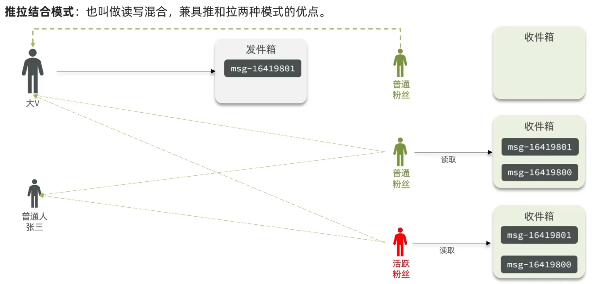

# 达人探店

- 查看笔记
- 点赞
- 点赞排行榜

## 查看笔记

查询博客详情接口的同时，重构了一下查询热点博客的接口

```java
@Service
public class BlogServiceImpl extends ServiceImpl<BlogMapper, Blog> implements IBlogService {

    @Resource
    private IUserService userService;

    @Override
    public Result queryHotBlog(Integer current) {
        // 根据用户查询
        Page<Blog> page = query()
                .orderByDesc("liked")
                .page(new Page<>(current, SystemConstants.MAX_PAGE_SIZE));
        // 获取当前页数据
        List<Blog> records = page.getRecords();
        // 查询用户
        records.forEach(this::queryUserByBlog);
        return Result.ok(records);
    }

    @Override
    public Result queryBlogById(Long id) {
        // 查询博客信息
        Blog blog = getById(id);
        if (blog == null){
            return Result.fail("博客不存在");
        }
        // 查询用户
        queryUserByBlog(blog);
        return Result.ok(blog);
    }

    private void queryUserByBlog(Blog blog) {
        Long userId = blog.getUserId();
        User user = userService.getById(userId);
        blog.setName(user.getNickName());
        blog.setIcon(user.getIcon());
    }
}
```

## 点赞功能

使用`Redis`的`Set`实现一人只能点赞一次

- 给Blog类中添加一个isLike字段，标示是否被当前用户点赞
- 利用Redis的set集合判断是否点赞过，未点赞过则点赞数+1，已点赞过则点赞数-1
- 修改根据id查询Blog的业务，判断当前登录用户是否点赞过，赋值给isLike字段
- 修改分页查询Blog业务，判断当前登录用户是否点赞过，赋值给isLike字段

```java
@Service
public class BlogServiceImpl extends ServiceImpl<BlogMapper, Blog> implements IBlogService {

    @Resource
    private IUserService userService;
    @Resource
    private StringRedisTemplate stringRedisTemplate;

    @Override
    public Result queryHotBlog(Integer current) {
        // 根据用户查询
        Page<Blog> page = query()
                .orderByDesc("liked")
                .page(new Page<>(current, SystemConstants.MAX_PAGE_SIZE));
        // 获取当前页数据
        List<Blog> records = page.getRecords();
        // 查询用户
        records.forEach(blog -> {
            this.queryUserByBlog(blog);
            this.isBlogLiked(blog);
        });
        return Result.ok(records);
    }

    @Override
    public Result queryBlogById(Long id) {
        // 查询博客信息
        Blog blog = getById(id);
        if (blog == null){
            return Result.fail("博客不存在");
        }
        // 查询用户
        queryUserByBlog(blog);
        isBlogLiked(blog);
        return Result.ok(blog);
    }

    private void isBlogLiked(Blog blog) {
        // 1、获取登录用户
        Long userId = UserHolder.getUser().getId();
        // 2、判断当前登录用户是否已经点赞，笔记的id作为key
        String key = "blog:liked:" + blog.getId();
        Boolean isMember = stringRedisTemplate.opsForSet().isMember(key, userId.toString());
        blog.setIsLike(BooleanUtil.isTrue(isMember));
    }


    @Override
    public Result likeBlog(Long id) {
        // 1、获取登录用户
        Long userId = UserHolder.getUser().getId();
        // 2、判断当前登录用户是否已经点赞，笔记的id作为key
        String key = "blog:liked:" + id;
        Boolean isMember = stringRedisTemplate.opsForSet().isMember(key, userId.toString());

        if (BooleanUtil.isFalse(isMember)) {
            // 3、如果未点赞,可以点赞
            // 3.1数据库点赞数 +1
            boolean isSuccess = update().setSql("liked = liked + 1").eq("id", id).update();
            // 3.2保存用户到Redis的set集合
            if (isSuccess) {
                stringRedisTemplate.opsForSet().add(key, userId.toString());
            }
        } else {
            // 4、如果已经点赞,取消点赞
            // 4.1数据库点赞数-1
            boolean isSuccess = update().setSql("liked = liked - 1").eq("id", id).update();
            // 4.2把用户从Redis的set集合中移除
            if (isSuccess) {
                stringRedisTemplate.opsForSet().remove(key, userId.toString());
            }
        }
        return Result.ok();
    }

    private void queryUserByBlog(Blog blog) {
        Long userId = blog.getUserId();
        User user = userService.getById(userId);
        blog.setName(user.getNickName());
        blog.setIcon(user.getIcon());
    }
}
```

## 点赞排行榜

`SortedSet`

```java
@Service
public class BlogServiceImpl extends ServiceImpl<BlogMapper, Blog> implements IBlogService {

    @Resource
    private IUserService userService;
    @Resource
    private StringRedisTemplate stringRedisTemplate;

    @Override
    public Result queryHotBlog(Integer current) {
        // 根据用户查询
        Page<Blog> page = query()
        .orderByDesc("liked")
        .page(new Page<>(current, SystemConstants.MAX_PAGE_SIZE));
        // 获取当前页数据
        List<Blog> records = page.getRecords();
        // 查询用户
        records.forEach(blog -> {
            this.queryUserByBlog(blog);
            this.isBlogLiked(blog);
        });

        return Result.ok(records);
    }

    @Override
    public Result queryBlogById(Long id) {
        // 查询博客信息
        Blog blog = getById(id);
        if (blog == null) {
            return Result.fail("博客不存在");
        }
        // 查询用户
        queryUserByBlog(blog);
        isBlogLiked(blog);
        return Result.ok(blog);
    }

    private void isBlogLiked(Blog blog) {
        // 1、获取登录用户
        UserDTO user = UserHolder.getUser();
        if (user == null) {
            return;
        }
        Long userId = user.getId();
        // 2、判断当前登录用户是否已经点赞，笔记的id作为key
        String key = BLOG_LIKED_KEY + blog.getId();
        Double score = stringRedisTemplate.opsForZSet().score(key, userId.toString());
        blog.setIsLike(score != null);
    }

    @Override
    public Result likeBlog(Long id) {
        // 1、获取登录用户
        Long userId = UserHolder.getUser().getId();
        // 2、判断当前登录用户是否已经点赞
        String key = BLOG_LIKED_KEY + id;
        Double score = stringRedisTemplate.opsForZSet().score(key, userId.toString());

        if (score == null) {
            // 3、如果未点赞,可以点赞
            // 3.1数据库点赞数 +1
            boolean isSuccess = update().setSql("liked = liked + 1").eq("id", id).update();
            // 3.2保存用户到Redis的zset集合   zadd key value score
            if (isSuccess) {
                stringRedisTemplate.opsForZSet().add(key, userId.toString(), System.currentTimeMillis());
            }
        } else {
            // 4、如果已经点赞,取消点赞
            // 4.1数据库点赞数-1
            boolean isSuccess = update().setSql("liked = liked - 1").eq("id", id).update();
            // 4.2把用户从Redis的set集合中移除
            if (isSuccess) {
                stringRedisTemplate.opsForZSet().remove(key, userId.toString());
            }
        }
        return Result.ok();
    }

    // 查询本博客点赞排行榜  前五名
    @Override
    public Result queryBlogLikes(Long id) {
        //1、查询出top5点赞用户，zrange key 0 4
        String key = BLOG_LIKED_KEY + id;
        Set<String> top5 = stringRedisTemplate.opsForZSet().range(key, 0, 4);
        if (top5 == null || top5.isEmpty()) {
            return Result.ok(Collections.emptyList());
        }
        //2、解析出其中的用户id
        List<Long> ids = top5.stream().map(Long::valueOf).collect(Collectors.toList());
        /*List<UserDTO> userDTOS = userService.listByIds(ids)
                .stream()
                .map(user -> BeanUtil.copyProperties(user, UserDTO.class))
                .collect(Collectors.toList());*/
        //3、根据用户id查询用户   WHERE id IN ( 5 , 1 ) Order BY Field (id,5,1)
        String idsStr = StrUtil.join(",", ids);
        List<UserDTO> userDTOS = userService.query()
                .in("id", ids).last("ORDER BY FIELD(id," + idsStr + ")").list()
                .stream()
                .map(user -> BeanUtil.copyProperties(user, UserDTO.class))
                .collect(Collectors.toList());
        //4、返回
        return Result.ok(userDTOS);
    }

    private void queryUserByBlog(Blog blog) {
        Long userId = blog.getUserId();
        User user = userService.getById(userId);
        blog.setName(user.getNickName());
        blog.setIcon(user.getIcon());
    }
}
```

# 好友关注

## 关注和取关

两个接口：

- 关注和取关的接口
- 判断是否关注的接口

**FollowController**：负责接收请求、返回响应

```java
@RestController
@RequestMapping("/follow")
public class FollowController {

    @Resource
    private IFollowService followService;

    /**
     * 关注用户
     * @param followUserId 关注用户的id
     * @param isFollow 是否已关注
     * @return
     */
    @PutMapping("/{id}/{isFollow}")
    public Result follow(@PathVariable("id") Long followUserId, @PathVariable("isFollow") Boolean isFollow){
        return followService.follow(followUserId, isFollow);
    }

    /**
     * 是否关注用户
     * @param followUserId 关注用户的id
     * @return
     */
    @GetMapping("/or/not/{id}")
    public Result isFollow(@PathVariable("id") Long followUserId){
        return followService.isFollow(followUserId);
    }
}
```

**FollowServiceImpl**：负责业务逻辑处理

```java
@Service
public class FollowServiceImpl extends ServiceImpl<FollowMapper, Follow> implements IFollowService {

    /**
     * 关注用户
     *
     * @param followUserId 关注用户的id
     * @param isFollow     是否已关注
     * @return
     */
    @Override
    public Result follow(Long followUserId, Boolean isFollow) {
        Long userId = UserHolder.getUser().getId();
        if (isFollow) {
            // 用户为关注，则关注
            Follow follow = new Follow();
            follow.setUserId(userId);
            follow.setFollowUserId(followUserId);
            save(follow);
        } else {
            // 用户已关注，删除关注信息
            remove(new LambdaQueryWrapper<Follow>()
                    .eq(Follow::getUserId, userId)
                    .eq(Follow::getFollowUserId, followUserId));
        }
        return Result.ok();
    }

    /**
     * 是否关注用户
     *
     * @param followUserId 关注用户的id
     * @return
     */
    @Override
    public Result isFollow(Long followUserId) {
        Long userId = UserHolder.getUser().getId();
        int count = count(new LambdaQueryWrapper<Follow>()
                .eq(Follow::getUserId, userId)
                .eq(Follow::getFollowUserId, followUserId));
        return Result.ok(count > 0);
    }
}
```

## 共同关注

`Set`实现，取交集。前提：首先要把用户的关注列表保存到Redis中

```java
@Service
public class FollowServiceImpl extends ServiceImpl<FollowMapper, Follow> implements IFollowService {

    @Resource
    private StringRedisTemplate stringRedisTemplate;

    @Resource
    private IUserService userService;

    /**
     * 关注用户
     *
     * @param followUserId 关注用户的id
     * @param isFollow     是否已关注
     * @return
     */
    @Override
    public Result follow(Long followUserId, Boolean isFollow) {
        Long userId = UserHolder.getUser().getId();
        String key = "follows" + userId;
        if (isFollow) {
            // 用户为关注，则关注
            Follow follow = new Follow();
            follow.setUserId(userId);
            follow.setFollowUserId(followUserId);
            boolean isSuccess = save(follow);
            if (isSuccess) {
                // 把关注用户的id，放入当前用户的redis的set集合  sadd userId followUserId
                stringRedisTemplate.opsForSet().add(key, followUserId.toString());
            }
        } else {
            // 用户已关注，删除关注信息
            boolean isSuccess = remove(new LambdaQueryWrapper<Follow>()
                    .eq(Follow::getUserId, userId)
                    .eq(Follow::getFollowUserId, followUserId));
            // 把关注用户的id，从当前用户的redis的set集合移除
            if (isSuccess) {
                stringRedisTemplate.opsForSet().remove(key, followUserId);
            }
        }
        return Result.ok();
    }

    /**
     * 是否关注用户
     *
     * @param followUserId 关注用户的id
     * @return
     */
    @Override
    public Result isFollow(Long followUserId) {
        Long userId = UserHolder.getUser().getId();
        int count = count(new LambdaQueryWrapper<Follow>()
                .eq(Follow::getUserId, userId)
                .eq(Follow::getFollowUserId, followUserId));
        return Result.ok(count > 0);
    }

    /**
     * 查找共同关注的用户
     *
     * @param id id
     * @return {@link Result}
     */
    @Override
    public Result followCommons(Long id) {
        // 1、当前用户
        Long userId = UserHolder.getUser().getId();
        String curUserKey = "follows:" + userId;
        String targetUserKey = "follows:" + id;
        // 2、求两个set集合的交集，解析出ID
        Set<String> intersect = stringRedisTemplate.opsForSet().intersect(curUserKey, targetUserKey);
        if (intersect == null || intersect.isEmpty()) {
            return Result.ok(Collections.emptyList());
        }
        List<Long> commonsIds = intersect.stream().map(Long::valueOf).collect(Collectors.toList());
        // 3、查询对应的用户信息
        List<UserDTO> collect = userService.listByIds(commonsIds)
                .stream()
                .map((user) -> BeanUtil.copyProperties(user, UserDTO.class))
                .collect(Collectors.toList());
        return Result.ok(collect);
    }
}
```

## Feed关注推送

### 分析

- Feed流是一种基于用户个性化需求和兴趣的信息流推送方式

  - **时间排序**（`Timeline`）：按时间发布顺序

    - 拉模式（读扩散）：发件箱，用户可以在需要时发出请求来获取新数据

    - 推模式（写扩散）：数据提供方会实时地将数据推送到终端用户或应用程序

    - 推拉结合（读写混合）：

      

  - 智能排序：推送用户感兴趣信息

- 传统是用户进行自主寻找内容

### 实现

基于 **推模式** 实现，且要实现 

**分页**

- 传统分页（`list`依赖角标不行）模式：用页码进行分页
- 滚动分页模式（不依赖角标），使用`SortedSet`，可以按照`Score`排序（Score默认按照时间戳生成，所以是固定的）：会不断有新增的，不可以使用页码，而是采用`score`

**推送功能**（BlogServiceImpl）

```java
     @Override
    public Result saveBlog(Blog blog) {
        // 1、获取登录用户
        UserDTO user = UserHolder.getUser();
        blog.setUserId(user.getId());
        // 2、保存探店博文
        boolean isSuccess = save(blog);
        if (!isSuccess) {
            return Result.fail("新增笔记失败！");
        }
        // 3、查询笔记作者的所有粉丝   select user_id from tb_follow where follow_user_id = {userId}
        List<Follow> follows = followService.query().eq("follow_user_id", user.getId()).list();
        List<Long> followsIds = follows.stream().map(Follow::getUserId).collect(Collectors.toList());
        // 遍历粉丝收件箱
        for (Long followsId : followsIds) {
            //4、推送笔记ID给所有粉丝的收件箱
            String key = FEED_KEY + followsId;
            stringRedisTemplate.opsForZSet().add(key, blog.getId().toString(), System.currentTimeMillis());
        }
        //5、返回id
        return Result.ok(blog.getId());
    }
```

**分页查询**

**BlogController**

```java
    @GetMapping("/of/follow")
    public Result queryBlogOfFollow(
            @RequestParam("lastId") Long max, @RequestParam(value = "offset", defaultValue = "0") Integer offset) {
        // 上一次查询的 最小时间戳  即本次查询的最大时间戳
        // 第一次来查询的偏移量为 0
        return blogService.queryBlogOfFollow(max, offset);
    }
```

**BlogServiceImpl**

由于要求查询后有序，因此不饿能直接使用`query.in`，而要加上`ORDER BY`

```java
String blogIdStr = StrUtil.join(",", blogIds);//把blogIds拼接成字符串
List<Blog> blogs = query().in("id", blogIds).last("ORDER BY FIELD(id," + blogIdStr + ")").list();
```

完整代码

```java
     /**
     * 查询关注列表发送的博客(收件箱里的所有笔记，做一个滚动分页)
     */
    @Override
    public Result queryBlogOfFollow(Long max, Integer offset) {
        // 1、找到当前用户的收件箱
        String key = FEED_KEY + UserHolder.getUser().getId();

        // 2、查询收件箱  zrevRangeByScore key max min limit offset count
        Set<ZSetOperations.TypedTuple<String>> typedTuples = stringRedisTemplate.opsForZSet()
                .reverseRangeByScoreWithScores(key, 0, max, offset, 2);
        // 非空判断
        if (typedTuples == null || typedTuples.isEmpty()) {
            return Result.ok();
        }
        // 3、解析数据：blogId、 score(minTime)时间戳  offset:本次查询的最小值一样的元素个数,  作为下次查询的参数传递进啦
        List<Long> blogIds = new ArrayList<>(typedTuples.size());
        long minTime = 0;
        int os = 1;
        // typedTuples 本身是降序的  最后一个的score即时间戳一定是最小的
        for (ZSetOperations.TypedTuple<String> tuple : typedTuples) {
            // 3.1获取笔记ID
            blogIds.add(Long.valueOf(tuple.getValue()));
            // 3.2获取分数(时间戳)
            long scoreTime = tuple.getScore().longValue();
            // 3.3判断偏移量：本次查询最小的score时间戳 相同的有几个
            if (minTime == scoreTime) {
                os++;
            } else {
                minTime = scoreTime;
                os = 1;
            }
        }
        // 4、根据id查询blog
        String blogIdStr = StrUtil.join(",", blogIds);//把blogIds拼接成字符串
        List<Blog> blogs = query().in("id", blogIds).last("ORDER BY FIELD(id," + blogIdStr + ")").list();
        // 这里由于 查看笔记时 可以看到整个笔记对应发布者的用户信息  所以Blog实体类里面有用户的 icon、name
        // 并且由于笔记也可以查看自己有没有点赞,所以blog实体类的isliked属性也需要赋值
       for(Blog blog:blogs){
           queryUserByBlog(blog);
           isBlogLiked(blog);
       }
        // 5、封装并返回
        ScrollResult scrollResult = new ScrollResult();
        scrollResult.setList(blogs);        //笔记集合
        scrollResult.setOffset(os);         //下一次查询所要传递的偏移量参数
        scrollResult.setMinTime(minTime);   //本次查询的最小时间戳，下次查询的参数(最大时间戳)
        return Result.ok(scrollResult);
    }
```

# 附近商铺

**GEO数据类型**：Geolocation的简写形式，代表地理坐标。

常见指令：

- [GEOADD](https://redis.io/commands/geoadd)：添加一个地理空间信息，包含：经度（longitude）、纬度（latitude）、值（member）
- [GEODIST](https://redis.io/commands/geodist)：计算指定的两个点之间的距离并返回
- [GEOHASH](https://redis.io/commands/geohash)：将指定member的坐标转为hash字符串形式并返回
- [GEOPOS](https://redis.io/commands/geopos)：返回指定member的坐标
- [GEORADIUS](https://redis.io/commands/georadius)：指定圆心、半径，找到该圆内包含的所有member，并按照与圆心之间的距离排序后返回。6.2以后已废弃
- [GEOSEARCH](https://redis.io/commands/geosearch)：在指定范围内搜索member，并按照与指定点之间的距离排序后返回。范围可以是圆形或矩形。6.2.新功能
- [GEOSEARCHSTORE](https://redis.io/commands/geosearchstore)：与GEOSEARCH功能一致，不过可以把结果存储到一个指定的key。 6.2.新功能

实例：

```shell
# 添加坐标数据
GEOADD g1 116.378248 39.865275 bjn 116.42803 39.903738 bjz 116.322287 39.893729 bjx
# 计算北京西站到北京站的距离
GEODIST g1 bjx bjz km
# 搜索天安门附近10km内的所有火车站，并按照距离升序排序
GEOSEARCH g1 FROMLONLAT 116.397904 39.909005 BYRADIUS 10 km WITHDIST
```

## 附近店铺搜索

商铺类型进行分组，类型相同的商户分为一组，以`typeId`作为`key`同时存入一个GEO集合中。

**导入店铺数据到 Redis GEO**

```java
    // 导入店铺数据
    @Test
    void loadShopData() {
        // 1、查询店铺信息
        List<Shop> list = shopService.list();
        // 2、相同类型存到一个keyvalue，按照typeID分组
        // 这里一个list只因为一个属性进行分组，可以使用stream的玩法进行分组
        Map<Long, List<Shop>> map = list.stream().collect(Collectors.groupingBy(Shop::getTypeId));
        // 3、分批写入Redis
        for (Map.Entry<Long, List<Shop>> entry : map.entrySet()) {
            // 3.1获取店铺类型TypeId
            Long typeId = entry.getKey();
            String key = "shop:geo" + typeId;
            // 3.2获取店铺集合
            List<Shop> value = entry.getValue();
            List<RedisGeoCommands.GeoLocation<String>> locations = new ArrayList<>();
            // 3.3写入Redis geoADD key 经度  纬度  member(即value)
            for (Shop shop : value) {
                // stringRedisTemplate.opsForGeo().add(key,new Point(shop.getX(),shop.getY()),shop.getId().toString());
                locations.add(new RedisGeoCommands.GeoLocation<>(
                        shop.getId().toString(),
                        new Point(shop.getX(), shop.getY())
                ));
            }
            stringRedisTemplate.opsForGeo().add(key, locations);
        }
    }
```

**编写查询代码**

```java
    /**
     * 根据商铺类型分页查询商铺信息
     * @param typeId 商铺类型
     * @param current 页码
     * @return 商铺列表
     */
    @GetMapping("/of/type")
    public Result queryShopByType(
            @RequestParam("typeId") Integer typeId,
            @RequestParam(value = "current", defaultValue = "1") Integer current,
            @RequestParam(value = "x",required = false)Double x,
            @RequestParam(value = "y",required = false)Double y
    ) {
        return shopService.queryShopByType(typeId,current,x,y);
    }
```

pom依赖要进行处理，redis更改版本

```java
@Override
    public Result queryShopByType(Integer typeId, Integer current, Double x, Double y) {
        // 1、判断是否需要根据坐标查询
        if (x == null || y == null) {
            // 不需要根据坐标查询，直接查询数据库
            // 根据类型分页查询
            Page<Shop> page = query()
                    .eq("type_id", typeId)
                    .page(new Page<>(current, SystemConstants.DEFAULT_PAGE_SIZE));
            return Result.ok(page.getRecords());
        }
        // 2、计算分页参数
        int from = (current - 1) * SystemConstants.DEFAULT_PAGE_SIZE;
        int end = current * SystemConstants.DEFAULT_PAGE_SIZE;

        // 3、查询Redis，按照距离排序、分页。结果:shopId、distance
        String key = SHOP_GEO_KEY + typeId;
        GeoResults<RedisGeoCommands.GeoLocation<String>> results = stringRedisTemplate.opsForGeo()     // geoSearch key byLonLAT x y ByRadius 10 withDistance
                .search(
                        key, GeoReference.fromCoordinate(x, y),
                        new Distance(5000),    //默认为米      结果也为米
                        RedisGeoCommands.GeoSearchCommandArgs.newGeoSearchArgs().includeDistance()
                                .limit(end)
                );
        // 4、截取一部分,由于分页的时候只能指定终止数
        if (results == null) {
            return Result.ok(Collections.emptyList());
        }
        List<GeoResult<RedisGeoCommands.GeoLocation<String>>> list = results.getContent();//0-end
        if (list.size() <= from) {
            return Result.ok(Collections.emptyList());
        }
        // from - end
        List<Long> shopIds = new ArrayList<>(list.size());
        Map<Long, Double> distanceMap = new HashMap<>(list.size());
        list.stream().skip(from).forEach(
                result -> {
                    // 4.1 获取店铺id
                    Long id = Long.valueOf(result.getContent().getName());
                    shopIds.add(id);
                    //4.2获取距离
                    distanceMap.put(id, result.getDistance().getValue());
                }
        );
        // 5、查询商户具体信息
        String idStr = StrUtil.join(",", shopIds);
        List<Shop> shops = query().in("id", shopIds).last("ORDER BY FIELD(id," + idStr + ")").list();
        for (Shop shop : shops) {
            shop.setDistance(distanceMap.get(shop.getId()));
        }
        // 6、 返回数据
        return Result.ok(shops);
    }
```

# 用户签到

**BitMap** 把每一个`bit`位对应当月的每一天，**位图**

BitMap的操作命令有：

- [SETBIT](https://redis.io/commands/setbit)：向指定位置（offset）存入一个0或1
- [GETBIT](https://redis.io/commands/getbit) ：获取指定位置（offset）的bit值
- [BITCOUNT](https://redis.io/commands/bitcount) ：统计BitMap中值为1的bit位的数量
- [BITFIELD](https://redis.io/commands/bitfield) ：操作（查询、修改、自增）BitMap中bit数组中的指定位置（offset）的值
- [BITFIELD_RO](https://redis.io/commands/bitfield_ro) ：获取BitMap中bit数组，并以十进制形式返回
- [BITOP](https://redis.io/commands/bitop) ：将多个BitMap的结果做位运算（与 、或、异或）
- [BITPOS](https://redis.io/commands/bitpos) ：查找bit数组中指定范围内第一个0或1出现的位置

## 签到功能

`BitMap`封装在了`String`数据结构里面，`ValueOperations`

```java
    @Override
    public Result sign() {
        // 1、获取当前登录用户
        Long userId = UserHolder.getUser().getId();
        // 2、获取日期
        LocalDateTime now = LocalDateTime.now();
        // 3、key：sign:用户ID:年:月
        String keySuffix = now.format(DateTimeFormatter.ofPattern(":yyyy:MM"));
        String key = USER_SIGN_KEY + userId + keySuffix;
        // 4、获取offset  今天是本月的第几天   offset是从0开始的   而DayofMonth是从1开始的
        int dayOfMonth = now.getDayOfMonth() - 1;
        // 5、写入Redis存储bitMap   setbit key offset 1/0
        stringRedisTemplate.opsForValue().setBit(key, dayOfMonth, true);
        return Result.ok();
    }
```

## 签到统计

步骤：

1. 得到本月到今天为止的签到数据：`BITFIELD key GET u[dayOfMonth] 0`
2. 从后向前遍历每个bit位：使用与1相与的位运算，随后右移
3. 遇到第一次未签到为止：条件判断语句

```java
    @Override
    public Result signCount() {
        // 1、本月截止今天为止的所有的签到记录
        // 1.1获取key sign:用户id:yyyy:MM
        Long userId = UserHolder.getUser().getId();
        String nowMonth = LocalDateTime.now().format(DateTimeFormatter.ofPattern(":yyyy:MM"));
        String key = USER_SIGN_KEY + userId + nowMonth;

        // 1.2获取今天是第几天   今天第几天就应该获取几个数字
        int dayOfMonth = LocalDateTime.now().getDayOfMonth();

        // 1.3 从Redis获取数据得到十进制数字     bifField  key  get  u count offset
        List<Long> result = stringRedisTemplate.opsForValue().bitField(
                key, BitFieldSubCommands.create()
                        .get(BitFieldSubCommands.BitFieldType.unsigned(dayOfMonth))
                        .valueAt(0));
        if (result == null || result.isEmpty()) {
            //没有签到结果
            return Result.ok(0);
        }
        Long number = result.get(0);
        if (number == null || number == 0) {
            return Result.ok(0);
        }

        // 2、解析数字(循环遍历)
        int count = 0;
        while (true) {
            // 2.1 让number和1作与运算，得到最后一个位的值
            if ((number & 1) == 0) {
                // 2.2 如果为0 则未签到
                break;
            } else {
                // 2.3 如果为1 则已签到
                count++;

            }
            // 2.4 把数字右移一位
            number >>>= 1;
        }
        return Result.ok(count);
    }
```

可以通过`SETBIT`命令进行补签
`SETBIT sign:2:202307 0 1`

# UV统计

- **UV**：Unique Visitor，独立访客量，一天内同一个用户多次访问，只记录一次
- **PV**：Page View，页面访问量（点击量），衡量网站的流量

## HyperLogLog用法

`HLL`是从`Loglog`算法派生的概率算法，用于确定非常大的集合的基数，不需要存储其所有值。Redis中的`HLL`是基于`string`结构实现的，单个`HLL`的内存永远小于**16kb**。

测量结果是概率性的，有小于**0.81％**的误差。

相关原理：[https://juejin.cn/post/6844903785744056333#heading-0](https://juejin.cn/post/6844903785744056333)

**指令**：

- `PFADD key element [element...]` ：添加指定元素到 `HyperLogLog` 中
- `PFCOUNT key [key ...]`：返回给定 `HyperLogLog` 的基数估算值
- `PFMERGE destkey sourcekey [sourcekey ...]`：将多个 `HyperLogLog` 合并为一个 `HyperLogLog`

存储：`stringRedisTemplate.opsForHyperLogLog().add("hll1",users);`

统计：`stringRedisTemplate.opsForHyperLogLog().size("hll1");`
