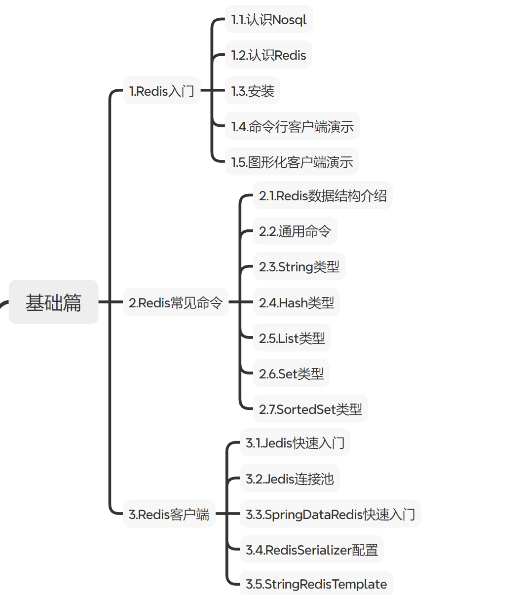
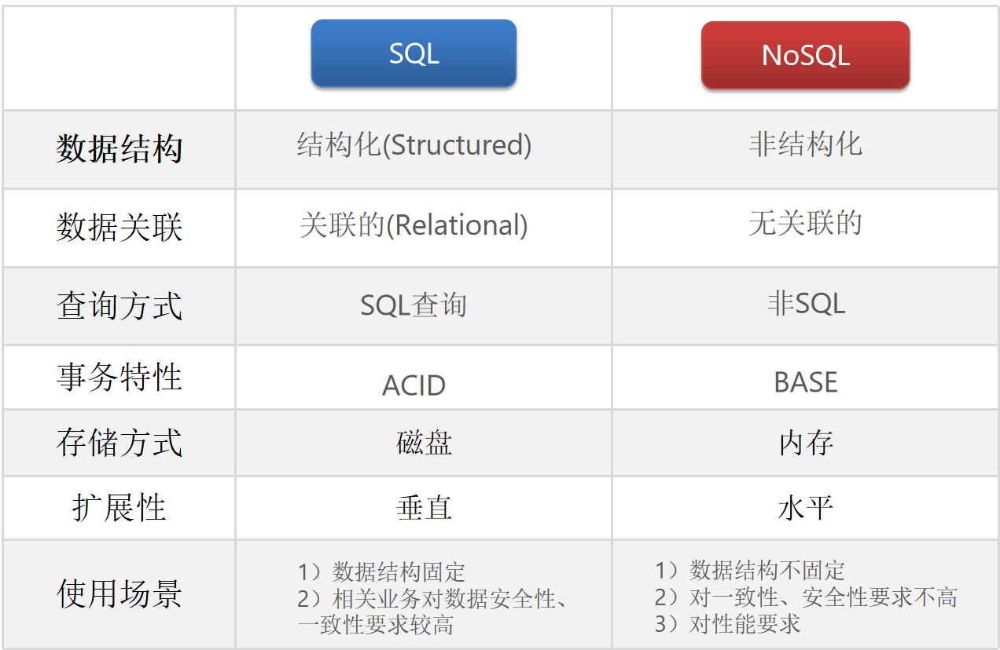
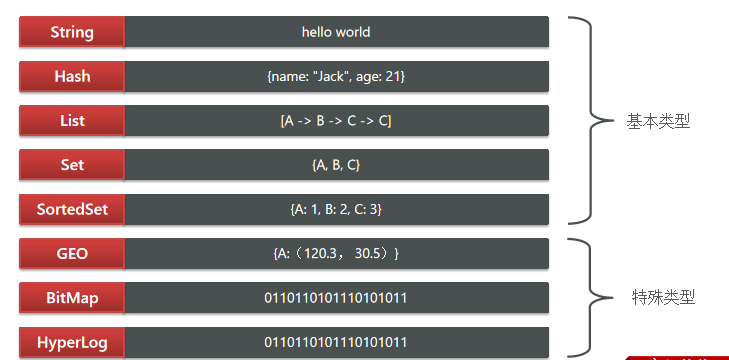
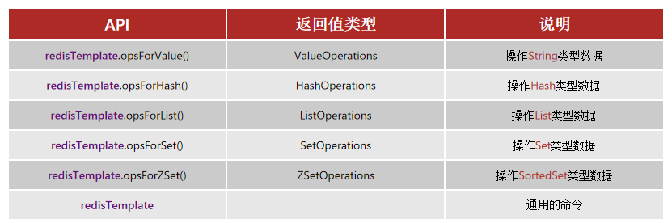
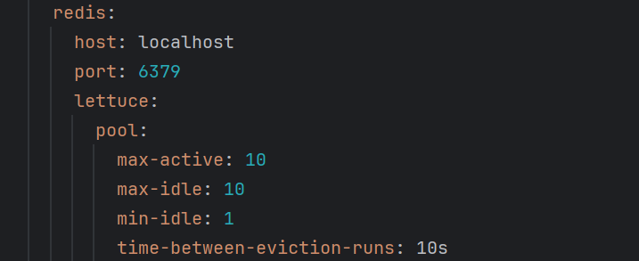
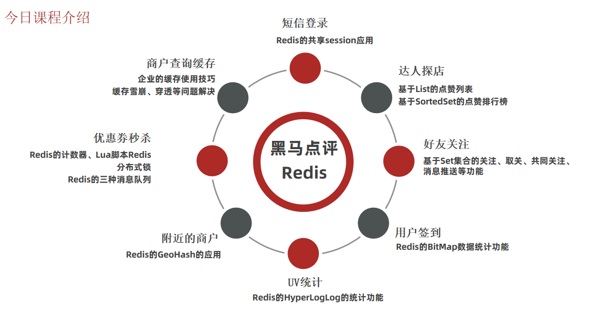

# Redis基础概念



## 认识

属于NoSQL

​    

命令：https://redis.io/commands 

常用：

- `redis-cli`：启动redis
- `help +`指令：查询指令的用法
- `keys`：查看符合模板的所有key
- `del`：删除指定的key
- `exists`：判断key是否存在
- `expire`：设置有效期，有效期到key删除
- `ttl`：查看key的剩余有效期

数据结构类型：



key结构  项目名:业务名:类型:id

- String
- Hash
- List
- Set
- SortedSet：可排序的Set，包含score属性，可进行排序

## 客户端

网址：https://redis.io/clients

### Jedis

以Redis命令作为方法名称，学习成本低，简单实用。但是Jedis实例是线程不安全的，多线程环境下需要基于连接池来使用

 https://github.com/redis/jedis

- 引入依赖

  ```java
  <dependency>   
  <groupId>redis.clients</groupId>
  <artifactId>jedis</artifactId>
  <version>3.7.0</version>
  </dependency>
  ```
- 创建对象，建立连接

  ```java
  private Jedis jedis;
  
  @BeforeEach
  void setUp() {
      // 建立连接
      jedis = new Jedis("192.168.150.101", 6379);
      // 设置密码
      jedis.auth("123321");
      // 选择库
      jedis.select(0);
  }
  ```
- Jedis使用

  ```java
  @Test
  void testString() {
      // 创建 Redis 连接
      try (Jedis jedis = new Jedis("localhost", 6379)) {
  
          // 插入数据（SET）
          String result = jedis.set("name", "张三");
          System.out.println("result = " + result);
  
          // 获取数据（GET）
          String name = jedis.get("name");
          System.out.println("name = " + name);
      }
  }
  ```
- 释放资源

  ```java
  @AfterEach
  void tearDown() {
      // 释放资源
      if (jedis != null) {
          jedis.close();
      }
  }
  ```

连接池

```java
public class JedisConnectionFactory {

    private static final JedisPool jedisPool;

    static {
        JedisPoolConfig jedisPoolConfig = new JedisPoolConfig();

        // 最大连接
        jedisPoolConfig.setMaxTotal(8);

        // 最大空闲连接
        jedisPoolConfig.setMaxIdle(8);

        // 最小空闲连接
        jedisPoolConfig.setMinIdle(0);

        // 设置最长等待时间，ms
        jedisPoolConfig.setMaxWaitMillis(200);

        jedisPool = new JedisPool(
                jedisPoolConfig,
                "192.168.150.101",
                6379,
                1000,
                "123321"
        );
    }

    // 获取Jedis对象
    public static Jedis getJedis() {
        return jedisPool.getResource();
    }
}
```

### SpringDataRedis

SpringData：Spring中数据操作的模块，包含对各种数据库的集成



https://spring.io/projects/spring-data-redis

- 引入spring-boot-starter-data-redis依赖

  ```java
  <!--Redis依赖-->
  <dependency>
      <groupId>org.springframework.boot</groupId>
      <artifactId>spring-boot-starter-data-redis</artifactId>
  </dependency>
  
  <!--连接池依赖-->
  <dependency>
      <groupId>org.apache.commons</groupId>
      <artifactId>commons-pool2</artifactId>
  </dependency>
  ```

- yml配置redis

  

- 注入RedisTemplate

  ```java
  @Autowired
  private RedisTemplate redisTemplate;
  
  @SpringBootTest
  public class RedisTest {
      @Autowired
      private RedisTemplate redisTemplate;
      @Test
      void testString() {
          // 插入一条 string 类型数据
          redisTemplate.opsForValue().set("name", "李四");
          // 读取一条 string 类型数据
          Object name = redisTemplate.opsForValue().get("name");
          System.out.println("name = " + name);
      }
  }
  ```

#### 序列化方式

- 自动化
  - 自定义RedisTemplate
  
  - 修改RedisTemplate的序列化器为GenericJackson2JsonRedisSerializer
  
    ```java
    @Bean
    public RedisTemplate<String, Object> redisTemplate(RedisConnectionFactory redisConnectionFactory)
            throws UnknownHostException {
    
        // 创建 RedisTemplate
        RedisTemplate<String, Object> redisTemplate = new RedisTemplate<>();
    
        // 设置连接工厂
        redisTemplate.setConnectionFactory(redisConnectionFactory);
    
        // 设置序列化工具
        GenericJackson2JsonRedisSerializer jsonRedisSerializer =
                new GenericJackson2JsonRedisSerializer();
    
        // key 和 hashKey 使用 string 序列化
        redisTemplate.setKeySerializer(RedisSerializer.string());
        redisTemplate.setHashKeySerializer(RedisSerializer.string());
    
        // value 和 hashValue 使用 JSON 序列化
        redisTemplate.setValueSerializer(jsonRedisSerializer);
        redisTemplate.setHashValueSerializer(jsonRedisSerializer);
    
        return redisTemplate;
    }
    ```
  
- 省内存
  - 使用StringRedisTemplate
  
  - 写入Redis时，手动把对象序列化为JSON
  
  - 读取Redis时，手动把读取到的JSON反序列化为对象
  
    ```java
    @SpringBootTest
    public class RedisTest {
    
        @Autowired
        private StringRedisTemplate stringRedisTemplate;
    
        // JSON工具
        private static final ObjectMapper mapper = new ObjectMapper();
    
        @Test
        void testStringTemplate() throws JsonProcessingException {
    
            // 准备对象
            User user = new User("虎哥", 18);
    
            // 手动序列化
            String json = mapper.writeValueAsString(user);
    
            // 写入一条数据到redis
            stringRedisTemplate.opsForValue().set("user:200", json);
    
            // 读取数据
            String val = stringRedisTemplate.opsForValue().get("user:200");
    
            // 反序列化
            User user1 = mapper.readValue(val, User.class);
    
            System.out.println("user1 = " + user1);
        }
    }
    ```

## 项目概况

