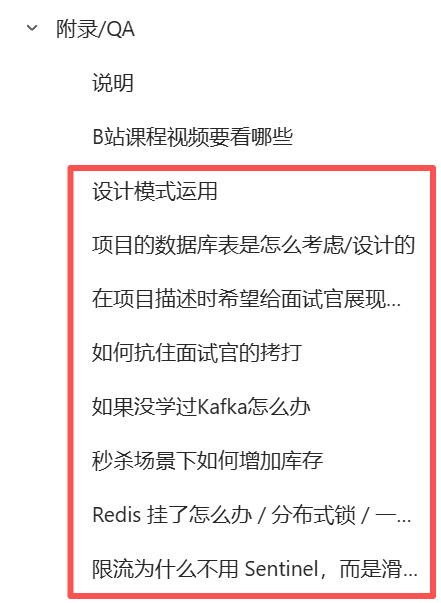
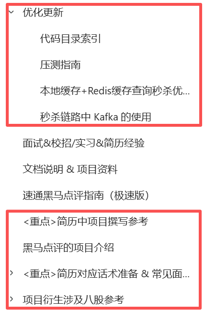
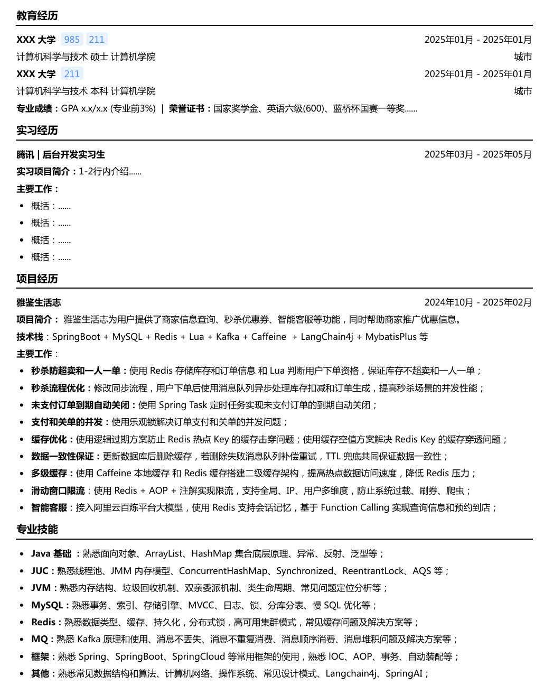

## 黑马点评文档参照





## 面试考察

- 算法
- 八股
  - 面试前40天开始熟悉Java八股
  - 一个模块用一天或者两天看完
  - 理解背+开口说
  - 每次面试前都花两三个小时过一遍整个八股
- 项目
  - **框架**：背景阐述-问题剖析-方案构思-复盘总结
  - **面试题**：面试官听完表述后联想出来的问题

## 简历撰写

- 实习经历放第一，教育经历后移到第二
- 荣誉奖项直接放在教育经历下起一行
- 专业成绩绩点至少位于专业前5%才写上去
- "项目经历"上写一个项目或两个项目（校招需要2个）
- "专业技能"模块，简洁明了（把自己背的很熟的**八股知识点**写上去）



## 八股顺序

- 黑马学习路线（javase，javaweb，ssm，mysql，redis，juc，jvm，消息队列）
- b站（小林）

---

- 先理解含义
- 开口说

## 算法

- 笔试算法
  - `gpt`辅助写题
- 面试算法

**难度：** 笔试算法  远大于 面试算法

**重要程度：** 面试算法 远大于 笔试算法

- 面试手撕
  - 核心代码模式（30%）
  - 空白模式（70%）
    - `main`函数
    - 写测试用例(假数据)，测试运行输出
      - 代码里写死假数据，再输出结果
    - 导包
      - `import java.util.*`;
      - 和面试官说一下，请求查一下类所在的包
    - 链表、二叉树 需要自己去定义`Class`，写构造函数
- 笔试算法
  - ACM模式
- （牛客）SQL必知必会

### 构造函数

```java
import java.util.*;

// 空白开始，所有都要自己写
public class InterviewSolution {
    
    // 如果需要链表或二叉树，先定义类
    
    public static void main(String[] args) {
        // 自己创建测试用例
        int[] testCase1 = {1, 2, 3, 4, 5};
        System.out.println("测试用例1: " + Arrays.toString(testCase1));
        System.out.println("结果: " + solution(testCase1));
        
        // 链表测试
        ListNode head = createLinkedList(new int[]{1, 2, 3, 4, 5});
        printLinkedList(head);
    }
    
    public static int solution(int[] nums) {
        // 解决方案
        return 0;
    }
}
```

### 链表节点定义

```java
// 单向链表
class ListNode {
    int val;
    ListNode next;
    
    // 构造函数（必须掌握！）
    ListNode() {}
    ListNode(int val) { 
        this.val = val; 
    }
    ListNode(int val, ListNode next) { 
        this.val = val; 
        this.next = next; 
    }
}

// 双向链表
class DoubleListNode {
    int val;
    DoubleListNode prev;
    DoubleListNode next;
    
    DoubleListNode() {}
    DoubleListNode(int val) { 
        this.val = val; 
    }
    DoubleListNode(int val, DoubleListNode prev, DoubleListNode next) { 
        this.val = val;
        this.prev = prev;
        this.next = next;
    }
}
```

### 二叉树节点

```java
class TreeNode {
    int val;
    TreeNode left;
    TreeNode right;
    
    // 构造函数（必须掌握！）
    TreeNode() {}
    TreeNode(int val) { 
        this.val = val; 
    }
    TreeNode(int val, TreeNode left, TreeNode right) {
        this.val = val;
        this.left = left;
        this.right = right;
    }
}
```

**反复刷三遍**，整理：

- 笔记
- 题目
- 讲解视频
- 思路
- 代码

## 面试

### 项目

- 项目亮点、可能被问、对应八股延伸

### 八股

- JavaSE、JUC、JVM、MySQL、Redis、Kafka、Spring框架、计算机网络、操作系统、分布式、常见问题定位分析排查、场景题、数据结构与算法、设计模式、分库分表、智力题、AI&大模型
- 重点技术栈的八股（根据公司等级）

---

1. 项目方面复习完需要两个小时左右
2. 八股方面复习完需要七个小时左右
3. 算法方面复习完需要两个小时左右

### 避坑

1. 讲述项目必须**先介绍清楚项目背景**，特别是有业务壁垒的项目
2. 先听清楚再回答

### 反问

**一面**：可以反问业务

**leader面/总监面**：

很荣幸有机会和您交流，因为您作为团队的负责人，一定有带领指导校招生/实习生的一些经历和经验， 因为我们知道**后端的日常工作**，一般包括产品的业务需求、后台的技术专项、服务的治理、质量的提升、成本方面降本增效。我理解校招生/实习生也是这样需要能够快速地参与到这些工作当中，**关键问题**是如何快速成长、熟练的完成这些工作，**核心目的**一是为团队做贡献，二是达到自己的成长目标。

1. 相当于在这个校招生/实习生成长过程中，您有哪些建议呢？
2. 我所理解的描述的是否有哪些问题呢？
3. 再或者说团队对于校招生/实习生有着怎么样的期望呢？

### 项目中难点

1. 背景阐述
2. 问题剖析（讲清楚问题是什么）
3. 方案构思（解决问题的过程是怎么样的，是否有多种方案的对比，最终选择哪个方案及原因）
4. 复盘总结（如果有,需求上线后的成绩与不足，如果有,可以阐述对方案的长远规划）

### HR面

绝对来、一定来。优先选择加入公司意愿强烈的同学。

### 面试侧重点（大厂）

- **一面**：基础（八股理论、算法、项目思考），一面的面试官一般是你的导师或者同事
- **二面**：思考，小组组长，面试时看细节。eg.为什么线程频繁切换会导致性能不好呢？线程切换要做什么呢？做什么才会导致性能不好。
- **三面**：中心的总监级别，我个人认为三面面试官会更看重你的整体潜力，包括你整个人是否自信，理解能力是不是好的，智商是不是高的。大的方向上的问题，例如技术选型，java和go的区别，线程和协程等等这些问题可能会问。但是不排除有一些三面面试官对技术追求更高，也会深入问你原理，比如kafka的很深入的原理我也被问过。（有思考、言之有理）

## 找实习

### 掌握程度

**中大厂**：Java基础、JUC、JVM、MySQL、Redis、框架、计网、操作系统、项目、算法

- 第一优先级：MySQL、Redis、JVM（字节、腾讯(这些主流技术栈使用Golang，倾向于JVM)
- 第二优先级：Java基础、JUC（了解多线程可能会问）、计网
- 第三优先级：消息队列、Spring框架、操作系统

**小厂**：Java基础、JVM、MySQL、Redis、框架、项目

- 第一优先级：Java基础、MySQL、Redis
- 第二优先级：Spring框架、JVM、JUC
- 第三优先级：消息队列、计网、操作系统

### boss打招呼

打招呼、届数、学校学历、实习经历(选填)、开源经历(选填)、项目经历、到岗时间

您好，我是27届北京大学在读研一学生月如风，对您的招聘信息很感兴趣，期待您的回复！

1. 实习经历：腾讯后台开发实习、字节后台开发实习
2. 开源经历：积极参与开源社区XXX，成为活跃贡献者
3. 项目经历：设计实现XX项目、XX项目
4. 面试通过后一周内到岗，实习时长六个月以上

### 如何投递

- 中小厂 优先关注 Boss、实习僧的新增岗位
- 大厂 优先关注官网的新增岗位（但也要试试Boss和实习僧）
- 寻求学长学姐组内直推 Leader

优先找最近一周内开发的岗位去投递，投递日常实习就是抢机会（不论HC是多是少），公司会随时开放出岗位，**经常关注，及时投递**。

可以先投官网后投Boss

### 投递时间

**暑期实习（2月底-6月）、校招（7月底-12月）**

- **前期**：（暑期实习节点：2月至3月初，校招节点：7月至8月底）处于高强度状态，准备充分。
- **中期**：（暑期实习节点：3月初至4月中，校招节点：8月底至9月底）不断面试，面试后的查缺补漏。根据面试官反馈进行迭代优化。
- **后期**：（暑期实习节点：4月中至6月，校招节点：9月底至12月）

### Offer选择

暑期实习求的是"转正保底机会" 和 "秋招通关筹码"，我认为前者更重要

- 第一考虑因素是Base工作地点：转正保底，Base地至少要满意，否则工作后要换Base地要考虑跳槽，而以后的大环境对于跳槽风险性太大
- 暑期实习第二考虑因素是平台，但校招第二考虑因素是业务
- 暑期实习第三考虑因素是业务，但校招第三考虑因素是平台
- 第四考虑因素是薪资

### 实习内容如何编造

https://www.yuque.com/kdoxioc/gaa1qm/dpw8cbmfzw8nun29

### 实习投递官网

***公司名称+校园招聘***

#### 第一梯队（顶尖）

- 腾讯：https://join.qq.com/index.html
- 字节：https://jobs.bytedance.com/campus/m/page-6272Gc
- 阿里系列：https://talent.alibaba.com/?lang=zh

#### 第二梯队（大大厂）

- 蚂蚁：https://talent.antgroup.com/campus/
- 美团：https://zhaopin.meituan.com/web/campus
- 快手：https://campus.kuaishou.cn/recruit/campus/e/#/campus/jobs
- 京东：https://campus.jd.com

#### 第三梯队（大厂）

- 拼多多：https://careers.pddglobalhr.com/campus
- 滴滴：https://campus.didiglobal.com
- 小红书：https://campus.xiaohongshu.com
- 百度：https://talent.baidu.com/external/baidu/campus.html
- 哔哩哔哩：https://jobs.bilibili.com/campus/
- 携程：https://campus.ctrip.com
- 网易：https://campus.163.com
- 虾皮：https://careers.shopee.sg/campus
- 华为：https://career.huawei.com/reccampportal/portal5/index.html
- OPPO：https://career.oppo.com/campus
- 荣耀：https://campus.honor.com
- 小米：https://hr.xiaomi.com/campus/recruitment
- 米哈游：https://jobs.mihoyo.com/campus

#### 第四梯队（中大厂）

- 大疆：https://we.dji.com/zh-CN/campus
- TP-LINK：https://hr.tp-link.com.cn/campus/
- 爱奇艺：https://campus.iqiyi.com/
- 贝壳：https://campus.ke.com
- 希音：https://careers.shein.com/campus
- Momenta：https://momenta.zhiye.com/campus
- 得物：https://campus.dewu.com
- 科大讯飞：https://campus.iflytek.com
- 哈啰：https://helloinc.zhiye.com/campus
- 360：https://campus.360.cn

#### 第五梯队（中厂）

- 阅文集团：https://join.yuewen.com/campus.html
- Boss 直聘：https://zhipin.com/campus/
- Soul：https://soul.zhiye.com/campus
- 招银网络科技：https://cmbnt.zhiye.com/campus
- 同程旅行：https://campus.ly.com
- 作业帮：https://zuoyebang.zhiye.com/campus
- 猿辅导：https://yuanfudao.zhiye.com/campus
- 喜马拉雅：https://campus.ximalaya.com
- 用友：https://campus.yonyou.com
- 虎牙直播：https://campus.huya.com
- 金山：https://campus.kingsoft.com
- 4399：https://web.4399.com/job/campus/
- 三七互娱：https://zhaopin.37.com/campus
- CVTE：https://campus.cvte.com
- 好未来：https://talfuture.zhiye.com/campus
- 货拉拉：https://huolala.zhiye.com/campus

### 公共资源

1. 暑期投递飞书list（模版+每日更新招聘）：https://kccrkrp7fv.feishu.cn/base/SrtubqMnmaZNLGsscLicq1ESnUb
2. 北森题库（总）：https://kccrkrp7fv.feishu.cn/file/DsdTbnOjboH8CQxo2Wmc0ObgnVP?from=from_copylink
3. 赛码题库：https://kccrkrp7fv.feishu.cn/file/H3JHb255poSLkaxfmNScPEgJnod
4. 智鼎题库：https://kccrkrp7fv.feishu.cn/file/AJlbbejoXovEQhxQfnnc1kIynuh

央国企资料：

链接:https://pan.baidu.com/s/11_MR0FVNxzErs52UvXojJA?pwd=y4fw 

提取码:y4fw

## 实习后landing

https://www.yuque.com/kdoxioc/gaa1qm/omvapypsl0x6gaox

## AI应用

https://www.yuque.com/kdoxioc/gaa1qm/qr3qgrruac8ssyso


