# Excel

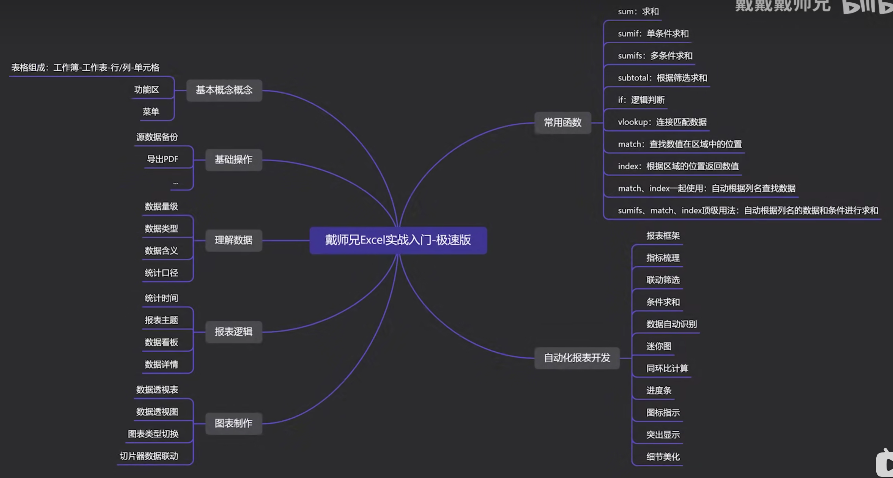

## 基础概念

1. 对数据进行备份

右键——移动或复制——移到最后——创建副本——隐藏

需要显现的时候，右键任意sheet，取消隐藏

## 数据理解

         ctrl + shift + L  /* 全部筛选 */

UV与PV：去重与不去重

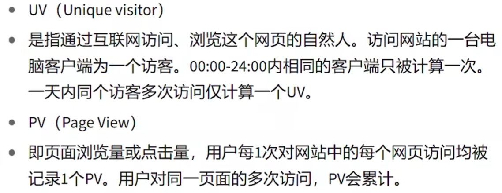

CPC：单次广告的成本

### 数据透视表

#### 筛选

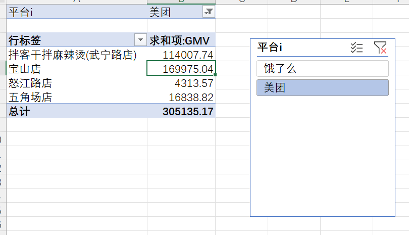

1. 插入切片器
2. 透视表内的筛选
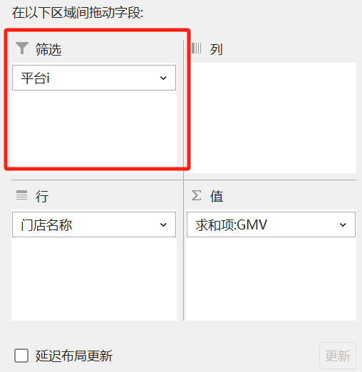

都可以进行筛选，区别是：切片器不只应用于透视表。

双击可以更改名称：

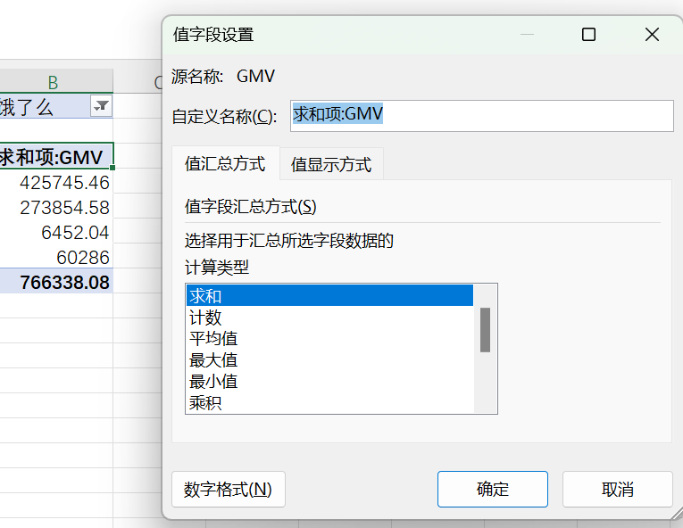

#### 插入字段

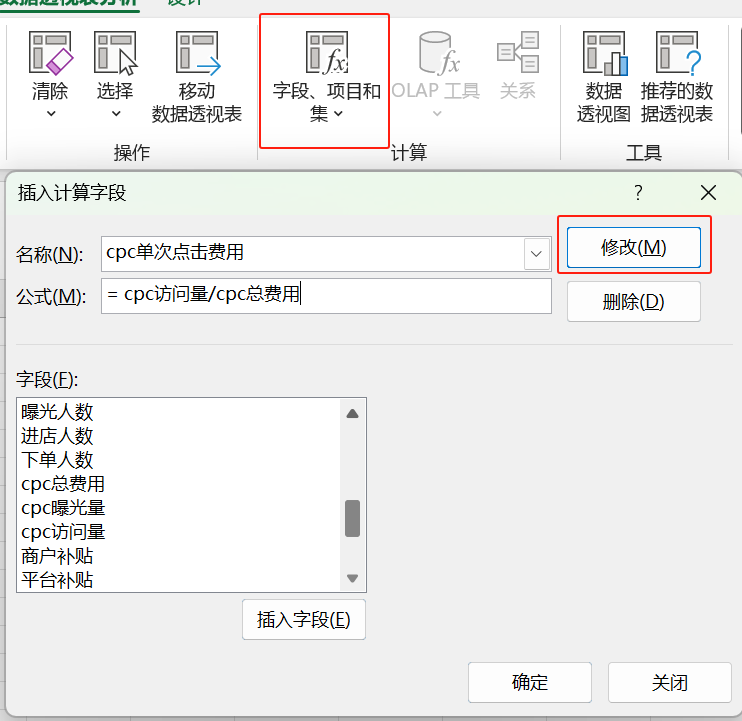

## 函数

### sum函数

#### 新建窗口

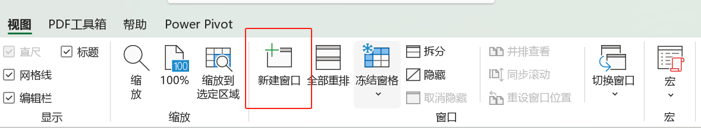

#### 冻结窗口

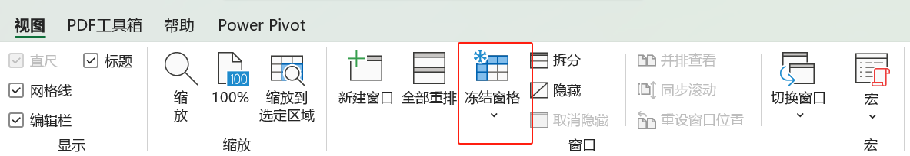

#### sum特殊

         win + 上下左右 /* 任意分屏 */

中间加逗号可以分开来选。

### sumif函数

#### 锁定

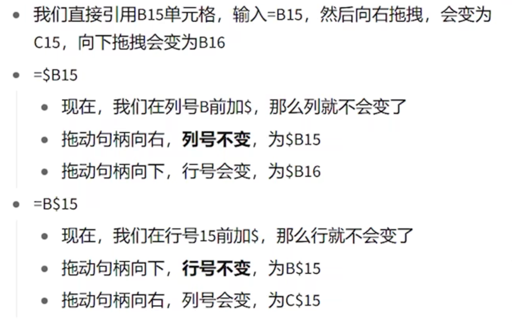

#### sumif

         sumif( 比对的数据行，标准，要的数据行)

#### sumifs

         sumifs( 要的数据行，对比的数据行1，标准1，对比数据行2，标准2，...)

#### 环比与同比

同比：上一年或者上一月
环比：上一个相邻的

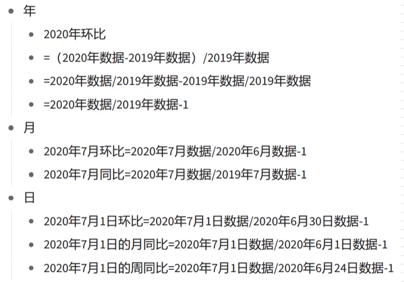

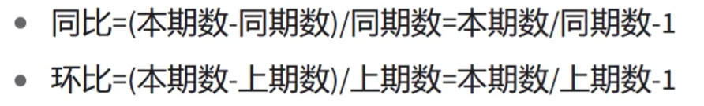

#### 拆解日期

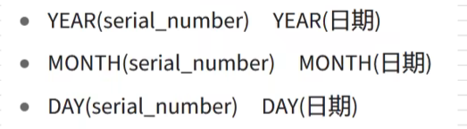

#### 组合日期

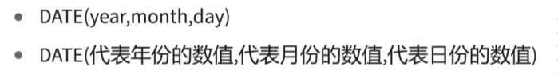

如果前一个月没有那一天，就会返回第一天。跨年算的结果是正确的。

不要用Excel的日期格式去存储日期，要用字符串格式。

#### 求每个月最后一天

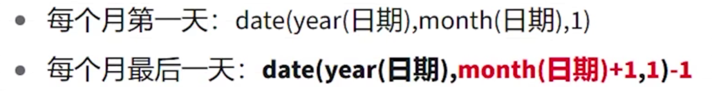

#### 条件判断

符号要加双引号
后面跟&

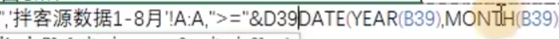

总结

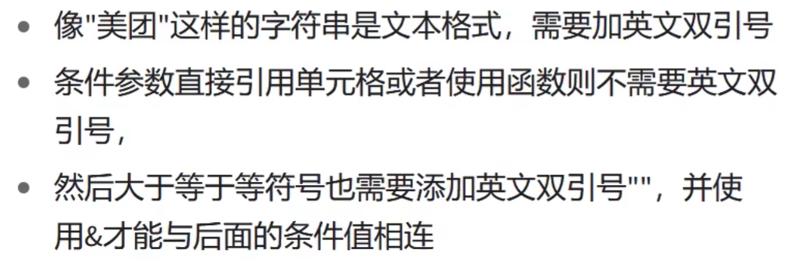

### subtotal

         subtotal(选择功能，要求和的)

#### subtotal和sum区别

subtotal可以根据原表筛选，进行筛选求和，更灵活。

### if

         if(判断条件，True返回结果，False返回结果)

if可以进行嵌套

### vlookup

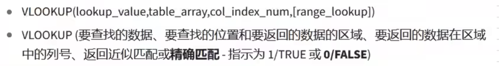

几个注意的点：

1. 匹配的一般是第一个
2. 0是精确匹配，1是模糊匹配
3. 如果是查找a开头的

         &"*" /* 通配符 */

4. 如果是查找a开头，往后数固定位数

         &"??" /* 2 */

5. vlookup 查找的是符合的第一个来返回

6. $ 来锁定函数里面的数值

### match

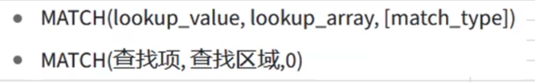

         match(查找项,查找区域,0)

         index(数据区域,行,列)

步骤：使用match先匹配行再匹配列，再用index根据位置得到数值

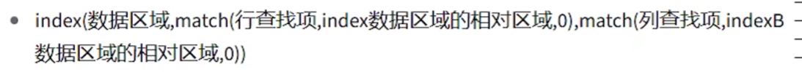

返回整列和整行，该位置就填0

如果是一列里面有若干，需要累计返回的，用sumifs

**如果有些地方需要，锁定的要记得锁定**

### 总结

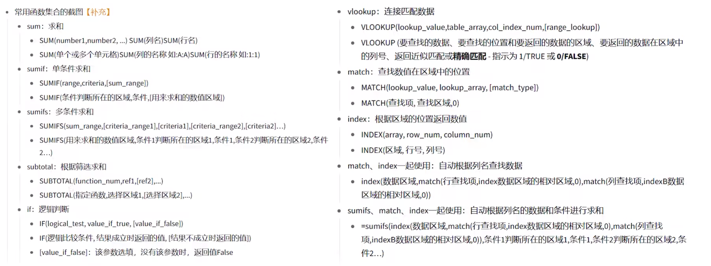

## 报表

### 统计口径

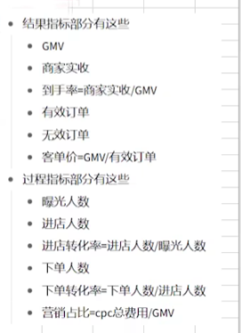

### 注意事项

**所有都要引用，才会联动**

关于**营销占比**的总计计算会比较困难，参考下图

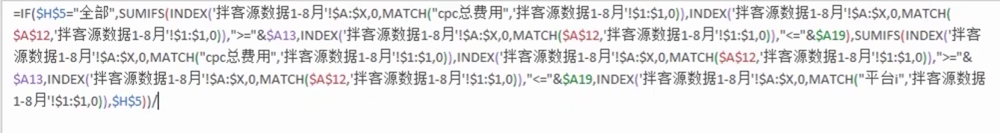

关于**周环比**的计算会比较困难，参考下图

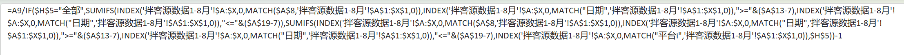

关于**到手率的周环比**的计算会比较困难，参考下图

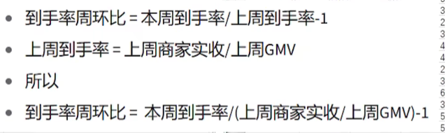

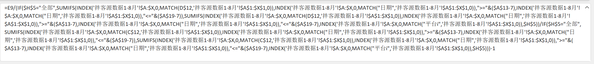

唯一秘诀就是化简公式！！

设置特殊格式：可以让所有小于均值的都加粗加下划线

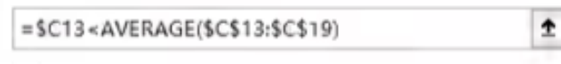

### 成果

Excel报表的自动化

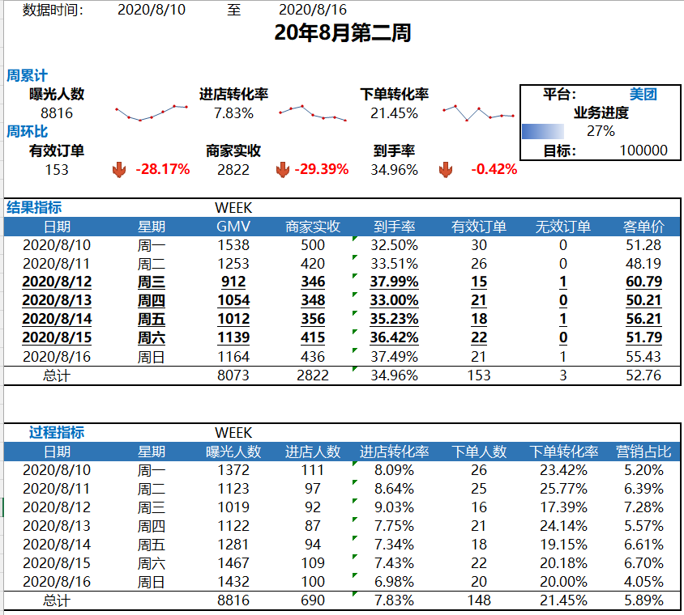

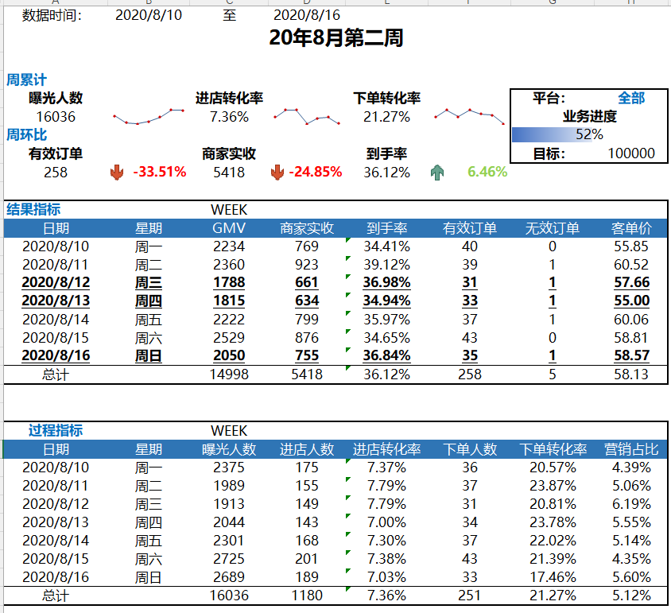

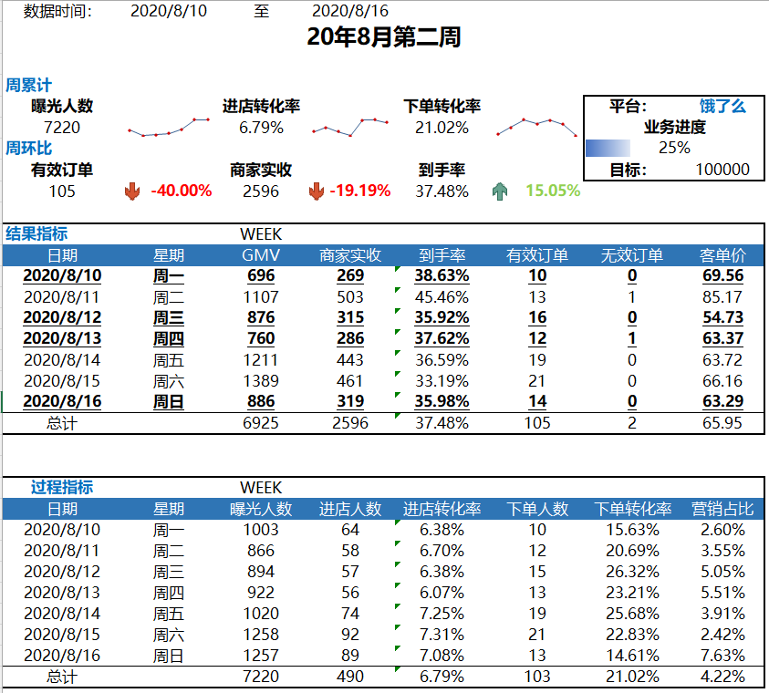

## 写在后面

没想到此次学习竟然进行了这么久，主要是Excel的学习也是一个会偏无聊的过程（特别是函数学习），很高兴！通过此次机会很好地学习了Excel的基础技能，学会了制作报表。

最后，我想说，发明Excel的真的是天才！！

学习永无止境：

### 哪里不会搜哪里
- [Excel官方文档](https://support.microsoft.com/zh-cn/excel)

### 不断积累新用法
- 学到新东西记下来
- 看到好资源要保存

### 定期对用法总结
