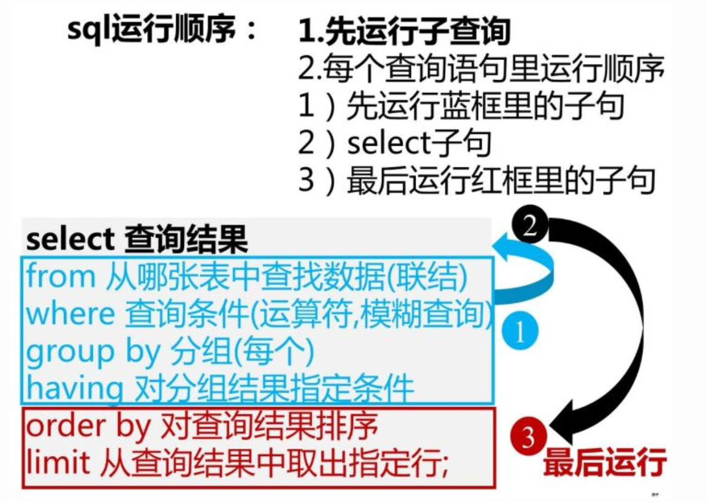
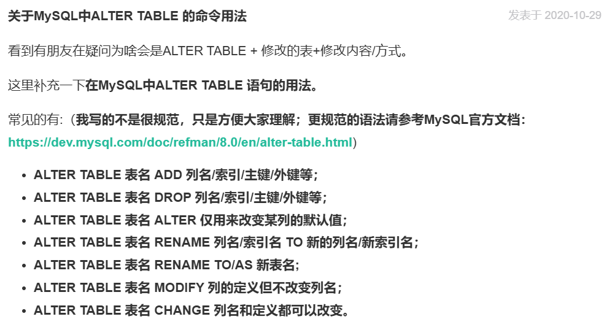
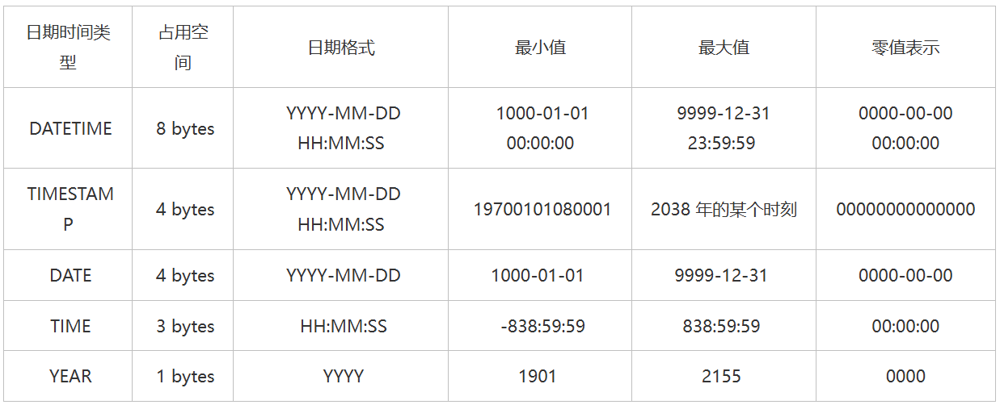
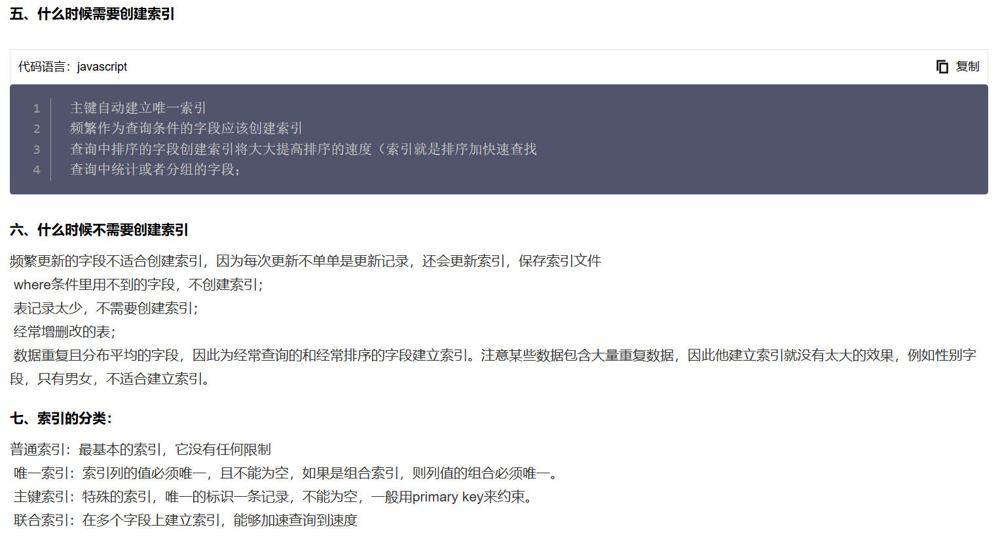

[查缺补漏](https://www.runoob.com/sql/sql-tutorial.html)

[刷题](https://www.nowcoder.com/exam/oj?page=1&tab=SQL%E7%AF%87&topicId=82)

##### 从第三行数据开始，只取一行

```mysql
SELECT * FROM employees ORDER BY hire_date DESC
LIMIT 1 OFFSET 2
```

##### 左连接

```mysql
select last_name,first_name,dept_no
from employees s
left join dept_emp d
on s.emp_no = d.emp_no
```
- 获取每个部门中当前员工薪水最高的相关信息，给出dept_no, emp_no以及其对应的salary，按照部门编号dept_no升序排列

```mysql
SELECT d.dept_no, d.emp_no, s.salary
FROM dept_emp d
JOIN salaries s ON d.emp_no = s.emp_no
WHERE s.salary = (
    SELECT MAX(s1.salary)
    FROM dept_emp d1
    JOIN salaries s1 ON d1.emp_no = s1.emp_no
    WHERE d1.dept_no = d.dept_no
)
ORDER BY d.dept_no ASC;
```
- 可以连续`left join`

```mysql
SELECT e.last_name, e.first_name, d.dept_name
FROM employees e
LEFT JOIN dept_emp de ON e.emp_no = de.emp_no
LEFT JOIN departments d ON de.dept_no = d.dept_no;
```

##### 获取第二多
- 用avg之类的函数，需要聚类

- 请你获取薪水第二多的员工的emp_no以及其对应的薪水salary，若有多个员工的薪水为第二多的薪水，则将对应的员工的emp_no和salary全部输出，并按emp_no升序排序。

```mysql
- 一个要小心的点就是：可能第一个有多个，所以要先聚合分组

select emp_no,salary
from salaries
where salary = 
(
select salary
from salaries
group by salary
order by salary desc
limit 1 offset 1
)
order by emp_no asc
```

- 不能使用order by的情况下思路：先选出小于最大值的，再在其中选出最大值进行匹配

##### mysql窗口函数

[参考CSDN](https://blog.csdn.net/CoderSharry/article/details/135063960)

[博客园 个人感觉会讲的更清楚](https://www.cnblogs.com/goloving/p/7469399.html)

注意：窗口函数在mysql8.0以上支持

- 对所有员工的薪水按照salary降序先进行1-N的排名，如果salary相同，再按照emp_no升序排列

```mysql
- 使用窗口函数

select 
    emp_no,
    salary,
    DENSE_RANK() over(order by salary desc) t_rank
from salaries
order by t_rank asc,emp_no asc
```

```mysql
- 不使用窗口函数

SELECT 
    s1.emp_no, 
    s1.salary,
    (
        SELECT COUNT(DISTINCT s2.salary)
        FROM salaries s2
        WHERE s2.salary >= s1.salary
    ) AS t_rank
FROM salaries s1
ORDER BY s1.salary DESC, s1.emp_no ASC;
```

补充：在运行顺序中，select字句是最后被运行的。
所以，如果有想要先执行的可以放在子查询当中，再来用它。


##### 各种连接的区别和选择

[详见链接](https://justcode.ikeepstudying.com/2016/08/mysql-%E5%9B%BE%E8%A7%A3-inner-join%E3%80%81left-join%E3%80%81right-join%E3%80%81full-outer-join%E3%80%81union%E3%80%81union-all%E7%9A%84%E5%8C%BA%E5%88%AB/)

该链接讲的很好，用文氏图更易懂。

##### mysql8.0

[上](https://cloud.tencent.com/developer/article/2244537) [下](https://cloud.tencent.com/developer/article/2244538)

mysql最新为8.0版本，我们来看下有哪些需要了解的实用特性。大多数是取数人员用不到的，我只看关于查询、建表会用到的。

- group by不再隐式排序，需要人为加order by
- 加入窗口函数
- 在 MySQL 8.0.29 之前，一列只能作为表的最后一列添加。不支持将列添加到其他列中的任何其他位置。从 MySQL 8.0.29 开始，可以将即时添加的列添加到表中的任何位置。


##### concat

`CONCAT(str1,str2,…)`字符串连接

```mysql
mysql> SELECT CONCAT('张三','李四','王五');
result> 张三李四王五
//——————————————————————————————————————————————
mysql> SELECT CONCAT('张三','李四',NULL);
result> NUll
```

##### 建表

我的天 一直忘记

```mysql
CREATE TABLE actor
(
    actor_id smallint(5) not null PRIMARY KEY,
    first_name varchar(45) not null,
    last_name varchar(45) not null,
    last_update date not null
);

-- 判断有无表，防止报错
CREATE TABLE IF NOT EXISTS actor
```

##### 修改（ALTER）

详见

[alter table](https://dev.mysql.com/doc/refman/8.0/en/alter-table.html)

略见



##### 建表和修改默认值（DEFAULT）

- default 用于没有指定数值的情况下，设置默认值。ALTER 和 CREATE 都可以用，SELECT 不能用。
[参考示例](https://blog.51cto.com/u_16213384/7646841#:~:text=MySQL%E4%B8%ADDEFAULT%E7%9A%84%E6%84%8F%E4%B9%89%201%201.%20%E6%A6%82%E8%BF%B0%20%E5%9C%A8MySQL%E4%B8%AD%EF%BC%8CDEFAULT%E6%98%AF%E4%B8%80%E4%B8%AA%E9%9D%9E%E5%B8%B8%E9%87%8D%E8%A6%81%E7%9A%84%E5%85%B3%E9%94%AE%E5%AD%97%EF%BC%8C%E5%AE%83%E7%94%A8%E4%BA%8E%E6%8C%87%E5%AE%9A%E6%9F%90%E4%B8%AA%E5%AD%97%E6%AE%B5%E5%9C%A8%E6%B2%A1%E6%9C%89%E6%98%8E%E7%A1%AE%E8%B5%8B%E5%80%BC%E6%97%B6%E5%BA%94%E8%AF%A5%E4%BD%BF%E7%94%A8%E7%9A%84%E9%BB%98%E8%AE%A4%E5%80%BC%E3%80%82%20%E5%BD%93%E6%88%91%E4%BB%AC%E5%88%9B%E5%BB%BA%E8%A1%A8%E6%97%B6%EF%BC%8C%E5%8F%AF%E4%BB%A5%E4%B8%BA%E6%AF%8F%E4%B8%AA%E5%AD%97%E6%AE%B5%E8%AE%BE%E7%BD%AE%E9%BB%98%E8%AE%A4%E5%80%BC%EF%BC%8C%E8%BF%99%E6%A0%B7%E5%9C%A8%E6%8F%92%E5%85%A5%E6%95%B0%E6%8D%AE%E6%97%B6%E5%A6%82%E6%9E%9C%E6%B2%A1%E6%9C%89%E6%98%BE%E5%BC%8F%E5%9C%B0%E6%8C%87%E5%AE%9A%E8%AF%A5%E5%AD%97%E6%AE%B5%E7%9A%84%E5%80%BC%EF%BC%8C%E7%B3%BB%E7%BB%9F%E5%B0%B1%E4%BC%9A%E8%87%AA%E5%8A%A8%E4%BD%BF%E7%94%A8%E9%BB%98%E8%AE%A4%E5%80%BC%E3%80%82%20...%202,%E5%9C%A8%E4%BD%BF%E7%94%A8DEFAULT%E5%85%B3%E9%94%AE%E5%AD%97%E8%AE%BE%E7%BD%AE%E5%AD%97%E6%AE%B5%E9%BB%98%E8%AE%A4%E5%80%BC%E6%97%B6%EF%BC%8C%E9%9C%80%E8%A6%81%E6%B3%A8%E6%84%8F%E4%BB%A5%E4%B8%8B%E5%87%A0%E7%82%B9%EF%BC%9A%20DEFAULT%E5%85%B3%E9%94%AE%E5%AD%97%E5%8F%AA%E8%83%BD%E7%94%A8%E4%BA%8E%E6%8F%92%E5%85%A5%E6%95%B0%E6%8D%AE%E6%97%B6%EF%BC%8C%E5%A6%82%E6%9E%9C%E5%9C%A8UPDATE%E8%AF%AD%E5%8F%A5%E4%B8%AD%E6%8C%87%E5%AE%9A%E4%BA%86%E8%A6%81%E6%9B%B4%E6%96%B0%E7%9A%84%E5%AD%97%E6%AE%B5%EF%BC%8CDEFAULT%E5%85%B3%E9%94%AE%E5%AD%97%E5%B0%86%E4%B8%8D%E8%B5%B7%E4%BD%9C%E7%94%A8%E3%80%82%20...%205%205.%20%E6%80%BB%E7%BB%93%20%E5%9C%A8%E6%9C%AC%E6%96%87%E4%B8%AD%EF%BC%8C%E6%88%91%E4%BB%AC%E4%BB%8B%E7%BB%8D%E4%BA%86MySQL%E4%B8%ADDEFAULT%E5%85%B3%E9%94%AE%E5%AD%97%E7%9A%84%E4%BD%BF%E7%94%A8%E6%96%B9%E6%B3%95%E3%80%82%20)

- after 用于指定在某个后面

```mysql
alter table actor
add column create_date datetime not null 
default '2020-10-01 00:00:00' after last_update
```

##### 日期



`DATETIME`、 `TIMESTAMP`、`DATE`、`TIME`、`YEAR`

`DATETIME`：表示年月日时分秒，记录年份长，DATE和TIME的组合
`TIMESTAMP`：表示年月日时分秒，记录年份短；会根据所在时区进行切换，表中新插入的日期自动设置为当前系统时间，第二个列默认值为0000-00-00 00:00:00
`DATE`：表示年月日
`TIME`：表示时分秒
`YEAR`：年份，默认四位，用1bytes足够。

##### mysql一些莫名的规范

```mysql
-- 需要有分号

insert into actor values(1,'PENELOPE','GUINESS','2006-02-15 12:34:33');
insert into actor values(2,'NICK','WAHLBERG','2006-02-15 12:34:33');
```

- 转义字符 `\`

##### 插入数据

```mysql
# mysql中常用的三种插入数据的语句: 
# insert into表示插入数据，数据库会检查主键，如果出现重复会报错； 
# replace into表示插入替换数据，需求表中有PrimaryKey，
#             或者unique索引，如果数据库已经存在数据，则用新数据替换，如果没有数据效果则和insert into一样； 
# insert ignore表示，如果中已经存在相同的记录，则忽略当前新数据；

insert ignore into actor values("3","ED","CHASE","2006-02-15 12:34:33");
```

##### 删除数据

- 删除emp_no重复的记录，只保留最小的id对应的记录

```mysql
DELETE FROM titles_test
WHERE id NOT IN (
SELECT * FROM
(
    SELECT
    MIN(id)
    FROM titles_test
    GROUP BY emp_no
) as temp);
```

##### 创建索引

[索引](https://www.runoob.com/mysql/mysql-index.html)

```mysql
CREATE UNIQUE INDEX uniq_idx_firstname ON actor (`first_name`);
CREATE INDEX idx_lastname ON actor (`last_name`);
```



所以，索引一般针对where内的，需要order by或者group by的。但也小心需要经常增删改的数据，这会导致索引的维护。

##### 使用索引

- 使用强制索引

```mysql
select *
from salaries
force index (idx_emp_no)
where emp_no=10005
```
使用强制索引的原因：因为MYSQL优化器优化后使用的索引未必是最优的，当优化器指定的索引影响查询速度时用强制索引可以用来提高查询速度。

[示例文档](https://www.yangdx.com/2020/05/151.html#comments)

##### 创建视图

视图创建后，可以像操作表一样操作视图，主要是查询操作。对应的表被称作基表。

```mysql
CREATE VIEW actor_name_view AS
SELECT first_name first_name_v,last_name last_name_v
FROM actor
```

##### 触发器

我服了，全忘光了。。真是的。

```mysql
-- mysql的触发器创建方式略微不同

CREATE TRIGGER audit_log
AFTER INSERT ON employees_test
FOR EACH ROW
BEGIN
    INSERT INTO audit (EMP_no, NAME)
    VALUES (NEW.ID, NEW.NAME);
END;

# 具体地：

# 在 INSERT 型触发器中，NEW 用来表示将要（BEFORE）或已经（AFTER）插入的新数据；
# 在 UPDATE 型触发器中，OLD 用来表示将要或已经被修改的原数据，NEW 用来表示将要或已经修改为的新数据；
# 在 DELETE 型触发器中，OLD 用来表示将要或已经被删除的原数据；
# 使用方法： NEW.columnName （columnName 为相应数据表某一列名）

# 触发器有三种：INSERT、UPDATE、DELETE，还分为BEFORE和AFTER
```