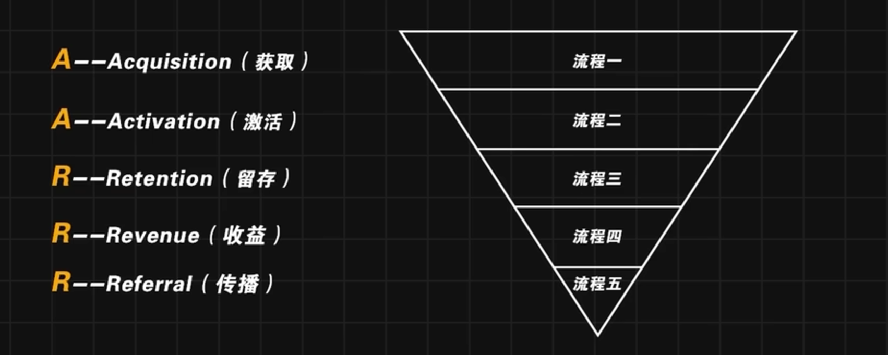
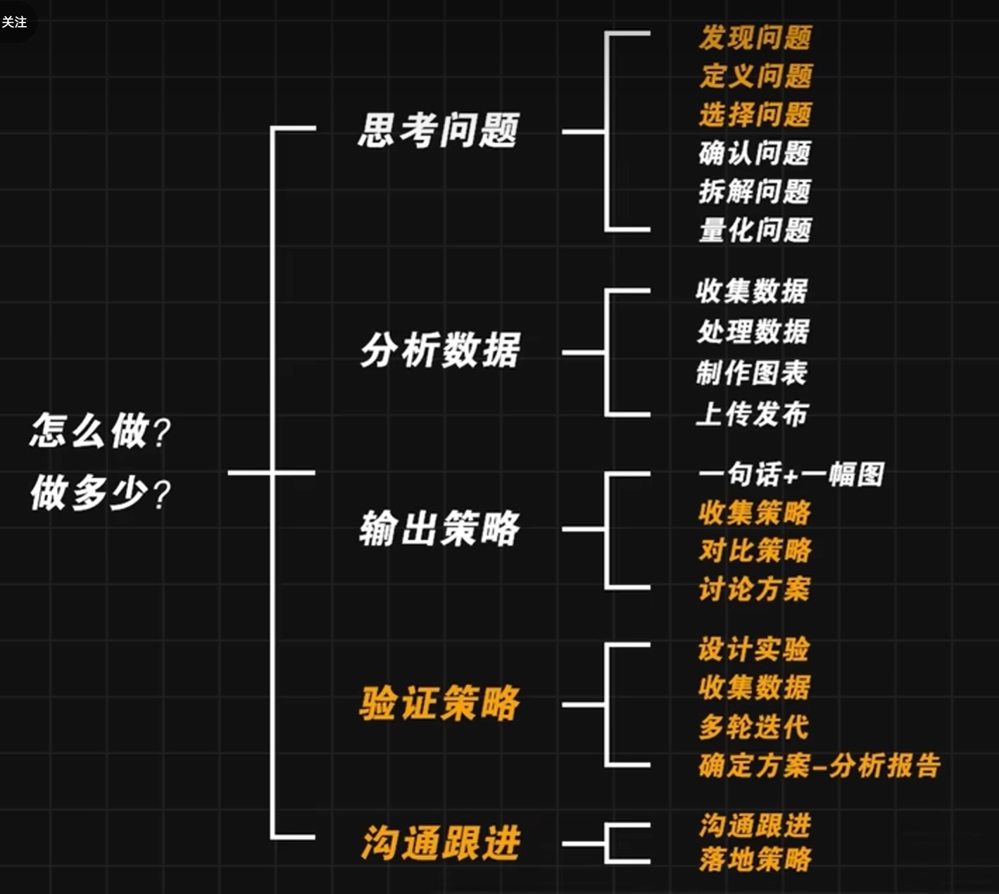
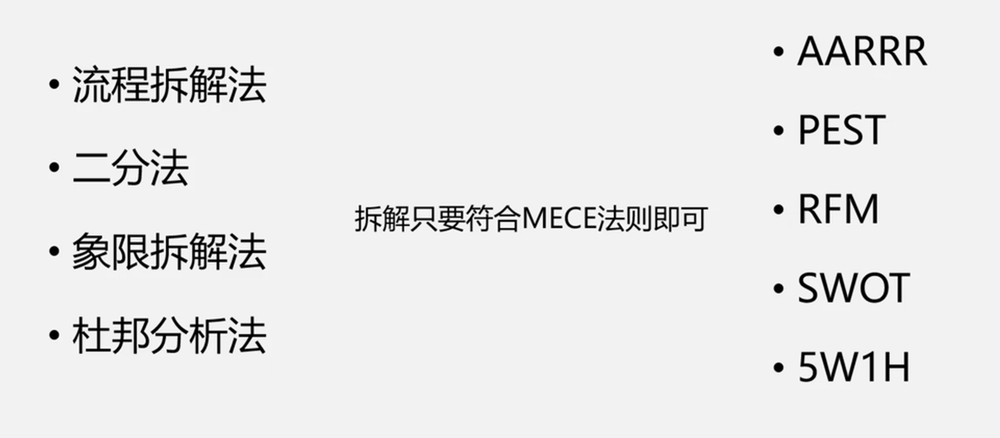
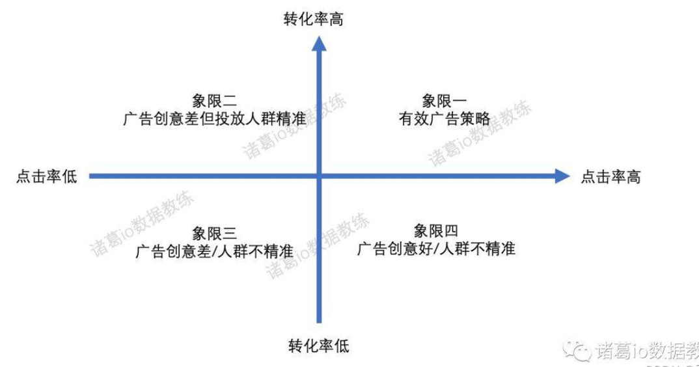
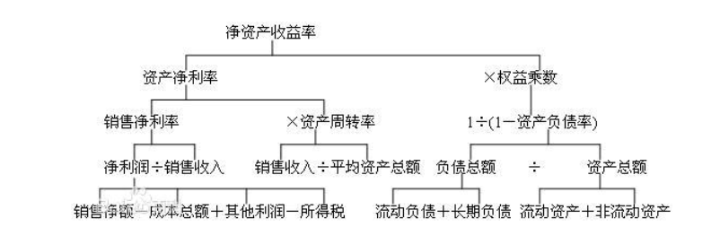
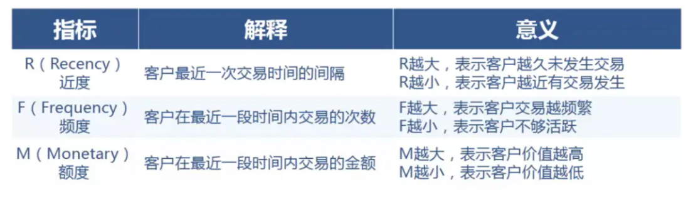
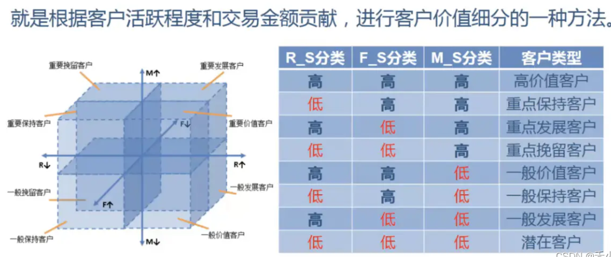
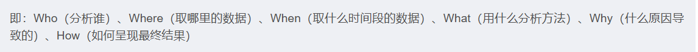

## 数据分析思维

### 数据分析过程
1. 观测
    
    （1）采集数据
    
    - 解析系统日志
    - 埋点获取新数据
    - 通过传感器采集
    - 爬虫解析网站
    - API获取数据

    （2）存储数据

    - 数据库
    - 连接数据库取数

    （3）展示数据
    - 可视化高效传达信息

2. 测量

    - 设定标准
    - 发现异常

3. 应用数据创造价值

    - 数据不断迭代产品和业务策略
    - 明确目标
    - 拆解目标
    - 得到标准值

MECE：满足相互独立、且能够穷尽。

比较常见的拆解方法：
- 时间流程法

    - 漏斗模型：AARRR，用户的流程

    - PDCA：质量管理，先规划再进行，定期检查过程问题

    - 精益创业：根据想法快速建产品，并根据数据快速更改想法

- 模型框架法

    - 优劣势比较

    - 投入产出比

    - SWOT

- 量化公式法

- 穷尽要素法

整体分为各部分

**是什么-为什么-怎么做-做什么**

## 拆解方法的记录

拆解方法：

首先，需要符合MECE（无重复，无遗漏）

1. 流程拆解法：流程分析进行拆解，适用于流程较长，环节较多，随着环节的进行，留存率越来越少的场景。
2. 二分法：把事物分成A和非A两个部分。
3. 象限拆解法：
（1）可用于找到问题的共性原因，将有相同特征的事件进行归因分析，总结共性。
（2）建立分组优化策略。

4. 杜邦分析法：主要用来评价公司盈利能力与股东权益回报水平。财务角度分析企业绩效的方法。

**基本思想**：将企业净资产收益率逐级分解为多项财务比率乘积。
ROE = 净资产利润率 * 权益乘数 * 资产周转率

5. AARRR

研究用户增长的数据分析模型，用户生命周期：用户获取、用户激活、用户留存、获得收益、推进传播。

6. PEST：针对企业的战略管理

从政治、经济、社会、技术，基于公司战略的眼光来分析企业外部宏观环节的方法。

7. RFM：客户价值细分的一种方法

根据客户活跃程度和交易金额贡献

过程：

- 计算RFM各项分值，最高5分，最低1分
- 汇总RFM分值，RFM = 100 * R_S + 10 * F_S
- 根据RFM分值对客户分类

8. SWOT：对企业内部外条件各方面进行综合和概括，分析组织的优劣势、面临的机会和威胁的一种方法

优势、劣势、机会、威胁

9. 5W1H

- Who：分析谁？确定分析主题
- Where：取哪里的数据？进行数据集成
- When：取什么时间段的数据？
- What：用什么分析方法？
- Why：是什么原因导致的问题？
- How：如何呈现分析结果

10. 5W2H

- Why：为什么？为什么要这么做？原因是什么
- What：是什么？目的是什么？
- Where：何处？从哪里来？到哪里去？
- When：何时？什么时间完成
- Who：谁来执行？谁来负责？谁来管理
- How：怎么做？如何提高效率？如何实施？
- How much：做多少？做到何种程度？数量、质量如何

一些分析类资讯文章：
[36氪](https://www.36kr.com/)  [人人都是产品经历](https://www.woshipm.com/)   [简书](https://www.jianshu.com/)

接下来，学习工具的同时，将先后看看两本书：

[深入浅出数据分析](https://yrzu9y4st8.feishu.cn/docs/doccnzwzLDGEnGoVsF6YT9Sh2Zd)

[精益数据分析](https://yrzu9y4st8.feishu.cn/docs/doccnzwzLDGEnGoVsF6YT9Sh2Zd)

以及学习分析报告制作：[分析报告制作](https://www.zhihu.com/search?type=content&q=%E5%88%86%E6%9E%90%E6%8A%A5%E5%91%8A)

