[数据集](https://tianchi.aliyun.com/dataset/649)

这份数据集的内容包括第一列用户id，第二列商品id，第三列类别id（比如冰箱属于家电类），第四列用户行为类型（包括pv：浏览/fav：收藏/cart：加入购物车/buy：购买），第五列时间戳。

## 数据导入

首先，使用Navicat将csv格式的数据集导入Mysql。
由于数据集过大，这里仅导入前300w行数据，并以此进行分析。

## 数据处理

1. 更改数据列名

```mysql
alter table userbehavior    
    change f1 user_id int,    
    change f2 item_id int,    
    change f3 category_id int,    
    change f4 behavior_type varchar(5),    
    change f5 time_stamp int;
```

2. 查找空值

```mysql
select *    
from    
    userbehavior    
where    
    user_id is null    
    or item_id is null    
    or category_id is null    
    or behavior_type is null    
    or time_stamp is null;
```

返回空值，证明该数据集无空值。

3. 查找重复值

```mysql
select    
    user_id,    
    item_id,    
    time_stamp    
from    
    userbehavior    
group by    
    user_id,    
    item_id,    
    time_stamp    
having    
    count(*) > 1
```
找到一行数据为重复

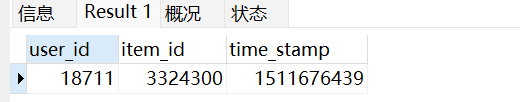

检验

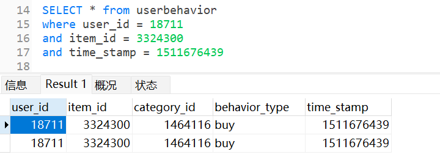

重复属实，需要做处理

4. 去重

思路：增加一列id，设置为自增的主键，重复的id保留最大的即可

```mysql
/* 增加一列 */

ALTER TABLE userbehavior add id int first;
ALTER TABLE userbehavior MODIFY id int PRIMARY KEY auto_increment;
```

```mysql
/* 删除重复的当中，除最大id外的其他（即只留一个） */

delete userbehavior    
from    
    userbehavior,    
    (    
        select    
            user_id,    
            item_id,    
            time_stamp,    
            max(id) as max_id    
        from    
            userbehavior    
        group by    
            user_id,    
            item_id,    
            time_stamp    
        having    
            count(*) > 1    
    ) as df1    
where    
    userbehavior.user_id = df1.user_id    
    and userbehavior.item_id = df1.item_id    
    and userbehavior.time_stamp = df1.time_stamp    
    and userbehavior.id < df1.max_id;
```

5. 删除异常值

只保留2017-11-25 00:00:00至2017-12-03 23:59:59的数据

```mysql
/* 对日期进行修改，同时分割出天和时 */

alter table userbehavior add datetimes timestamp(0); -- 0 到s为止
update userbehavior
set datetimes = from_unixtime(time_stamp);

-- from_unixtime() 有两个参数
-- 将 UNIX 时间戳转换为默认日期时间格式
-- 空默认会使用%Y-%m-%d %H:%i:%s的格式
	
delete 
from
	userbehavior
where
	datetimes > '2017-12-03 23:59:59'
	or datetimes < '2017-11-25 00:00:00'
	
ALTER TABLE userbehavior ADD dates CHAR(10);
alter table userbehavior add hours CHAR(2);

update userbehavior
set    
    dates = substring(datetimes,1,10),    
    hours = substring(datetimes,12,2);
		
-- SUBSTRING(原,起始,终止)
```

## 分析思路

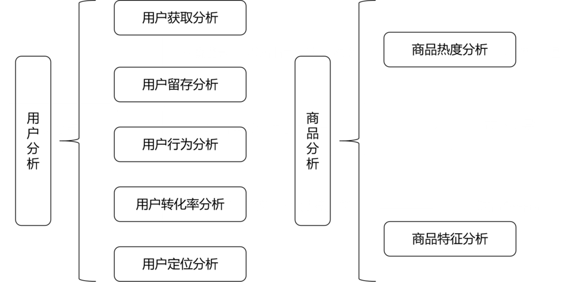

### 用户获取分析

PV是浏览量，UV是浏览人数（去重），PV/UV称为浏览深度，统计单位：每天

```mysql
create table df_pv_uv
(
	dates char(10),
	PV int(9),
	UV int(9),
	PVUV decimal(10,2)
);

INSERT into df_pv_uv
select
	dates,
	count(if(behavior_type='pv',1,null)) as PV,
	count(DISTINCT user_id) as UV,
	round(count(if(behavior_type='pv',1,null))/count(DISTINCT user_id),2) as PVUV
from userbehavior
GROUP BY dates;
```

### 用户留存分析

次日留存率问题，计算次日留存率和三日留存率

```mysql
/* 次日留存率 */

CREATE TABLE df_retention_1 ( dates CHAR ( 10 ), retention_1 FLOAT );

insert into df_retention_1    
select    
   ub1.dates,    
   count(ub2.user_id)/count(ub1.user_id) as retention_1    
from    
  (    
  select    
     distinct user_id,    
     dates    
  from    
     userbehavior    
  ) as ub1    
left join    
   (    
  select    
     distinct user_id,    
     dates    
  from    
     userbehavior    
  ) as ub2 on ub2.user_id = ub1.user_id    
  and ub2.dates = date_add(ub1.dates,interval 1 day)    
group by    
   ub1.dates;
```

```mysql
/* 三日留存率 */

CREATE TABLE df_retention_3
(
	dates char(10),
	retetion_3 FLOAT
);

insert into df_retention_3
select
	ub1.dates,
	count(ub2.user_id)/count(ub1.user_id) as retetion_3
from
(
	select
		DISTINCT user_id,
		dates
	from userbehavior
) as ub1
left join
(
	select
		DISTINCT user_id,
		dates
	from userbehavior
) as ub2 
on ub2.user_id = ub1.user_id
and ub2.dates = DATE_ADD(ub1.dates,INTERVAL 3 day)
GROUP BY ub1.dates;
```

### 用户行为分析

统计每天每时用户群体的各种行为（其实是时间序列分析），因此以dates和hours分组

```mysql
CREATE TABLE df_timeseries
(
	dates char(10),
	hours int(9),
	PV int(9),
	CART int(9),
	FAV int(9),
	BUY int(9)
);

insert into df_timeseries    
select    
  dates,    
  hours,    
  count(if(behavior_type = 'pv',1,null)) as PV,    
  count(if(behavior_type = 'cart',1,null)) as CART,    
  count(if(behavior_type = 'fav',1,null)) as FAV,    
  count(if(behavior_type = 'buy',1,null)) as BUY    
from    
  userbehavior    
group by    
  dates,    
  hours    
order by    
  dates asc,    
  hours asc;
```

### 用户转化率分析

```mysql
/* 计算总的各自有多少 */

CREATE VIEW user_behavior_total AS SELECT
user_id,
item_id,
count( IF ( behavior_type = 'pv', 1, NULL ) ) AS PV,
count( IF ( behavior_type = 'cart', 1, NULL ) ) AS CART,
count( IF ( behavior_type = 'fav', 1, NULL ) ) AS FAV,
count( IF ( behavior_type = 'buy', 1, NULL ) ) AS BUY 
FROM
	userbehavior 
GROUP BY
	user_id,
	item_id;

/* 不关心次数，只关心有无 */

CREATE VIEW user_behavior_total_standard AS SELECT
user_id,
item_id,
IF
	( PV > 0, 1, 0 ) AS ifpv,
IF
	( CART > 0, 1, 0 ) AS ifcart,
IF
	( FAV > 0, 1, 0 ) AS iffav,
IF
	( BUY > 0, 1, 0 ) AS ifbuy 
FROM
	user_behavior_total 
GROUP BY
	user_id,
	item_id;

/* 连接成一个 */

CREATE VIEW user_path AS SELECT
user_id,
item_id,
CONCAT( ifpv, ifcart, iffav, ifbuy ) AS path 
FROM
	user_behavior_total_standard;

/* 筛选 正则表达式 分类 */

CREATE VIEW user_path_num AS SELECT
path,
CASE
	
	WHEN path = 1001 THEN
	'浏览-/-/-购买' 
	WHEN path = 1010 THEN
	'浏览-/-加购-/' 
	WHEN path = 1011 THEN
	'浏览-/-加购-购买' 
	WHEN path = 1100 THEN
	'浏览-收藏-/-/' 
	WHEN path = 1101 THEN
	'浏览-收藏-/-购买' 
	WHEN path = 1110 THEN
	'浏览-收藏-加购-/' 
	WHEN path = 1111 THEN
	'浏览-收藏-加购-购买' ELSE '浏览-/-/-/' 
	END AS description,
	count( * ) AS path_num 
FROM
	user_path 
WHERE
	path REGEXP '^1' 
GROUP BY
	path;

/* 汇总 */

CREATE TABLE df_buy_path    
  (    
  buy_path varchar(55),    
  buy_path_num int(9)    
  );    

INSERT INTO df_buy_path    
SELECT   
  '浏览',    
  sum(path_num) as buy_path_num    
FROM  
  user_path_num;    

INSERT INTO df_buy_path    
SELECT    
  '浏览后收藏加购',    
   sum(IF(path = 1101 OR   
    path = 1100 OR    
    path = 1010 or    
    path = 1011 or    
    path = 1110 or    
    path = 1111,path_num,null )) as buy_path_num    
FROM  
  user_path_num;    

INSERT INTO df_buy_path    
SELECT
  '浏览后收藏加购后购买',    
  sum(IF(path = 1101 OR    
    path = 1011 OR    
    path = 1111,path_num,null )) as buy_path_num    
FROM    
  user_path_num;
```

### 用户定位分析

采用常见的RFM模型，即根据R（最近一次消费的时间间隔）F（一定时间内的消费频率）M（一定时间内的消费金额）给用户分为8类

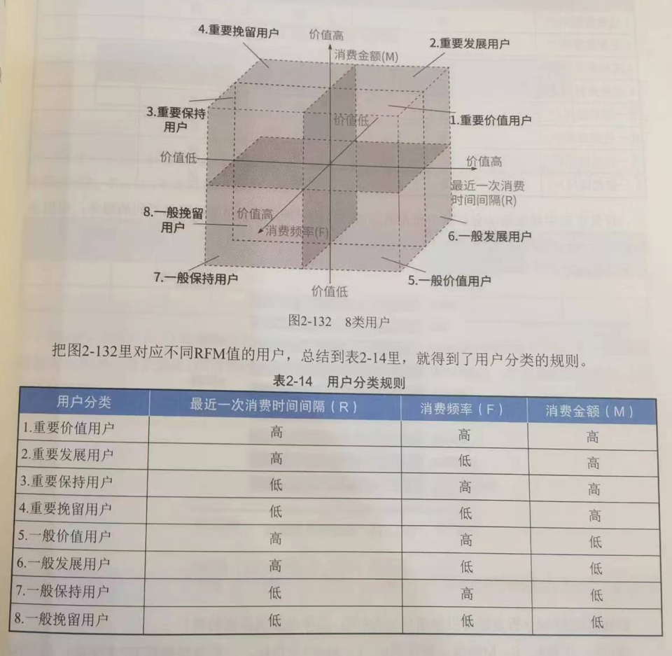

由于，此处数据没有消费金额。因此只考虑R和F，分类4类

1. 计算R和F值

```mysql
-- R计算

CREATE VIEW c as
SELECT
	user_id,
	max(dates) as 'last_buy_date'
from
	userbehavior
where
	behavior_type = 'buy'
GROUP BY
	user_id;
	
-- F计算

CREATE VIEW d as
SELECT
	user_id,
	count(user_id) as 'buy_times'
FROM
	userbehavior
WHERE
	behavior_type = 'buy'
GROUP BY
	user_id;

-- 二者合称为一个新表

CREATE TABLE df_rfm_model
(
	user_id int(9),
	recency char(10), -- 近期
	frequency int(9) -- 频率
);
INSERT INTO df_rfm_model
SELECT
	user_id,
	last_buy_date,
	buy_times
FROM
	c
JOIN
	d USING(user_id);
```

2. 量化，分级

```mysql
-- 量化R

ALTER TABLE df_rfm_model add r_score int(9);

update df_rfm_model
set r_score = 
	case
		when recency = '2017-12-03' then 100
		when recency = '2017-12-02' or recency = '2017-12-01' then 80
		when recency = '2017-11-30' or recency = '2017-11-29' then 60
		when recency = '2017-11-28' or recency = '2017-11-27' then 40
		else 20
	END;

-- 量化F

alter table df_rfm_model add f_score int(9);

update df_rfm_model
set f_score = 
	case
		when frequency > 15 then 100
		when frequency BETWEEN 12 and 14 then 90
		when frequency BETWEEN 9 and 11 then 70
		when frequency BETWEEN 6 and 8 then 50
		when frequency BETWEEN 3 and 5 then 30
		else 10
	end;
```

3. 平均值（创建视图）

```mysql
-- 平均值
create view f as
select
	e.user_id,
	recency,
	r_score,
	avg_r,
	frequency,
	f_score,
	avg_f
FROM
(
	SELECT
		user_id,
		avg(r_score) over() as avg_r,
		avg(f_score) over() as avg_f
	from
		df_rfm_model
	) as e
join
	df_rfm_model using (user_id);
```

从两个维度把用户分成四类

```mysql
/* 用户分类为四类 */
create table df_rfm_result    
    (    
    user_class varchar(5),    
    user_class_num int(9)    
    );    
		
-- 插入数据到 df_rfm_result
INSERT INTO df_rfm_result
SELECT
    user_class,
    COUNT(*) AS user_class_num
FROM (
    SELECT
        *,
        CASE
            WHEN (f_score >= avg_f AND r_score >= avg_r) THEN '价值用户'
            WHEN (f_score >= avg_f AND r_score < avg_r) THEN '保持用户'
            WHEN (f_score < avg_f AND r_score >= avg_r) THEN '发展用户'
            ELSE '挽留用户'
        END AS user_class
    FROM f
) AS g
GROUP BY
    user_class;
```

### 商品分析

```mysql
-- 热门品类 前TOP10   

create table df_popular_category    
  (    
  category_id int(9),    
  category_pv int(9)    
  );    
insert into df_popular_category    
select    
  category_id,    
  count(if(behavior_type = 'pv',1,null)) as category_pv    
from    
  userbehavior    
group by    
  category_id    
order by    
  count(if(behavior_type = 'pv',1,null)) desc    
limit 10;    

-- 热门商品

create table df_popular_item    
  (    
  item_id int(9),    
  item_pv int(9)    
  );    
insert into df_popular_item    
select    
  item_id,    
  count(if(behavior_type = 'pv',1,null)) as item_pv    
from    
  userbehavior    
group by    
  item_id    
order by    
  count(if(behavior_type = 'pv',1,null)) desc    
limit 10;
```

### 商品特征分析

根据category_id进行分组，统计每个类别：商品被浏览、收藏、加入购物车、购买的次数，顺便计算了转化率
- 转化率：品类被多少用户浏览数/最后有多少用户购买了它

```mysql
create table df_category_conv_rate    
  (    
  category_id int(9),    
  PV int(9),    
  FAV int(9),    
  CART int(9),    
  BUY int(9),    
  category_conv_rate float    
  );    
insert into df_category_conv_rate    
select    
  category_id,    
  count(if(behavior_type = 'pv',1,null)) as PV,    
  count(if(behavior_type = 'fav',1,null)) as FAV,    
  count(if(behavior_type = 'cart',1,null)) as CART,    
  count(if(behavior_type = 'buy',1,null)) as BUY,    
  count(distinct if(behavior_type = 'buy',user_id,null))/count(distinct user_id) as category_conv_rate    
from    
  userbehavior    
group by    
  category_id    
order by    
  category_conv_rate desc;
```

初步数据处理和分析，已经完成。

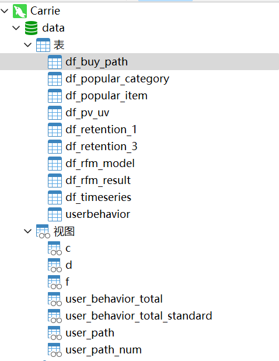

## 分析和可视化

首先，修改下名字，然后观察看每个表和视图的数据情况

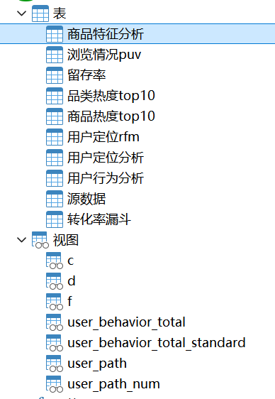

导入Tableau做可视化

### 用户流量分析

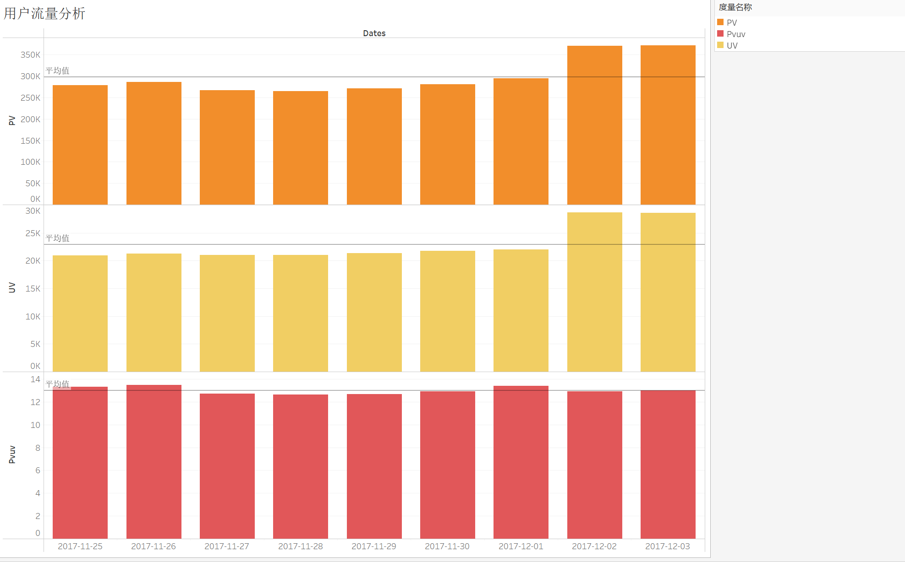

1. 由于我们的数据集（2017-11-15）是从星期六开始，从理论上来讲周末的流量会大一些，统计周期的前两天和后两天的PV值刚好印证了这一特点。第二个周末的PV值要显著高于第一个周末，推测原因是由于进入12月商家为了’双十二‘提前开启了预热活动，以此吸引用户。

2. PV值有一定波动，但UV值基本不变，维持在25k左右，这表明热衷于购物的用户很大一部分都是同一批人，即有很大一部分都可能是老客户，一方面商家在做活动时可以有所偏向这部分群体，另一方面商家也需要调整手段来吸引更多新用户。

3. PV/UV记为浏览深度，可以看到大体保持平稳状态。

### 用户留存分析

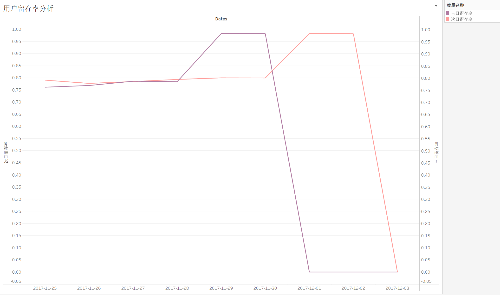

1. 留存率在12月之前一直稳定在80%左右，进入12月份后急剧上升，持续逼近100%，显著说明商家的活动成功吸引到了用户。

2. 本图中留存率迅速衰减的原因是由于数据集跨度不够导致的，但我们可以设想继续分析‘双十二’活动附近几天的用户留存率变化在一定程度上评估某一次活动的效果，进而商家就能知道用户喜欢什么，进而调整自己的策划方案，实现用户的长期价值。

### 用户行为分析

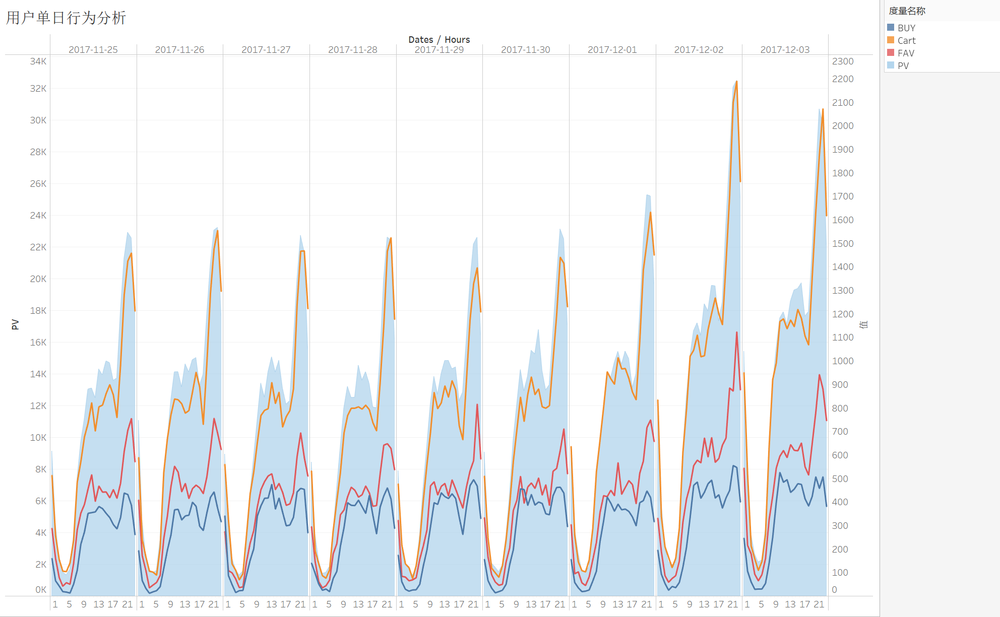

1. 从波峰波谷来看，符合国民的日常作息，流量高峰出现在夜间8-10点，低峰在0-6点，同时购买量、收藏量、加购量呈现出明显的正相关，这也符合一般认知，商家需要做的是在高峰期保证平台正常运行以免给用户带来不好的体验感。

2. 商家可以针对流量高峰采取行动，例如先是在高峰期采取更多推送，用户不但不反感还更有可能点击查看，然后采用限时限量优惠，比如每天九点限量发放满减优惠券以此实现收益扩大化。

### 用户转化率分析

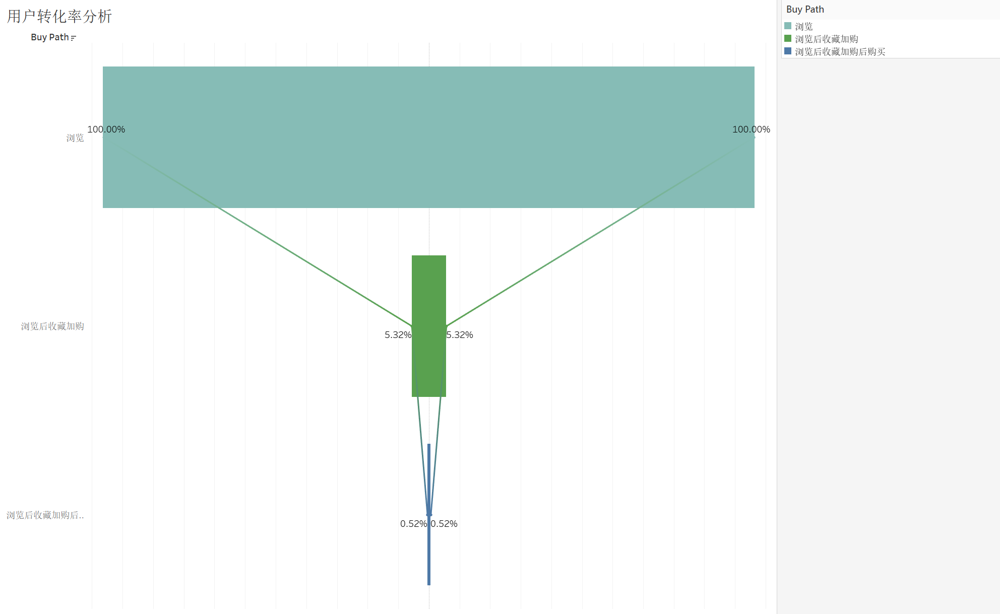

从浏览到收藏加购仅有5%，从收藏加购再到下单购买仅有10%（最初浏览量的0.5%），我们这里从中间两个阶段入手：

1. 从浏览到收藏加购来看，大多数用户在浏览后并没有进行收藏或加入购物车。需要分析用户在浏览时遇到的问题，例如产品展示不吸引人，或是促销信息不明确等等，商家需要考虑的是推出限时优惠或打折促销，激励用户收藏和加入购物车，毕竟从之前的分析来看收藏加购和购买呈现出明显的正相关性。

2. 从收藏加购到购买的转化率仅为0.52%，表明用户在收藏或加入购物车后，因价格、支付流程、物流问题等等因素未完成购买，建议商家分阶段进行A/B测试，尝试不同的页面设计、促销策略和用户体验优化，找到最佳方案。

### 用户定位分析

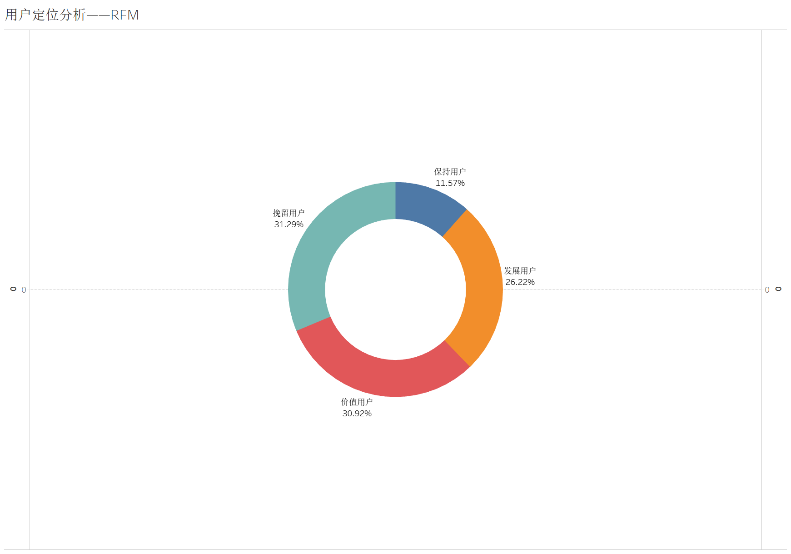

1. 个人认为看整个平台的用户定位分析可能意义不大，更好的是看平台之间的对比或者是每个商家的用户分层状况，以此来评估这个商家或者平台的经营状况如何。

2. 这里发展用户、价值用户、挽留用户三者占比相当，保持用户占比较少。

3. 就商家的用户定位分析而言，针对不同的用户群体，他们可以使用不同的策略。例如针对价值用户要继续维持之前的服务不能松懈；针对发展用户，可以采取第二次购买优惠的手段来提高他们的购买频率；针对保持用户，属于一段时间没来的忠实用户，可以采取给这类用户单独发放优惠券的形式来吸引他们；对于挽留用户，应尽可能地采取措施挽回，整体上实现精细化运营。

### 热门商品/品类TOP10

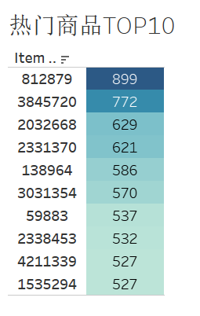  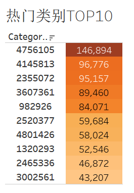

针对热门商品和热门类别，平台可以将它放在主页推荐位显眼的地方更容易吸引顾客

### 商品特征分析

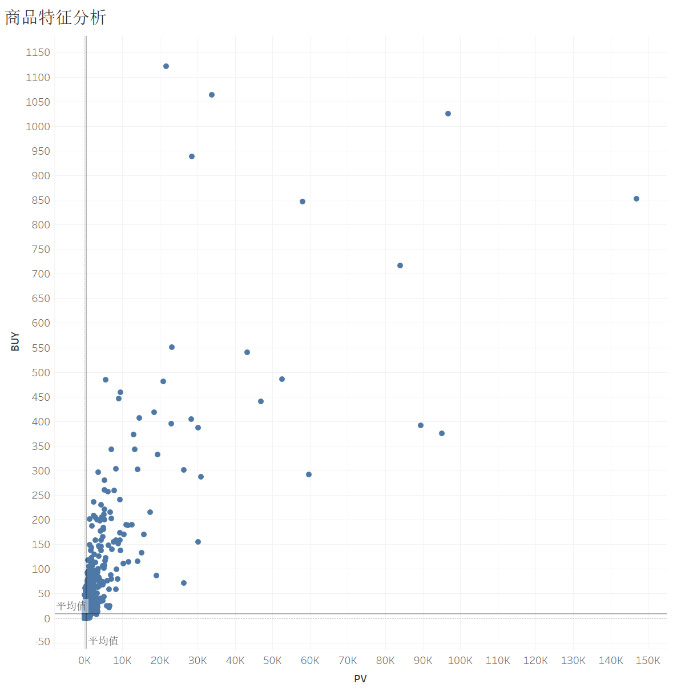

发现密集集中于平均值处，因此猜测数据受极小值影响很大，所以这里筛选PV>15000的数据，并设置新的字段：

    IF [PV] > 15000 THEN [PV] ELSE NULL END

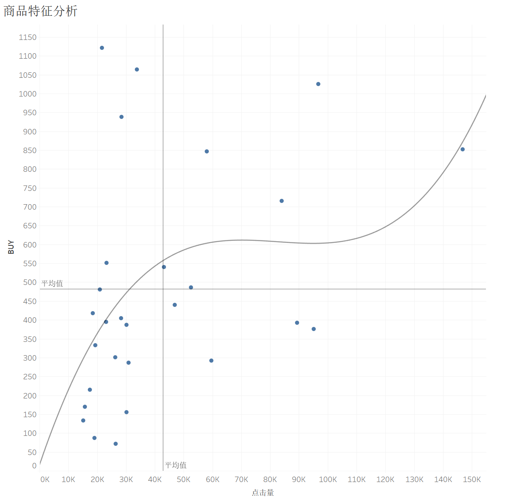

1. 第一象限的品类点击量高购买量高，很可能是必需品（例如卫生纸、洗衣粉等等），同时每个品类的下属商品应该有很多种，用户会有多种选择；

2. 第二象限的品类点击量低但是购买量高，说明用户购买非常果断，而且可选择的商品也比较少，个人推测存在一定垄断的，比如买可乐，一般固定为百事可乐或者可口可乐，很少有人会浏览其他的品牌（仅代表个人）；

3. 第四象限的品类点击量高但是购买量低，个人认为这应当是弹性较高的奢侈品，比如珠宝首饰、电子设备等等，你总是会浏览很多次又货比三家之后才购买；

4. 第三象限的品类点击量低购买量也低，个人认为这类商品可能是有很多的替代品，比如你在楼下小卖部就能买到的矿泉水，你也不太可能会为了哪个牌子特地去网上买，因此用户对这类商品的浏览量比较低而且也不倾向于购买他们。

## 仪表盘搭建

这一次主风格采用粉紫色系，还在摸索当中..


## 总结

1. PV上升的同时UV维持在22K左右，平台流量以老用户为主，吸引新用户能力不足；

2. ‘双十二’预热活动有效提升了用户的短期留存率将近20个百分点；

3. 在晚间20-22点流量高峰期间建议发放限时限量优惠，扩大收益；

4. 从浏览到收藏加购再到购买的转化率分别为5.32%和0.52%，建议通过A/B测试调整策略来提高转化率；

5. 对于不同的用户和商品应该实现精细化运营（详见上文）