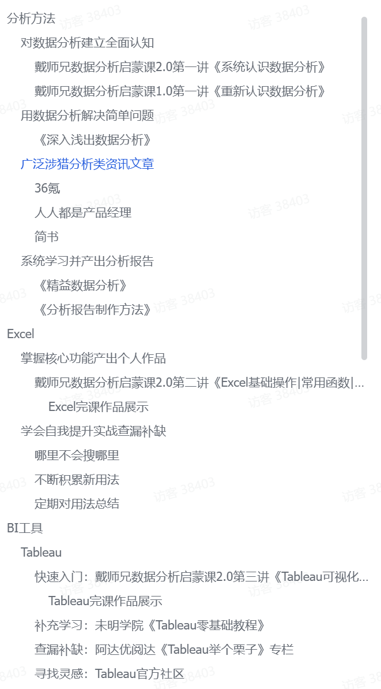
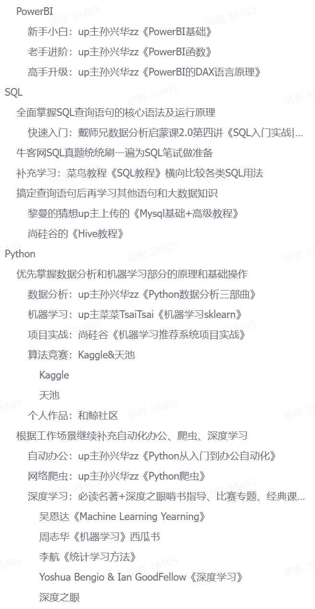

### 写在这里

今天是2024年7月11日，准备继续开始学习数据分析的必要知识。

未接触的时候，我以为Python处理就算可以了甚至加分项，后来发现市面上更多使用Excel和MySql，看似很简单很枯燥是不是，但是当我前几天尝试学习Excel高级知识时候发现它的潜力远不止平常所用的功能。

**该暑假学习完整个内容**，如果能花时间做几个项目就更好了。

## 总路线

接下来将根据该学习路线，先试着进行：[戴师兄数据分析自学路线](https://yrzu9y4st8.feishu.cn/docs/doccnzwzLDGEnGoVsF6YT9Sh2Zd)

---
2024/7/28 修改路线

① 处理数据：Excel、Python、SQL
② BI工具：Tableau、PowerBI
③ 分析思维
④ 大数据知识
⑤ Python进阶
⑥ 数学知识

决定根据个人的学习情况，适当修改学习路线和进度：
- 已完成：
1. Excel
2. Tableau
3. SQL

改为先学FinBI，然后就先不用学习更多BI工具的使用，而是就Tableau和FinBI来更熟练掌握。

---

特此鸣谢！

1. 建立数据分析思维
2. Excel 功能学习
3. BI 工具
4. SQL
5. 其他了解：数仓、统计学知识、高数等
6. 实操做项目

