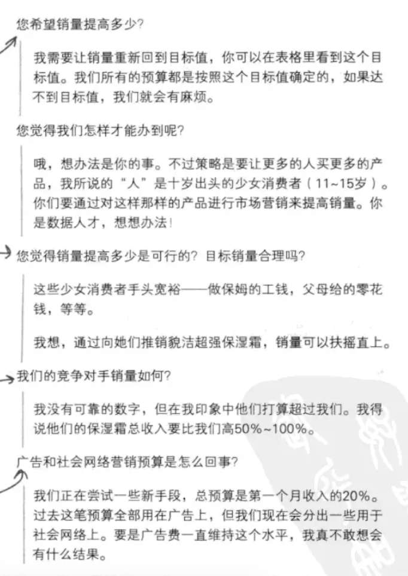
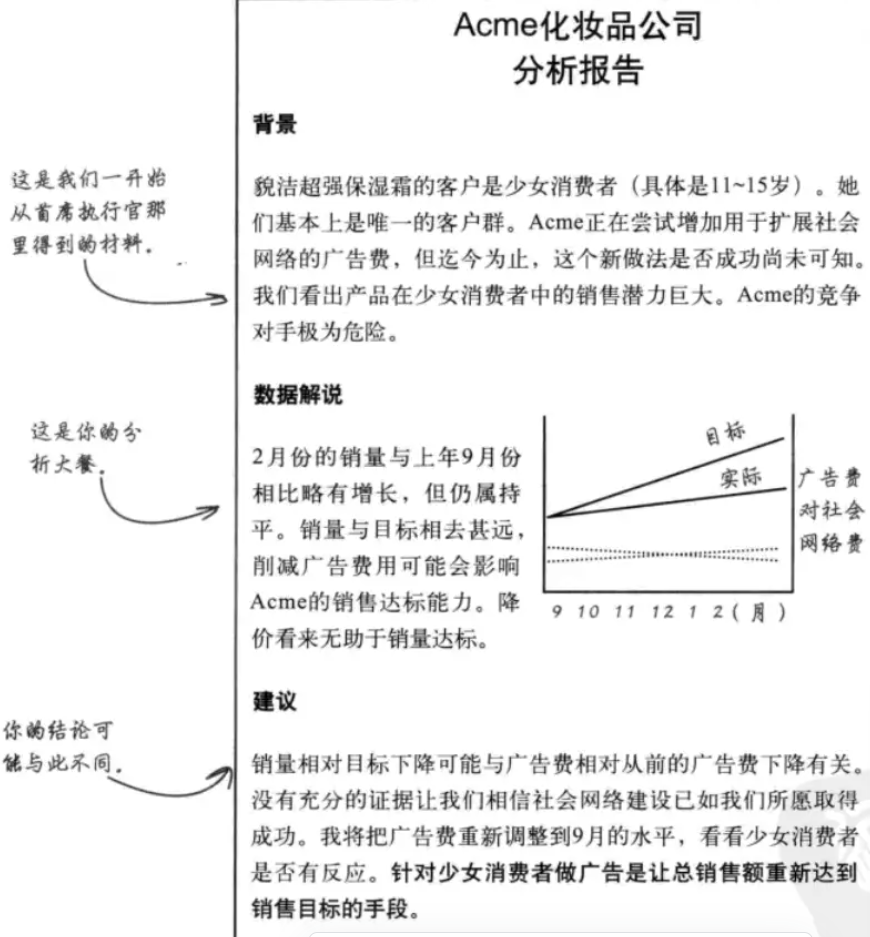
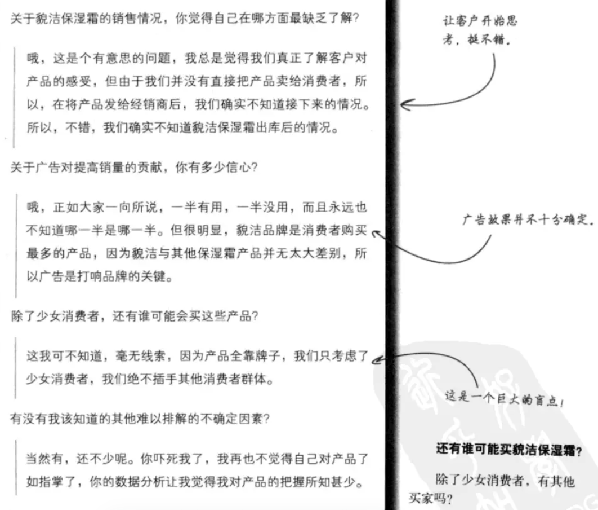
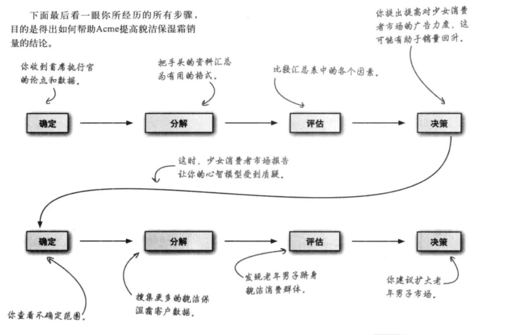
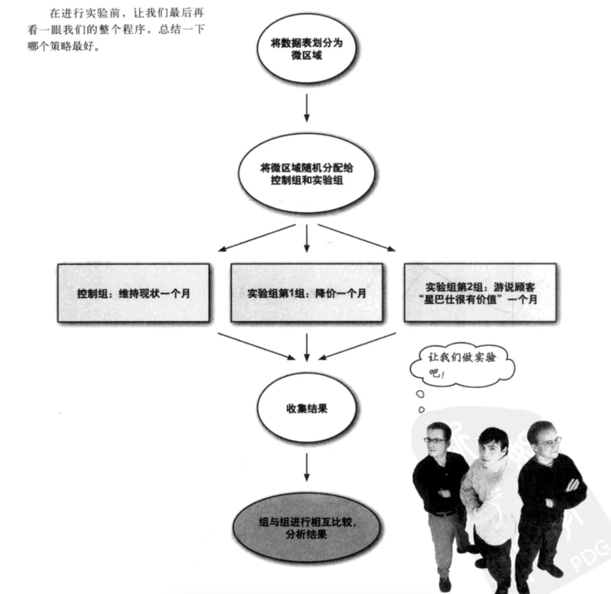
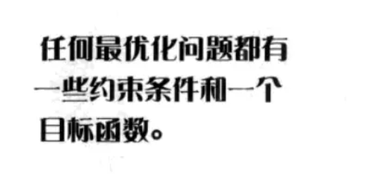
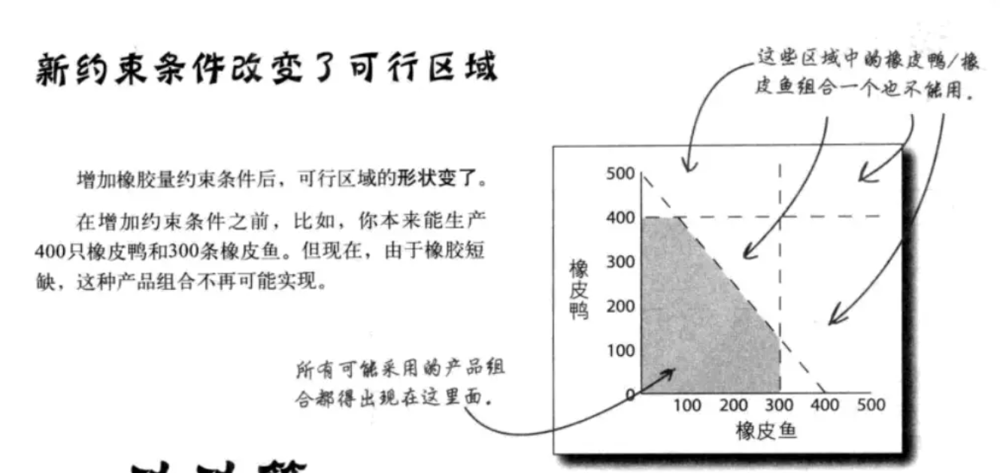
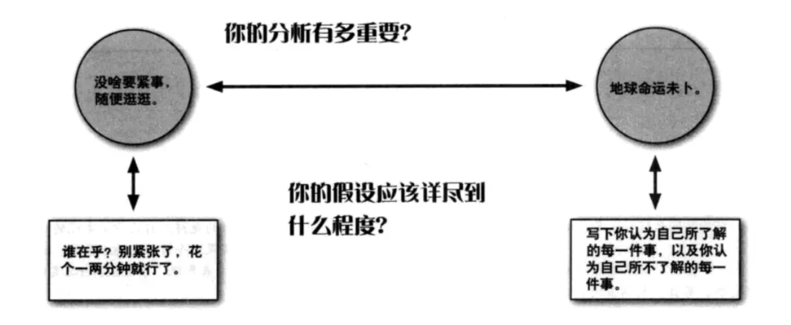
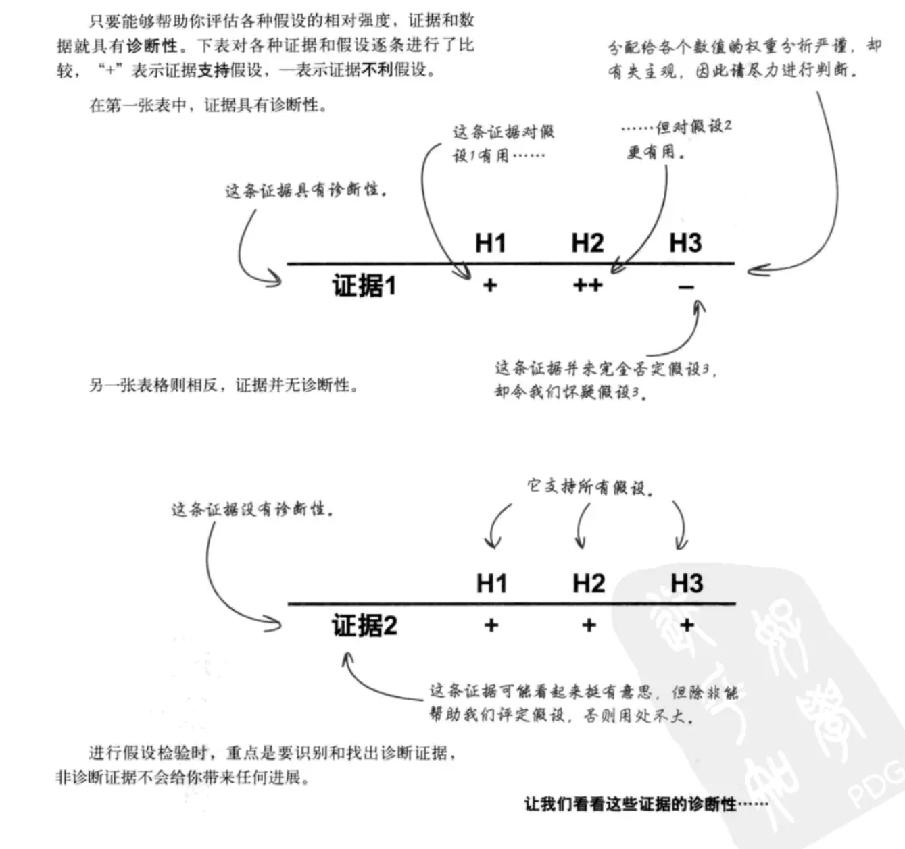

# 《深入浅出数据分析》

坦白来说，也不是崇洋媚外，只是外国笔者的书籍有时确实比中国学者有趣得多。可能看起来讲的并不深入，但是作为启蒙书，会给你一步步启迪。

为防止后续遗忘，能不断巩固，写下此篇读书笔记。

## 数据分析引言：分解数据

四个流程：确定--分解--评估--决策

### 确定

首先，首席执行官或是客户（包括你自己）会给出一个浅薄的目标，比如提高销量。

此时，应该提出问题做深一步的确定问题。

### 分解

接下来对数据进行分解，确定**基准假设**。客户确定无疑的信息和你对数据的想法。

### 评估

加入本人的介入：做出自己的明确假设，以信用为自己的结论负责。写最终报告要提到自己，明确结论出处。

### 决策

粗略版本：

背景：来自于得到的材料，写下自己和客户的假设
数据解说：数据支持，图表辅助
建议：得出的结论

不是每一次分析结果都是理想的，当决策后出现偏差时候，考虑**错误或不完整的信息**。

从背景切入，某个客户确信的观点可能只是**心智模型**。

需要根据数据，对原本确定的目标，进行重新的确定。

可以向客户询问其不知道的事情。例如：

索要更多数据，进行分析和深入挖掘更多数据。

回顾整个模拟流程：

## 实验，检验你的理论

务必使用比较法，数据相互比较才会有意义。

##### 观察研究法：被研究的人自行决定自己属于哪个群体的一种研究方法。

在进行探究时，要考虑一线人员的直觉与统计数据相结合。

##### 混杂因素：研究对象的个体差异，不是试图比较的因素，但会导致分析结果敏感度变差。

需要校正某个混杂因素，通过拆分数据块，管理混杂因素。

##### 控制组：一组体现现状的处理对象，未经过任何新的处理（也称为对照组）

精心选择分组来避免混杂因素，比如：将大的地理区域分成小的地理区域，随机将这些微区域分进控制组和实验组。

##### 历史控制法：取用过去的数据，并将这些数据作为控制数据。
##### 同期控制法：控制组与实验组在相同的时期内经历同样的事。

历史控制法通常偏向于力图进行检验的对象的成功方面，需要对此表示怀疑。

需要随机选择，使得之前具有相似性。随机控制是各种实验的黄金标准，能最大限度接近数据分析的核心：证明因果关系。

简易流程：

## 寻找最大值

数据分类为：无法控制的因素和可以控制的因素

决策变量：可以控制的因素

约束条件：无法控制的因素

目标：最大化...

因此，借用**目标函数**来找出最优化结果。

将约束条件不断进行拆分为更小的求解公式

确定可行区域：

模型可能只描述你规定的情况，不完美导致问题的出现。应该尽量创建最有用的模型，让模型的不完美相对于分析目标变得无足轻重。

因此，要按照分析目标校正假设

比如，原本只知道时间、产量，但还要考虑客户购买，即需求量。

另外，要提防**负相关变量**：一种产品越多，另一种产品越少的情况。

由于所使用的数据都是观察数据，做好准备，立足于不断变化的实际情况修改模型。

## 数据图形化

我还挺喜欢这一板块的，原因大概是，我比较喜欢数据图形化后很直观的感觉吧哈哈。
在打数模比赛的过程中，也会遇到挺多情况，大家都努力做很好看的图表来获奖。但坦白来说，获奖与否其实更在于图表是否能精准表达不是吗？

[生成词云网站（限英文）](https://www.edwordle.net/)

- 散点图：因果关系。因变量是X轴，自变量是Y轴
1. 同时展示多张图形，体现更多变量

-----
可能还需要自行对各个图表的使用进行一个了解。

## 检验假设

采用证伪法，避免使用满意法。

用能直接剔除的证据，剔除掉一些假设。

然后，对假设进行评级，不利证据越少，排在前面。

诊断性：数据能够按照强弱程度，帮你做出排序。

诊断性是证据所具有的一种功能，能够帮助你评估所考虑的假设的相对似然。如果证据具有诊断性，就能帮助你对假设排序。

再根据不断变动的信息，去进行更改调整。

## 贝叶斯统计

贝叶斯规则：利用基础概率和波动数据来分析

首先，运用**基础概率**，又叫做事前概率。务必警惕基础概率，基础概率数据不一定在每种情况下都存在。但是忽略事前数据并做出错误决策，就会造成**基础概率谬误**。

新信息会改变基础概率，需要用贝叶斯规则重新进行计算。

