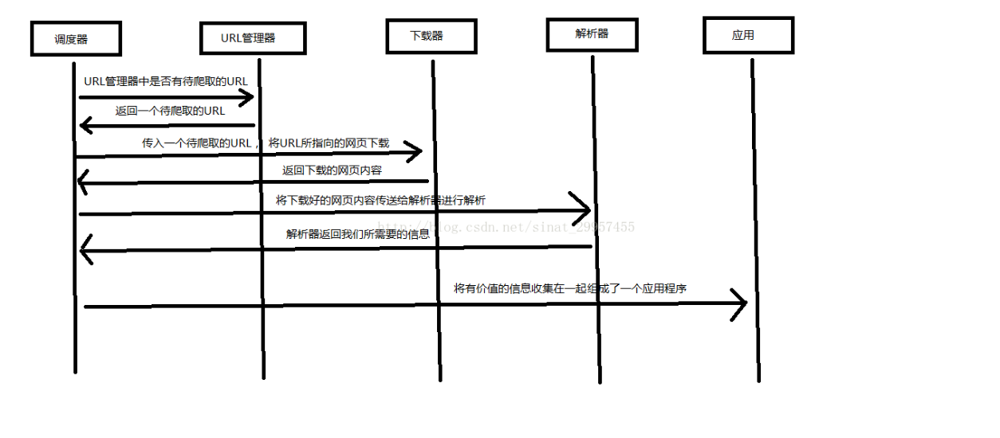

# 写在前面
今天想着先把爬虫重新捡起来，再深入下。结果一打开，就看到12.14有4名因为非法爬取判处有期徒刑的新闻。。
只能说，接下来我要小心谨慎点了。

## 爬虫框架

- 调度器：相当于cpu，调度下面几个之间协调工作
- URL管理器：带爬取URL和已爬取URL，通过内存、数据库、缓存数据库实现
- 网页下载器：传入URL下载网页，转为字符串。urllib
- 网页解析器：字符串进行解析，提取我们需要的。有：re、html.parser、beautifulsoup（可以多种）、lxml（解析xml和HTML）。html.parser、beautifulsoup、lxml都以DOM树方式进行解析。



可以测试能否爬取：

1. 看robots.txt
2. 网站测试

[检验robots](https://www.dute.org/robots-tester)

## 豆瓣爬取

大部分的人启蒙应该都从豆瓣开始

在爬取之前，需要先补一下正则表达式的大坑（详见下一章），因为此次主要用正则表达式。

```
# -*- codeing = utf-8 -*-
from bs4 import BeautifulSoup  # 网页解析，获取数据
import re  # 正则表达式，进行文字匹配`
import urllib.request, urllib.error  # 制定URL，获取网页数据
import xlwt  # 进行excel操作

findLink = re.compile(r'<a href="(.*?)">')  # 创建正则表达式对象，标售规则   影片详情链接的规则
findImgSrc = re.compile(r'(.*)</span>')
findRating = re.compile(r'<span class="rating_num" property="v:average">(.*)</span>')
findJudge = re.compile(r'<span>(\d*)人评价</span>')
findInq = re.compile(r'<span class="inq">(.*)</span>')
findBd = re.compile(r'<p class="">(.*?)</p>', re.S)

def main():
    baseurl = "https://movie.douban.com/top250?start="  #要爬取的网页链接
    # 1.爬取网页
    datalist = getData(baseurl)
    savepath = "豆瓣电影Top250.xls"    #当前目录新建XLS，存储进去
    # dbpath = "movie.db"              #当前目录新建数据库，存储进去
    # 3.保存数据
    saveData(datalist,savepath)      #2种存储方式可以只选择一种
    # saveData2DB(datalist,dbpath)


# 爬取网页
def getData(baseurl):
    datalist = []  #用来存储爬取的网页信息
    for i in range(0, 10):  # 调用获取页面信息的函数，10次
        url = baseurl + str(i * 25)
        html = askURL(url)  # 保存获取到的网页源码
        # 2.逐一解析数据
        soup = BeautifulSoup(html, "html.parser")
        for item in soup.find_all('div', class_="item"):  # 查找符合要求的字符串
            data = []  # 保存一部电影所有信息
            item = str(item)
            link = re.findall(findLink, item)[0]  # 通过正则表达式查找
            data.append(link)
            imgSrc = re.findall(findImgSrc, item)[0]
            data.append(imgSrc)
            titles = re.findall(findTitle, item)
            if (len(titles) == 2):
                ctitle = titles[0]
                data.append(ctitle)
                otitle = titles[1].replace("/", "")  #消除转义字符
                data.append(otitle)
            else:
                data.append(titles[0])
                data.append(' ')
            rating = re.findall(findRating, item)[0]
            data.append(rating)
            judgeNum = re.findall(findJudge, item)[0]
            data.append(judgeNum)
            inq = re.findall(findInq, item)
            if len(inq) != 0:
                inq = inq[0].replace("。", "")
                data.append(inq)
            else:
                data.append(" ")
            bd = re.findall(findBd, item)[0]
            bd = re.sub('<br(\s+)?/>(\s+)?', "", bd)
            bd = re.sub('/', "", bd)
            data.append(bd.strip())
            datalist.append(data)

    return datalist


# 得到指定一个URL的网页内容
def askURL(url):
    head = {  # 模拟浏览器头部信息，向豆瓣服务器发送消息
        "User-Agent": "Mozilla / 5.0(Windows NT 10.0; Win64; x64) AppleWebKit / 537.36(KHTML, like Gecko) Chrome / 80.0.3987.122  Safari / 537.36"
    }
    # 用户代理，表示告诉豆瓣服务器，我们是什么类型的机器、浏览器（本质上是告诉浏览器，我们可以接收什么水平的文件内容）

    request = urllib.request.Request(url, headers=head)
    html = ""
    try:
        response = urllib.request.urlopen(request)
        html = response.read().decode("utf-8")
    except urllib.error.URLError as e:
        if hasattr(e, "code"):
            print(e.code)
        if hasattr(e, "reason"):
            print(e.reason)
    return html

# 保存数据到表格
def saveData(datalist,savepath):
    print("save.......")
    book = xlwt.Workbook(encoding="utf-8",style_compression=0) #创建workbook对象
    sheet = book.add_sheet('豆瓣电影Top250', cell_overwrite_ok=True) #创建工作表
    col = ("电影详情链接","图片链接","影片中文名","影片外国名","评分","评价数","概况","相关信息")
    for i in range(0,8):
        sheet.write(0,i,col[i])  #列名
    for i in range(0,250):
        # print("第%d条" %(i+1))       #输出语句，用来测试
        data = datalist[i]
        for j in range(0,8):
            sheet.write(i+1,j,data[j])  #数据
    book.save(savepath) #保存

if __name__ == "__main__":  # 当程序执行时
    # 调用函数
     main()
    # init_db("movietest.db")
     print("爬取完毕！")
```

## 爬取自己博客

弄完后，我想试下爬取自己的博客hh

```
# -*- codeing = utf-8 -*-
from bs4 import BeautifulSoup
import pandas as pd
import urllib.request, urllib.error
import xlwt

def main():
    baseurl = "https://wwcarrie.github.io/"
    # 1. 爬取网页
    datalist = getData(baseurl)

    save_to_excel(datalist)

def getData(baseurl):
    datalist = []
    for i in range(1,4): # 由于第一页是没有1的
        if i == 1:
            url = baseurl
        else:
            url = baseurl + 'page/' +str(i)
        html = askURL(url)
        soup = BeautifulSoup(html, 'html.parser')
        articles = soup.find_all('article', class_='article')
        print(articles)
        for article in articles:
            # id
            article_id = article.get('id')

            # 标题
            title_tag = article.find('a',class_="p-name article-title")
            title = title_tag.get_text(strip=True) if title_tag else None

            # 发布时间
            time_tag = article.find('time',class_="dt-published")
            time = time_tag['datetime'] if time_tag else None

            # 获取标签
            tag_tag = article.find('a',class_="article-tag-list-link")
            tag = tag_tag.get_text(strip=True) if tag_tag else None

            # 获取简介
            introduce_tag = article.find('div',class_="e-content article-entry")
            introduce = introduce_tag.get_text(strip=True) if introduce_tag else None

            # 获取链接
            link_tag = article.find('a',class_="p-name article-title")
            link = link_tag['href'] if link_tag else None

            # 将提取的数据存储到列表中
            datalist.append({
                'id': article_id,
                '标题': title,
                '时间': time,
                '标签': tag,
                '简介': introduce,
                '链接': link
            })

    return datalist

def askURL(url):
    head = {  # 模拟浏览器头部信息，向豆瓣服务器发送消息
        "User-Agent": "Mozilla / 5.0(Windows NT 10.0; Win64; x64) AppleWebKit / 537.36(KHTML, like Gecko) Chrome / 80.0.3987.122  Safari / 537.36"
    }

    request = urllib.request.Request(url, headers=head)
    html = ""
    try:
        response = urllib.request.urlopen(request)
        html = response.read().decode("utf-8")
    except urllib.error.URLError as e:
        if hasattr(e, "code"):
            print(e.code)
        if hasattr(e, "reason"):
            print(e.reason)
    return html

def save_to_excel(datalist):
    # 使用pandas将数据保存为Excel文件
    df = pd.DataFrame(datalist)
    df.to_excel('articles.xlsx', index=False)
    print("数据已保存为 articles.xlsx")

if __name__ == '__main__':
    main()
```

### 总结
过程并不算难但需要注意以下几点：
1. 可以用re，也可以直接用pd
2. 必须是连接自己最近的标签名
3. 熟悉网站和考虑多种情况