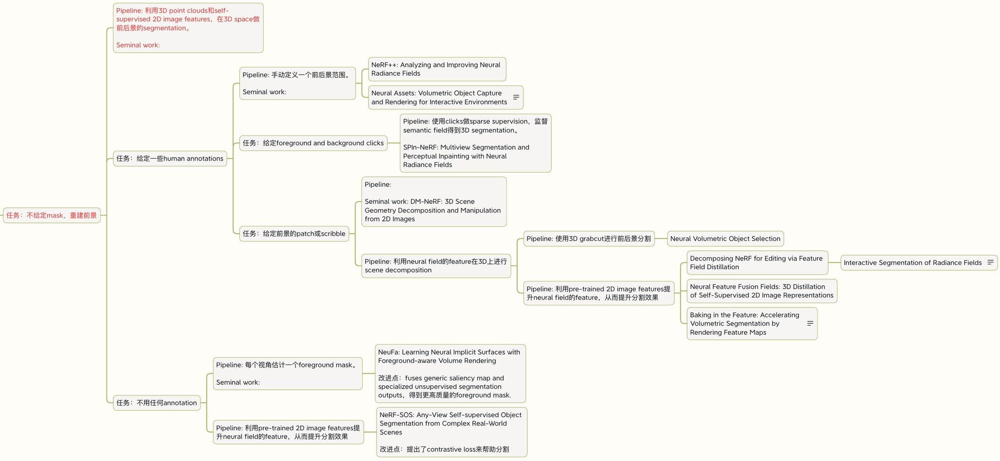

Ref：https://github.com/wwCarrie/learning_research

## 入门科研路线

1. 学习基础的深度学习知识
2. 做项目，掌握某一论文细节，复现
   1. 选择科研方向，制定学习计划
   2. 看课程
   3. 旁听科研项目、讨论
3. 做自己一作的project，投稿

## 学习计划如何指定

- 初步目标
- 下一步目标

**计划安排**

- 学习算法
  - 看论文
  - 学习代码，理解算法
  - 在代码框架下复现论文
  - 自己使用新数据，在自己写的代码上跑
- 学习学长相关论文
  - 同上+交流
- 做实验过程中阅读相关论文

## 科研具体流程

### 研究风格

- 非常明确且长期的目标，问题驱动式科研
- 找到有价值的问题
- 不畏难地填坑，挑战“没答案”的问题
- 把问题解决到99%程度的意识
- 极强的技术能力：多阅读论文，积累技术
- 尝鲜新技术

### 宝贵品质

**划分阶段**

- 基本功阶段
- 影响力阶段

**品质**

- 健康
- 专注
- 冷静
- 合作

**总结**

- 做科研应该多花时间找正确的问题
- 要Aim high，并且敢于行动
- 敢于拥抱变化
- 遵循第一性原理解决问题。打补丁短期能解决某些问题，长期一定会被淘汰
- 独立思考，总结出自己的一套

## 意识

- 系统思维、目标管理
  - 商务动态分析方法
- 科研品味
  - **精力花在判断上**：方向不将就，执行粗略快速验证
  - 阅读足够多论文
  - 跟有taste的人共事（讨论）
  - 深耕领域
  - 选择不做
    - 能发论文但不重要
    - 有市场但不值得做

---

**问题**：

- 技术细节
- 工作解决了什么问题
- 和之前方法对比本质区别

**每周练习**：

- 每周想一些ideas，和senior advisor以及身边的同学讨论这些ideas好或者不好
- 和不同的researchers交流，询问他们research上的big picture，看看他们觉得什么问题比较重要，看看他们一个project怎么选择课题
- 思考不同论文的引用量不同

---

- 深耕
- 重要问题的敏感度，价值和影响力
- 技术敏感度，前沿方向和技术
- 对外蒸馏知识
- debug算法与代码思路

