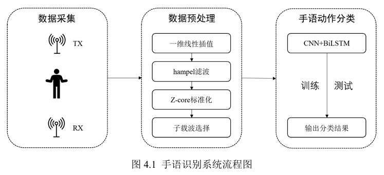
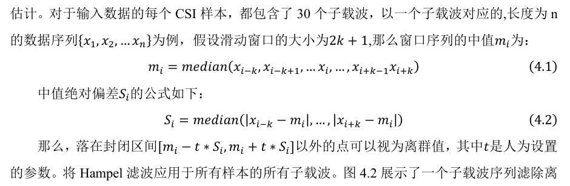
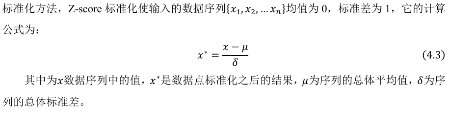
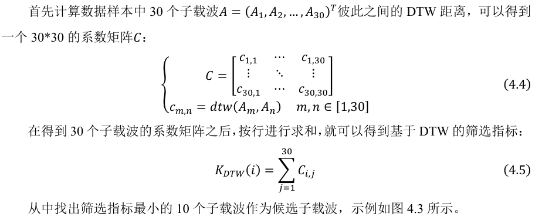
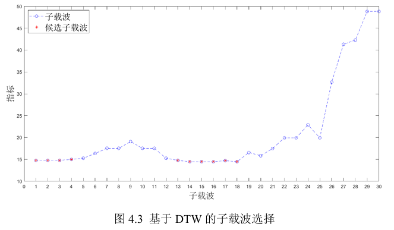

---
论文名：基于WIFI的人体行为感知技术研究

作者：朱旭

种类：南京邮电大学专业学位硕士研究生学位论文

关键词：行为感知、WIFI、CSI、人员识别、手语识别

---

## 人员识别

一、监测呼吸速率（note_1详细记录）

1. CSI进行共轭相乘
2. 中值滤波
3. EMD经验模态分解
4. FFT子载波选择策略
5. 恒虚警CFAR寻峰算法

二、人员识别

1. 滑动窗口

   Input:

   - 行: NT * NR * K

   式中：NT、NR分别是发送和接收天线，K为子载波选择的数目。

   - 列: Nresample * t

   式中：N是重采样率，t是采样时长。

   设置窗口大小200，步长40，CSI产生86个样本。

2. CNN

可改进：

1. 基于EMD的信号分解算法，如何选择IMF重构呼吸信号[40]动态；
2. 均值类CFAR寻峰算法可以改进，CFAR算法中的自适应类；
3. 进一步改进分类模型。

## 手语识别

1. 一维数据插值

   在一组已知数据点的范围内添加新数据点的技术。线性插值是一种使用线性多项式在已知数据点的离散集合范围内构造新数据点的曲线拟合方法，适用于一维数据。

2. Hampel滤波器-进行降噪

   Hampel滤波器使用Hampel标识符监测并去除信号中的离群值。基于中值和中值绝对偏差（MAD）对离群值位置和散步进行鲁棒性估计。

3. Z-core标准化

   消除评价指标量纲和取模规模的影响，利于不同量级或单位的指标间的比较或加权计算。深度学习中，减少内部协变量偏移（ICS），加速训练，减少梯度依赖性，优化更快，加速收敛。

   常见方式：

   - min-max标准化
   - Z-core标准化

3. 动态时间归整（DTW）的选择策略筛选可用子载波

   选择具有高度相关性的子载波。

   主要思想：在受干扰较大的子载波之间，也较少出现波形相似的情况。

   选择DTW作为指标，测量两个时间序列的相似性，适用于视频、音频、图形等可以转换为线性序列的数据。

4. CNN-BiLSTM双向长短期记忆的深度学习模型-进行分类

   同时，可以用KNN、SVM、CNN进行对比参照。

可改进：

1. 手语识别系统可以展开对于连续手语动作识别的研究，采用深度学习方法而不 是以方差作为阈值来分割连续的手语动作。